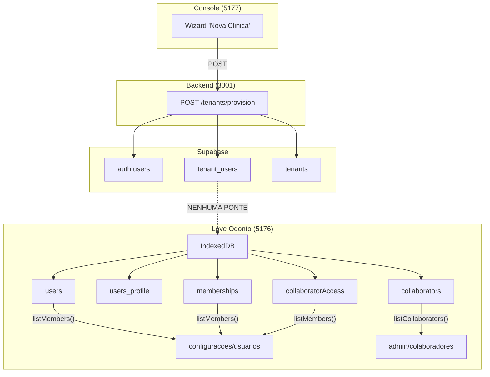
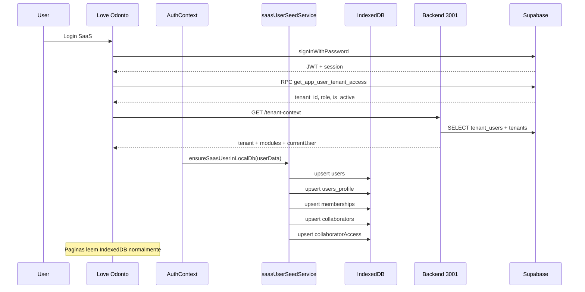

# Provisioning e Sincronizacao do Master User

## Diagnostico da Causa Raiz



**O provisionamento do Console cria registros em 3 locais do Supabase** (`auth.users`, `tenant_users`, `tenants`), mas as telas do Love Odonto leem de **5 colecoes do IndexedDB** (`users`, `users_profile`, `memberships`, `collaborators`, `collaboratorAccess`). Nao existe nenhuma ponte entre esses dois mundos.

## Dados Envolvidos

**O que o Console/Server ja cria (Supabase):**
- `auth.users` -- id UUID, email, user_metadata.full_name
- `tenant_users` -- user_id, tenant_id, email, full_name, role, is_active
- `tenants` -- id, trade_name, owner_name, owner_email

**O que as telas do app leem (IndexedDB):**
- `users` -- id, name, email, role, active, has_system_access
- `users_profile` -- id, full_name, email, phone, tenant_id
- `memberships` -- id, tenant_id, user_id, role, has_system_access, status
- `collaborators` -- id, nomeCompleto, apelido, rhCategoria, cargo, email, status
- `collaboratorAccess` -- collaboratorId, userId, role, permissions

## Arquitetura da Solucao



## Arquivos que Serao Alterados

### 1. Backend: [`server/index.js`](server/index.js)

**Endpoint `GET /internal/app/tenant-context` (linha 542):**

Hoje o select de `tenant_users` busca apenas `tenant_id, role, role_slug, is_active, status`. Precisa incluir `full_name, email, user_id` e retornar no response como `currentUser`:

```js
// Linha 547: expandir select
.select('tenant_id, user_id, full_name, email, role, role_slug, is_active, status')

// Linha 606-618: adicionar currentUser no JSON de resposta
res.json({
  tenant,
  modules: ...,
  flags: ...,
  limits: ...,
  subscription,
  warnings,
  access: { ... },
  currentUser: {
    id: authUserId,
    fullName: tenantUser.full_name || req.appAuthUser.user_metadata?.full_name || '',
    email: tenantUser.email || req.appAuthUser.email || '',
    role: tenantUser.role || tenantUser.role_slug || 'atendimento',
    isActive: tenantUser.is_active ?? true,
  },
});
```

### 2. Novo servico: [`src/services/saasUserSeedService.js`](src/services/saasUserSeedService.js)

Funcao central `ensureSaasUserInLocalDb(user)` que:
- Recebe o objeto `user` do AuthContext (id, name, email, role, tenantId, authMode)
- Verifica se cada colecao ja tem registro para esse user (por `id` ou `email`)
- Se nao existe: cria (insert)
- Se existe: atualiza campos essenciais (upsert)
- Usa `withDb()` para uma unica transacao atomica

Colecoes tocadas e campos:

- **`users`**: `{ id: authUserId, name, email, role: 'admin', active: true, has_system_access: true }`
- **`users_profile`**: `{ id: authUserId, full_name, email, phone: '', tenant_id }`
- **`memberships`**: `{ id: 'memb-{uuid}', tenant_id, user_id: authUserId, role: 'master', has_system_access: true, status: 'active' }`
- **`collaborators`**: `{ id: 'col-master-{authUserId}', nomeCompleto, apelido, email, rhCategoria: 'Diretoria e Gestao', cargo: 'Gestor Geral', status: 'ativo' }`
- **`collaboratorAccess`**: `{ collaboratorId: 'col-master-{authUserId}', userId: authUserId, role: 'admin' }`

**Protecao contra duplicidade:**
- `users`: busca por `id === authUserId`
- `memberships`: busca por `tenant_id + user_id`
- `collaborators`: busca por `id === 'col-master-{authUserId}'` OU `email`
- `collaboratorAccess`: busca por `userId === authUserId`

### 3. App: [`src/services/tenantContextService.js`](src/services/tenantContextService.js)

Na funcao que processa a resposta da admin API (`fetchTenantContextViaAdminApiAttempt`), extrair e repassar `currentUser` no retorno para que fique disponivel durante o bootstrap.

### 4. App: [`src/services/platformAccessService.js`](src/services/platformAccessService.js)

Na funcao `readTenantAccessSnapshot`, propagar o `currentUser` do context para o snapshot retornado.

### 5. App: [`src/tenant/TenantContext.jsx`](src/tenant/TenantContext.jsx)

Apos `refreshTenantContext` resolver com sucesso e `user.authMode === 'saas'`:
- Chamar `ensureSaasUserInLocalDb(user, currentUser)` passando dados do user (AuthContext) + dados do currentUser (tenant-context)
- Executar apenas uma vez por sessao (ref `hasSeedRun`)

### 6. App: [`src/auth/AuthContext.jsx`](src/auth/AuthContext.jsx)

Alternativa ao item 5: chamar o seed logo apos `resolveSaasUserFromSession` retornar com sucesso, dentro do `useEffect([session])`. Isso garante que os registros locais existam ANTES das paginas renderizarem.

**Decisao recomendada:** Chamar no AuthContext (item 6) pois ele resolve primeiro. O TenantContext depende dele. Isso garante que quando `/configuracoes/usuarios` renderizar, o IndexedDB ja tera os registros.

## Nao Serao Alterados

- **Console** (`console/`) -- nenhuma mudanca; ele ja passa todos os dados necessarios
- **Endpoint de provisioning** (`POST /tenants/provision`) -- ja cria tudo que precisa no Supabase
- **Paginas do app** (`ConfiguracoesUsuariosPage.jsx`, `CollaboratorsPage.jsx`) -- ja leem do IndexedDB; os registros apenas passam a existir
- **Schema** (`db/schema.js`) -- as colecoes ja existem, so estavam vazias em modo SaaS
- **Migrations SQL** -- nao sao necessarias; o `tenant_users` ja tem `full_name` e `email`

## Script de Backfill

Nao e necessario SQL de backfill porque:
- Os dados ja existem em `tenant_users` (Supabase) para todos os tenants
- O seed acontece **no login** do usuario SaaS, nao no provisioning
- Clínicas antigas: quando o master fizer login, o seed executa automaticamente
- Isso cobre 100% dos tenants existentes sem migration

## Checklist de Teste Manual

- Criar nova clinica pelo Console (5177)
- Verificar no Supabase: `auth.users` + `tenant_users` preenchidos
- Abrir Love Odonto (5176) e fazer login com o email/senha do master
- Navegar para `/configuracoes/usuarios` -- master deve aparecer como Administrador (MASTER)
- Navegar para `/admin/colaboradores` -- master deve aparecer como colaborador ativo com cargo "Gestor Geral"
- Fazer logout e login novamente -- nao deve duplicar registros
- Recarregar a pagina (F5) -- dados devem persistir
- Testar com tenant antigo: fazer login com master de clinica ja existente -- seed deve criar registros
