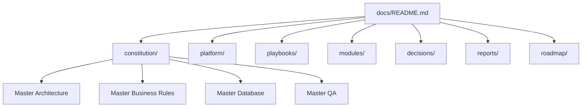

# Love Odonto V2 — Documentação Oficial

Documentação corporativa da plataforma SaaS **Love Odonto V2** — ERP odontológico multi-clínica.

Este índice é o ponto de entrada oficial. Toda documentação nova deve seguir a estrutura definida em [`decisions/ADR-000-DOCUMENTATION-FOUNDATION.md`](./decisions/ADR-000-DOCUMENTATION-FOUNDATION.md).

---

## Visão geral

O Love Odonto V2 é uma plataforma de gestão odontológica composta por:

| Superfície | Descrição |
|------------|-----------|
| **App clínica** | Operação da clínica (agenda, pacientes, financeiro, CRM, RH) |
| **Console SaaS** | Gestão de tenants, billing e suporte plataforma |
| **Admin API** | Orquestração de regras sensíveis, provisionamento, RBAC |
| **Supabase** | Postgres + Auth + Storage — fonte oficial de dados |

A documentação está organizada em **camadas normativas** (Constituições) e **camadas operacionais** (playbooks, módulos, relatórios).

---

## Arquitetura da documentação



**Hierarquia de autoridade (conflito):**

1. `constitution/` — prevalece sobre demais camadas  
2. `decisions/` (ADRs) — decisões pontuais ratificadas  
3. `platform/`, `playbooks/`, `modules/` — detalhamento e operação  
4. `reports/` — diagnósticos e evidências (não normativos)

---

## Mapa das pastas

| Pasta | Propósito | README |
|-------|-----------|--------|
| [`constitution/`](./constitution/) | Constituições oficiais V2 | [constitution/README.md](./constitution/README.md) |
| [`platform/`](./platform/) | Documentação técnica da plataforma | [platform/README.md](./platform/README.md) |
| [`playbooks/`](./playbooks/) | Procedimentos operacionais | [playbooks/README.md](./playbooks/README.md) |
| [`modules/`](./modules/) | Documentação funcional por módulo | [modules/README.md](./modules/README.md) |
| [`roadmap/`](./roadmap/) | Planejamento evolutivo do produto | [roadmap/README.md](./roadmap/README.md) |
| [`decisions/`](./decisions/) | ADRs — Architecture Decision Records | [decisions/README.md](./decisions/README.md) |
| [`reports/`](./reports/) | Auditorias, validações e relatórios | [reports/README.md](./reports/README.md) |

---

## Constituições (obrigatórias)

| Documento | Papel |
|-----------|-------|
| [Master Architecture](./constitution/LOVE_ODONTO_V2_MASTER_ARCHITECTURE.md) | **Como** construir — arquitetura, stack, migrations, deploy |
| [Master Business Rules](./constitution/LOVE_ODONTO_V2_MASTER_BUSINESS_RULES.md) | **O quê** o sistema faz — regras de negócio |
| [Master Database](./constitution/LOVE_ODONTO_V2_MASTER_DATABASE.md) | **Como** persistir — modelo, RLS, domínios |
| [Master QA](./constitution/LOVE_ODONTO_V2_MASTER_QA.md) | **Como** validar — testes, homologação, smoke |

---

## Documentos da plataforma

| Documento | Descrição |
|-----------|-----------|
| [PLATFORM_PANEL.md](./platform/PLATFORM_PANEL.md) | Console da plataforma |
| [navigation.md](./platform/navigation.md) | Navegação e rotas |
| [PRECIFICACAO-NATIVO.md](./platform/PRECIFICACAO-NATIVO.md) | Precificação nativa |
| [PRECIFICACAO-INTEGRACAO-MINIMA.md](./platform/PRECIFICACAO-INTEGRACAO-MINIMA.md) | Integração mínima precificação |
| [PHASE_10_CONTRACTS_ARCHITECTURE.md](./platform/PHASE_10_CONTRACTS_ARCHITECTURE.md) | Arquitetura-alvo Contratos e Consentimentos |

> Console dedicado: `console/docs/` (billing, arquitetura console).

---

## Playbooks

| Documento | Descrição |
|-----------|-----------|
| [STABILITY_CHECKLIST.md](./playbooks/STABILITY_CHECKLIST.md) | Checklist pré-deploy e auth |
| [LOCAL_DEV.md](./playbooks/LOCAL_DEV.md) | Desenvolvimento local |

---

## Módulos (documentação funcional)

| Módulo | Documento |
|--------|-----------|
| Agenda | [agenda.md](./modules/agenda.md) |
| CRM | [CRM.md](./modules/CRM.md) · [CRM_CLINICO.md](./modules/CRM_CLINICO.md) |
| Prontuário | [prontuario.md](./modules/prontuario.md) |
| Contratos e Consentimentos | [PHASE_10_CONTRACTS_ARCHITECTURE.md](./platform/PHASE_10_CONTRACTS_ARCHITECTURE.md) |
| RH / Colaboradores | [collaborators.md](./modules/collaborators.md) |
| Clínica | [clinic-profile.md](./modules/clinic-profile.md) |
| Chat Inteligente | [marketing-chat-inteligente-*.md](./modules/) |

---

## Roadmap

Planejamento formal em [`roadmap/`](./roadmap/). Roadmaps detalhados também constam nas Constituições (Architecture §30, Business Rules §19, Database §26, QA §13).

---

## ADRs (decisions)

| ADR | Título |
|-----|--------|
| [ADR-000](./decisions/ADR-000-DOCUMENTATION-FOUNDATION.md) | Fundação da documentação V2 |

---

## Reports (auditorias)

| Relatório | Descrição |
|-----------|-----------|
| [architecture-audit-love-odonto-v2.md](./reports/architecture-audit-love-odonto-v2.md) | Auditoria arquitetural completa |
| [feature-audit.md](./reports/feature-audit.md) | Auditoria de features |

Relatórios JSON de scripts: `scripts/reports/` (backfill, migrations, seed).

---

## Como utilizar esta documentação

| Persona | Começar por |
|---------|-------------|
| **Tech Lead / Arquiteto** | Constitution → Architecture → Database → ADRs |
| **Desenvolvedor** | Playbooks LOCAL_DEV → Architecture → módulo relevante |
| **QA / Homologação** | Master QA → Playbooks STABILITY → Reports |
| **Product / Negócio** | Master Business Rules → Modules |
| **DevOps / Deploy** | Architecture §25 → Playbooks → QA smoke |

---

## Fluxo recomendado de leitura

```
1. docs/README.md (este arquivo)
2. constitution/LOVE_ODONTO_V2_MASTER_ARCHITECTURE.md
3. constitution/LOVE_ODONTO_V2_MASTER_BUSINESS_RULES.md
4. constitution/LOVE_ODONTO_V2_MASTER_DATABASE.md
5. constitution/LOVE_ODONTO_V2_MASTER_QA.md
6. reports/architecture-audit-love-odonto-v2.md
7. playbooks/ + modules/ conforme tarefa
```

---

## Regra de ouro

> Nenhum documento fora desta estrutura sem revisão arquitetural formal (ADR).

Versão da estrutura documental: **1.0.0** (2026-06-29) — Fase 6.1
