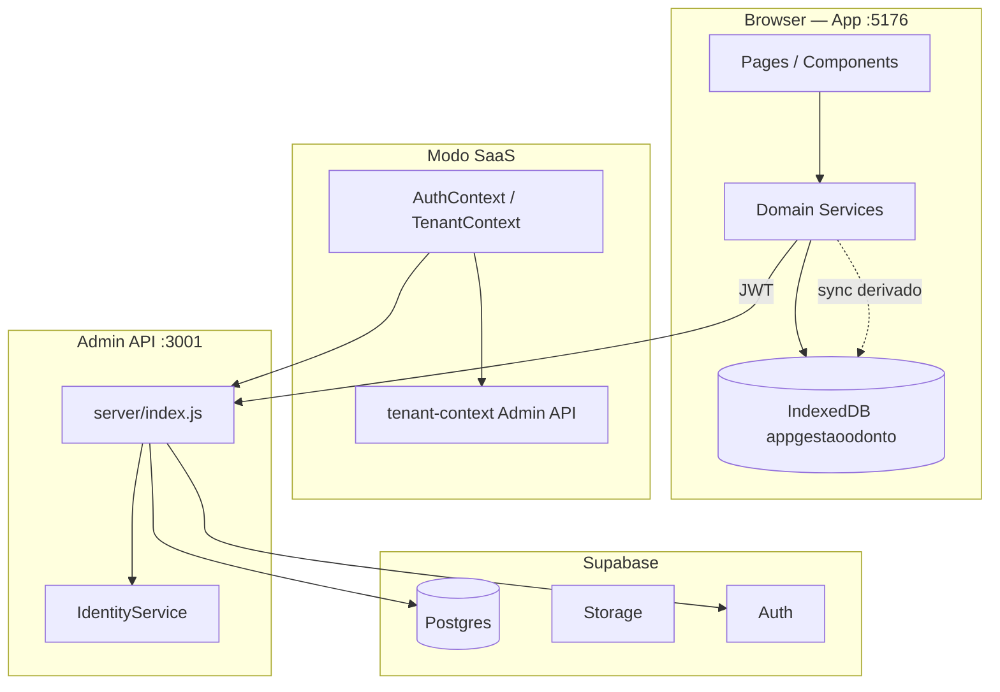
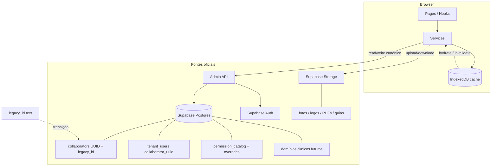

# Love Odonto V2 — Constituição Técnica (Master Architecture)

**Documento:** `docs/constitution/LOVE_ODONTO_V2_MASTER_ARCHITECTURE.md`  
**Versão:** 1.0.0  
**Data:** 2026-06-29  
**Status:** Oficial — fonte única para decisões de arquitetura, banco, API, permissões, cache, multi-tenant, deploy e módulos.  
**Base:** [`architecture-audit-love-odonto-v2.md`](../reports/architecture-audit-love-odonto-v2.md) + consolidação Fase 1 (migrations 014–019, backfill RH, staging).

**Regra de ouro:** qualquer PR, migration, script de dados ou feature nova **deve ser compatível com este documento**. Em caso de conflito, este documento prevalece até revisão formal.

---

## Índice

1. [Visão geral do produto](#1-visão-geral-do-produto)
2. [Princípios arquiteturais obrigatórios](#2-princípios-arquiteturais-obrigatórios)
3. [Fonte oficial dos dados](#3-fonte-oficial-dos-dados)
4. [Arquitetura atual resumida](#4-arquitetura-atual-resumida)
5. [Arquitetura alvo V2](#5-arquitetura-alvo-v2)
6. [Multi-tenant e isolamento de clínicas](#6-multi-tenant-e-isolamento-de-clínicas)
7. [Supabase como fonte oficial](#7-supabase-como-fonte-oficial)
8. [IndexedDB apenas como cache](#8-indexeddb-apenas-como-cache)
9. [Admin API](#9-admin-api)
10. [Autenticação e sessão](#10-autenticação-e-sessão)
11. [RBAC e permissões](#11-rbac-e-permissões)
12. [Modelo oficial de colaboradores / RH](#12-modelo-oficial-de-colaboradores--rh)
13. [Modelo oficial de usuários e acessos](#13-modelo-oficial-de-usuários-e-acessos)
14. [Modelo oficial de agenda](#14-modelo-oficial-de-agenda)
15. [Modelo oficial de pacientes](#15-modelo-oficial-de-pacientes)
16. [Modelo oficial financeiro](#16-modelo-oficial-financeiro)
17. [Modelo oficial de contratos](#17-modelo-oficial-de-contratos)
18. [Modelo oficial de prontuário / odontograma](#18-modelo-oficial-de-prontuário--odontograma)
19. [Modelo oficial de CRM / comercial](#19-modelo-oficial-de-crm--comercial)
20. [Assets, logos e fotos](#20-assets-logos-e-fotos)
21. [Storage](#21-storage)
22. [RLS e segurança](#22-rls-e-segurança)
23. [Padrões de API](#23-padrões-de-api)
24. [Padrões de migrations](#24-padrões-de-migrations)
25. [Estratégia de staging / dev / prod](#25-estratégia-de-staging--dev--prod)
26. [Estratégia de cache](#26-estratégia-de-cache)
27. [Estratégia offline futura](#27-estratégia-offline-futura)
28. [Estratégia de auditoria e logs](#28-estratégia-de-auditoria-e-logs)
29. [Estratégia de testes](#29-estratégia-de-testes)
30. [Roadmap de consolidação](#30-roadmap-de-consolidação)
31. [Decisões arquiteturais já tomadas](#31-decisões-arquiteturais-já-tomadas)
32. [Decisões proibidas daqui para frente](#32-decisões-proibidas-daqui-para-frente)
33. [Checklist obrigatório antes de qualquer nova feature](#33-checklist-obrigatório-antes-de-qualquer-nova-feature)

---

## 1. Visão geral do produto

**Love Odonto** é um sistema de gestão odontológica multi-clínica (SaaS) composto por:

| Superfície | Path | Porta | Público |
|------------|------|-------|---------|
| **App clínica** | `src/` | 5176 | Equipe da clínica (agenda, pacientes, financeiro, CRM, RH) |
| **Console SaaS** | `console/` | 5177 | Operadores da plataforma (tenants, billing, suporte) |
| **Admin API** | `server/index.js` | 3001 | Backend privado (JWT app + platform key) |

O produto evolui de um **app offline-first** (IndexedDB como autoridade) para **Love Odonto V2**: plataforma cloud-native com **Supabase Postgres + Auth + Storage** como fonte oficial, **Admin API** como orquestrador de regras de negócio sensíveis, e **IndexedDB** restrito a **cache derivado** e fila offline (fase posterior).

**Domínios principais:** RH, usuários e acessos, permissões, agenda, pacientes, prontuário, financeiro, CRM, contratos, convênios, clínica/tenant, assets, relatórios.

---

## 2. Princípios arquiteturais obrigatórios

Estes princípios são **não negociáveis** em V2:

1. **Single source of truth (SSOT):** Supabase é a autoridade para dados críticos de plataforma e, progressivamente, para dados clínicos e operacionais.
2. **Tenant-first:** todo dado crítico pertence a um `tenant_id` UUID válido. Sem exceções silenciosas.
3. **Cache explícito:** IndexedDB só armazena cópias derivadas, nunca a verdade canônica de domínios migrados.
4. **Fail closed:** ausência de tenant, permissão ou vínculo → bloqueio, não fallback.
5. **Idempotência:** scripts de backfill, seed e sync devem ser reexecutáveis com dry-run e rollback.
6. **Segurança em camadas:** RLS no Postgres, validação na Admin API, guards no frontend — nunca confiar só na UI.
7. **Preservação de legado durante transição:** `legacy_id` (text) mantido até cutover completo; `collaborator_uuid` como vínculo formal.
8. **Staging antes de produção:** migrations estruturais e applies de dados passam por ambiente dev/staging validado.
9. **Observabilidade:** operações sensíveis geram audit trail (`identity_events`, `audit_logs`, backups versionados).
10. **Simplicidade incremental:** migrar módulo a módulo; proibir big-bang sem plano de rollback.

---

## 3. Fonte oficial dos dados

### Hierarquia de autoridade (V2)

```
┌─────────────────────────────────────────────────────────┐
│  NÍVEL 1 — CANÔNICO (fonte oficial)                     │
│  Supabase Postgres + Auth app_metadata + Storage          │
└─────────────────────────────────────────────────────────┘
                          ▲
                          │ read/write via Admin API ou client autorizado
┌─────────────────────────────────────────────────────────┐
│  NÍVEL 2 — ORQUESTRAÇÃO                                 │
│  Admin API (server/index.js) — regras, provisionamento  │
└─────────────────────────────────────────────────────────┘
                          ▲
                          │ hydrate / invalidate
┌─────────────────────────────────────────────────────────┐
│  NÍVEL 3 — CACHE DERIVADO                               │
│  IndexedDB, localStorage (sessão reduzida), sessionStorage│
└─────────────────────────────────────────────────────────┘
```

### Matriz por domínio (estado 2026-06-29)

| Domínio | Autoridade hoje | Autoridade V2 | Status migração |
|---------|-----------------|---------------|-----------------|
| Membership / tenant_users | Supabase + API | Supabase + API | ✅ Alinhado |
| Auth / sessão SaaS | Supabase Auth | Supabase Auth | ✅ Alinhado |
| Perfil clínica | Supabase `clinic_profiles` | Supabase | ✅ Alinhado (cache IDB) |
| Logos | Supabase Storage | Supabase Storage | ✅ Alinhado |
| Catálogo permissões (seed) | Supabase + código | Supabase | 🔄 Seed OK; runtime ainda IDB |
| RBAC overrides | Auth `app_metadata` | Supabase relacional (Fase 2) | 🔄 Transição |
| RH / colaboradores | IndexedDB (ficha) + schema SB | Supabase `collaborators` | 🔄 Backfill preparado |
| Identities | Supabase `identities` | Supabase | ✅ Parcial |
| Agenda | IndexedDB | Supabase (futuro) | ⏳ Pendente |
| Pacientes | IndexedDB | Supabase (futuro) | ⏳ Pendente |
| Financeiro | IndexedDB | Supabase (futuro) | ⏳ Pendente |
| CRM | IndexedDB | Supabase (futuro) | ⏳ Pendente |
| Contratos | IndexedDB (+ espelho opcional) | Supabase + Storage | ⏳ Pendente |
| Prontuário / odontograma | IndexedDB | Supabase + Storage | ⏳ Pendente |
| Dashboard / relatórios | IndexedDB (agregado) | Read models Supabase | ⏳ Pendente |

**Legenda:** ✅ alinhado · 🔄 em consolidação · ⏳ ainda no IndexedDB como autoridade

---

## 4. Arquitetura atual resumida



**Fluxo dominante hoje:** `UI → Service → loadDb/withDb → IndexedDB`.

**Exceções SaaS (já canônicas):** tenant context, `tenant_users`, convites, `clinic_profiles`, logos, identities, espelho opcional de contratos.

**Referência detalhada:** [`architecture-audit-love-odonto-v2.md`](../reports/architecture-audit-love-odonto-v2.md).

---

## 5. Arquitetura alvo V2



**Contrato V2 por camada:**

| Camada | Responsabilidade |
|--------|------------------|
| **Supabase** | Persistência canônica, RLS, Auth, Storage |
| **Admin API** | Provisionamento, RBAC write, tenant-context, regras que não cabem só em RLS |
| **Frontend services** | Orquestração, cache, UX offline (fase 2+) |
| **IndexedDB** | Cache derivado + fila offline — **nunca** autoridade de dados críticos migrados |

---

## 6. Multi-tenant e isolamento de clínicas

### Modelo

- **Tenant** = clínica assinante (`public.tenants.id` UUID).
- **Membership** = `public.tenant_users` (usuário Auth ↔ tenant).
- **Isolamento:** toda tabela de domínio exposta deve ter `tenant_id NOT NULL` + FK → `tenants` + RLS por tenant.

### Regras obrigatórias

1. **Todo write crítico exige `tenant_id`** validado contra a sessão ativa (`TenantContext`, `tenantWriteGuard.js`).
2. **Proibido** inferir tenant por: primeira clínica, `tenant-1`, tenant padrão, seed automático, mock ou “qualquer tenant ativo”.
3. **Proibido** cross-tenant read/write silencioso — queries sem filtro de tenant são bug crítico.
4. **UUID de tenant** vem exclusivamente de: sessão SaaS (`tenant-context`), JWT claims validados, ou parâmetro explícito validado server-side.
5. **IndexedDB:** coleções em `TENANT_GUARDED_COLLECTIONS` (`src/db/index.js`) bloqueiam persistência sem `tenant_id`.

### Entidades de plataforma (sem tenant ou multi-tenant especial)

- Console: `platform_admin_users`, billing platform — escopo platform, não clínica.
- Catálogo global: `permission_catalog` (sem tenant; seed único).

---

## 7. Supabase como fonte oficial

### Projeto e ambientes

| Ambiente | Project ref | Uso |
|----------|-------------|-----|
| **Produção** | `uoepkwhqztmsjnzirpev` (`love-odonto-prod`) | Clínicas reais — **protegido** |
| **Staging / dev** | `tckdjyunwmdpqmewrwvt` (`Love odonto`) | Testes, applies, validação UI |

> **Regra:** desenvolvimento local e applies de dados **devem apontar para staging** até processo formal de promoção.

### Tabelas oficiais (Fase 1 — consolidadas)

| Tabela | Propósito |
|--------|-----------|
| `tenants` | Cadastro SaaS da clínica |
| `tenant_users` | Membership + vínculo RH (`collaborator_id`, `collaborator_uuid`) |
| `tenant_modules`, `tenant_limits`, `tenant_subscriptions` | Módulos, limites, assinatura |
| `clinic_profiles` | Perfil cadastral/visual |
| `collaborators` | RH canônico (UUID + `legacy_id`) |
| `permission_catalog`, `role_permission_defaults` | RBAC seed (184 + 175) |
| `invitations` | Convites canônicos |
| `identities`, `identity_events` | Identidade unificada + auditoria |
| `audit_logs` | Auditoria plataforma |

### Tabelas futuras (domínios clínicos)

Agenda, pacientes, financeiro, CRM, contratos, prontuário — **schema a definir por fase**, sempre com `tenant_id` + RLS + migrations versionadas.

### O que Supabase **não** faz sozinho

- Regras complexas de provisionamento RH → **Admin API**.
- Dual-write durante transição → scripts + services com feature flag.
- Validação de negócio clínico pesado → Admin API ou Edge Functions (avaliar por caso).

---

## 8. IndexedDB apenas como cache

### Definição

IndexedDB (`appgestaoodonto`, store `data`, `src/db/idbStorage.js`) **pode** armazenar:

- Snapshots derivados de respostas Supabase/API (ex.: `clinicProfile` cache, roster enriquecido).
- Dados de domínios **ainda não migrados** (agenda, pacientes, financeiro…) — **temporário**.
- Espelho de permissões para `can()` offline — **temporário**, invalidado após sync.

IndexedDB **não pode** (após cutover do módulo):

- Ser o único lugar onde um dado crítico existe.
- Receber writes que não propagam para Supabase (dual-write obrigatório na transição).
- Armazenar fotos/assets como base64 persistente (ver seção 20).

### Módulos que **ainda** tratam IndexedDB como autoridade (devem migrar)

| Módulo | Stores / serviços principais |
|--------|------------------------------|
| Agenda | `appointments`, `appointmentBlocks`, `collaboratorWorkHours`, `appointmentService.js` |
| Pacientes | `patients` + satélites, `patientService.js` |
| Prontuário | `patientOdontograms*`, `clinicalAppointments`, `clinicalEvents`, `documentRecords` |
| Financeiro | `transactions`, `accountsReceivable`, `payables`, `financings`, `commissions`, … |
| CRM | `crmLeads`, `crmBudgets`, `crmTasks`, `marketingChat*` |
| Contratos | `contractTemplates`, `generatedContracts`, `contractSignatures` |
| RH ficha rica | `collaborators`, `collaboratorDocuments`, `collaboratorFinance`, `collaboratorService.js` |
| RBAC runtime | `permissionsCatalog`, `userPermissions`, `accessService.js` |
| Convênios | `insuranceProviders`, `insuranceGuides`, … |
| Estoque | `materials`, `stockMovements` |
| Dashboard | agregações sobre stores acima |

### Padrão de cache (obrigatório para novos services)

```
1. READ:  tentar cache (IDB) → se stale/miss → fetch Supabase/API → hydrate IDB
2. WRITE: Supabase/API primeiro → sucesso → invalidate/update cache
3. Nunca: write IDB-only em domínio migrado
```

---

## 9. Admin API

**Arquivo:** `server/index.js`  
**Autenticação:** JWT Supabase (app) via `requireAppUser`; Console via `X-Platform-Key` + `requireConsoleAccess`.

### Grupos de endpoints

| Grupo | Prefixo / exemplos | Responsabilidade |
|-------|---------------------|------------------|
| Health | `GET /health` | Liveness |
| Tenant context | `GET /internal/app/tenant-context` | Snapshot completo da sessão clínica |
| Clínica | `PUT /internal/app/clinic-profile` | Perfil + logo URL |
| Colaboradores / acessos | `POST .../collaborators/link`, `provision`, `access-bundle` | RH ↔ user, RBAC write |
| Usuários tenant | `CRUD /internal/app/users/*` | `tenant_users` |
| Convites | `POST .../invitations/resend`, `reconcile` | Fluxo convite |
| Platform | `/internal/platform/*` | Provisioning, billing (Console) |
| Contratos espelho | `POST /internal/app/contracts/generated` | Espelho opcional |
| Webhooks | `POST /api/signature/webhook` | Assinatura externa |

### Regras

1. **Toda rota mutável** valida `tenant_id` do JWT/context — nunca confia só no body.
2. **Service role** só no server — nunca expor `SUPABASE_SERVICE_ROLE_KEY` ao browser.
3. **Respostas de erro** sem vazamento de PII ou stack em produção.
4. **Versionamento:** header ou campo `apiVersion` documentado em mudanças breaking.

---

## 10. Autenticação e sessão

### Modos

| Modo | Ativação | Fluxo |
|------|----------|-------|
| **Legado local** | SaaS desabilitado | bcrypt em IDB `userAuth` — **deprecado** |
| **SaaS** | `VITE_ACCESS_SAAS_ENABLED=1` ou PLATFORM URL+KEY | Supabase Auth → Admin API → hydrate local |

### Componentes

- `src/auth/AuthContext.jsx` — sessão app, `hydrateSaasUser()`
- `src/tenant/TenantContext.jsx` — snapshot tenant, refresh 5 min, realtime
- `src/services/saasAuthService.js`, `saasSessionResolver.js`
- `src/lib/supabaseClients.js` — `supabasePlatformClient` (Auth), `supabaseAppClient`

### Storage de sessão

| Key | Uso |
|-----|-----|
| `appgestaoodonto-platform-auth` | JWT Supabase (localStorage) |
| `appgestaoodonto.session` | Sessão reduzida app (legado/SaaS cache) |

### Regras

1. Login SaaS **exige** mesmo projeto Supabase em app, server e Console (`envGuard.js` valida alinhamento).
2. Logout limpa sessão local **e** invalida contexto tenant.
3. **Proibido** autenticar com usuário mock ou seed em produção/staging real.

---

## 11. RBAC e permissões

### Modelo canônico (V2)

```
permission_catalog (184 permissões, global seed)
        ↓
role_permission_defaults (175 mapeamentos role → permission)
        ↓
tenant_users + overrides (custom_permissions / permission_overrides)
        ↓
Auth app_metadata (snapshot temporário na transição)
        ↓
cache IDB (espelho para can() — invalidar após sync)
```

### Runtime hoje

- **Escrita canônica:** `POST /internal/app/collaborators/access-bundle` → Auth `app_metadata`.
- **Leitura `can()`:** `src/services/accessService.js` — catálogo + overrides do IDB espelho.
- **UI:** `useCollaboratorAccessForm.js`, `CollaboratorPermissionsPanel.jsx`.

### Regras V2

1. Catálogo oficial = **`permission_catalog` Supabase** (migration 015 + `scripts/seed-permission-catalog.mjs`).
2. Overrides por usuário migrarão para tabela relacional tenant-scoped (Fase 2).
3. Contagem tipo “184/184” deve ser derivada do **catálogo Supabase**, não de array hardcoded divergente.
4. **Master / owner / admin** — bypass documentado em `accessService.js`; não duplicar lógica na UI.

---

## 12. Modelo oficial de colaboradores / RH

### Supabase `public.collaborators` (canônico)

| Campo | Tipo | Regra |
|-------|------|-------|
| `id` | UUID | PK |
| `tenant_id` | UUID | FK tenants, NOT NULL |
| `legacy_id` | text | Mapeamento `col-*` / `col-saas-*`; unique `(tenant_id, legacy_id)` |
| `email`, `apelido`, `nome_completo` | text | Normalizados |
| `rh_categoria`, `cargo`, `tipo_vinculo`, `setor` | text | Catálogo RH |
| `agenda_enabled` | boolean | Profissional de agenda |
| `foto_url` | text | **HTTPS Storage only** — proibido base64 |
| `status`, `deleted_at` | | Soft delete |
| `updated_at` | timestamptz | Conflito backfill |

### Vínculo com usuário

| Campo | Tabela | Regra |
|-------|--------|-------|
| `collaborator_id` | `tenant_users` | **Legado text — preservar** na transição |
| `collaborator_uuid` | `tenant_users` | **Vínculo formal** → `collaborators.id` |
| FK 018 | | **Gate pós-backfill** — não aplicar antes de UUIDs consistentes |

### IndexedDB (transição)

- Ficha rica (`collaboratorDocuments`, `collaboratorFinance`, …) permanece até migração módulo a módulo.
- `collaboratorService.js` → dual-write obrigatório quando cutover iniciar.

### Backfill oficial

- Script: `scripts/rh-backfill-to-supabase.mjs`
- Lógica: `server/lib/rhBackfillToSupabase.js`
- Estratégia link: (1) `legacy_id`, (2) e-mail único no tenant, (3) `AMBIGUOUS` se duplicado, (4) `NOT_FOUND` se sem match.

---

## 13. Modelo oficial de usuários e acessos

### `public.tenant_users`

Campos críticos: `tenant_id`, `user_id` (Auth), `email`, `role_slug`, `role`, `status`, `is_active`, `has_system_access`, `invitation_status`, `collaborator_id`, `collaborator_uuid`, `has_custom_permissions`.

### Fluxos

| Operação | Canal |
|----------|-------|
| Criar acesso | Admin API `POST .../users/create` + Auth user |
| Convite | `invitations` + e-mail |
| Link RH | `POST .../collaborators/link` |
| Revogar | `DELETE/PATCH .../users/:id` |
| Auditoria | `identity_events`, `GET .../access-audit` |

### Deprecações

- `userAuth` (bcrypt local) — remover após cutover SaaS 100%.
- IDs sintéticos `col-saas-*` — aceitos como `legacy_id`; convergir para UUID via backfill + sync.

---

## 14. Modelo oficial de agenda

### Estado atual

- **Autoridade:** IndexedDB (`appointments`, `appointmentBlocks`, `collaboratorWorkHours`, `rooms`).
- **Serviço:** `appointmentService.js`, `AgendaPage.jsx`.
- **Campos críticos:** `professionalId` (= `collaborators.id` text legado), `patientId`, `tenant_id`.

### Alvo V2

- Tabela Supabase `appointments` (schema futuro) com `professional_collaborator_uuid` + `legacy_professional_id` na transição.
- IndexedDB = cache + optimistic UI.
- Backfill RH **não altera** agenda IndexedDB.

---

## 15. Modelo oficial de pacientes

### Estado atual

- **Autoridade:** IndexedDB (`patients` + ~15 satélites).
- **Serviço:** `patientService.js`, `patientRecordService.js`.

### Alvo V2

- `public.patients` (UUID, `tenant_id`, soft delete).
- Satélites normalizados ou JSONB documentado por subdomínio.
- Import/export via API — nunca seed mock em tenant real.

---

## 16. Modelo oficial financeiro

### Estado atual

- **Autoridade:** IndexedDB (`transactions`, `accountsReceivable`, `payables`, `financings`, `boletoCharges`, `commissions`).
- **Fase de migração:** 3+ (após RH, agenda, pacientes).

### Alvo V2

- Ledger Supabase com `tenant_id` em toda movimentação.
- Comissões vinculadas a `collaborator_uuid`.
- Integração boleto/gateway via Admin API / webhooks.

---

## 17. Modelo oficial de contratos

### Estado atual

- **Autoridade:** IndexedDB (`contractTemplates`, `generatedContracts`, `contractSignatures`).
- **Espelho opcional:** `contractSaasSyncService.js` → Supabase (migration 006).

### Alvo V2

- Contratos canônicos em Supabase + PDFs em Storage.
- Assinatura via webhook (`/api/signature/webhook`).
- Unificar `clinicId` legado → `tenant_id`.

---

## 18. Modelo oficial de prontuário / odontograma

### Estado atual

- **Autoridade:** IndexedDB (odontograma v1/v2, anamnese, eventos clínicos).
- **Storage parcial:** guias clínicos em Supabase Storage (migration 007).

### Alvo V2

- Registros clínicos versionados em Supabase.
- Imagens/radiografias em Storage — **proibido base64 persistente**.
- Deprecar trilha legada `budgetsService` → Supabase `budgets` onde existir.

---

## 19. Modelo oficial de CRM / comercial

### Estado atual

- **Autoridade:** IndexedDB (`crmLeads`, `crmBudgets`, `crmTasks`, `marketingChat*`).

### Alvo V2

- Pipeline CRM Supabase com `tenant_id`.
- Integração agenda/financeiro via FKs UUID.

---

## 20. Assets, logos e fotos

| Tipo | V2 oficial | Proibido |
|------|------------|----------|
| Logo clínica | Storage `clinic-logos` + `clinic_profiles.logo_url` | base64 em DB |
| Foto RH | Storage bucket dedicado + `collaborators.foto_url` HTTPS | `data:image/*` em Postgres/IDB persistente |
| Foto paciente | Storage | base64 em IDB |
| Avatar UI | URL ou iniciais | inline base64 salvo |

**Backfill RH:** fotos base64 no export → `SKIP_BASE64_PHOTO` / `foto_url: null` no Supabase; migrar para Storage em fase dedicada.

---

## 21. Storage

### Buckets oficiais (Fase 1)

| Bucket | Migration | Escopo |
|--------|-----------|--------|
| `clinic-logos` | 013 | Logos por tenant (público controlado) |

### Buckets futuros

- `collaborator-photos`, `patient-files`, `clinical-guides`, `contract-pdfs` — criar via migration com RLS por `tenant_id`.

### Regras

1. Path convention: `{tenant_id}/{entity_type}/{entity_id}/{filename}`.
2. Upload via client autenticado ou Admin API — validar MIME e tamanho server-side.
3. **Nunca** persistir binário em coluna text/json.

---

## 22. RLS e segurança

### Postgres RLS

- **Obrigatório** em toda tabela `public` exposta à API.
- Padrão tenant: `tenant_id = app_user_admin_tenant_id()` ou helpers SECURITY DEFINER (`009`, `012`, `019`).
- **Recursão:** usar funções `app_user_is_tenant_admin`, `app_user_collaborator_uuid` — nunca subquery direta em `tenant_users` dentro de policy de `tenant_users`.

### Auth

- RBAC sensível em `app_metadata` (não `user_metadata` — editável pelo usuário).
- JWT refresh após mudança de permissões.

### Secrets

- `SUPABASE_SERVICE_ROLE_KEY`, `PLATFORM_API_KEY` — somente server/CI.
- **Proibido** commitar `.env` com secrets.

### Checklist segurança (toda migration)

- [ ] RLS enabled
- [ ] Policies SELECT + INSERT + UPDATE (+ DELETE se aplicável)
- [ ] SECURITY DEFINER functions em schema controlado
- [ ] Advisors Supabase (`get_advisors`) sem critical pendente

---

## 23. Padrões de API

### Request / response

- JSON UTF-8.
- Erros: `{ error: string, code?: string, details?: object }` — sem stack trace em prod.
- Paginação: `limit`, `offset` ou cursor — documentar por endpoint.

### Idempotência

- Provisionamento e backfill: chaves naturais (`tenant_id` + `email`, `legacy_id`).
- Retries seguros com `ON CONFLICT`.

### CORS e proxy

- Dev: Vite proxy `/internal/app` → `:3001`.
- Prod: `VITE_PLATFORM_API_BASE_URL` apontando para API pública (Railway/Render).

---

## 24. Padrões de migrations

### Localização

| Repo path | Escopo |
|-----------|--------|
| `supabase/migrations/` | App clínica + tenant SaaS |
| `console/supabase/migrations/` | Console platform / billing |

### Numeração

- Sequencial `NNN_descricao_snake.sql`.
- **Nunca** inventar filename fora do padrão CLI.

### Regras

1. **Migrations aditivas** preferidas; destructive exige plano de rollback documentado.
2. **DDL estrutural:** staging primeiro → validação → produção em janela aprovada.
3. **Seed de dados** (015): script separado `scripts/seed-permission-catalog.mjs` quando aplicável.
4. **018 FK `collaborator_uuid`:** gate explícito — só após backfill + queries de órfãos = 0.
5. Registrar versão aplicada via Supabase MCP / CLI — manter paridade staging ↔ prod.

### Ordem mínima Fase 1 (referência staging)

`007_console` → `005` → `008` → `009` → `010` → `011` → `013` → `012_prod` → `014` → `015` + seed → `016` → `017` → `019` — **sem 018**.

---

## 25. Estratégia de staging / dev / prod

### Ambientes

| Ambiente | Supabase ref | Dados | Applies / backfill |
|----------|--------------|-------|-------------------|
| **Local** | staging credentials | Seed / export anonimizado | Permitido |
| **Staging** | `tckdjyunwmdpqmewrwvt` | Snapshot mínimo Implanprime anonimizado | Permitido após dry-run |
| **Produção** | `uoepkwhqztmsjnzirpev` | Clínicas reais | **Somente** janela aprovada |

### Gate de produção (obrigatório)

Antes de **qualquer** `--apply` ou migration structural em produção:

1. Dry-run aprovado (`apply_gate.ok = true`).
2. Backup completo (`pre-apply-full-backup-*.json`).
3. Relatório dry-run arquivado e referenciado.
4. Rollback testado em staging.
5. Janela de manutenção comunicada.
6. Migration 018 **não** incluída até validação pós-backfill.

### Preflight

```powershell
node scripts/preflight-local.mjs
# Deve confirmar project ref esperado antes de cada operação
```

---

## 26. Estratégia de cache

### Camadas

| Camada | TTL / invalidação |
|--------|-------------------|
| React state / context | Sessão; refresh tenant-context 5 min |
| localStorage sessão | Logout; troca tenant |
| IndexedDB | Evento sync; versão schema `DB_VERSION` |
| CDN / Storage | Cache-Control nos buckets |

### Invalidação obrigatória após

- Mudança RBAC → `syncCurrentUserPermissionsFromContext`
- Mudança clinic profile → `syncTenantClinicProfileToLocalDb`
- Backfill RH → refresh roster + invalidate colaboradores cache

### Proibido

- Cache como única cópia de dado migrado.
- Stale cache silencioso após write Supabase falho.

---

## 27. Estratégia offline futura

**Fase posterior** — não implementar como autoridade.

### Diretriz

1. **Fila offline** (outbox): writes enfileirados com `tenant_id`, timestamp, idempotency key.
2. **Sync worker:** replay para Supabase/API ao reconectar.
3. **Conflitos:** Last-write-wins **somente** onde documentado; demais casos → UI de merge.
4. **Read offline:** servir cache IDB com banner “modo offline — dados podem estar desatualizados”.

### Pré-requisitos antes do offline

- SSOT Supabase estável por módulo.
- `collaborator_uuid` propagado em agenda/financeiro.
- Testes de sync em staging.

---

## 28. Estratégia de auditoria e logs

### Fontes

| Fonte | Escopo |
|-------|--------|
| `identity_events` | Ações identidade/acesso por tenant |
| `audit_logs` | Platform / admin |
| `accessAuditLogs` (IDB) | Legado — migrar para Supabase |
| Backups JSON | `scripts/reports/*` — dry-run, pre-apply, rollback |
| `stabilityLogService` | Frontend stability (dev) |

### Regras

1. Operações de provisionamento, link RH, RBAC change → evento em `identity_events`.
2. Scripts de backfill → relatório JSON timestampado obrigatório.
3. **Proibido** logar PII, tokens ou service role em console produção.

---

## 29. Estratégia de testes

### Pirâmide

| Nível | Escopo | Exemplos |
|-------|--------|----------|
| Unit | Lógica pura | `rhBackfillToSupabase.test.js`, `collaboratorIdBackfill.test.js` |
| Integration | Services + mocks | `identityProvisionFlow.test.js` |
| E2E manual | Staging | Checklist pós-apply (dashboard, equipe, acessos, Melissa N/184) |
| SQL validation | Pós-migration | Queries órfãos, counts, RLS |

### Obrigatório antes de apply

- `npm test` nos módulos alterados.
- Dry-run CLI com gate liberado.
- Validação staging espelhando prod.

### Proibido

- Testes que dependem de tenant padrão ou seed mock em CI de produção.

---

## 30. Roadmap de consolidação

### Fase 0 — Governança ✅ (em curso)

- [x] Auditoria arquitetural (`architecture-audit-love-odonto-v2.md`)
- [x] Constituição técnica (este documento)
- [x] Backfill RH dry-run 4/4 LINK (email fallback)
- [ ] Staging schema + seed Implanprime
- [ ] Apply backfill staging + validação UI

### Fase 1 — RH + vínculos UUID

- [ ] Apply backfill staging
- [ ] Apply backfill produção (janela aprovada)
- [ ] Migration 018 (FK validate) pós-queries órfãos = 0
- [ ] Dual-write RH → Supabase nos services
- [ ] Fotos RH → Storage

### Fase 2 — Permissões relacionais

- [ ] Tabela overrides tenant-scoped
- [ ] `can()` lê Supabase (cache IDB)
- [ ] Deprecar espelho `app_metadata` como canônico

### Fase 3 — Domínios clínicos

- [ ] Pacientes Supabase
- [ ] Agenda Supabase
- [ ] Financeiro core

### Fase 4 — CRM, contratos, prontuário completo

### Fase 5 — Offline outbox + cutover IndexedDB → cache-only

---

## 31. Decisões arquiteturais já tomadas

| # | Decisão | Data | Referência |
|---|---------|------|------------|
| D1 | Supabase = SSOT V2 | 2026-06 | Auditoria V2 |
| D2 | IndexedDB → cache derivado (meta) | 2026-06 | Auditoria V2 |
| D3 | `legacy_id` text preservado na transição | 2026-06 | Migrations 016–017 |
| D4 | `collaborator_uuid` = vínculo formal tenant_users → collaborators | 2026-06 | Migration 017 |
| D5 | Migration 018 = gate pós-backfill | 2026-06 | Migration 018 |
| D6 | Backfill link: legacy_id → email único → AMBIGUOUS/NOT_FOUND | 2026-06 | `rhBackfillToSupabase.js` |
| D7 | Backfill não altera `collaborator_id` text nem IndexedDB | 2026-06 | Script CLI |
| D8 | Proibido base64 em `foto_url` Supabase | 2026-06 | Migration 016 |
| D9 | Prod confirmada: `uoepkwhqztmsjnzirpev` — apply bloqueado até staging OK | 2026-06 | Preflight + MCP |
| D10 | Staging candidato: `tckdjyunwmdpqmewrwvt` | 2026-06 | Plano staging |
| D11 | `permission_catalog` seed 184 + `role_permission_defaults` 175 | 2026-06 | Migration 015 |
| D12 | Admin API orquestra provisionamento e RBAC write | 2026-06 | `server/index.js` |
| D13 | Modais Radix, toasts CSS global, z-index tokens | contínuo | `.cursor/rules/conventions.mdc` |

---

## 32. Decisões proibidas daqui para frente

| # | Proibição |
|---|-----------|
| P1 | Usar IndexedDB como **única** autoridade para novos dados críticos |
| P2 | Fallback para tenant padrão, `tenant-1`, primeira clínica, seed automático ou mock |
| P3 | Writes sem `tenant_id` em coleções guarded ou tabelas Supabase de domínio |
| P4 | `--apply` ou backfill em produção sem dry-run + backup + rollback + janela |
| P5 | Aplicar migration 018 antes de backfill validado e órfãos = 0 |
| P6 | Aplicar migrations estruturais direto em prod sem passar por staging |
| P7 | Persistir fotos/assets como base64 em Postgres ou IDB (novos features) |
| P8 | Expor `SUPABASE_SERVICE_ROLE_KEY` no frontend |
| P9 | Usar `user_metadata` JWT para autorização |
| P10 | Criar `collaborator_id` sintético `col-saas-*` sem convergir para UUID Supabase |
| P11 | Dual-write IDB-only após cutover de módulo declarado |
| P12 | Commit de `.env` com secrets |
| P13 | `document.querySelector` / DOM imperativo para modais e toasts (ver conventions) |
| P14 | Console.log desprotegido em produção |

---

## 33. Checklist obrigatório antes de qualquer nova feature

Copiar e responder em PR ou ticket:

### Contexto

- [ ] Módulo identificado (RH, agenda, pacientes, …)
- [ ] Este documento (seção relevante) lida
- [ ] `architecture-audit` consultado se domínio híbrido

### Tenant e dados

- [ ] Todo dado novo tem `tenant_id` UUID
- [ ] Nenhum fallback para tenant padrão/mock
- [ ] Fonte oficial identificada (Supabase / API / cache temporário)

### Persistência

- [ ] Writes vão para Supabase/API se módulo migrado
- [ ] Cache IDB invalidado após write
- [ ] Sem base64 persistente para assets

### Segurança

- [ ] RLS considerado se nova tabela
- [ ] Admin API valida tenant server-side
- [ ] Permissões via `can()` / RBAC documentado

### Migrations / scripts

- [ ] Migration testada em staging primeiro
- [ ] Script com dry-run se mutação de dados
- [ ] Rollback documentado

### Testes

- [ ] Testes unitários para lógica nova
- [ ] Checklist manual staging se afeta UI

### Deploy

- [ ] Env vars documentadas
- [ ] Sem breaking change não versionado na Admin API

---

## Referências

| Documento / path | Conteúdo |
|------------------|----------|
| [`LOVE_ODONTO_V2_MASTER_BUSINESS_RULES.md`](./LOVE_ODONTO_V2_MASTER_BUSINESS_RULES.md) | Constituição Funcional (regras de negócio) |
| [`LOVE_ODONTO_V2_MASTER_DATABASE.md`](./LOVE_ODONTO_V2_MASTER_DATABASE.md) | Constituição do Banco de Dados |
| [`LOVE_ODONTO_V2_MASTER_QA.md`](./LOVE_ODONTO_V2_MASTER_QA.md) | Manual oficial de QA |
| [`architecture-audit-love-odonto-v2.md`](../reports/architecture-audit-love-odonto-v2.md) | Auditoria detalhada módulo a módulo |
| [`agenda.md`](../modules/agenda.md), [`prontuario.md`](../modules/prontuario.md), [`collaborators.md`](../modules/collaborators.md), [`clinic-profile.md`](../modules/clinic-profile.md) | Docs de domínio |
| `supabase/migrations/014_*` … `019_*` | Schema V2 Fase 1 |
| `scripts/rh-backfill-to-supabase.mjs` | Backfill RH |
| `scripts/pre-apply-full-backup.mjs` | Backup pré-apply |
| `DEPLOY.md`, `CONSOLE_SETUP.md` | Deploy e env |
| `.cursor/rules/conventions.mdc` | Convenções UI |

---

## Histórico de revisões

| Versão | Data | Autor | Mudança |
|--------|------|-------|---------|
| 1.0.0 | 2026-06-29 | Consolidação V2 | Versão inicial — Constituição Técnica |

---

*Love Odonto V2 — Este documento é a Constituição Técnica do produto. Alterações exigem revisão explícita e bump de versão nesta seção.*
