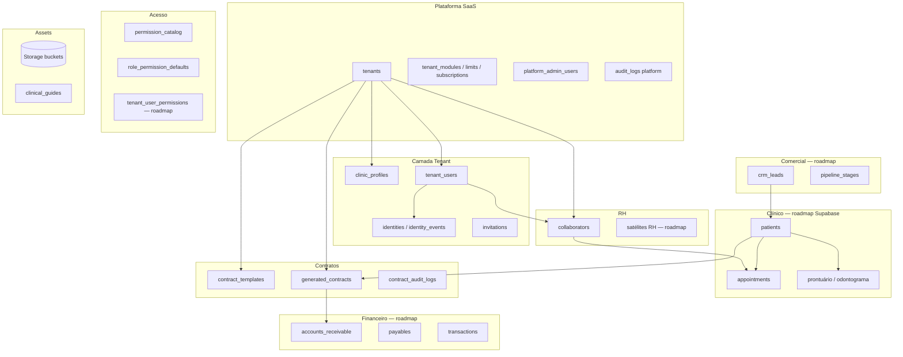

# Love Odonto V2 — Constituição Oficial do Banco de Dados

**Documento:** `docs/constitution/LOVE_ODONTO_V2_MASTER_DATABASE.md`  
**Versão:** 1.0.0  
**Data:** 2026-06-29  
**Status:** Oficial — fonte única para modelo de dados, domínios, RLS, constraints e evolução do banco Love Odonto V2.  
**Complemento de:** [`LOVE_ODONTO_V2_MASTER_ARCHITECTURE.md`](./LOVE_ODONTO_V2_MASTER_ARCHITECTURE.md) · [`LOVE_ODONTO_V2_MASTER_BUSINESS_RULES.md`](./LOVE_ODONTO_V2_MASTER_BUSINESS_RULES.md) · [`LOVE_ODONTO_V2_MASTER_QA.md`](./LOVE_ODONTO_V2_MASTER_QA.md)

**Regra de ouro:** nenhuma tabela, coluna, índice, policy ou bucket pode ser criado fora das regras deste documento. Em conflito com implementação legada, **este documento prevalece** até revisão formal.

**Escopo:** modelo lógico, ownership, RLS, auditoria, cache e estratégia de evolução. **Não** contém SQL, migrations nem código.

---

## Índice

1. [Filosofia do Banco](#1-filosofia-do-banco)
2. [Princípios obrigatórios](#2-princípios-obrigatórios)
3. [Arquitetura geral](#3-arquitetura-geral)
4. [Organização dos domínios](#4-organização-dos-domínios)
5. [Catálogo oficial das tabelas](#5-catálogo-oficial-das-tabelas)
6. [Modelo oficial de Tenant](#6-modelo-oficial-de-tenant)
7. [Modelo oficial RH](#7-modelo-oficial-rh)
8. [Modelo oficial Pacientes](#8-modelo-oficial-pacientes)
9. [Modelo oficial Agenda](#9-modelo-oficial-agenda)
10. [Modelo clínico](#10-modelo-clínico)
11. [Modelo comercial](#11-modelo-comercial)
12. [Modelo financeiro](#12-modelo-financeiro)
13. [Modelo contratos](#13-modelo-contratos)
14. [Modelo permissões](#14-modelo-permissões)
15. [Modelo Storage](#15-modelo-storage)
16. [Modelo auditoria](#16-modelo-auditoria)
17. [Modelo IA](#17-modelo-ia)
18. [IndexedDB](#18-indexeddb)
19. [RLS](#19-rls)
20. [Constraints](#20-constraints)
21. [Índices](#21-índices)
22. [Auditoria de integridade](#22-auditoria-de-integridade)
23. [Estratégia de evolução](#23-estratégia-de-evolução)
24. [Estratégia de migrations](#24-estratégia-de-migrations)
25. [Estratégia Dev / Staging / Produção](#25-estratégia-dev--staging--produção)
26. [Roadmap](#26-roadmap)
27. [Regras proibidas](#27-regras-proibidas)
28. [Checklist obrigatório](#28-checklist-obrigatório)

---

## 1. Filosofia do Banco

### 1.1 Princípios

O banco de dados Love Odonto V2 é projetado como **ledger corporativo multi-tenant** de um ERP odontológico SaaS:

| Princípio | Significado |
|-----------|-------------|
| **Single Source of Truth (SSOT)** | Supabase Postgres + Storage + Auth são autoridade canônica para dados migrados |
| **Tenant-first** | Isolamento por clínica é requisito estrutural, não opcional |
| **Auditabilidade** | Mutations sensíveis deixam trilha recuperável |
| **Evolução incremental** | Migração módulo a módulo; dual-write na transição |
| **Fail closed** | RLS negando acesso é comportamento correto |
| **Preservação legado** | `legacy_id`, `collaborator_id` text mantidos até cutover |

### 1.2 Stack oficial

| Camada | Tecnologia | Papel |
|--------|------------|-------|
| **Persistência relacional** | PostgreSQL (Supabase) | Entidades canônicas, FK, RLS |
| **Objetos binários** | Supabase Storage | Logos, guias, PDFs, imagens clínicas |
| **Identidade** | Supabase Auth | Usuários, JWT, `app_metadata` |
| **Orquestração** | Admin API (`server/`) | Writes sensíveis, service role |
| **Cache derivado** | IndexedDB (`appgestaoodonto`) | Snapshot local — **nunca SSOT pós-cutover** |

### 1.3 Projetos Supabase

| Projeto | Ref | Escopo |
|---------|-----|--------|
| **App clínica + tenant SaaS** | `uoepkwhqztmsjnzirpev` (prod) · `tckdjyunwmdpqmewrwvt` (staging) | `public.*` app + migrations `supabase/migrations/` |
| **Console plataforma** | Projeto dedicado (recomendado) | `console/supabase/migrations/` — billing, platform admins |

### 1.4 Escalabilidade

- Particionamento lógico por `tenant_id` (índices compostos `(tenant_id, …)`).
- Read models futuros para dashboard (materialized views ou tabelas agregadas).
- Storage path `{tenant_id}/{entity}/{id}/{file}` — sem blobs em colunas text.
- Conexões client-side via PostgREST com RLS — service role **somente** server-side.

---

## 2. Princípios obrigatórios

Todo objeto persistente **crítico** deve obedecer:

| # | Princípio | Obrigatoriedade |
|---|-----------|-----------------|
| P1 | `tenant_id UUID NOT NULL` + FK → `tenants` | Tabelas de domínio clínico/operacional |
| P2 | RLS habilitado | Toda tabela `public` exposta à API |
| P3 | Auditoria em mutations sensíveis | Via tabela de eventos ou `audit_logs` |
| P4 | FK representa regra de negócio documentada | Sem FK decorativa |
| P5 | Soft delete preferencial (`deleted_at`) | RH, pacientes, registros clínicos |
| P6 | `created_at` / `updated_at` | Todas tabelas mutáveis |
| P7 | `created_by` / `updated_by` | Quando actor humano identificável |
| P8 | Proibição base64 persistente | Fotos, logos, PDFs → Storage |
| P9 | Idempotência em backfill/seed | Chaves naturais `(tenant_id, email)`, `(tenant_id, legacy_id)` |

**Exceções globais (sem `tenant_id`):**

- `permission_catalog`, `role_permission_defaults` — catálogo global de referência
- `clinical_guides` com `tenant_id IS NULL` — defaults de sistema (leitura global autenticada)
- Tabelas platform (`platform_admin_users`, `plans` globais) — escopo Console

---

## 3. Arquitetura geral

### 3.1 Diagrama lógico de domínios



### 3.2 Hierarquia de autoridade (resumo)

```
Supabase Postgres + Storage + Auth  ← CANÔNICO (domínios migrados)
Admin API                             ← ORQUESTRAÇÃO + service role
IndexedDB                             ← CACHE / transição temporária
```

### 3.3 Fluxo de escrita padrão V2

```
UI → Service → Admin API (ou client RLS) → Postgres
                    ↓ sucesso
              invalidate / hydrate IndexedDB
```

---

## 4. Organização dos domínios

| Domínio | Tabelas Supabase (estado 2026-06-29) | Autoridade operacional hoje |
|---------|--------------------------------------|----------------------------|
| **Autenticação** | `auth.users` (Supabase Auth) | Supabase Auth ✅ |
| **Tenant** | `tenants`, `clinic_profiles`, `tenant_modules`, `tenant_limits`, `tenant_subscriptions`, `tenant_integrations`, `tenant_legal_profiles` | Supabase ✅ |
| **RH** | `collaborators` | Supabase 🔄 + IDB ficha rica |
| **Usuários** | `tenant_users`, `invitations`, `identities`, `identity_events` | Supabase ✅ |
| **Permissões** | `permission_catalog`, `role_permission_defaults` | Supabase seed ✅ / runtime IDB 🔄 |
| **Contratos** | `contract_templates`, `contract_blocks`, `generated_contracts`, `contract_audit_logs` | Supabase espelho ✅ / IDB autoridade 🔄 |
| **Clínico (guias)** | `clinical_guides`, `clinical_guide_images` | Supabase ✅ |
| **Pacientes** | — (roadmap) | IndexedDB ⏳ |
| **Agenda** | — (roadmap) | IndexedDB ⏳ |
| **Prontuário** | — (roadmap) | IndexedDB ⏳ |
| **Financeiro** | — (roadmap) | IndexedDB ⏳ |
| **CRM / Comercial** | — (roadmap) | IndexedDB ⏳ |
| **IA** | — (roadmap) | IndexedDB ⏳ |
| **Storage** | `storage.buckets`, `storage.objects` | Supabase Storage ✅ |
| **Logs / Auditoria** | `identity_events`, `audit_logs`, `contract_audit_logs` | Supabase ✅ |
| **Plataforma** | `platform_*`, `support_*`, `feature_flags` | Console Supabase ✅ |

---

## 5. Catálogo oficial das tabelas

**Legenda Status:** `✅ Produção` · `🔄 Transição` · `⏳ Roadmap` · `🏛️ Platform` · `📦 IDB-only`

**Legenda Cache:** `Hydrate` · `Invalidate pós-write` · `Mirror` · `N/A`

### 5.1 Domínio Tenant e plataforma

#### `tenants`

| Campo | Valor |
|-------|-------|
| **Objetivo** | Registro canônico da clínica assinante |
| **Responsabilidade** | Identidade SaaS, billing ref, status operacional |
| **Fonte oficial** | Supabase Postgres |
| **Quem grava** | Console platform (provisionamento) · Admin API |
| **Quem consulta** | App (via tenant-context) · Console |
| **Relacionamentos** | 1:N `tenant_users`, `collaborators`, `clinic_profiles`, domínios |
| **FK** | `created_by` → `platform_admin_users` |
| **Índices** | `clinic_code` UNIQUE |
| **RLS** | Platform policies + app read scoped |
| **Auditoria** | `audit_logs` (platform) |
| **Status** | ✅ |
| **Cache** | Snapshot em IDB `tenants[]` (derivado) |
| **Roadmap** | Filiais como sub-tenant (a definir) |

#### `clinic_profiles`

| Campo | Valor |
|-------|-------|
| **Objetivo** | Perfil cadastral/visual da clínica por tenant |
| **Responsabilidade** | Nome, CNPJ, logo URL, contatos |
| **Fonte oficial** | Supabase |
| **Quem grava** | Admin API `PUT /clinic-profile` |
| **Quem consulta** | App todos usuários do tenant |
| **Relacionamentos** | 1:1 `tenants` (`tenant_id` UNIQUE) |
| **FK** | `tenant_id` → `tenants` CASCADE |
| **Índices** | `clinic_profiles_tenant_id_idx` |
| **RLS** | `app_user_can_access_tenant` (014) |
| **Auditoria** | Sync event + IDB cache |
| **Status** | ✅ |
| **Cache** | `clinicProfile` IDB — invalidate pós-write |
| **Roadmap** | — |

#### `tenant_users`

| Campo | Valor |
|-------|-------|
| **Objetivo** | Membership usuário Auth ↔ tenant (papel, status, vínculo RH) |
| **Responsabilidade** | RBAC membership, convites, link colaborador |
| **Fonte oficial** | Supabase |
| **Quem grava** | Admin API (CRUD users, link, provision) |
| **Quem consulta** | App tenant-context · RLS scoped |
| **Relacionamentos** | N:1 `tenants` · N:1 `auth.users` · FK lógica `collaborator_uuid` → `collaborators` |
| **FK** | `tenant_id` CASCADE · `collaborator_uuid` → `collaborators` (018, VALIDATED staging) |
| **Índices** | `(tenant_id, lower(email))` · `collaborator_uuid` · UNIQUE `(tenant_id, collaborator_uuid)` |
| **RLS** | SELECT self + admin · MODIFY admin only (009) |
| **Auditoria** | `identity_events` |
| **Status** | ✅ |
| **Cache** | `memberships`, `users_profile` IDB |
| **Roadmap** | `tenant_user_permissions` relacional |

**Colunas críticas:** `user_id`, `email`, `role_slug`, `role`, `status`, `is_active`, `has_system_access`, `invitation_status`, `collaborator_id` (text legado), `collaborator_uuid`, `has_custom_permissions`.

#### `tenant_modules`

| Campo | Valor |
|-------|-------|
| **Objetivo** | Módulos habilitados por tenant |
| **Fonte oficial** | Supabase |
| **Quem grava** | Console platform |
| **RLS** | Tenant-scoped |
| **Status** | ✅ |
| **Cache** | `tenantModules` IDB |

#### `tenant_limits`

| Campo | Valor |
|-------|-------|
| **Objetivo** | Limites operacionais (usuários, storage, IA) |
| **Fonte oficial** | Supabase |
| **Quem grava** | Console / Admin API |
| **RLS** | SELECT + MODIFY tenant-scoped (004) |
| **Status** | ✅ |
| **Cache** | `tenantLimits` IDB |

#### `tenant_subscriptions` / `tenant_billing_events`

| Campo | Valor |
|-------|-------|
| **Objetivo** | Assinatura e eventos billing tenant |
| **Fonte oficial** | Supabase (Console schema) |
| **Status** | 🏛️ Platform |
| **Auditoria** | `audit_logs`, billing events |

#### `tenant_integrations`

| Campo | Valor |
|-------|-------|
| **Objetivo** | Config integrações (WhatsApp, etc.) por tenant |
| **Fonte oficial** | Supabase |
| **Status** | ✅ |
| **Roadmap** | Secrets via vault; nunca plain text sensível |

#### `tenant_legal_profiles`

| Campo | Valor |
|-------|-------|
| **Objetivo** | Compliance onboarding — responsável legal, termos |
| **Fonte oficial** | Supabase Console |
| **Status** | 🏛️ Platform |
| **FK** | 1:1 `tenants` |

---

### 5.2 Domínio RH

#### `collaborators`

| Campo | Valor |
|-------|-------|
| **Objetivo** | Cadastro RH oficial UUID por tenant |
| **Responsabilidade** | Dados profissionais, agenda_enabled, legacy_id |
| **Fonte oficial** | Supabase (pós-backfill) |
| **Quem grava** | Admin API · backfill RH · admins (RLS) |
| **Quem consulta** | App equipe, agenda, avatares |
| **Relacionamentos** | N:1 `tenants` · 1:N `tenant_users.collaborator_uuid` |
| **FK** | `tenant_id` CASCADE |
| **Índices** | `(tenant_id)` partial deleted · `(tenant_id, legacy_id)` UNIQUE · `(tenant_id, lower(email))` UNIQUE · `(tenant_id, agenda_enabled)` |
| **Constraints** | CHECK status `ativo/inativo` · CHECK no base64 `foto_url` · trigger immutável `tenant_id` |
| **RLS** | SELECT tenant members · MODIFY admin (019) |
| **Auditoria** | Backfill JSON reports · future RH events |
| **Status** | ✅ (staging validado pós-backfill) |
| **Cache** | IDB `collaborators[]` — dual-write transição |
| **Roadmap** | Satélites: `collaborator_documents`, phones, addresses, work_hours |

---

### 5.3 Domínio Identidade e convites

#### `identities`

| Campo | Valor |
|-------|-------|
| **Objetivo** | Visão unificada identidade (auth + tenant_user + colaborador) |
| **Fonte oficial** | Supabase |
| **Quem grava** | Admin API IdentityService |
| **RLS** | Admin-only tenant (009) |
| **Auditoria** | `identity_events` |
| **Status** | ✅ |
| **Índices** | UNIQUE `(tenant_id, email)` · `(tenant_id, collaborator_id)` |

#### `identity_events`

| Campo | Valor |
|-------|-------|
| **Objetivo** | Trilha auditável ações identidade/acesso |
| **Fonte oficial** | Supabase append-only |
| **Quem grava** | Admin API · triggers provisionamento |
| **RLS** | Admin read tenant |
| **Status** | ✅ |
| **Índices** | `(tenant_id)`, `(identity_id)` |

#### `invitations`

| Campo | Valor |
|-------|-------|
| **Objetivo** | Convites canônicos ativação acesso |
| **Fonte oficial** | Supabase |
| **Quem grava** | Admin API |
| **RLS** | SELECT tenant · ALL master/admin (005) |
| **Status** | ✅ |
| **Índices** | UNIQUE pending `(tenant_id, email)` |

---

### 5.4 Domínio Permissões

#### `permission_catalog`

| Campo | Valor |
|-------|-------|
| **Objetivo** | Catálogo global 184 permissões (`perm-{module}-{action}`) |
| **Fonte oficial** | Supabase seed (015) |
| **Quem grava** | Migrations + `scripts/seed-permission-catalog.mjs` |
| **Quem consulta** | App read-only authenticated |
| **tenant_id** | **Ausente** (global) |
| **RLS** | SELECT authenticated · write service_role only |
| **Status** | ✅ |
| **Cache** | IDB `permissionsCatalog` mirror |

#### `role_permission_defaults`

| Campo | Valor |
|-------|-------|
| **Objetivo** | 175 mapeamentos role_slug → permission_id |
| **Fonte oficial** | Supabase seed |
| **PK** | `(role_slug, permission_id)` |
| **RLS** | SELECT authenticated |
| **Status** | ✅ |
| **Roadmap** | `tenant_user_permissions` overrides (Fase 2) |

---

### 5.5 Domínio Contratos

#### `contract_templates` / `contract_blocks`

| Campo | Valor |
|-------|-------|
| **Objetivo** | Modelos e blocos contratuais por tenant |
| **Fonte oficial** | Supabase espelho (006) + IDB autoridade operacional |
| **RLS** | Tenant-scoped |
| **Status** | 🔄 |
| **Storage** | PDF templates futuro |

#### `generated_contracts`

| Campo | Valor |
|-------|-------|
| **Objetivo** | Contratos gerados (snapshot jurídico) |
| **FK lógica** | `patient_id`, `quote_id` text (legado IDB) |
| **Status** | 🔄 |
| **Storage** | `pdf_url` → bucket futuro `contract-pdfs` |
| **Auditoria** | `contract_audit_logs` |

#### `contract_audit_logs`

| Campo | Valor |
|-------|-------|
| **Objetivo** | Trilha ações contrato |
| **Status** | ✅ |
| **Índices** | `(tenant_id, contract_id)` |

---

### 5.6 Domínio Clínico (guias)

#### `clinical_guides` / `clinical_guide_images`

| Campo | Valor |
|-------|-------|
| **Objetivo** | Biblioteca educativa tratamentos |
| **Fonte oficial** | Supabase (007) |
| **tenant_id** | Nullable para defaults sistema |
| **RLS** | SELECT global defaults + tenant custom |
| **Storage** | Bucket `clinical-guides` |
| **Status** | ✅ |
| **Cache** | IDB `clinicalGuides` mirror |

---

### 5.7 Domínio Plataforma (Console)

| Tabela | Objetivo | Status |
|--------|----------|--------|
| `platform_roles` | Roles operadores plataforma | 🏛️ |
| `platform_permissions` | Permissões console | 🏛️ |
| `platform_role_permissions` | Mapeamento | 🏛️ |
| `platform_admin_users` | Admins console | 🏛️ |
| `audit_logs` | Auditoria platform | 🏛️ |
| `support_tickets` / `support_messages` | Suporte | 🏛️ |
| `feature_flags` | Flags globais/tenant | 🏛️ |
| `system_health_checks` | Health monitoring | 🏛️ |
| `platform_subscriptions` / `platform_invoices` / `platform_billing_*` | Billing SaaS | 🏛️ |

---

### 5.8 Tabelas roadmap (ainda não no Supabase — IndexedDB autoridade)

| Entidade lógica | Coleção IDB principal | Status Supabase |
|-----------------|----------------------|-----------------|
| `patients` | `patients` + satélites | ⏳ |
| `appointments` | `appointments`, `appointmentBlocks` | ⏳ |
| `accounts_receivable` | `accountsReceivable` | ⏳ |
| `payables` | `payables` | ⏳ |
| `transactions` / caixa | `cashTransactions`, `cashRegisters` | ⏳ |
| `financings` | `financings`, `financingInstallments` | ⏳ |
| `commissions` | `commissions` | ⏳ |
| `crm_leads` | `crmLeads`, `crmLeadEvents` | ⏳ |
| `crm_pipeline_stages` | `crmPipelineStages` | ⏳ |
| `budgets` | orçamentos clínicos (stores clínicos) | ⏳ |
| `patient_odontograms` | `patientOdontograms`, `patientOdontogramsV2` | ⏳ |
| `clinical_appointments` | `clinicalAppointments` | ⏳ |
| `marketing_chat_*` | `marketingChatConversations`, etc. | ⏳ |
| `insurance_*` | convênios TISS | ⏳ |
| `materials` / estoque | `materials`, `stockMovements` | ⏳ |

**Total catalogado:** **28 tabelas Supabase** + **4 buckets Storage** + **~85 coleções IndexedDB** mapeadas.

---

## 6. Modelo oficial de Tenant

### 6.1 Entidades

```
tenants (1)
  ├── clinic_profiles (1:1)
  ├── tenant_users (1:N)
  ├── tenant_modules (1:N)
  ├── tenant_limits (1:1)
  ├── tenant_subscriptions (1:N)
  ├── tenant_integrations (1:N)
  ├── tenant_legal_profiles (1:1) [Console]
  └── collaborators (1:N)
```

### 6.2 Fluxos

| Fluxo | Tabelas tocadas |
|-------|-----------------|
| Provisionamento clínica | `tenants` → `clinic_profiles` → `tenant_modules` → `tenant_limits` |
| Primeiro master | `tenant_users` + Auth user + `identities` |
| Tenant-context app | READ `tenant_users`, `clinic_profiles`, modules, limits |
| Offboarding | `tenants.status` suspended · soft policies |

### 6.3 Regras

- **DB-TEN-001:** `clinic_code` único globalmente quando preenchido.
- **DB-TEN-002:** Um `clinic_profiles` por tenant — enforced UNIQUE.
- **DB-TEN-003:** Email owner em `tenants.owner_email` ≠ substituto de membership.

---

## 7. Modelo oficial RH

### 7.1 Entidades atuais (Supabase)

**`collaborators`** — núcleo canônico (016).

### 7.2 Entidades satélite (roadmap Supabase / hoje IDB)

| Entidade | IDB hoje | Supabase futuro |
|----------|----------|-----------------|
| Documentos RH | `collaboratorDocuments` | `collaborator_documents` |
| Telefones | `collaboratorPhones` | `collaborator_phones` |
| Endereços | `collaboratorAddresses` | `collaborator_addresses` |
| Escalas | `collaboratorWorkHours` | `collaborator_work_hours` |
| Financeiro RH | `collaboratorFinance` | `collaborator_finance` |

### 7.3 Vínculo usuário

```
collaborators.id (UUID)
        ↑
tenant_users.collaborator_uuid  [FK 018 — formal]
tenant_users.collaborator_id    [text legado — preservar]
        ↑
identities.collaborator_id      [text sync best-effort]
```

### 7.4 Regras

- **DB-RH-001:** `legacy_id` UNIQUE por tenant quando não nulo.
- **DB-RH-002:** Soft delete via `deleted_at` — não DELETE físico recomendado.
- **DB-RH-003:** `agenda_enabled` indexado para queries roster agenda.
- **DB-RH-004:** Backfill link: legacy_id → email fallback → manual.

---

## 8. Modelo oficial Pacientes

### 8.1 Estado atual

**Autoridade:** IndexedDB — coleções `patients` + ~15 satélites.

### 8.2 Modelo alvo Supabase (roadmap)

| Tabela alvo | Responsabilidade |
|-------------|------------------|
| `patients` | Núcleo cadastral UUID |
| `patient_phones` | Telefones normalizados |
| `patient_addresses` | Endereços |
| `patient_guardians` | Responsáveis (menores) |
| `patient_documents` | CPF, RG, documentos |
| `patient_lgpd_consents` | Consentimentos LGPD |
| `patient_status_history` | Transições estado |

### 8.3 Regras

- **DB-PAC-001:** CPF UNIQUE por tenant (quando informado).
- **DB-PAC-002:** Soft delete — prontuário preservado.
- **DB-PAC-003:** Satélites sempre com `tenant_id` denormalizado ou JOIN via `patients.tenant_id`.

---

## 9. Modelo oficial Agenda

### 9.1 Estado atual (IDB)

| Coleção | Conteúdo |
|---------|----------|
| `appointments` | Consultas |
| `appointmentBlocks` | Bloqueios |
| `collaboratorWorkHours` | Escalas |
| `rooms` | Salas |

### 9.2 Modelo alvo Supabase

| Tabela alvo | Campos críticos |
|-------------|-----------------|
| `appointments` | `tenant_id`, `patient_id`, `professional_collaborator_uuid`, `start_at`, `end_at`, `status` |
| `appointment_status_history` | Auditoria transições |
| `agenda_settings` | Config tenant (horários, slot) |
| `professional_schedules` | Disponibilidade |
| `appointment_blocks` | Bloqueios recorrentes |

### 9.3 Status (domínio negócio → coluna `status`)

Valores oficiais: `agendado`, `confirmado`, `em_confirmacao`, `chegou`, `em_espera`, `chamado`, `em_atendimento`, `finalizado`, `atendido`, `cancelado`, `faltou`, `reagendar`, `atrasado`.

### 9.4 Regras

- **DB-AGD-001:** `professional_collaborator_uuid` FK → `collaborators` (pós RH cutover).
- **DB-AGD-002:** Índice `(tenant_id, start_at)` para queries calendário.
- **DB-AGD-003:** Produção clínica derivada de appointments `finalizado/atendido`.

---

## 10. Modelo clínico

### 10.1 Supabase existente

- `clinical_guides`, `clinical_guide_images` ✅

### 10.2 Roadmap Supabase + IDB satélites

| Domínio | IDB | Supabase alvo |
|---------|-----|---------------|
| Anamnese clínica/ATM | `patientAnamnesisClinical`, `patientAnamnesisAtm` | `patient_anamnesis_*` |
| Odontograma | `patientOdontograms`, `patientOdontogramsV2`, `patientOdontogramHistory` | `patient_odontograms`, `odontogram_history` |
| Evolução | `clinicalEvents` | `clinical_evolutions` |
| Atendimento | `clinicalAppointments` | `clinical_sessions` |
| Receitas/Atestados | `documentRecords` | `clinical_documents` |
| Exames/RX | `patientFiles` | Storage + `patient_imaging` |
| Consentimentos | contratos + prontuário | `patient_consents` |
| Fotos | `patientPhotoAlbums` | Storage `patient-files` |

### 10.3 Regras

- **DB-CLI-001:** Odontograma history append-only.
- **DB-CLI-002:** Imagens/radiografias **somente** Storage URLs.
- **DB-CLI-003:** Documentos confidenciais — RLS restrita profissional/admin.

---

## 11. Modelo comercial

### 11.1 Estado IDB

| Coleção | Entidade |
|---------|----------|
| `crmLeads` | Leads |
| `crmPipelineStages` | Estágios pipeline |
| `crmLeadEvents` | Timeline |
| `crmFollowUps`, `crmTasks` | Follow-up |
| `crmAutomations` | Automações |
| `crmMessageLogs` | WhatsApp log |
| `crmBudgetLinks` | Vínculo orçamento |
| `marketingChat*` | Chat inteligente (~15 coleções) |

### 11.2 Modelo alvo Supabase

| Tabela | Relacionamentos |
|--------|-----------------|
| `crm_leads` | → `tenants`, → `patients` (nullable) |
| `crm_pipeline_stages` | → `tenants` |
| `crm_lead_events` | → `crm_leads` |
| `crm_follow_ups` | → `crm_leads` |
| `crm_campaigns` | → `tenants` |
| `marketing_conversations` | → `tenants`, → contacts |

---

## 12. Modelo financeiro

### 12.1 Estado IDB (autoridade)

`transactions`, `accountsReceivable`, `receivablePayments`, `payables`, `cashTransactions`, `cashRegisters`, `financings`, `financingInstallments`, `boletoCharges`, `commissions`, `commissionRules`, etc.

### 12.2 Modelo alvo Supabase

| Tabela | Propósito |
|--------|-----------|
| `financial_accounts_receivable` | Títulos a receber |
| `financial_receivable_payments` | Baixas |
| `financial_payables` | Contas a pagar |
| `financial_cash_sessions` | Sessões caixa |
| `financial_cash_movements` | Movimentos |
| `financial_financings` | Financiamentos |
| `financial_installments` | Parcelas |
| `financial_commissions` | Comissões |
| `financial_ledger_entries` | Ledger unificado (opcional) |

### 12.3 Regras

- **DB-FIN-001:** Todo movimento com `tenant_id` + referência origem (orçamento, contrato, manual).
- **DB-FIN-002:** Estorno = novo registro — sem DELETE físico.
- **DB-FIN-003:** Comissões FK `collaborator_uuid`.

---

## 13. Modelo contratos

### 13.1 Dual authority (transição)

| Camada | Autoridade |
|--------|------------|
| Operacional UI | IDB `generatedContracts`, `contractSignatures` |
| Espelho canônico | Supabase `generated_contracts` (006) |
| PDF | Storage roadmap `contract-pdfs` |

### 13.2 Versionamento

- Template `version` integer incrementável.
- Contrato assinado → imutável; nova versão = novo registro `replaced`.

### 13.3 Assinaturas

IDB: `contractSignatures`, `contractSignLinks`, `contractSignatureAudits`  
Supabase roadmap: `contract_signatures`, webhook sync.

---

## 14. Modelo permissões

### 14.1 Camadas

```
permission_catalog (global, 184)
    ↓
role_permission_defaults (175)
    ↓
tenant_users.has_custom_permissions
    ↓
Auth app_metadata (snapshot transição)
    ↓
IDB permissionsCatalog + userPermissions (cache)
    ↓
tenant_user_permissions (roadmap Fase 2)
```

### 14.2 Regras

- **DB-PER-001:** Catálogo Supabase é SSOT do seed — não array hardcoded divergente.
- **DB-PER-002:** Escrita catálogo somente service_role / migrations.
- **DB-PER-003:** Overrides tenant-scoped na Fase 2 — nunca global.

---

## 15. Modelo Storage

### 15.1 Buckets oficiais

| Bucket | Migration | Público | Path convention |
|--------|-----------|---------|-----------------|
| `clinic-logos` | 013 | Sim (logo) | `{tenant_id}/{filename}` |
| `clinical-guides` | 007 | Não | `{tenant_id}/{guide_id}/{filename}` |

### 15.2 Buckets roadmap

| Bucket | Conteúdo |
|--------|------------|
| `collaborator-photos` | Fotos RH |
| `patient-files` | Documentos paciente |
| `clinical-imaging` | Radiografias |
| `contract-pdfs` | Contratos assinados |
| `signature-evidence` | Evidências assinatura |

### 15.3 Regras

- **DB-STG-001:** RLS Storage via `app_user_can_access_tenant(folder[1])`.
- **DB-STG-002:** Proibido objeto sem prefixo tenant (exceto assets sistema explicitamente documentados).
- **DB-STG-003:** Metadados no Postgres; binário no Storage.

---

## 16. Modelo auditoria

### 16.1 Tabelas auditáveis / append-only

| Tabela | Escopo |
|--------|--------|
| `identity_events` | Acesso, convites, RBAC |
| `audit_logs` | Platform console |
| `contract_audit_logs` | Contratos |
| `crm_lead_events` | Pipeline (IDB → Supabase) |
| `accessAuditLogs` | Prontuário (IDB) |
| `financingEvents` | Financeiro (IDB) |
| Scripts `reports/*.json` | Backfill, migrations |

### 16.2 Campos padrão evento

`tenant_id`, `actor_user_id`, `actor_email`, `action`, `entity_type`, `entity_id`, `before_json`, `after_json`, `ip`, `origin`, `created_at`.

### 16.3 Regras

- **DB-AUD-001:** Mutations destrutivas preferem soft delete + evento.
- **DB-AUD-002:** Retenção mínima 5 anos dados clínicos/financeiros (política legal).

---

## 17. Modelo IA

### 17.1 Estado atual

Coleções IDB `marketingChat*` — autoridade operacional local.

### 17.2 Modelo alvo Supabase

| Tabela | Propósito |
|--------|-----------|
| `ai_knowledge_base` | FAQ tenant |
| `ai_prompts` | Templates sistema |
| `ai_embeddings` | Vetores (pgvector) |
| `ai_conversations` | Threads |
| `ai_messages` | Mensagens |
| `ai_training_jobs` | Jobs treinamento |
| `ai_audit_logs` | Ações IA |

### 17.3 Regras

- **DB-IA-001:** Conversas sempre `tenant_id` scoped.
- **DB-IA-002:** Embeddings não cruzam tenants.
- **DB-IA-003:** Logs sem PII em plain text desnecessário.

---

## 18. IndexedDB

### 18.1 Definição

- **Database:** `appgestaoodonto` (store `data`, key `k`)
- **Versão schema:** `DB_VERSION` em `schema.js`
- **Papel V2:** Cache derivado + autoridade **temporária** domínios não migrados

### 18.2 Coleções tenant-guarded (write blocked sem tenant_id)

`users_profile`, `memberships`, `patients`, `appointments`, `transactions`, `accountsReceivable`, `receivablePayments`, `payables`, `cashTransactions`, `crmLeads`, `crmTasks`, `marketingCampaigns`, `marketingFunnels`, `marketingAutomations`, `marketingChatConversations`, `marketingChatMessages`, `marketingChatContacts`.

### 18.3 Padrão cache

| Operação | Regra |
|----------|-------|
| **READ** | IDB → se stale/miss → Supabase/API → hydrate IDB |
| **WRITE** | Supabase/API primeiro → sucesso → update/invalidate IDB |
| **TTL** | Sessão tenant-context 5 min; invalidate explícito pós RBAC/clinic/RH |
| **Hydration** | `tenant-context`, `syncTenantClinicProfileToLocalDb`, roster RH |
| **Offline futuro** | Outbox queue — **não implementado** como autoridade |

### 18.4 Regras

- **DB-IDB-001:** Após cutover módulo, write IDB-only **proibido**.
- **DB-IDB-002:** Seed default contém `clinic-1` legado — **não** usar em SaaS prod.
- **DB-IDB-003:** Dual-write obrigatório na transição RH → Supabase.

---

## 19. RLS

### 19.1 Padrão base (migration 002)

Para toda tabela `public` com `tenant_id`:

| Operação | Policy |
|----------|--------|
| **SELECT** | `app_user_can_access_tenant(tenant_id)` |
| **ALL** | same USING + WITH CHECK |

**JWT claim:** `tenant_id` ou `app_tenant_id` via `app_current_tenant_id()`.

### 19.2 Exceções documentadas

| Tabela | Padrão especial |
|--------|-----------------|
| `tenant_users` | SELECT self OR admin · MODIFY admin only (009) |
| `identities`, `identity_events` | Admin tenant only (009) |
| `collaborators` | SELECT tenant + self · MODIFY admin (019) |
| `invitations` | SELECT tenant · ALL master/admin (005) |
| `permission_catalog` | SELECT authenticated global |
| `clinical_guides` | SELECT inclui `tenant_id IS NULL` defaults |
| `audit_logs` | Platform scope |

### 19.3 Security Definer helpers

| Função | Uso |
|--------|-----|
| `app_user_is_tenant_admin(tenant_id)` | Evita recursão RLS |
| `app_user_admin_tenant_id()` | Valida writes admin |
| `app_user_collaborator_uuid(tenant_id)` | Self-read RH |
| `get_app_user_tenant_access()` | Legacy tenant resolution |
| `resolve_collaborator_uuid_from_legacy()` | Backfill |

### 19.4 Matriz operacional

| Actor | Lê tenant data | Grava tenant data | Grava platform |
|-------|----------------|-------------------|----------------|
| `authenticated` app user | RLS tenant JWT | RLS + role | ❌ |
| `service_role` Admin API | Bypass RLS | Bypass RLS | ✅ server only |
| `anon` | ❌ domínio clínico | ❌ | ❌ |
| Platform admin | Console policies | Console policies | ✅ |

---

## 20. Constraints

### 20.1 Tipos obrigatórios

| Tipo | Uso |
|------|-----|
| **FK** | Integridade referencial cross-entity |
| **UNIQUE** | `(tenant_id, email)`, `(tenant_id, legacy_id)`, `(tenant_id, cpf)` |
| **CHECK** | Enums status, no base64, email lowercase |
| **NOT NULL** | `tenant_id`, campos negócio obrigatórios |
| **Partial UNIQUE** | WHERE `deleted_at IS NULL` |

### 20.2 ON DELETE behavior

| Relação | Comportamento |
|---------|---------------|
| `tenant_users.tenant_id` → `tenants` | CASCADE |
| `collaborators.tenant_id` → `tenants` | CASCADE |
| `tenant_users.collaborator_uuid` → `collaborators` | SET NULL (018) |
| `identities.tenant_user_id` → `tenant_users` | SET NULL |

### 20.3 Soft delete

- Coluna `deleted_at TIMESTAMPTZ NULL`
- Índices partial `WHERE deleted_at IS NULL`
- RLS filters `deleted_at IS NULL` em SELECT roster
- **Proibido** hard delete em produção salvo GDPR/legal process documentado

### 20.4 Triggers de negócio

| Trigger | Tabela | Função |
|---------|--------|--------|
| `trg_collaborators_validate` | collaborators | Normalização + immutável tenant_id |
| `trg_tenant_users_validate_collaborator_uuid` | tenant_users | Cross-tenant block (018) |
| `sync_tenant_users_compat` | tenant_users | role/is_active sync |
| `touch_updated_at` | várias | `updated_at` auto |

---

## 21. Índices

### 21.1 Índices obrigatórios por padrão

| Padrão | Colunas | Motivo |
|--------|---------|--------|
| Tenant scope | `(tenant_id)` | Toda query filtra tenant |
| Tenant + status | `(tenant_id, status)` WHERE active | Listagens filtradas |
| Temporal | `(tenant_id, created_at DESC)` | Timeline, auditoria |
| Temporal agenda | `(tenant_id, start_at)` | Calendário |
| Email | `(tenant_id, lower(email))` UNIQUE | Login, convites |
| CPF paciente | `(tenant_id, cpf)` UNIQUE | Dedup cadastro |
| FK lookup | `(collaborator_uuid)`, `(patient_id)` | Joins |
| Legacy bridge | `(tenant_id, legacy_id)` UNIQUE | Backfill transição |

### 21.2 Índices existentes críticos (referência)

- `collaborators_tenant_legacy_id_uq`
- `tenant_users_tenant_collaborator_uuid_uq`
- `identities_tenant_email_unique`
- `invitations_pending_email_unique`
- `generated_contracts_tenant_status_idx`

---

## 22. Auditoria de integridade

### 22.1 Queries de validação (conceitual — executar via MCP/CLI)

| Check | Detecção |
|-------|----------|
| **Órfãos collaborator_uuid** | `tenant_users.collaborator_uuid` sem match em `collaborators` |
| **Cross-tenant** | `tenant_users.tenant_id` ≠ `collaborators.tenant_id` via uuid |
| **Duplicidade vínculo** | Mesmo `collaborator_uuid` em 2 `tenant_users` mesmo tenant |
| **FK inválida 018** | `pg_constraint.convalidated = false` |
| **Email duplicado tenant** | Violation UNIQUE `(tenant_id, email)` |
| **Legacy sem UUID** | `collaborator_id` text preenchido, `collaborator_uuid` null pós-backfill |
| **Base64 foto** | `collaborators.foto_url ~ '^data:'` → deve ser 0 |
| **RLS disabled** | `pg_tables.rowsecurity = false` em tabela exposta |
| **Tenant_id null** | Scan domínio — deve ser 0 |

### 22.2 Gates pós-backfill RH (obrigatório antes 018 prod)

1. Órfãos = 0  
2. Cross-tenant = 0  
3. Duplicidade = 0  
4. Backup JSON arquivado  
5. VALIDATE CONSTRAINT sucesso  

### 22.3 Frequência

| Ambiente | Frequência |
|----------|------------|
| Pós-migration | Imediato |
| Staging semanal | Checks órfãos + advisors |
| Pré-prod deploy | Gate completo |
| Produção | Monitoramento + alertas |

---

## 23. Estratégia de evolução

### 23.1 Criar nova tabela

1. Documentar neste manual (addendum versionado)  
2. Definir domínio, FK, RLS, índices, auditoria  
3. Migration aditiva `NNN_descricao_snake.sql`  
4. Staging apply + SQL validation  
5. Homologação QA (LO-QA-DB-*)  
6. Produção janela aprovada  

### 23.2 Versionar schema

- Numeração sequencial migrations repo  
- Nunca editar migration aplicada — nova migration corretiva  
- Paridade staging ↔ prod documentada  

### 23.3 Depreciar

1. Marcar coluna/tabela `@deprecated` neste doc  
2. Dual-read period  
3. Stop writes legado  
4. Migration drop com rollback plan  

### 23.4 Migrar domínio IDB → Supabase

1. DDL Supabase + RLS  
2. Backfill script dry-run → apply  
3. Dual-write services  
4. Validação counts  
5. Cutover read Supabase-first  
6. IDB downgrade to cache-only  

---

## 24. Estratégia de migrations

### 24.1 Localização

| Path | Escopo |
|------|--------|
| `supabase/migrations/` | App clínica + tenant |
| `console/supabase/migrations/` | Platform console |

### 24.2 Ordem referência Fase 1 (staging validado)

`005` → `008` → `009` → `010` → `011` → `013` → `014` → `015`+seed → `016` → `017` → backfill RH → `019` → `018` (gate)

### 24.3 Práticas

| Prática | Regra |
|---------|-------|
| **Forward-only** | Migrations aplicadas não revertidas in-place |
| **Rollback** | Script/manual documentado por migration |
| **Dry-run** | Obrigatório backfill/seed (`apply_gate.ok`) |
| **Backup** | `pre-apply-snapshot-*.json` antes apply dados |
| **Homologação** | Staging espelha prod antes promoção |
| **DDL destructive** | Proibido sem plano + janela |

### 24.4 Registro

- Versão via Supabase MCP / CLI `list_migrations`  
- Relatório JSON em `scripts/reports/`  

---

## 25. Estratégia Dev / Staging / Produção

| Ambiente | Ref | Migrations | Backfill | Dados |
|----------|-----|------------|----------|-------|
| **Dev local** | Staging credentials | Permitido | Dry-run default | Anonimizado |
| **Staging** | `tckdjyunwmdpqmewrwvt` | ✅ Todas Fase 1 | ✅ Após dry-run | Implanprime seed |
| **Produção** | `uoepkwhqztmsjnzirpev` | ⏳ Janela aprovada | ⏳ Pós-staging | Clínicas reais |

### 25.1 Fluxo obrigatório

```
Dev → Staging apply → SQL validation → QA homologação → Gate → Produção
```

**Nunca** aplicar structural migration direto em produção sem paridade staging validada.

### 25.2 Estado conhecido (2026-06-29)

| Item | Staging | Produção |
|------|---------|----------|
| `collaborators` + RLS | ✅ | ✅ schema, backfill pendente |
| Migration 018 FK | ✅ validada | ❌ não aplicada |
| Backfill RH Implanprime | ✅ 4/4 | ❌ |
| Permission seed 184/175 | ✅ | 🔄 parcial |

---

## 26. Roadmap

### 26.1 Tabelas Supabase pendentes (prioridade)

| Prioridade | Domínio | Tabelas |
|------------|---------|---------|
| P0 | RBAC Fase 2 | `tenant_user_permissions` |
| P0 | RH satélites | `collaborator_documents`, phones, addresses, work_hours |
| P1 | Pacientes | `patients` + satélites |
| P1 | Agenda | `appointments`, blocks, schedules |
| P2 | Orçamentos | `budgets`, `budget_items`, versions |
| P2 | Financeiro | AR, AP, cash, financings |
| P3 | CRM | leads, events, campaigns |
| P3 | Prontuário | odontogram, evolutions, sessions |
| P4 | IA | conversations, knowledge_base |
| P4 | Convênios | providers, guides, glosas |
| P5 | Estoque | materials, movements |

### 26.2 Integrações DB

- Webhooks assinatura → update `generated_contracts.status`  
- Gateway pagamento → `financial_*` tables  
- WhatsApp API → `marketing_*` / `crm_message_logs`  

---

## 27. Regras proibidas

| # | Proibição |
|---|-----------|
| ❌ 1 | Tenant inferido (`tenant-1`, primeira clínica, default) |
| ❌ 2 | Mock/seed não autorizado em produção |
| ❌ 3 | Base64 persistente em coluna Postgres/IDB longo prazo |
| ❌ 4 | Dados críticos sem `tenant_id` |
| ❌ 5 | RLS desabilitado em tabela exposta |
| ❌ 6 | FK quebrada ou `NOT VALID` indefinida pós-backfill |
| ❌ 7 | IndexedDB como autoridade pós-cutover |
| ❌ 8 | Bypass Admin API onde mandatório (provisionamento, RBAC write) |
| ❌ 9 | Gravação direta cache sem write canônico |
| ❌ 10 | Duplicidade de autoridade silenciosa (dois SSOT mesmo domínio) |
| ❌ 11 | Hard delete prontuário/financeiro auditado |
| ❌ 12 | Cross-tenant FK ou uuid link |
| ❌ 13 | Service role exposta ao browser |
| ❌ 14 | Migration 018 prod antes órfãos = 0 |
| ❌ 15 | Editar migration já aplicada in-place |

---

## 28. Checklist obrigatório

Toda **nova tabela** deve responder:

| # | Pergunta | Bloqueante |
|---|----------|------------|
| 1 | Existe `tenant_id` (ou exceção documentada)? | ✅ |
| 2 | Existe RLS com policies SELECT + INSERT/UPDATE/DELETE? | ✅ |
| 3 | Existe estratégia de auditoria? | ✅ |
| 4 | Existe FK para entidade pai documentada? | ✅ |
| 5 | Existe índice `(tenant_id, …)`? | ✅ |
| 6 | Existe entrada neste catálogo (addendum)? | ✅ |
| 7 | Existe migration `NNN_*.sql`? | ✅ |
| 8 | Existe rollback documentado? | ✅ |
| 9 | Existe item roadmap alinhado? | Se novo domínio |
| 10 | Existe caso teste QA (`LO-QA-DB-*`)? | ✅ |

**DB-CHK-001:** Tabela sem resposta afirmativa items 1–2 → **não deployável**.

---

## Controle de revisão

| Versão | Data | Alteração |
|--------|------|-----------|
| 1.0.0 | 2026-06-29 | Versão inicial — Constituição Database V2 |

**Documentos relacionados (não alterados por este entregável)**

- [`LOVE_ODONTO_V2_MASTER_ARCHITECTURE.md`](./LOVE_ODONTO_V2_MASTER_ARCHITECTURE.md)
- [`LOVE_ODONTO_V2_MASTER_BUSINESS_RULES.md`](./LOVE_ODONTO_V2_MASTER_BUSINESS_RULES.md)
- [`LOVE_ODONTO_V2_MASTER_QA.md`](./LOVE_ODONTO_V2_MASTER_QA.md)
- [`architecture-audit-love-odonto-v2.md`](../reports/architecture-audit-love-odonto-v2.md)
- `supabase/migrations/` · `console/supabase/migrations/`

---

## Apêndice — Métricas de catalogação

| Métrica | Quantidade |
|---------|------------|
| **Domínios documentados** | **16** (Auth, Tenant, RH, Pacientes, Agenda, Clínico, Comercial, Financeiro, Contratos, Permissões, Storage, IA, Logs, Plataforma, IndexedDB, Sistema) |
| **Tabelas Supabase catalogadas** | **28** (app + platform core) |
| **Buckets Storage catalogados** | **2** ativos + **5** roadmap |
| **Coleções IndexedDB mapeadas** | **~85** |
| **Relacionamentos FK documentados** | **~45** (incl. lógicos e roadmap) |
| **Helpers RLS Security Definer** | **6** |
| **Estratégias definidas** | Evolução, migrations, ambientes, cache, integridade, RLS |
| **Regras proibidas** | **15** |
| **Pendências (P-DB)** | Ver abaixo |

### Pendências identificadas (P-DB)

| ID | Pendência | Prioridade |
|----|-----------|------------|
| P-DB-01 | `tenant_user_permissions` relacional Fase 2 | Alta |
| P-DB-02 | Satélites RH Supabase | Alta |
| P-DB-03 | Schema `patients` Supabase | Alta |
| P-DB-04 | Schema `appointments` Supabase | Alta |
| P-DB-05 | Unificar autoridade contratos IDB → Supabase | Média |
| P-DB-06 | Backfill RH produção + 018 prod | Alta |
| P-DB-07 | Buckets `collaborator-photos`, `patient-files` | Média |
| P-DB-08 | Migrar `accessAuditLogs` IDB → Supabase | Média |
| P-DB-09 | Remover seed legado `clinic-1` do schema IDB default | Baixa |
| P-DB-10 | Documento Data Dictionary detalhado por coluna | Média |

### Próximos documentos recomendados

| Documento | Propósito |
|-----------|-----------|
| `LOVE_ODONTO_V2_MASTER_DATA_DICTIONARY.md` | Colunas, tipos, enums por tabela |
| `LOVE_ODONTO_V2_MASTER_INTEGRATION.md` | Webhooks, API contracts ↔ tabelas |
| Addendum `MIGRATION_PLAYBOOK.md` | Runbook operacional migrations |
| Cross-ref nos índices Architecture / QA / Business Rules | Tríade + quádrupla constitucional |
