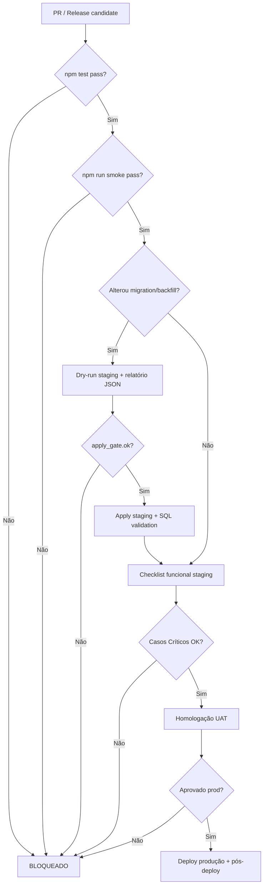

# Love Odonto V2 — Manual Oficial de Garantia de Qualidade (QA)

**Documento:** `docs/constitution/LOVE_ODONTO_V2_MASTER_QA.md`  
**Versão:** 1.0.0  
**Data:** 2026-06-29  
**Status:** Oficial — referência obrigatória para validação, homologação, deploy e evolução do produto.  
**Complemento de:** [`LOVE_ODONTO_V2_MASTER_ARCHITECTURE.md`](./LOVE_ODONTO_V2_MASTER_ARCHITECTURE.md) (Constituição Técnica)

**Regra de ouro:** nenhum deploy em **staging** ou **produção** é considerado válido sem evidência registrada contra este manual. Em conflito entre checklist informal e este documento, **este documento prevalece** até revisão formal.

---

## Índice

1. [Objetivo do QA](#1-objetivo-do-qa)
2. [Estratégia de testes](#2-estratégia-de-testes-do-love-odonto)
3. [Classificação dos testes](#3-classificação-dos-testes)
4. [Fluxo oficial de validação antes de deploy](#4-fluxo-oficial-de-validação-antes-de-qualquer-deploy)
5. [Critérios de aceite](#5-critérios-de-aceite)
6. [Checklist obrigatório por módulo](#6-checklist-obrigatório-por-módulo)
7. [Casos de teste por domínio](#7-casos-de-teste-por-domínio)
8. [Matriz de rastreabilidade](#8-matriz-de-rastreabilidade)
9. [Plano de regressão](#9-plano-de-regressão)
10. [Plano de smoke test](#10-plano-de-smoke-test)
11. [Plano de homologação](#11-plano-de-homologação)
12. [Plano de validação pós-deploy](#12-plano-de-validação-pós-deploy)
13. [Roadmap evolutivo do QA](#13-roadmap-evolutivo-do-qa)

---

## 1. Objetivo do QA

Garantir que o **Love Odonto V2** opere de forma **correta, segura, isolada por tenant e previsível** em todos os ambientes, respeitando a Constituição Técnica:

| Objetivo | Descrição |
|----------|-----------|
| **Proteger o paciente e a clínica** | Dados clínicos, financeiros e jurídicos sem vazamento cross-tenant, perda silenciosa ou corrupção. |
| **Validar SSOT e transição V2** | Confirmar que Supabase + Admin API são autoridade onde declarado; IndexedDB permanece cache derivado. |
| **Bloquear regressões críticas** | Auth, tenant-context, RBAC, RH/vínculos UUID, agenda e financeiro não podem regredir sem detecção. |
| **Formalizar evidências** | Todo apply de migration, backfill ou release exige relatório, checklist assinado e status de casos de teste. |
| **Habilitar evolução contínua** | Casos de teste versionados, rastreáveis e expandíveis conforme módulos migram para Supabase. |

### Escopo

| Superfície | Porta | Incluído neste manual |
|------------|-------|------------------------|
| App clínica (`src/`) | 5176 | ✅ Completo |
| Admin API (`server/`) | 3001 | ✅ Integração + segurança |
| Console SaaS (`console/`) | 5177 | ✅ Smoke + multi-tenant plataforma |
| Supabase Postgres + Auth + Storage | — | ✅ Banco, RLS, migrations |
| IndexedDB / cache local | — | ✅ Cache e invalidação |
| Offline (fila futura) | — | ✅ Diretrizes + casos preparatórios |

### Ambientes oficiais

| Ambiente | Supabase ref | Uso QA |
|----------|--------------|--------|
| **Local** | Credenciais staging | Desenvolvimento + `npm test` + smoke |
| **Staging** | `tckdjyunwmdpqmewrwvt` | Homologação, backfill, migrations estruturais |
| **Produção** | `uoepkwhqztmsjnzirpev` | Somente após gate completo + janela aprovada |

### Convenção de IDs de teste

```
LO-QA-{MOD}-{NNN}
```

| MOD | Domínio |
|-----|---------|
| AUTH | Login |
| MT | Multi-tenant |
| DSH | Dashboard |
| AGD | Agenda |
| PAC | Pacientes |
| RH | RH / Colaboradores |
| USR | Usuários e Permissões |
| FIN | Financeiro |
| COM | Comercial |
| CTR | Contratos |
| PRO | Prontuário |
| ODO | Odontograma |
| STG | Storage |
| IA | IA / Chat Inteligente |
| CFG | Configurações |
| API | Admin API |
| DB | Banco / Migrations |
| CCH | Cache |
| OFF | Offline |
| AUD | Auditoria |

### Campos obrigatórios por caso de teste

Todo caso de teste **deve** conter: **ID**, **Nome**, **Objetivo**, **Pré-condições**, **Dados de teste**, **Passos**, **Resultado esperado**, **Criticidade**, **Tipo**, **Dependências**, **Status**.

**Status permitidos:** `Pendente` · `Aprovado` · `Falhou` · `Bloqueado` · `N/A (futuro)` · `Obsoleto`

**Criticidade:** `Crítica` · `Alta` · `Média` · `Baixa`

---

## 2. Estratégia de testes do Love Odonto

### 2.1 Pirâmide de testes

```
                    ┌─────────────┐
                    │  E2E Manual │  Homologação staging / UAT
                    │  Homologação│
                   ┌┴─────────────┴┐
                   │  Integração    │  Services + API + Supabase mocks
                  ┌┴───────────────┴┐
                  │  Unitário        │  Vitest — lógica pura, parsers, RBAC
                 ┌┴─────────────────┴┐
                 │  SQL / Infra       │  Pós-migration, RLS, órfãos, counts
                 └────────────────────┘
```

### 2.2 Camadas e responsabilidades

| Camada | Ferramenta | Quando executar | Responsável |
|--------|------------|-----------------|-------------|
| **Unitário** | Vitest (`npm test`) | Todo PR que altere lógica | Dev |
| **Smoke automatizado** | `npm run smoke` | PR, pré-deploy, pós-deploy | Dev / CI |
| **Integração** | Vitest + mocks Supabase/API | Módulos auth, RH, financeiro | Dev |
| **SQL validation** | Supabase MCP / CLI | Pós-migration, pós-backfill | Tech Lead |
| **Funcional manual** | Este manual — staging | Release candidate | QA / Product |
| **Regressão** | Subset automatizado + checklist | Semanal + antes de prod | QA |
| **Performance** | Lighthouse / carga API | Releases maiores | DevOps |
| **Segurança** | RLS advisors, RBAC, tenant isolation | Toda migration | Security / Tech Lead |

### 2.3 Princípios QA V2

1. **Fail closed:** teste que espera bloqueio deve falhar se a UI permitir acesso indevido.
2. **Tenant-first:** todo caso funcional declara `tenant_id` e usuário com papel conhecido.
3. **Evidência obrigatória:** prints, relatórios JSON (`scripts/reports/`), logs de estabilidade.
4. **Staging espelha prod:** applies e migrations estruturais **nunca** pulam staging.
5. **Sem mock em prod:** testes automatizados não rodam contra tenant real de produção.
6. **Dual authority awareness:** enquanto módulo estiver em transição IDB → Supabase, casos devem validar **ambas** as camadas quando aplicável.

### 2.4 Dados de teste oficiais (staging Implanprime)

| Campo | Valor |
|-------|-------|
| Tenant staging | `7aba7127-409c-4ea4-8dbc-807efc5e189c` |
| Clinic code | `implanprime-staging` |
| Senha padrão | `StagingTest2026!` |
| Master | `paulo+staging@implanprime.test` |
| Gerente (inativa) | `melissa+staging@implanprime.test` |
| Administrativo | `juliana+staging@implanprime.test`, `renata+staging@implanprime.test` |

**Proibido** usar tenant produção Implanprime (`b2f95268-101c-42cb-8a8e-8d3681aa7dfa`) em testes de escrita.

---

## 3. Classificação dos testes

| Tipo | Definição | Duração típica | Automatizável |
|------|-----------|----------------|---------------|
| **Smoke** | Verifica se o sistema **sobe e responde** — login, tenant-context, rotas críticas | 5–15 min | ✅ `npm run smoke` |
| **Funcional** | Valida **regra de negócio** de um fluxo ponta a ponta na UI | 15–60 min/caso | Parcial |
| **Integração** | Valida **contrato entre camadas** (UI → service → API → Supabase/IDB) | CI | ✅ Vitest |
| **Regressão** | Reexecuta casos **aprovados** após mudança para detectar quebra | 1–4 h | Parcial |
| **Performance** | Latência, bundle, queries N+1, tempo de carga dashboard | Release | Parcial |
| **Segurança** | RLS, RBAC, tenant isolation, injection, secrets | Migration / release | Parcial |

### Matriz tipo × criticidade (obrigatório em release)

| | Crítica | Alta | Média | Baixa |
|---|---------|------|-------|-------|
| **Smoke** | 100% pass | 100% pass | amostra | opcional |
| **Funcional** | 100% pass | ≥ 95% pass | ≥ 90% pass | best effort |
| **Integração** | 100% pass | 100% pass | ≥ 95% pass | — |
| **Regressão** | 100% pass | ≥ 98% pass | ≥ 95% pass | — |
| **Segurança** | 0 finding crítico | 0 finding alto | plano de remediação | — |

---

## 4. Fluxo oficial de validação antes de qualquer deploy



### 4.1 Gate mínimo (todo deploy)

| # | Etapa | Comando / evidência | Bloqueante |
|---|-------|---------------------|------------|
| G1 | Preflight env | `node scripts/preflight-local.mjs` | ✅ |
| G2 | Testes unitários | `npm test` | ✅ |
| G3 | Smoke local | `npm run smoke` | ✅ |
| G4 | Type-check (release) | `npm run type-check` | ✅ |
| G5 | Build (release) | `npm run build` | ✅ |
| G6 | Envs críticas | `VITE_SUPABASE_APP_*`, `VITE_APP_ADMIN_API_BASE_URL` | ✅ |
| G7 | Host Supabase alinhado | App ≠ Console project | ✅ |

### 4.2 Gate migration / backfill (adicional)

| # | Etapa | Bloqueante |
|---|-------|------------|
| M1 | Dry-run com `apply_gate.ok = true` | ✅ |
| M2 | Backup pré-apply (`pre-apply-snapshot-*.json`) | ✅ |
| M3 | Apply **somente staging** primeiro | ✅ |
| M4 | Queries SQL órfãos / cross-tenant = 0 | ✅ |
| M5 | Checklist UI pós-apply (RH, usuários) | ✅ |
| M6 | Rollback testado em staging | ✅ |
| M7 | Janela + comunicação (produção) | ✅ |

### 4.3 Proibições absolutas

- Deploy estrutural em produção **sem** paridade validada em staging.
- Migration **018** (FK `collaborator_uuid`) em produção **sem** backfill RH + queries = 0.
- Commit de secrets ou `.env` com service role.
- Considerar deploy OK apenas com smoke — **funcional crítico** é obrigatório em releases de domínio.

---

## 5. Critérios de aceite

### 5.1 Critérios globais (release)

| ID | Critério | Medição |
|----|----------|---------|
| AC-G01 | Zero erro crítico aberto | Issue tracker |
| AC-G02 | Smoke 100% verde | `npm run smoke` |
| AC-G03 | Testes unitários alterados passando | CI / local |
| AC-G04 | Nenhum advisor Supabase **critical** pendente | `get_advisors` |
| AC-G05 | RLS habilitado em tabelas novas | Migration review |
| AC-G06 | Logs sem PII/tokens em produção | Spot check |
| AC-G07 | Documentação QA atualizada se novo módulo | Este manual |

### 5.2 Critérios por domínio (amostra)

| Domínio | Critério de aceite |
|---------|-------------------|
| **Auth** | Login/logout; sessão persiste; `AUTH_FAILED` ≠ `TENANT_CONTEXT_FAILED` |
| **Multi-tenant** | Usuário A não vê dados do tenant B; troca tenant invalida cache |
| **RH** | 4 colaboradores staging; `collaborator_uuid` preenchido; `collaborator_id` text preservado |
| **Permissões** | Menu oculto conforme role; override custom respeitado |
| **Agenda** | CRUD consulta; busca paciente; conflito de horário detectado |
| **Financeiro** | Lançamento reflete caixa; totais batem com relatório |
| **Contratos** | Assinatura gera PDF; variáveis resolvidas |
| **Storage** | Upload logo RH; URL pública apenas onde permitido |

### 5.3 Definição de Done (QA)

Uma entrega está **Done** quando:

1. Casos de teste **Críticos** e **Altos** do módulo = `Aprovado` em staging.
2. Evidência arquivada (print, JSON, link PR).
3. Matriz de rastreabilidade atualizada (seção 8).
4. Regressão do módulo executada sem falhas bloqueantes.
5. Tech Lead / Product sign-off registrado.

---

## 6. Checklist obrigatório por módulo

Marque **OK** / **N/A** / **FALHA** em cada homologação.

### 6.1 Login (AUTH)

- [ ] Login e-mail/senha válidos
- [ ] Credenciais inválidas → mensagem clara, sem vazamento de stack
- [ ] Sessão persiste após refresh
- [ ] Logout limpa contexto e cache sensível
- [ ] Primeiro acesso / convite (se aplicável)
- [ ] Recuperação de senha (se habilitada)

### 6.2 Multi-tenant (MT)

- [ ] Tenant correto após login
- [ ] Isolamento de dados entre tenants
- [ ] Falha tenant-context → retry sem logout forçado
- [ ] Refresh tenant-context (5 min) funcional

### 6.3 Dashboard (DSH)

- [ ] Cards carregam sem erro
- [ ] Métricas coerentes com dados seed
- [ ] Permissão `dashboard:view` respeitada

### 6.4 Agenda (AGD)

- [ ] Visualização dia/semana/mês
- [ ] Criar / editar / cancelar consulta
- [ ] Vincular paciente e profissional
- [ ] Busca paciente na agenda

### 6.5 Pacientes (PAC)

- [ ] Busca e cadastro rápido
- [ ] Cadastro completo com validações
- [ ] Edição sem perda de histórico
- [ ] Import/export (se usado)

### 6.6 RH (RH)

- [ ] Lista 4 colaboradores (staging)
- [ ] Ficha completa RH
- [ ] Foto / avatar (Storage quando migrado)
- [ ] Vínculo `collaborator_uuid` ↔ `tenant_users`

### 6.7 Usuários e Permissões (USR)

- [ ] Lista usuários do tenant
- [ ] Convite / ativação
- [ ] RBAC por role
- [ ] Permissões customizadas
- [ ] Identidades / saúde de acesso

### 6.8 Financeiro (FIN)

- [ ] Contas a pagar / receber
- [ ] Caixa e saldo
- [ ] Boletos / financiamento
- [ ] DRE / relatórios CSV

### 6.9 Comercial (COM)

- [ ] CRM Kanban / pipeline
- [ ] Chat inteligente (hub)
- [ ] Confirmação agendamento / templates
- [ ] Follow-up comercial

### 6.10 Contratos (CTR)

- [ ] Templates e variáveis
- [ ] Assinatura digital
- [ ] Histórico jurídico
- [ ] TCLE / consentimentos

### 6.11 Prontuário (PRO)

- [ ] Atendimento clínico
- [ ] Anamnese / evolução
- [ ] Anexos clínicos
- [ ] Orçamentos no prontuário

### 6.12 Odontograma (ODO)

- [ ] Renderização base SVG
- [ ] Marcação procedimentos
- [ ] Persistência por paciente
- [ ] Sincronização com orçamento

### 6.13 Storage (STG)

- [ ] Upload logo clínica
- [ ] Bucket RLS correto
- [ ] URL assinada / pública conforme policy
- [ ] Rejeição tipo/tamanho inválido

### 6.14 IA (IA)

- [ ] Hub chat inteligente carrega
- [ ] Permissões multi-clínica
- [ ] Transbordo humano
- [ ] Sem vazamento de contexto cross-tenant

### 6.15 Configurações (CFG)

- [ ] Dados da clínica
- [ ] Base de preços / procedimentos
- [ ] Tipos de tratamento
- [ ] Guia clínico / biblioteca imagens

### 6.16 API (API)

- [ ] Health Admin API
- [ ] JWT app válido
- [ ] Erros padronizados JSON
- [ ] CORS / proxy dev

### 6.17 Banco (DB)

- [ ] Migrations aplicadas na ordem
- [ ] RLS enabled
- [ ] Queries órfãos = 0 (pós-backfill)
- [ ] Paridade staging documentada

### 6.18 Cache (CCH)

- [ ] Invalidate pós RBAC
- [ ] Invalidate pós clinic profile
- [ ] IDB não autoridade em domínio migrado

### 6.19 Offline (OFF)

- [ ] Banner offline (quando implementado)
- [ ] Fila outbox (futuro)
- [ ] Sem write silencioso perdido

### 6.20 Auditoria (AUD)

- [ ] `identity_events` em ações sensíveis
- [ ] Relatórios JSON de scripts
- [ ] Stability logs em dev

---

## 7. Casos de teste por domínio

> **Legenda Status inicial:** casos validados em staging Implanprime (jun/2026) marcados `Aprovado`; demais `Pendente` ou `N/A (futuro)`.

---

### 7.1 Login (AUTH)

#### LO-QA-AUTH-001 — Login válido master

| Campo | Valor |
|-------|-------|
| **Objetivo** | Confirmar autenticação Supabase Auth com redirecionamento ao app |
| **Pré-condições** | Staging configurado; usuário master ativo |
| **Dados de teste** | `paulo+staging@implanprime.test` / `StagingTest2026!` |
| **Passos** | 1. Abrir `/login` · 2. Informar credenciais · 3. Submeter · 4. Aguardar tenant-context |
| **Resultado esperado** | Redirect para dashboard; sessão ativa; log `AUTH_OK` |
| **Criticidade** | Crítica |
| **Tipo** | Smoke |
| **Dependências** | Supabase Auth, Admin API |
| **Status** | Aprovado |

#### LO-QA-AUTH-002 — Credenciais inválidas

| Campo | Valor |
|-------|-------|
| **Objetivo** | Garantir fail closed sem expor detalhes internos |
| **Pré-condições** | Tela de login |
| **Dados de teste** | E-mail válido + senha errada |
| **Passos** | 1. Informar senha incorreta · 2. Submeter |
| **Resultado esperado** | Mensagem genérica; permanece em login; log `AUTH_FAILED` |
| **Criticidade** | Alta |
| **Tipo** | Segurança |
| **Dependências** | — |
| **Status** | Pendente |

#### LO-QA-AUTH-003 — Persistência de sessão

| Campo | Valor |
|-------|-------|
| **Objetivo** | Validar refresh de página sem logout |
| **Pré-condições** | Usuário logado |
| **Dados de teste** | Master staging |
| **Passos** | 1. Login · 2. F5 · 3. Navegar menu |
| **Resultado esperado** | Sessão mantida; tenant correto |
| **Criticidade** | Crítica |
| **Tipo** | Funcional |
| **Dependências** | LO-QA-AUTH-001 |
| **Status** | Pendente |

#### LO-QA-AUTH-004 — Logout

| Campo | Valor |
|-------|-------|
| **Objetivo** | Limpar sessão e impedir acesso a rotas protegidas |
| **Pré-condições** | Usuário logado |
| **Passos** | 1. Logout · 2. Tentar `/gestao/dashboard` |
| **Resultado esperado** | Redirect login; cache sensível limpo |
| **Criticidade** | Alta |
| **Tipo** | Funcional |
| **Dependências** | LO-QA-AUTH-001 |
| **Status** | Pendente |

#### LO-QA-AUTH-005 — Convite primeiro acesso

| Campo | Valor |
|-------|-------|
| **Objetivo** | Validar fluxo convite → senha → ativação |
| **Pré-condições** | Convite pendente no tenant staging |
| **Dados de teste** | Token convite válido |
| **Passos** | 1. Abrir link convite · 2. Definir senha · 3. Login |
| **Resultado esperado** | `invitation_status=accepted`; acesso conforme role |
| **Criticidade** | Alta |
| **Tipo** | Integração |
| **Dependências** | Admin API identities |
| **Status** | Pendente |

---

### 7.2 Multi-tenant (MT)

#### LO-QA-MT-001 — Tenant correto pós-login

| Campo | Valor |
|-------|-------|
| **Objetivo** | Usuário enxerga apenas tenant da membership |
| **Pré-condições** | Seed Implanprime staging |
| **Dados de teste** | Tenant `7aba7127-409c-4ea4-8dbc-807efc5e189c` |
| **Passos** | 1. Login master · 2. Verificar nome clínica · 3. Inspecionar tenant-context |
| **Resultado esperado** | `implanprime-staging`; sem referência tenant prod |
| **Criticidade** | Crítica |
| **Tipo** | Smoke |
| **Dependências** | LO-QA-AUTH-001 |
| **Status** | Aprovado |

#### LO-QA-MT-002 — Isolamento cross-tenant (RLS)

| Campo | Valor |
|-------|-------|
| **Objetivo** | Query direta não retorna dados de outro tenant |
| **Pré-condições** | Dois tenants com dados distintos |
| **Passos** | 1. Autenticar tenant A · 2. Tentar ler `tenant_users` tenant B via client |
| **Resultado esperado** | 0 linhas ou erro RLS |
| **Criticidade** | Crítica |
| **Tipo** | Segurança |
| **Dependências** | Migration 009 RLS |
| **Status** | Pendente |

#### LO-QA-MT-003 — Falha tenant-context com retry

| Campo | Valor |
|-------|-------|
| **Objetivo** | Erro transitório não força logout |
| **Pré-condições** | Simular falha API (dev tools / mock) |
| **Passos** | 1. Login · 2. Forçar `TENANT_CONTEXT_FAILED` · 3. Clicar "Tentar novamente" |
| **Resultado esperado** | Retry recupera; usuário permanece autenticado |
| **Criticidade** | Crítica |
| **Tipo** | Funcional |
| **Dependências** | STABILITY_CHECKLIST |
| **Status** | Pendente |

#### LO-QA-MT-004 — Bloqueio tenant prod em scripts staging

| Campo | Valor |
|-------|-------|
| **Objetivo** | Guards abortam URL/ref produção |
| **Pré-condições** | Script backfill/seed |
| **Passos** | 1. Executar dry-run com URL prod · 2. Observar exit code |
| **Resultado esperado** | ABORT; nenhuma mutação |
| **Criticidade** | Crítica |
| **Tipo** | Segurança |
| **Dependências** | `stagingSeedImplanprime.js` |
| **Status** | Aprovado |

---

### 7.3 Dashboard (DSH)

#### LO-QA-DSH-001 — Carregamento dashboard master

| Campo | Valor |
|-------|-------|
| **Objetivo** | Página `/gestao/dashboard` renderiza sem erro |
| **Pré-condições** | Login master |
| **Passos** | 1. Navegar dashboard · 2. Aguardar métricas |
| **Resultado esperado** | Cards visíveis; sem erro console (prod) |
| **Criticidade** | Alta |
| **Tipo** | Smoke |
| **Dependências** | LO-QA-AUTH-001 |
| **Status** | Pendente |

#### LO-QA-DSH-002 — Permissão dashboard por role

| Campo | Valor |
|-------|-------|
| **Objetivo** | Role sem `dashboard:view` não acessa |
| **Pré-condições** | Usuário role restrito |
| **Passos** | 1. Login · 2. Tentar rota dashboard |
| **Resultado esperado** | Bloqueio ou redirect |
| **Criticidade** | Alta |
| **Tipo** | Segurança |
| **Dependências** | RBAC |
| **Status** | Pendente |

#### LO-QA-DSH-003 — Métricas coerentes

| Campo | Valor |
|-------|-------|
| **Objetivo** | Totais batem com seed/agenda do dia |
| **Pré-condições** | Dados conhecidos no IDB |
| **Passos** | 1. Anotar consultas do dia · 2. Comparar card agenda |
| **Resultado esperado** | Divergência ≤ regra documentada |
| **Criticidade** | Média |
| **Tipo** | Funcional |
| **Dependências** | LO-QA-AGD-001 |
| **Status** | Pendente |

---

### 7.4 Agenda (AGD)

#### LO-QA-AGD-001 — Visualizar agenda do dia

| Campo | Valor |
|-------|-------|
| **Objetivo** | Calendário carrega consultas do tenant |
| **Pré-condições** | Consultas seed no IDB |
| **Passos** | 1. `/gestao/agenda` · 2. Selecionar hoje |
| **Resultado esperado** | Slots renderizados; profissionais corretos |
| **Criticidade** | Alta |
| **Tipo** | Funcional |
| **Dependências** | LO-QA-MT-001 |
| **Status** | Pendente |

#### LO-QA-AGD-002 — Criar consulta

| Campo | Valor |
|-------|-------|
| **Objetivo** | Nova consulta persiste e aparece na agenda |
| **Dados de teste** | Paciente + profissional Juliana |
| **Passos** | 1. Novo agendamento · 2. Salvar · 3. Refresh |
| **Resultado esperado** | Consulta visível; horário correto |
| **Criticidade** | Crítica |
| **Tipo** | Funcional |
| **Dependências** | LO-QA-PAC-001 |
| **Status** | Pendente |

#### LO-QA-AGD-003 — Busca paciente na agenda

| Campo | Valor |
|-------|-------|
| **Objetivo** | Autocomplete paciente funcional |
| **Passos** | 1. Campo busca · 2. Digitar nome parcial |
| **Resultado esperado** | Sugestões corretas; seleção preenche form |
| **Criticidade** | Alta |
| **Tipo** | Integração |
| **Dependências** | `agendaPatientSearch.test.js` |
| **Status** | Pendente |

#### LO-QA-AGD-004 — Conflito de horário

| Campo | Valor |
|-------|-------|
| **Objetivo** | Sistema alerta sobreposição |
| **Passos** | 1. Criar consulta · 2. Segunda no mesmo slot/profissional |
| **Resultado esperado** | Aviso ou bloqueio conforme regra |
| **Criticidade** | Alta |
| **Tipo** | Funcional |
| **Dependências** | LO-QA-AGD-002 |
| **Status** | Pendente |

---

### 7.5 Pacientes (PAC)

#### LO-QA-PAC-001 — Cadastro rápido via busca

| Campo | Valor |
|-------|-------|
| **Objetivo** | Fluxo `/pacientes/busca` → cadastro mínimo |
| **Passos** | 1. Buscar CPF inexistente · 2. Criar cadastro rápido |
| **Resultado esperado** | Paciente criado; redirect ficha |
| **Criticidade** | Alta |
| **Tipo** | Funcional |
| **Dependências** | — |
| **Status** | Pendente |

#### LO-QA-PAC-002 — Cadastro completo

| Campo | Valor |
|-------|-------|
| **Objetivo** | Validações obrigatórias em `/pacientes/cadastro` |
| **Passos** | 1. Submeter vazio · 2. Corrigir · 3. Salvar |
| **Resultado esperado** | Erros inline; persistência completa |
| **Criticidade** | Alta |
| **Tipo** | Funcional |
| **Dependências** | — |
| **Status** | Pendente |

#### LO-QA-PAC-003 — Edição sem perda histórico

| Campo | Valor |
|-------|-------|
| **Objetivo** | Alterar telefone não apaga atendimentos |
| **Passos** | 1. Editar paciente com histórico · 2. Salvar · 3. Abrir prontuário |
| **Resultado esperado** | Histórico intacto |
| **Criticidade** | Crítica |
| **Tipo** | Regressão |
| **Dependências** | LO-QA-PRO-001 |
| **Status** | Pendente |

#### LO-QA-PAC-004 — Import pacientes

| Campo | Valor |
|-------|-------|
| **Objetivo** | Import CSV/JSON valida duplicatas |
| **Dados de teste** | Arquivo sample sem PII real |
| **Passos** | 1. Import · 2. Revisar preview · 3. Confirmar |
| **Resultado esperado** | Contagem correta; duplicatas reportadas |
| **Criticidade** | Média |
| **Tipo** | Integração |
| **Dependências** | `importPatients.test.js` |
| **Status** | Pendente |

---

### 7.6 RH (RH)

#### LO-QA-RH-001 — Lista colaboradores staging

| Campo | Valor |
|-------|-------|
| **Objetivo** | `/admin/colaboradores` exibe 4 registros pós-backfill |
| **Pré-condições** | Backfill RH aplicado staging |
| **Passos** | 1. Login master · 2. Abrir Dados da Equipe |
| **Resultado esperado** | Paulo, Juliana, Renata, Melissa visíveis |
| **Criticidade** | Crítica |
| **Tipo** | Smoke |
| **Dependências** | Backfill RH staging |
| **Status** | Aprovado |

#### LO-QA-RH-002 — Ficha RH completa

| Campo | Valor |
|-------|-------|
| **Objetivo** | Campos export RH refletidos na ficha |
| **Passos** | 1. Abrir Juliana · 2. Verificar CRO, especialidade, agenda |
| **Resultado esperado** | CRO 27267-MG; Implantodontia; agenda enabled |
| **Criticidade** | Alta |
| **Tipo** | Funcional |
| **Dependências** | LO-QA-RH-001 |
| **Status** | Pendente |

#### LO-QA-RH-003 — Vínculo UUID tenant_users

| Campo | Valor |
|-------|-------|
| **Objetivo** | SQL: 4/4 `collaborator_uuid` preenchidos; órfãos = 0 |
| **Passos** | 1. Executar queries pós-apply · 2. Comparar backup JSON |
| **Resultado esperado** | Counts conforme relatório backfill |
| **Criticidade** | Crítica |
| **Tipo** | Integração |
| **Dependências** | Migration 016–017, backfill |
| **Status** | Aprovado |

#### LO-QA-RH-004 — collaborator_id text preservado

| Campo | Valor |
|-------|-------|
| **Objetivo** | Juliana/Renata mantêm text divergente do legacy_id |
| **Passos** | 1. Query tenant_users · 2. Comparar backup |
| **Resultado esperado** | Text inalterado; UUID aponta collaborator correto |
| **Criticidade** | Crítica |
| **Tipo** | Regressão |
| **Dependências** | LO-QA-RH-003 |
| **Status** | Aprovado |

#### LO-QA-RH-005 — Editar colaborador pós-FK 018

| Campo | Valor |
|-------|-------|
| **Objetivo** | Update RH não viola trigger/FK |
| **Passos** | 1. Editar cargo · 2. Salvar |
| **Resultado esperado** | Sucesso; sem erro FK |
| **Criticidade** | Alta |
| **Tipo** | Funcional |
| **Dependências** | Migration 018 staging |
| **Status** | Pendente |

---

### 7.7 Usuários e Permissões (USR)

#### LO-QA-USR-001 — Lista usuários tenant

| Campo | Valor |
|-------|-------|
| **Objetivo** | `/admin/usuarios` mostra 4 usuários staging |
| **Passos** | 1. Login master · 2. Abrir Usuários |
| **Resultado esperado** | 4 linhas; roles corretos |
| **Criticidade** | Alta |
| **Tipo** | Smoke |
| **Dependências** | Seed staging |
| **Status** | Aprovado |

#### LO-QA-USR-002 — Menu por role gerente

| Campo | Valor |
|-------|-------|
| **Objetivo** | Melissa (gerente inativa) — menu conforme RBAC |
| **Passos** | 1. Login Melissa · 2. Inspecionar menu |
| **Resultado esperado** | Sem `/admin/usuarios`; equipe visível se permitido |
| **Criticidade** | Alta |
| **Tipo** | Segurança |
| **Dependências** | `manualMenuByRole.test.js` |
| **Status** | Pendente |

#### LO-QA-USR-003 — Permissão customizada

| Campo | Valor |
|-------|-------|
| **Objetivo** | Override custom altera acesso efetivo |
| **Passos** | 1. Conceder permissão extra · 2. Refresh sessão · 3. Testar rota |
| **Resultado esperado** | Acesso reflete override |
| **Criticidade** | Alta |
| **Tipo** | Integração |
| **Dependências** | `collaboratorCustomPermissions.test.js` |
| **Status** | Pendente |

#### LO-QA-USR-004 — Convite novo usuário

| Campo | Valor |
|-------|-------|
| **Objetivo** | Master convida usuário vinculado a colaborador |
| **Passos** | 1. Novo convite · 2. Selecionar colaborador · 3. Enviar |
| **Resultado esperado** | Registro pending; e-mail flow OK |
| **Criticidade** | Alta |
| **Tipo** | Funcional |
| **Dependências** | Admin API |
| **Status** | Pendente |

#### LO-QA-USR-005 — Identidades dashboard

| Campo | Valor |
|-------|-------|
| **Objetivo** | `/admin/identidades` saúde coerente |
| **Passos** | 1. Abrir identidades · 2. Verificar status |
| **Resultado esperado** | Sem alerta crítico falso-positivo |
| **Criticidade** | Média |
| **Tipo** | Funcional |
| **Dependências** | `identityHealth.test.js` |
| **Status** | Pendente |

---

### 7.8 Financeiro (FIN)

#### LO-QA-FIN-001 — Lançamento contas a receber

| Campo | Valor |
|-------|-------|
| **Objetivo** | CRUD recebível reflete no caixa |
| **Passos** | 1. Novo recebível · 2. Baixar · 3. Ver caixa |
| **Resultado esperado** | Saldo atualizado |
| **Criticidade** | Crítica |
| **Tipo** | Funcional |
| **Dependências** | Seed financeiro IDB |
| **Status** | Pendente |

#### LO-QA-FIN-002 — Contas a pagar

| Campo | Valor |
|-------|-------|
| **Objetivo** | Pagamento registrado com fornecedor |
| **Passos** | 1. Criar despesa · 2. Pagar |
| **Resultado esperado** | Status pago; extrato correto |
| **Criticidade** | Alta |
| **Tipo** | Funcional |
| **Dependências** | — |
| **Status** | Pendente |

#### LO-QA-FIN-003 — Financiamento parcelas

| Campo | Valor |
|-------|-------|
| **Objetivo** | Fluxo financiamento gera parcelas |
| **Passos** | 1. Criar financiamento · 2. Ver parcelas · 3. Simular inadimplência |
| **Resultado esperado** | Parcelas corretas; alertas coerentes |
| **Criticidade** | Alta |
| **Tipo** | Integração |
| **Dependências** | `financingOperationalFlows.test.js` |
| **Status** | Pendente |

#### LO-QA-FIN-004 — DRE export CSV

| Campo | Valor |
|-------|-------|
| **Objetivo** | Relatório DRE exportável |
| **Passos** | 1. `/financeiro/relatorios/dre` · 2. Export CSV |
| **Resultado esperado** | Arquivo válido; totais batem tela |
| **Criticidade** | Média |
| **Tipo** | Funcional |
| **Dependências** | — |
| **Status** | Pendente |

---

### 7.9 Comercial (COM)

#### LO-QA-COM-001 — CRM Kanban drag

| Campo | Valor |
|-------|-------|
| **Objetivo** | Mover lead entre estágios |
| **Passos** | 1. `/gestao/crm` · 2. Drag card · 3. Refresh |
| **Resultado esperado** | Estágio persistido |
| **Criticidade** | Alta |
| **Tipo** | Funcional |
| **Dependências** | `crmPipelineStages.test.js` |
| **Status** | Pendente |

#### LO-QA-COM-002 — Chat inteligente hub

| Campo | Valor |
|-------|-------|
| **Objetivo** | Hub marketing carrega sub-rotas |
| **Passos** | 1. `/marketing/chat-inteligente` · 2. Navegar abas |
| **Resultado esperado** | Dashboard, inbox, campanhas acessíveis |
| **Criticidade** | Alta |
| **Tipo** | Smoke |
| **Dependências** | Permissão comercial |
| **Status** | Pendente |

#### LO-QA-COM-003 — Template confirmação agendamento

| Campo | Valor |
|-------|-------|
| **Objetivo** | Template lembrete vinculado à agenda |
| **Passos** | 1. Configurar template · 2. Preview · 3. Disparo teste |
| **Resultado esperado** | Variáveis resolvidas (nome, data, hora) |
| **Criticidade** | Média |
| **Tipo** | Funcional |
| **Dependências** | LO-QA-AGD-002 |
| **Status** | Pendente |

#### LO-QA-COM-004 — Follow-up comercial

| Campo | Valor |
|-------|-------|
| **Objetivo** | Tarefa follow-up integra CRM |
| **Passos** | 1. Criar follow-up · 2. Verificar lead |
| **Resultado esperado** | Tarefa visível no lead |
| **Criticidade** | Média |
| **Tipo** | Integração |
| **Dependências** | — |
| **Status** | Pendente |

---

### 7.10 Contratos (CTR)

#### LO-QA-CTR-001 — Criar contrato from orçamento

| Campo | Valor |
|-------|-------|
| **Objetivo** | Orçamento aprovado gera contrato |
| **Passos** | 1. Orçamento aprovado · 2. Gerar contrato · 3. Preview |
| **Resultado esperado** | Variáveis paciente/clínica preenchidas |
| **Criticidade** | Crítica |
| **Tipo** | Integração |
| **Dependências** | `fullBudgetContractFlowValidation.test.js` |
| **Status** | Pendente |

#### LO-QA-CTR-002 — Assinatura digital

| Campo | Valor |
|-------|-------|
| **Objetivo** | Fluxo assinatura registra evidência |
| **Passos** | 1. Enviar assinatura · 2. Assinar · 3. Ver histórico |
| **Resultado esperado** | Status assinado; timestamp; PDF |
| **Criticidade** | Crítica |
| **Tipo** | Funcional |
| **Dependências** | `contractSignatureFlow.test.js` |
| **Status** | Pendente |

#### LO-QA-CTR-003 — TCLE anexo clínico

| Campo | Valor |
|-------|-------|
| **Objetivo** | TCLE vinculado ao atendimento |
| **Passos** | 1. Anexar TCLE · 2. Ver prontuário |
| **Resultado esperado** | Documento visível no histórico |
| **Criticidade** | Alta |
| **Tipo** | Funcional |
| **Dependências** | `clinicalTcleAttachment.test.js` |
| **Status** | Pendente |

---

### 7.11 Prontuário (PRO)

#### LO-QA-PRO-001 — Abrir atendimento

| Campo | Valor |
|-------|-------|
| **Objetivo** | Iniciar atendimento clínico |
| **Passos** | 1. Selecionar paciente · 2. Iniciar atendimento |
| **Resultado esperado** | Sessão aberta; timer/status correto |
| **Criticidade** | Crítica |
| **Tipo** | Funcional |
| **Dependências** | LO-QA-PAC-001 |
| **Status** | Pendente |

#### LO-QA-PRO-002 — Evolução clínica

| Campo | Valor |
|-------|-------|
| **Objetivo** | Nota evolução persiste |
| **Passos** | 1. Registrar evolução · 2. Salvar · 3. Reabrir |
| **Resultado esperado** | Texto preservado |
| **Criticidade** | Alta |
| **Tipo** | Funcional |
| **Dependências** | LO-QA-PRO-001 |
| **Status** | Pendente |

#### LO-QA-PRO-003 — Orçamento no prontuário

| Campo | Valor |
|-------|-------|
| **Objetivo** | Hub orçamentos acessível do prontuário |
| **Passos** | 1. Abrir orçamentos · 2. Criar novo |
| **Resultado esperado** | Navegação coerente; dados paciente |
| **Criticidade** | Alta |
| **Tipo** | Integração |
| **Dependências** | `clinicalBudgetHubService.test.js` |
| **Status** | Pendente |

---

### 7.12 Odontograma (ODO)

#### LO-QA-ODO-001 — Renderização odontograma

| Campo | Valor |
|-------|-------|
| **Objetivo** | SVG base carrega no prontuário |
| **Passos** | 1. Abrir odontograma paciente |
| **Resultado esperado** | Arcadas visíveis; interação dente |
| **Criticidade** | Alta |
| **Tipo** | Funcional |
| **Dependências** | LO-QA-PRO-001 |
| **Status** | Pendente |

#### LO-QA-ODO-002 — Marcar procedimento dente

| Campo | Valor |
|-------|-------|
| **Objetivo** | Procedimento associado ao dente |
| **Passos** | 1. Selecionar dente · 2. Aplicar procedimento · 3. Salvar |
| **Resultado esperado** | Marcação persistida |
| **Criticidade** | Alta |
| **Tipo** | Funcional |
| **Dependências** | LO-QA-ODO-001 |
| **Status** | Pendente |

#### LO-QA-ODO-003 — Sync orçamento ↔ odontograma

| Campo | Valor |
|-------|-------|
| **Objetivo** | Itens orçamento refletem odontograma |
| **Passos** | 1. Marcar odontograma · 2. Gerar orçamento |
| **Resultado esperado** | Itens e valores coerentes |
| **Criticidade** | Alta |
| **Tipo** | Integração |
| **Dependências** | LO-QA-PRO-003 |
| **Status** | Pendente |

---

### 7.13 Storage (STG)

#### LO-QA-STG-001 — Upload logo clínica

| Campo | Valor |
|-------|-------|
| **Objetivo** | Logo salvo em Supabase Storage |
| **Dados de teste** | PNG < 2MB |
| **Passos** | 1. Dados clínica · 2. Upload logo · 3. Salvar |
| **Resultado esperado** | URL storage; preview OK |
| **Criticidade** | Alta |
| **Tipo** | Integração |
| **Dependências** | Migration 013; `clinicLogoUpload.test.js` |
| **Status** | Pendente |

#### LO-QA-STG-002 — RLS bucket clínica

| Campo | Valor |
|-------|-------|
| **Objetivo** | Tenant A não acessa logo tenant B |
| **Passos** | 1. Obter path logo A · 2. Tentar fetch como tenant B |
| **Resultado esperado** | 403 / vazio |
| **Criticidade** | Crítica |
| **Tipo** | Segurança |
| **Dependências** | LO-QA-MT-002 |
| **Status** | Pendente |

#### LO-QA-STG-003 — Rejeitar arquivo inválido

| Campo | Valor |
|-------|-------|
| **Objetivo** | Tipo/tamanho inválido bloqueado |
| **Dados de teste** | `.exe` ou > limite |
| **Passos** | 1. Tentar upload |
| **Resultado esperado** | Erro amigável; sem objeto no bucket |
| **Criticidade** | Média |
| **Tipo** | Segurança |
| **Dependências** | — |
| **Status** | Pendente |

---

### 7.14 IA (IA)

#### LO-QA-IA-001 — Hub chat inteligente permissão

| Campo | Valor |
|-------|-------|
| **Objetivo** | Apenas roles autorizados acessam IA |
| **Passos** | 1. Login role sem permissão · 2. Tentar rota IA |
| **Resultado esperado** | Bloqueio |
| **Criticidade** | Alta |
| **Tipo** | Segurança |
| **Dependências** | Docs marketing-chat-inteligente |
| **Status** | Pendente |

#### LO-QA-IA-002 — Contexto isolado por tenant

| Campo | Valor |
|-------|-------|
| **Objetivo** | IA não referencia dados outro tenant |
| **Passos** | 1. Pergunta sobre paciente · 2. Verificar resposta |
| **Resultado esperado** | Somente dados tenant logado |
| **Criticidade** | Crítica |
| **Tipo** | Segurança |
| **Dependências** | LO-QA-MT-002 |
| **Status** | Pendente |

#### LO-QA-IA-003 — Transbordo humano

| Campo | Valor |
|-------|-------|
| **Objetivo** | Handoff IA → atendente |
| **Passos** | 1. Solicitar humano · 2. Ver inbox |
| **Resultado esperado** | Conversa atribuída; histórico preservado |
| **Criticidade** | Média |
| **Tipo** | Funcional |
| **Dependências** | LO-QA-COM-002 |
| **Status** | Pendente |

---

### 7.15 Configurações (CFG)

#### LO-QA-CFG-001 — Editar dados clínica

| Campo | Valor |
|-------|-------|
| **Objetivo** | Perfil clínica persiste Supabase + cache |
| **Passos** | 1. `/admin/dados-clinica` · 2. Editar · 3. Salvar · 4. F5 |
| **Resultado esperado** | Dados persistidos; sync IDB |
| **Criticidade** | Alta |
| **Tipo** | Integração |
| **Dependências** | `tenantClinicProfileSync.test.js` |
| **Status** | Pendente |

#### LO-QA-CFG-002 — Base de preços import

| Campo | Valor |
|-------|-------|
| **Objetivo** | Import tabela procedimentos |
| **Passos** | 1. Import CSV · 2. Validar preview · 3. Aplicar |
| **Resultado esperado** | Procedimentos disponíveis orçamento |
| **Criticidade** | Alta |
| **Tipo** | Funcional |
| **Dependências** | `priceBaseImportParse.test.js` |
| **Status** | Pendente |

#### LO-QA-CFG-003 — Tipos tratamento orçamento

| Campo | Valor |
|-------|-------|
| **Objetivo** | Categorias aparecem no orçamento clínico |
| **Passos** | 1. CRUD tipo · 2. Criar orçamento |
| **Resultado esperado** | Categoria listada |
| **Criticidade** | Média |
| **Tipo** | Funcional |
| **Dependências** | — |
| **Status** | Pendente |

---

### 7.16 API (API)

#### LO-QA-API-001 — Health Admin API

| Campo | Valor |
|-------|-------|
| **Objetivo** | API responde health check |
| **Passos** | 1. `npm run check:admin-api` ou GET health |
| **Resultado esperado** | 200 OK |
| **Criticidade** | Crítica |
| **Tipo** | Smoke |
| **Dependências** | Server :3001 |
| **Status** | Pendente |

#### LO-QA-API-002 — Tenant-context JWT

| Campo | Valor |
|-------|-------|
| **Objetivo** | Endpoint retorna membership correto |
| **Passos** | 1. Login · 2. Chamar tenant-context |
| **Resultado esperado** | tenant_id, role, permissions |
| **Criticidade** | Crítica |
| **Tipo** | Integração |
| **Dependências** | LO-QA-AUTH-001 |
| **Status** | Pendente |

#### LO-QA-API-003 — Erro sem stack trace

| Campo | Valor |
|-------|-------|
| **Objetivo** | Resposta erro JSON padronizada |
| **Passos** | 1. Request inválido · 2. Inspecionar body |
| **Resultado esperado** | `{ error, code? }`; sem stack prod |
| **Criticidade** | Alta |
| **Tipo** | Segurança |
| **Dependências** | — |
| **Status** | Pendente |

---

### 7.17 Banco (DB)

#### LO-QA-DB-001 — Paridade migrations staging

| Campo | Valor |
|-------|-------|
| **Objetivo** | Migrations aplicadas na ordem documentada |
| **Passos** | 1. `list_migrations` staging · 2. Comparar doc |
| **Resultado esperado** | 016–017–019 + 018 quando autorizado |
| **Criticidade** | Crítica |
| **Tipo** | Integração |
| **Dependências** | Master Architecture §24 |
| **Status** | Aprovado |

#### LO-QA-DB-002 — Query órfãos pós-backfill

| Campo | Valor |
|-------|-------|
| **Objetivo** | `collaborator_uuid` sem match = 0 |
| **Passos** | 1. Executar SQL validação · 2. Registrar resultado |
| **Resultado esperado** | 0 linhas |
| **Criticidade** | Crítica |
| **Tipo** | Integração |
| **Dependências** | Backfill RH |
| **Status** | Aprovado |

#### LO-QA-DB-003 — FK 018 validada

| Campo | Valor |
|-------|-------|
| **Objetivo** | `tenant_users_collaborator_uuid_fkey` convalidated=true |
| **Passos** | 1. Query pg_constraint · 2. Confirmar trigger |
| **Resultado esperado** | FK validada; trigger ativo |
| **Criticidade** | Crítica |
| **Tipo** | Integração |
| **Dependências** | LO-QA-DB-002 |
| **Status** | Aprovado |

#### LO-QA-DB-004 — RLS advisors clean

| Campo | Valor |
|-------|-------|
| **Objetivo** | Sem finding critical pós-migration |
| **Passos** | 1. `get_advisors` security |
| **Resultado esperado** | 0 critical pendente |
| **Criticidade** | Alta |
| **Tipo** | Segurança |
| **Dependências** | Nova migration |
| **Status** | Pendente |

---

### 7.18 Cache (CCH)

#### LO-QA-CCH-001 — Invalidate RBAC

| Campo | Valor |
|-------|-------|
| **Objetivo** | Mudança permissão reflete sem logout |
| **Passos** | 1. Alterar RBAC · 2. sync permissions · 3. Testar menu |
| **Resultado esperado** | Menu atualizado |
| **Criticidade** | Alta |
| **Tipo** | Integração |
| **Dependências** | `userContextPermissionsSync.test.js` |
| **Status** | Pendente |

#### LO-QA-CCH-002 — Clinic profile sync IDB

| Campo | Valor |
|-------|-------|
| **Objetivo** | Write Supabase invalida cache local |
| **Passos** | 1. Editar clínica · 2. Verificar IDB |
| **Resultado esperado** | Cache derivado atualizado |
| **Criticidade** | Alta |
| **Tipo** | Integração |
| **Dependências** | LO-QA-CFG-001 |
| **Status** | Pendente |

#### LO-QA-CCH-003 — IDB não autoridade RH migrado

| Campo | Valor |
|-------|-------|
| **Objetivo** | Lista colaboradores prioriza Supabase |
| **Passos** | 1. Alterar RH só IDB (dev) · 2. Refresh UI |
| **Resultado esperado** | UI mostra dado Supabase; banner sync se aplicável |
| **Criticidade** | Alta |
| **Tipo** | Regressão |
| **Dependências** | Dual-write RH |
| **Status** | N/A (futuro) |

---

### 7.19 Offline (OFF)

#### LO-QA-OFF-001 — Banner modo offline

| Campo | Valor |
|-------|-------|
| **Objetivo** | Usuário informado quando offline |
| **Passos** | 1. Simular offline · 2. Navegar app |
| **Resultado esperado** | Banner visível; leitura cache OK |
| **Criticidade** | Média |
| **Tipo** | Funcional |
| **Dependências** | Fase offline |
| **Status** | N/A (futuro) |

#### LO-QA-OFF-002 — Fila outbox replay

| Campo | Valor |
|-------|-------|
| **Objetivo** | Writes enfileirados sincronizam ao reconectar |
| **Passos** | 1. Offline write · 2. Online · 3. Verificar Supabase |
| **Resultado esperado** | Dado canônico persistido; idempotente |
| **Criticidade** | Crítica |
| **Tipo** | Integração |
| **Dependências** | SSOT estável |
| **Status** | N/A (futuro) |

---

### 7.20 Auditoria (AUD)

#### LO-QA-AUD-001 — identity_events provisionamento

| Campo | Valor |
|-------|-------|
| **Objetivo** | Convite/link gera evento auditável |
| **Passos** | 1. Convidar usuário · 2. Query identity_events |
| **Resultado esperado** | Evento com tenant_id, tipo, timestamp |
| **Criticidade** | Alta |
| **Tipo** | Integração |
| **Dependências** | Migration 008 |
| **Status** | Pendente |

#### LO-QA-AUD-002 — Relatório JSON backfill

| Campo | Valor |
|-------|-------|
| **Objetivo** | Apply gera backup timestampado |
| **Passos** | 1. Verificar `scripts/reports/rh-backfill-backup-*.json` |
| **Resultado esperado** | inserts, links, rollback_command |
| **Criticidade** | Alta |
| **Tipo** | Integração |
| **Dependências** | Scripts backfill |
| **Status** | Aprovado |

#### LO-QA-AUD-003 — Stability log auth

| Campo | Valor |
|-------|-------|
| **Objetivo** | Login gera evento estabilidade |
| **Passos** | 1. Login · 2. `/stability/health` ou logs dev |
| **Resultado esperado** | `AUTH_OK` registrado |
| **Criticidade** | Média |
| **Tipo** | Smoke |
| **Dependências** | STABILITY_CHECKLIST |
| **Status** | Pendente |

#### LO-QA-AUD-004 — Sem PII em logs produção

| Campo | Valor |
|-------|-------|
| **Objetivo** | Console prod sem tokens/CPF |
| **Passos** | 1. Spot check console build prod |
| **Resultado esperado** | Sem vazamento PII |
| **Criticidade** | Crítica |
| **Tipo** | Segurança |
| **Dependências** | Convenções debug DEV-only |
| **Status** | Pendente |

---

## 8. Matriz de rastreabilidade

| ID Caso | Módulo | Seção Architecture | Teste automatizado | Migration | Status |
|---------|--------|---------------------|-------------------|-----------|--------|
| LO-QA-AUTH-001 | Login | §10 | `authTenantFlow.test.js` | 008 | Aprovado |
| LO-QA-MT-001 | Multi-tenant | §6 | `tenantIsolation.test.js` | 009 | Aprovado |
| LO-QA-MT-004 | Multi-tenant | §25 | `stagingSeedImplanprime.test.js` | — | Aprovado |
| LO-QA-RH-001 | RH | §12 | `tenantCollaboratorList.test.js` | 016–017 | Aprovado |
| LO-QA-RH-003 | RH | §12 | `rhBackfillToSupabase.test.js` | 016–017 | Aprovado |
| LO-QA-RH-004 | RH | §12–13 | `collaboratorIdBackfill.test.js` | — | Aprovado |
| LO-QA-USR-001 | Permissões | §11 | `permissions.test.js` | 015 | Aprovado |
| LO-QA-USR-002 | Permissões | §11 | `manualMenuByRole.test.js` | — | Pendente |
| LO-QA-DB-001 | Banco | §24 | — | 005–019 | Aprovado |
| LO-QA-DB-002 | Banco | §12 | `rhBackfillToSupabase.test.js` | 016–017 | Aprovado |
| LO-QA-DB-003 | Banco | §24 | — | 018 | Aprovado |
| LO-QA-STG-001 | Storage | §20–21 | `clinicLogoUpload.test.js` | 013 | Pendente |
| LO-QA-AGD-003 | Agenda | §14 | `agendaPatientSearch.test.js` | — | Pendente |
| LO-QA-FIN-003 | Financeiro | §16 | `financingOperationalFlows.test.js` | — | Pendente |
| LO-QA-CTR-002 | Contratos | §17 | `contractSignatureFlow.test.js` | — | Pendente |
| LO-QA-AUD-002 | Auditoria | §28 | — | — | Aprovado |
| LO-QA-CCH-001 | Cache | §26 | `userContextPermissionsSync.test.js` | — | Pendente |

**Cobertura atual (jun/2026):** ~91 arquivos Vitest · **12 casos manuais aprovados** em staging (auth, MT, RH, DB, AUD) · demais pendentes homologação UI.

---

## 9. Plano de regressão

### 9.1 Frequência

| Gatilho | Escopo regressão | Duração |
|---------|------------------|---------|
| **Todo PR** | Unitários alterados + smoke | ~10 min |
| **Release candidate** | Smoke + casos Críticos/Altos módulos alterados | 2–4 h |
| **Semanal staging** | Regressão core (AUTH, MT, RH, USR, AGD, FIN smoke) | 4 h |
| **Pré-produção** | Regressão completa seção 7 Crítica + Alta | 1 dia |

### 9.2 Pacotes de regressão

| Pacote | Casos incluídos | Automatizado |
|--------|-----------------|--------------|
| **R-CORE** | AUTH-001–004, MT-001–003, API-001–002 | Parcial |
| **R-RH** | RH-001–005, USR-001–004, DB-002–003 | Parcial |
| **R-CLINICO** | PAC-001–003, PRO-001–002, ODO-001–002, AGD-001–004 | Manual |
| **R-FIN** | FIN-001–004 | Parcial |
| **R-COM** | COM-001–004, IA-001–002 | Manual |
| **R-JUR** | CTR-001–003 | Parcial |

### 9.3 Critério de pass

- **0 falhas Críticas**
- **≤ 1 falha Alta** com waiver documentado e fix plan ≤ 48h
- Evidência anexada ao release notes

---

## 10. Plano de smoke test

### 10.1 Smoke automatizado (obrigatório)

```bash
npm run smoke
```

Valida: stack local, auth básico, tenant-context, health endpoints.

### 10.2 Smoke manual staging (15 min)

| # | Caso | Pass/Fail |
|---|------|-----------|
| S1 | LO-QA-AUTH-001 Login master | |
| S2 | LO-QA-MT-001 Tenant correto | |
| S3 | LO-QA-API-001 Health API | |
| S4 | LO-QA-DSH-001 Dashboard carrega | |
| S5 | LO-QA-RH-001 Lista 4 colaboradores | |
| S6 | LO-QA-USR-001 Lista 4 usuários | |
| S7 | LO-QA-AGD-001 Agenda abre | |
| S8 | LO-QA-PAC-001 Busca paciente | |
| S9 | `/stability/health` OK | |
| S10 | Logout OK | |

### 10.3 Smoke pós-migration

Adicionar obrigatoriamente:

- LO-QA-DB-004 RLS advisors
- Queries órfãos / cross-tenant
- LO-QA-RH-005 se migration 018

---

## 11. Plano de homologação

### 11.1 Perfis UAT

| Perfil | Usuário staging | Foco |
|--------|-----------------|------|
| **Master** | paulo+staging@… | Admin, usuários, RH, config |
| **Gerente** | melissa+staging@… | Menu restrito, equipe |
| **Administrativo** | juliana+staging@… | Agenda, pacientes |
| **Recepção** | (criar se necessário) | Fluxo paciente/agenda |

### 11.2 Ciclo homologação (release minor)

| Dia | Atividade |
|-----|-----------|
| D1 | Deploy staging + smoke S1–S10 |
| D2 | Pacotes R-CORE + R-RH completos |
| D3 | Pacote módulo alterado (R-CLINICO / R-FIN / etc.) |
| D4 | Sign-off Product + Tech Lead |
| D5 | Gate produção (se aplicável) |

### 11.3 Artefatos obrigatórios

- Planilha casos seção 7 com Status atualizado
- Prints ou gravação fluxos Críticos
- Relatórios JSON se migration/backfill
- Link PR + changelog

---

## 12. Plano de validação pós-deploy

### 12.1 Primeiros 30 minutos

| # | Ação | Responsável |
|---|------|-------------|
| P1 | Smoke produção (S1–S10 adaptado tenant real — **somente leitura**) | DevOps |
| P2 | Monitor Supabase logs / API 5xx | DevOps |
| P3 | Login master clínica piloto | Product |
| P4 | Verificar métricas erro frontend | Dev |

### 12.2 Primeiras 24 horas

| # | Ação |
|---|------|
| P5 | Regressão R-CORE em produção (read-only checks) |
| P6 | Validar nenhum ticket auth/tenant |
| P7 | Confirmar advisors Supabase |
| P8 | Rollback plan confirmado disponível |

### 12.3 Rollback triggers

Executar rollback se:

- Taxa `AUTH_FAILED` > baseline 3x
- `TENANT_CONTEXT_FAILED` persistente > 5 min
- Falha Crítica em RH/agenda/financeiro confirmada
- Migration com órfãos > 0 pós-apply

---

## 13. Roadmap evolutivo do QA

### Fase Q0 — Fundação ✅ (2026-06)

- [x] Manual QA oficial (este documento)
- [x] Casos staging Implanprime (RH, DB, auth)
- [x] Integração com Master Architecture
- [ ] Homologação UI completa staging (seção 6)

### Fase Q1 — Automação RH + Auth (2026-Q3)

- [ ] E2E Playwright: AUTH + MT + RH smoke
- [ ] CI: smoke obrigatório em PR
- [ ] Relatório cobertura casos × automatizados > 40%

### Fase Q2 — Clínico + Financeiro (2026-Q4)

- [ ] Casos PAC, AGD, PRO, FIN homologados staging
- [ ] Testes integração Supabase pacientes (quando migrar)
- [ ] Regressão R-CLINICO + R-FIN automatizada parcial

### Fase Q3 — Comercial + IA + Contratos (2027-Q1)

- [ ] UAT chat inteligente multi-tenant
- [ ] Segurança IA (LO-QA-IA-002) automatizada
- [ ] Contratos assinatura E2E

### Fase Q4 — Offline + Performance (2027-Q2)

- [ ] Ativar casos LO-QA-OFF-*
- [ ] Benchmarks dashboard/agenda
- [ ] Load test Admin API

### Fase Q5 — Produção parity gate (contínuo)

- [ ] Checklist pré-prod integrado ao CI release
- [ ] Dashboard QA metrics (casos aprovados / pendentes)
- [ ] Revisão trimestral deste manual

---

## Controle de revisão

| Versão | Data | Autor | Alteração |
|--------|------|-------|-----------|
| 1.0.0 | 2026-06-29 | Love Odonto Tech | Versão inicial — Constituição QA V2 |

---

**Documentos relacionados**

- [`LOVE_ODONTO_V2_MASTER_ARCHITECTURE.md`](./LOVE_ODONTO_V2_MASTER_ARCHITECTURE.md)
- [`STABILITY_CHECKLIST.md`](../playbooks/STABILITY_CHECKLIST.md)
- [`architecture-audit-love-odonto-v2.md`](../reports/architecture-audit-love-odonto-v2.md)
- `scripts/reports/` — evidências backfill e migrations
