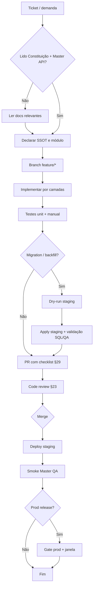

# Love Odonto V2 — Master Development Guide (Manual Oficial de Desenvolvimento)

**Documento:** `docs/platform/LOVE_ODONTO_V2_MASTER_DEVELOPMENT_GUIDE.md`  
**Versão:** 1.0.0  
**Data:** 2026-06-29  
**Status:** Oficial — manual normativo para toda implementação nova no Love Odonto V2.  
**Complemento de:** [`LOVE_ODONTO_V2_MASTER_ARCHITECTURE.md`](../constitution/LOVE_ODONTO_V2_MASTER_ARCHITECTURE.md) · [`LOVE_ODONTO_V2_MASTER_BUSINESS_RULES.md`](../constitution/LOVE_ODONTO_V2_MASTER_BUSINESS_RULES.md) · [`LOVE_ODONTO_V2_MASTER_DATABASE.md`](../constitution/LOVE_ODONTO_V2_MASTER_DATABASE.md) · [`LOVE_ODONTO_V2_MASTER_QA.md`](../constitution/LOVE_ODONTO_V2_MASTER_QA.md) · [`LOVE_ODONTO_V2_MASTER_API.md`](./LOVE_ODONTO_V2_MASTER_API.md)

**Regra de ouro:** nenhum código novo é aceito sem cumprir este guia. Em conflito com implementação legada, **este documento prevalece** até revisão formal da arquitetura.

**Escopo:** normas de desenvolvimento, organização, fluxos e checklists. **Não** contém código executável nem alterações de implementação.

---

## Índice

1. [Filosofia de desenvolvimento](#1-filosofia-de-desenvolvimento)
2. [Organização oficial das pastas](#2-organização-oficial-das-pastas)
3. [Convenções de nomenclatura](#3-convenções-de-nomenclatura)
4. [Estrutura de componentes React](#4-estrutura-de-componentes-react)
5. [Estrutura de Services](#5-estrutura-de-services)
6. [Estrutura da Admin API](#6-estrutura-da-admin-api)
7. [Organização dos Hooks](#7-organização-dos-hooks)
8. [Organização dos Contexts](#8-organização-dos-contexts)
9. [Organização das Rotas](#9-organização-das-rotas)
10. [Organização das Permissões](#10-organização-das-permissões)
11. [Organização dos Módulos](#11-organização-dos-módulos)
12. [Organização dos Assets](#12-organização-dos-assets)
13. [Organização do Storage](#13-organização-do-storage)
14. [Organização dos Tipos](#14-organização-dos-tipos)
15. [Organização dos Utilitários](#15-organização-dos-utilitários)
16. [Estratégia de Feature Flags](#16-estratégia-de-feature-flags)
17. [Estratégia de Refatoração](#17-estratégia-de-refatoração)
18. [Estratégia de Depreciação](#18-estratégia-de-depreciação)
19. [Estratégia de Migração](#19-estratégia-de-migração)
20. [Estratégia de Versionamento](#20-estratégia-de-versionamento)
21. [Estratégia de Branches](#21-estratégia-de-branches)
22. [Estratégia de Pull Requests](#22-estratégia-de-pull-requests)
23. [Estratégia de Code Review](#23-estratégia-de-code-review)
24. [Estratégia de Testes](#24-estratégia-de-testes)
25. [Estratégia de Performance](#25-estratégia-de-performance)
26. [Estratégia de Segurança](#26-estratégia-de-segurança)
27. [Estratégia de Observabilidade](#27-estratégia-de-observabilidade)
28. [Estratégia de Documentação](#28-estratégia-de-documentação)
29. [Checklist obrigatório para qualquer nova feature](#29-checklist-obrigatório-para-qualquer-nova-feature)
30. [Checklist obrigatório antes de merge](#30-checklist-obrigatório-antes-de-merge)
31. [Regras proibidas](#31-regras-proibidas)
32. [Fluxo oficial de desenvolvimento](#32-fluxo-oficial-de-desenvolvimento)
33. [Roadmap de evolução técnica](#33-roadmap-de-evolução-técnica)

**Apêndices:** [Checklists por artefato](#apêndice-a--checklists-por-artefato) · [Padrões de qualidade](#apêndice-b--padrões-de-qualidade)

---

## 1. Filosofia de desenvolvimento

### 1.1 Princípios

| Princípio | Aplicação prática |
|-----------|-------------------|
| **Tenant-first** | Todo dado e toda tela operam dentro de um `tenant_id` UUID válido |
| **SSOT explícito** | Antes de codar, declarar se a autoridade é Supabase, Admin API ou cache IDB (transição) |
| **Camadas claras** | UI → Hook → Service → API/Supabase/IDB — sem atalhos |
| **Fail closed** | Ausência de tenant, permissão ou sessão → bloqueio, nunca fallback silencioso |
| **Incrementalismo** | Migrar módulo a módulo; proibir big-bang sem rollback |
| **Evidência** | Toda mudança sensível tem teste, checklist ou relatório |

### 1.2 Hierarquia normativa

Em caso de dúvida, consultar nesta ordem:

1. Constituição Técnica (`LOVE_ODONTO_V2_MASTER_ARCHITECTURE.md`)
2. Regras de Negócio (`LOVE_ODONTO_V2_MASTER_BUSINESS_RULES.md`)
3. Banco de Dados (`LOVE_ODONTO_V2_MASTER_DATABASE.md`)
4. Contrato API (`LOVE_ODONTO_V2_MASTER_API.md`)
5. Este Development Guide
6. Master QA
7. ADRs em `docs/decisions/`
8. Docs de módulo em `docs/modules/`

### 1.3 Superfícies do monorepo

| Superfície | Path | Porta dev | Responsabilidade |
|------------|------|-----------|------------------|
| **App clínica** | `src/` | 5176 | Operação da clínica |
| **Console SaaS** | `console/` | 5177 | Tenants, billing, operadores |
| **Admin API** | `server/` | 3001 | Orquestração, Auth writes, service role |
| **Migrations app** | `supabase/migrations/` | — | Schema clínica + tenant |
| **Migrations console** | `console/supabase/migrations/` | — | Schema platform |
| **Scripts ops** | `scripts/` | — | Backfill, seed, preflight (fora do runtime) |

---

## 2. Organização oficial das pastas

### 2.1 Árvore canônica (App — `src/`)

```
src/
├── auth/              # Guards, AuthContext, sessão SaaS
├── tenant/            # TenantContext, tenantAccess, flags
├── pages/             # Rotas de página (*Page.jsx)
├── components/        # UI reutilizável e domínio transversal
│   ├── ui/            # Primitivos (Modal Radix, etc.)
│   ├── common/        # Avatar, badges, shared
│   └── {domínio}/     # clinical/, access/, collaborators/, …
├── services/          # Lógica de aplicação e persistência
├── hooks/             # Hooks transversais (useDebouncedValue, …)
├── db/                # IndexedDB — schema, migrations, idbStorage
├── lib/               # Clientes externos (supabaseClients)
├── config/            # envGuard, adminApiBase
├── navigation/        # menuConfig, routePermissionMap
├── constants/         # tenantRoles, enums estáveis
├── utils/             # Funções puras sem I/O
├── crm/               # Módulo CRM (ui/, hooks/, services locais)
├── convenios/         # Módulo convênios
├── contracts/         # Módulo contratos
├── platform/          # Shell platform embutido no app
├── __tests__/         # Testes Vitest
├── App.jsx            # Router raiz + providers
└── ProtectedApp.jsx   # Rotas autenticadas (lazy)
```

### 2.2 Admin API (`server/`)

```
server/
├── index.js           # Entry, rotas, middleware auth
├── identity/          # IdentityService, routes, audit
├── email/             # Templates e dispatch
├── lib/               # Backfill, seed, utilitários server-only
├── clinicProfileResolver.js
├── platformBillingService.js
└── .env.example       # Template secrets (nunca commitar .env)
```

### 2.3 Documentação (`docs/`)

```
docs/
├── constitution/      # Masters normativos (4 documentos)
├── platform/          # API, Development Guide, navigation
├── modules/           # Domínio funcional
├── playbooks/         # LOCAL_DEV, STABILITY_CHECKLIST
├── decisions/         # ADRs
├── reports/           # Audits
└── roadmap/           # Planejamento
```

### 2.4 Regra de colocação

| Se o artefato… | Colocar em… |
|----------------|-------------|
| É uma rota/tela | `src/pages/` ou subpasta do módulo |
| É UI reutilizável | `src/components/` |
| Orquestra dados | `src/services/` |
| É estado React compartilhado | `src/{auth,tenant}/` ou Context dedicado |
| É persistência IDB | `src/db/` + service que encapsula |
| É endpoint HTTP | `server/index.js` ou `server/{domínio}/` |
| É schema SQL | `supabase/migrations/` |

---

## 3. Convenções de nomenclatura

### 3.1 Arquivos

| Tipo | Padrão | Exemplo |
|------|--------|---------|
| Página | `{Nome}Page.jsx` | `CollaboratorsPage.jsx` |
| Componente | `{Nome}.jsx` PascalCase | `CollaboratorCompactHeader.jsx` |
| Service | `{domínio}Service.js` camelCase | `collaboratorService.js` |
| Hook | `use{Nome}.js` | `useCollaboratorAccessForm.js` |
| Context | `{Nome}Context.jsx` | `TenantContext.jsx` |
| Guard | `Require{Nome}.jsx` | `RequireTenantAccess.jsx` |
| Util | `{função}.js` camelCase | `passwordStrength.js` |
| Teste | `{alvo}.test.js` | `collaboratorIdBackfill.test.js` |
| Migration | `NNN_descricao_snake.sql` | `018_tenant_users_collaborator_fk.sql` |
| ADR | `ADR-NNN-TITULO.md` | `ADR-000-DOCUMENTATION-FOUNDATION.md` |

### 3.2 Identificadores

| Conceito | Padrão |
|----------|--------|
| Permissão RBAC | `{módulo}:{ação}` — ex.: `equipe:view` |
| Feature flag | `snake_case` ou camelCase consistente com `tenantAccess.js` |
| Coleção IDB | camelCase plural — ex.: `crmLeads` |
| Tabela Supabase | snake_case plural — ex.: `tenant_users` |
| UUID tenant | sempre UUID v4 — nunca slug como PK |

### 3.3 Imports

Ordem preferida: **externos → aliases internos → relativos → CSS**.

Usar extensão `.jsx`/`.js` conforme padrão do arquivo vizinho no mesmo diretório.

---

## 4. Estrutura de componentes React

### 4.1 Anatomia padrão

```
ComponentName.jsx
├── imports (externos → internos)
├── constantes locais (se pequenas)
├── subcomponentes privados (opcional, mesmo arquivo se < 30 linhas)
├── export function ComponentName({ props })
│   ├── hooks (useState, useContext, custom hooks)
│   ├── handlers (delegam a services)
│   └── JSX (sem lógica de negócio complexa)
```

### 4.2 Responsabilidades

| Componente **pode** | Componente **não pode** |
|---------------------|-------------------------|
| Renderizar UI | Implementar regra de negócio canônica |
| Validar UX (required, formato) | Chamar Supabase service role |
| Chamar hooks/services | Acessar IndexedDB diretamente |
| Usar `can()` para visibilidade | Duplicar RBAC server-side |
| Exibir toast via classe `.toast` | Criar modal legado (`div.modal-backdrop`) |

### 4.3 Modais e toasts

- **Modais:** exclusivamente `src/components/ui/Modal.jsx` (Radix) — ver `.cursor/rules/conventions.mdc`
- **Toasts:** classe global `.toast` — sem DOM imperativo

### 4.4 Limites recomendados

| Métrica | Limite |
|---------|--------|
| Linhas de lógica por arquivo | 200–300 (excl. JSX declarativo longo) |
| Linhas por função | 50 |
| Profundidade de nesting | < 4 níveis |
| Props | Preferir objetos tipados/documentados quando > 5 |

### 4.5 Lazy loading

- Rotas pesadas e `ProtectedApp` via `React.lazy` + `Suspense`
- Páginas de dev (`/dev/*`) somente em `import.meta.env.DEV`

---

## 5. Estrutura de Services

### 5.1 Papel

Services são a **camada de aplicação**: orquestram Admin API, Supabase client, IndexedDB e transformações de dados.

### 5.2 Anatomia padrão

```
domainService.js
├── imports (clients, db, helpers)
├── constantes / normalizers privados
├── export async function getX(tenantId, …)
├── export async function saveX(tenantId, payload)
└── export function normalizeX(row)   // funções puras exportadas se reutilizadas
```

### 5.3 Regras

| Regra | Descrição |
|-------|-----------|
| **DEV-SVC-001** | Todo write exige `tenantId` UUID explícito ou derivado de context validado |
| **DEV-SVC-002** | Admin API obrigatória conforme [`LOVE_ODONTO_V2_MASTER_API.md`](./LOVE_ODONTO_V2_MASTER_API.md) §4.2 |
| **DEV-SVC-003** | Acesso IDB apenas via `src/db/index.js` ou funções exportadas por `idbStorage.js` |
| **DEV-SVC-004** | Erros traduzidos para mensagens user-facing; códigos estáveis quando aplicável |
| **DEV-SVC-005** | Service não importa componente React |
| **DEV-SVC-006** | Um service por domínio principal; subpastas para subdomínios (`clinicalGuide/`) |

### 5.4 Services API-dedicated

Arquivos como `clinicProfileApi.js`, `platformApi.js` encapsulam **somente** fetch Admin API (headers, retry, timeout).

### 5.5 Comunicação entre services

- Permitido: service A chama função exportada de service B do **mesmo domínio** ou util compartilhado
- Evitar: cadeias profundas A→B→C→D sem contrato claro
- Proibido: service chamar service de outro domínio para contornar Admin API

---

## 6. Estrutura da Admin API

### 6.1 Organização

| Área | Local | Auth |
|------|-------|------|
| Health | `index.js` | Público |
| App tenant | `/internal/app/*` | `requireAppUser` |
| Platform | `/internal/platform/*` | `requireConsoleAccess` |
| Identities | `identity/routes.js` | `requireAppUser` |
| Público onboarding | `/public/platform/*` | Conforme rota |
| Webhooks | `/api/signature/webhook` | Secret header |

### 6.2 Handler padrão

1. Validar auth middleware  
2. Resolver `tenant_id` da membership (nunca só body)  
3. Validar permissão/role quando sensível  
4. Executar operação (service role Supabase)  
5. Registrar auditoria se crítico  
6. Responder envelope JSON (ver Master API §11–12)  

### 6.3 Novos endpoints

- Adicionar rota em `server/index.js` ou router dedicado montado com `app.use`
- Documentar em Master API antes ou no mesmo PR
- Nunca expor service role ao client

---

## 7. Organização dos Hooks

### 7.1 Tipos

| Tipo | Local | Exemplo |
|------|-------|---------|
| **Transversal** | `src/hooks/` | `useDebouncedValue`, `useCepAutofill` |
| **Domínio** | `{módulo}/hooks/` | `crm/hooks/useCrmTenantLabels.js` |
| **Formulário complexo** | `src/hooks/` | `useCollaboratorAccessForm.js` |

### 7.2 Regras

| Regra | Descrição |
|-------|-----------|
| **DEV-HOOK-001** | Um hook = uma responsabilidade coesa |
| **DEV-HOOK-002** | Hook chama services; não duplica lógica de service |
| **DEV-HOOK-003** | Side effects em `useEffect` com cleanup |
| **DEV-HOK-004** | Retorno estável documentado `{ state, actions, meta }` |

### 7.3 Anti-padrões

- Hook com fetch + transformação + persistência + navegação — dividir
- Hook que acessa IDB diretamente — delegar ao service/db layer

---

## 8. Organização dos Contexts

### 8.1 Contexts oficiais

| Context | Path | Escopo |
|---------|------|--------|
| `AuthProvider` | `src/auth/AuthContext.jsx` | Sessão app, hydrate SaaS |
| `TenantProvider` | `src/tenant/TenantContext.jsx` | Snapshot tenant, refresh |
| `PlatformAuthProvider` | `src/auth/PlatformAuthContext.jsx` | Console embutido |

### 8.2 Regras

- Context expõe **estado + ações estáveis** via `useMemo`/`useCallback`
- Fetch pesado no Provider ou service dedicado — não em cada consumer
- Novo Context global exige ADR se persistir além de um módulo
- Preferir composição: `TenantProvider` dentro de `AuthProvider` (ordem em `App.jsx`)

### 8.3 Guards relacionados

`RequireAuth`, `RequireTenantAccess`, `RequireRole`, `RequireModule`, `RequireFeatureFlag`, `RequireAdminGate` — usar em cadeia conforme `ProtectedApp.jsx`.

---

## 9. Organização das Rotas

### 9.1 Estrutura

| Arquivo | Responsabilidade |
|---------|------------------|
| `App.jsx` | Rotas públicas, platform, lazy ProtectedApp |
| `ProtectedApp.jsx` | Rotas autenticadas `/gestao/*`, shells de módulo |
| `navigation/menuConfig.js` | Menu lateral |
| `navigation/routePermissionMap.js` | Mapa rota → permissão |

### 9.2 Prefixos oficiais

| Prefixo | Módulo |
|---------|--------|
| `/gestao/` | Operação clínica (dashboard, agenda, …) |
| `/pacientes/`, `/prontuario/` | Pacientes e prontuário |
| `/crm/`, `/comercial/` | CRM e comercial |
| `/financeiro/` | Financeiro |
| `/admin/` | Administração clínica |
| `/configuracoes/` | Configurações |
| `/gestao/convenios/` | Convênios (shell) |
| `/gestao/contratos/` | Contratos (shell) |
| `/platform/` | Console embutido |

### 9.3 Nova rota — obrigatório

1. Registrar em `ProtectedApp.jsx` (ou shell do módulo)  
2. Entrada em `menuConfig.js` se visível no menu  
3. Mapa em `routePermissionMap.js`  
4. Guard `RequireModule` / `RequireFeatureFlag` se aplicável  
5. Caso de teste QA correspondente  

---

## 10. Organização das Permissões

### 10.1 Modelo

```
permission_catalog (Supabase)
    ↓
role_permission_defaults
    ↓
tenant_users + overrides
    ↓
accessService.can(permission)
    ↓
UI guards + menu
```

### 10.2 Implementação

| Camada | Arquivo | Papel |
|--------|---------|-------|
| Catálogo | Supabase `permission_catalog` | SSOT seed |
| Runtime read | `src/services/accessService.js` | `can()`, bypass master |
| Runtime write | Admin API `access-bundle` | Auth app_metadata |
| UI forms | `useCollaboratorAccessForm.js` | Edição RBAC |
| Rotas | `routePermissionMap.js` | Rota → permission key |

### 10.3 Regras

- Nova permissão: seed migration + catálogo + defaults + QA case
- UI oculta ≠ segurança — server/API deve validar
- Contagem “184/184” deriva do catálogo Supabase, não array hardcoded divergente

---

## 11. Organização dos Módulos

### 11.1 Módulos com shell próprio

| Módulo | Path | Shell |
|--------|------|-------|
| CRM | `src/crm/` | `CrmShellLayout` |
| Convênios | `src/convenios/` | `ConveniosShellLayout` |
| Contratos | `src/contracts/` | `ContractsShellLayout` |
| Marketing Chat | `src/pages/marketing/` | `MarketingChatShellLayout` |

### 11.2 Estrutura interna de módulo

```
{modulo}/
├── ui/           # Componentes específicos
├── hooks/        # Hooks do módulo
├── {modulo}ShellConfig.js   # Menu/tabs do shell
└── (services em src/services/ se compartilhados)
```

### 11.3 Novo módulo

1. ADR ou entrada em `docs/modules/{modulo}.md`  
2. Declarar SSOT (Supabase vs IDB transição)  
3. Shell + rotas + permissões + feature flag  
4. Checklist QA módulo  

---

## 12. Organização dos Assets

### 12.1 Estáticos frontend

| Path | Uso |
|------|-----|
| `public/` | favicon, áudio, assets sem hash |
| `src/assets/` | Imagens importadas pelo bundler (logos brand) |

### 12.2 Regras

- Assets de **clínica** (logo operacional) → Supabase Storage, não repo
- Assets de **marca Love Odonto** → repo + versionados
- Não commitar exports de pacientes ou dumps clínicos

---

## 13. Organização do Storage

Ver [`LOVE_ODONTO_V2_MASTER_API.md`](./LOVE_ODONTO_V2_MASTER_API.md) §7 e [`LOVE_ODONTO_V2_MASTER_ARCHITECTURE.md`](../constitution/LOVE_ODONTO_V2_MASTER_ARCHITECTURE.md) §21.

| Bucket atual | Path pattern |
|--------------|--------------|
| `clinic-logos` | `{tenant_id}/{filename}` |
| `clinical-guides` | `{tenant_id}/{guide_id}/{file}` |

**Fluxo logo:** upload Storage → URL HTTPS → `PUT clinic-profile` → invalidar cache.

---

## 14. Organização dos Tipos

### 14.1 Estado atual

Projeto predominantemente **JavaScript** com `tsc -b` para checagem parcial (`tsconfig`).

### 14.2 Diretrizes

| Situação | Abordagem |
|----------|-----------|
| Novo módulo crítico | Preferir `.ts`/`.tsx` ou JSDoc `@typedef` |
| Contratos API | Documentar shape em Master API + JSDoc no service |
| Enums estáveis | `src/constants/` |
| `any` | Proibido sem justificativa em comentário + ADR |

---

## 15. Organização dos Utilitários

### 15.1 `src/utils/`

Funções **puras** sem side effects: datas, currency, formatação, helpers de sugestão.

### 15.2 Regras

- Util não importa service nem React
- Util com I/O → mover para service
- Duplicação detectada → extrair util compartilhado, não copiar

---

## 16. Estratégia de Feature Flags

### 16.1 Fontes

| Fonte | Uso |
|-------|-----|
| `tenant.flags` / modules | Snapshot tenant-context |
| `RequireFeatureFlag` | Guard de rota |
| `import.meta.env.DEV` | Ferramentas dev only |
| Env `VITE_*` | Flags build-time (SaaS on/off) |

### 16.2 Regras

- Flag de produto → preferir tenant-context, não env hardcoded
- Flag temporária de migração → prazo de remoção em ADR
- Nova flag documentada em módulo + QA

---

## 17. Estratégia de Refatoração

### 17.1 Quando refatorar

- Arquivo > 300 linhas de lógica
- Duplicação de regra de negócio em 3+ lugares
- Cutover de módulo para Supabase
- Divergência com Constituição

### 17.2 Como refatorar

1. Testes cobrindo comportamento atual  
2. Refactor mecânico (sem mudança funcional)  
3. PR pequeno e revisável  
4. Sem “refactor drive-by” em feature unrelated  

### 17.3 Strangler pattern (V2)

Manter IDB legado atrás de service facade → dual-write → cutover → remover IDB authority.

---

## 18. Estratégia de Depreciação

| Artefato | Processo |
|----------|----------|
| Endpoint API | Header Deprecation + 90d + doc Master API |
| Campo DB | Migration aditiva → código para de usar → drop migration |
| Auth legado bcrypt IDB | Flag SaaS; remover após 100% tenants migrados |
| Permissão | Manter no catálogo como deprecated até major version |

---

## 19. Estratégia de Migração

### 19.1 Migrations SQL

Ver Constituição §24.

| Regra | Descrição |
|-------|-----------|
| **DEV-MIG-001** | Staging antes de produção — sempre |
| **DEV-MIG-002** | Numeração `NNN_descricao_snake.sql` |
| **DEV-MIG-003** | Destructive exige rollback documentado |
| **DEV-MIG-004** | RLS em toda tabela `public` nova |
| **DEV-MIG-005** | Gate 018 FK — só após backfill validado |

### 19.2 Backfill de dados

- Script em `scripts/` com `--dry-run` e `--apply`  
- Relatório JSON em `scripts/reports/`  
- Backup pré-apply obrigatório em staging/prod  

### 19.3 Migração domínio (App)

Por módulo: schema → RLS → service dual-write → QA → cutover → deprecate IDB writes.

---

## 20. Estratégia de Versionamento

| Artefato | Esquema |
|----------|---------|
| App npm | Semver em releases (atual `0.0.0` dev) |
| IndexedDB | `DB_VERSION` em `schema.js` — bump em migration IDB |
| Admin API | `meta.apiVersion` / ADR para breaking |
| Docs Masters | Versão no header + histórico de revisões |
| Migrations | Sequencial inteiro — nunca reutilizar número |

---

## 21. Estratégia de Branches

| Branch | Uso |
|--------|-----|
| `main` | Produção — protegida |
| `feature/{ticket}-{descricao-curta}` | Features |
| `fix/{ticket}-{descricao}` | Correções |
| `docs/{descricao}` | Somente documentação |
| `chore/migration-{NNN}` | Migrations isoladas quando necessário |

**Regras:**

- Branch curta (< 1 semana ideal)  
- Rebase ou merge conforme política do time — evitar long-lived divergência  
- Nunca commitar secrets  

---

## 22. Estratégia de Pull Requests

### 22.1 Tamanho

- Preferir PRs < 400 linhas lógicas  
- Separar: schema / backend / frontend / docs quando possível  

### 22.2 Template mínimo (descrição)

```markdown
## Contexto
[Módulo e ticket]

## O que mudou
- …

## SSOT / Tenant
- [ ] tenant_id em dados novos
- [ ] Sem fallback tenant

## Checklists
- [ ] Master Architecture §33
- [ ] Master API (se endpoints)
- [ ] Master QA (se deploy)
- [ ] Testes adicionados/atualizados

## Evidências
[Screenshots, relatório dry-run, etc.]
```

### 22.3 PRs proibidos sem

- Descrição do SSOT afetado  
- Resposta ao checklist §29 ou §30  
- Testes para lógica nova (exceto docs-only)  

---

## 23. Estratégia de Code Review

### 23.1 Checklist do revisor

| # | Verificar |
|---|-----------|
| 1 | Compatível com Constituição e Master API |
| 2 | Tenant validado em writes |
| 3 | Sem service role no frontend |
| 4 | Sem lógica de negócio pesada em componente |
| 5 | Modais Radix / toasts CSS |
| 6 | Sem console.log desprotegido |
| 7 | Migrations com staging first |
| 8 | Testes adequados |
| 9 | Sem secrets commitados |
| 10 | Performance aceitável (N+1, bundles) |

### 23.2 Aprovação

- Mínimo 1 revisor para features  
- 2 revisores para migrations prod, RBAC, auth  
- Autor não aprova alone mudanças de segurança crítica  

---

## 24. Estratégia de Testes

### 24.1 Pirâmide

| Nível | Ferramenta | Escopo |
|-------|------------|--------|
| Unit | Vitest (`npm test`) | Services, utils, policies |
| Integração | Vitest + mocks | API handlers, identity |
| Smoke | `npm run smoke` | Stack local |
| Manual staging | Master QA checklists | UI, fluxos E2E |
| E2E automatizado | Roadmap | Playwright/Cypress futuro |

### 24.2 Obrigatoriedade

| Mudança | Teste mínimo |
|---------|--------------|
| Service com regra | Unit test |
| Admin API handler | Test ou audit script |
| Migration | Validar staging + query sanity |
| UI crítica (auth, RBAC) | Caso manual QA |
| Bugfix | Regressão test |

### 24.3 Localização

- App: `src/__tests__/`  
- Server: `src/__tests__/` (cross) ou co-located futuro  
- Scripts: dry-run como teste operacional  

---

## 25. Estratégia de Performance

| Área | Diretriz |
|------|----------|
| **Bundle** | Lazy routes; evitar import pesado no critical path |
| **IDB** | Worker `loadDb.worker.js` para load inicial |
| **Fetch** | Debounce search; paginação server-side quando Supabase |
| **Tenant context** | Cache 5 min; não refetch em cada navegação |
| **Imagens** | Storage CDN; thumbnails para galerias |
| **React** | Memoização onde profiling indicar; não prematuramente |

---

## 26. Estratégia de Segurança

| Controle | Implementação |
|----------|---------------|
| Auth | JWT Supabase; guards em camadas |
| Tenant | Membership server-side |
| RLS | Toda tabela tenant-scoped |
| Secrets | `.env` gitignored; Railway/Render env |
| LGPD | Minimizar PII em logs |
| XSS | Sanitize HTML user-generated |
| CSRF | Bearer token; SameSite cookies Auth |
| Dependencies | `npm audit` periódico |

Ver Master API §14 e Constituição §22.

---

## 27. Estratégia de Observabilidade

| Canal | Uso | Ambiente |
|-------|-----|----------|
| `stabilityLogService` | Eventos auth/tenant/backend | Dev/staging |
| `identity_events` | Auditoria identidade | Todos |
| `scripts/reports/*.json` | Backfill, dry-run | Ops |
| Server logs | Erros 5xx — sem PII | Prod |
| `/stability/health` | Diagnóstico interno | Dev/staging |

**Logs produção:** apenas com guard `import.meta.env?.DEV` no frontend.

---

## 28. Estratégia de Documentação

| Tipo | Onde |
|------|------|
| Constituição | `docs/constitution/` |
| Contrato API | `docs/platform/LOVE_ODONTO_V2_MASTER_API.md` |
| Este guia | `docs/platform/` |
| Módulo | `docs/modules/{nome}.md` |
| Decisão | `docs/decisions/ADR-NNN-*.md` |
| Playbook ops | `docs/playbooks/` |
| README raiz docs | `docs/README.md` |

**Regra:** feature que altera contrato → atualizar Master correspondente no mesmo epic (PR separado docs-only permitido).

---

## 29. Checklist obrigatório para qualquer nova feature

Copiar no ticket/PR:

### Contexto
- [ ] Módulo identificado
- [ ] Constituição § relevante lida
- [ ] Master API consultado se comunicação
- [ ] SSOT declarado (Supabase / API / IDB transição)

### Implementação
- [ ] Camadas respeitadas (UI → Hook → Service → API/DB)
- [ ] `tenant_id` UUID em todo dado novo
- [ ] Sem fallback tenant padrão
- [ ] Permissões via `can()` + server validation
- [ ] Cache invalidado após write

### Qualidade
- [ ] Testes unitários (se lógica)
- [ ] Caso QA manual (se UI)
- [ ] Sem regras proibidas (§31)

### Ops (se aplicável)
- [ ] Migration staging first
- [ ] Env vars documentadas
- [ ] Rollback definido

---

## 30. Checklist obrigatório antes de merge

### Código
- [ ] `npm test` verde
- [ ] `npm run type-check` sem erros novos críticos
- [ ] `npm run lint` sem erros novos
- [ ] Sem secrets no diff

### Arquitetura
- [ ] Checklist §29 completo
- [ ] Revisor aprovou §23

### Deploy (se release)
- [ ] Master QA fluxo pré-deploy
- [ ] Smoke staging
- [ ] Evidência anexada

---

## 31. Regras proibidas

| # | Proibição |
|---|-----------|
| ❌ 1 | Lógica de negócio canônica dentro de componentes React |
| ❌ 2 | Acesso Supabase direto quando Admin API é obrigatória |
| ❌ 3 | Fallback para tenant padrão / inferido |
| ❌ 4 | Acesso IndexedDB fora de `src/db/` ou service autorizado |
| ❌ 5 | Duplicação de regras (RBAC, tenant, validação) |
| ❌ 6 | Service chamando service sem contrato claro |
| ❌ 7 | Chamadas async sem tratamento de erro |
| ❌ 8 | Componente monolítico (> 300 linhas lógica) |
| ❌ 9 | Hook com múltiplas responsabilidades não relacionadas |
| ❌ 10 | Migration aplicada em produção sem staging |
| ❌ 11 | Código novo sem testes (exceto trivial/docs) |
| ❌ 12 | Código novo sem documentação quando altera contrato |
| ❌ 13 | Uso de `any` sem justificativa documentada |
| ❌ 14 | Logs de produção inadequados (PII, tokens, console.log cru) |
| ❌ 15 | Modais/toasts fora dos padrões Radix/`.toast` |
| ❌ 16 | Service role (`SUPABASE_SERVICE_ROLE_KEY`) no frontend |
| ❌ 17 | Base64 persistente para assets |
| ❌ 18 | `document.querySelector` em componentes (usar refs) |
| ❌ 19 | z-index hardcoded (usar tokens CSS) |
| ❌ 20 | Commit de `.env` com secrets |

---

## 32. Fluxo oficial de desenvolvimento



### 32.1 Comandos locais (referência)

| Comando | Uso |
|---------|-----|
| `npm run dev` | App + API |
| `npm run dev:all` | App + Console + API |
| `npm run env:check` | Validar env stack |
| `npm test` | Vitest |
| `npm run type-check` | TypeScript |
| `npm run smoke` | Smoke local |

Detalhes: [`docs/playbooks/LOCAL_DEV.md`](../playbooks/LOCAL_DEV.md)

---

## 33. Roadmap de evolução técnica

| Fase | Foco | Entregável dev |
|------|------|----------------|
| **1** ✅ | RH, permissions, clinic profile, identities | Backfill, migrations 014–019 |
| **2** 🔄 | RBAC relacional Supabase; envelope API V2 | Services + migrations overrides |
| **3** ⏳ | Agenda → Supabase | Schema + dual-write + cutover |
| **4** ⏳ | Pacientes + prontuário | Storage imaging + RLS |
| **5** ⏳ | Financeiro + CRM | Read models, sync |
| **6** ⏳ | Contratos + assinatura | Webhook processor async |
| **7** ⏳ | Offline outbox | Fila + sync worker |
| **8** ⏳ | E2E CI + OpenAPI | Pipeline QA completo |

---

## Apêndice A — Checklists por artefato

### A.1 Checklist — nova tela

- [ ] Página em `src/pages/` ou módulo correto
- [ ] Rota em `ProtectedApp.jsx` ou shell
- [ ] Entrada menu + `routePermissionMap`
- [ ] Guards (`RequireModule`, `RequireRole`)
- [ ] Consome service — sem lógica de negócio no JSX
- [ ] Loading/error/empty states
- [ ] Toast para feedback mutação
- [ ] Caso QA manual registrado

### A.2 Checklist — novo módulo

- [ ] `docs/modules/{modulo}.md` criado/atualizado
- [ ] SSOT declarado
- [ ] Shell layout + rotas prefixo
- [ ] Permissões no catálogo
- [ ] Feature flag se beta
- [ ] Checklist QA módulo (Master QA §6)

### A.3 Checklist — nova migration

- [ ] Arquivo `NNN_descricao_snake.sql` no path correto
- [ ] `tenant_id` + RLS se tabela tenant
- [ ] Índices FK necessários
- [ ] Testada em staging
- [ ] Rollback documentado se destructive
- [ ] Não aplicada prod sem gate

### A.4 Checklist — nova API (endpoint)

- [ ] Auth middleware correto
- [ ] Tenant validado server-side
- [ ] Documentada em Master API
- [ ] Envelope JSON padrão
- [ ] Auditoria se sensível
- [ ] Teste ou script audit
- [ ] Timeout/erro tratados

### A.5 Checklist — novo Service

- [ ] Arquivo `*Service.js` em `src/services/`
- [ ] Exports claros; sem import React
- [ ] `tenantId` em assinaturas de write
- [ ] Admin API vs Supabase vs IDB explícito
- [ ] Erros traduzidos
- [ ] Teste unitário regras críticas

### A.6 Checklist — novo Hook

- [ ] Nome `use*`
- [ ] Uma responsabilidade
- [ ] Delega persistência ao service
- [ ] Cleanup effects
- [ ] Documentação JSDoc se API pública

### A.7 Checklist — novo Context

- [ ] Justificativa (estado global necessário)
- [ ] Provider + hook `useX`
- [ ] Valores memoizados
- [ ] ADR se cross-cutting novo

### A.8 Checklist — novo componente

- [ ] PascalCase, pasta domínio correta
- [ ] < 300 linhas lógica
- [ ] Sem fetch direto — props ou hooks
- [ ] Modal Radix se modal
- [ ] Acessibilidade básica (labels, roles)

### A.9 Checklist — novo bucket Storage

- [ ] Migration SQL policy RLS
- [ ] Documentado Master API §7
- [ ] Path `{tenant_id}/…`
- [ ] MIME/size validation
- [ ] Sem base64 fallback

### A.10 Checklist — novo endpoint (resumo operacional)

- [ ] Ver A.4 + Master API §21 checklist
- [ ] Rate limit considerado se público
- [ ] Idempotência se webhook/write externo

---

## Apêndice B — Padrões de qualidade

### B.1 Métricas recomendadas

| Métrica | Limite recomendado |
|---------|-------------------|
| Linhas lógica por arquivo | 200–300 |
| Linhas por função | 50 |
| Complexidade ciclomática | < 10 |
| Profundidade nesting | < 4 |
| Parâmetros função | ≤ 5 (senão objeto options) |
| Imports por arquivo | ≤ 15 (sinal de SRP violado) |

### B.2 SOLID aplicado

| Princípio | Love Odonto |
|-----------|-------------|
| **SRP** | Service por domínio; componente apresentacional |
| **OCP** | Extender via hooks/services, não ifs espalhados |
| **LSP** | Guards substituíveis (`RequireAuth` chain) |
| **ISP** | Contexts mínimos; não god context |
| **DIP** | UI depende de service interface, não IDB direto |

### B.3 Coesão e acoplamento

- **Alta coesão:** arquivos em `crm/` falam de CRM
- **Baixo acoplamento:** módulos via services e eventos, não imports circulares
- **Reuso:** extrair para `utils/` ou `components/common/` após 2º uso
- **Injeção:** preferir parâmetros (`tenantId`, `client`) a globals implícitos

### B.4 Legibilidade

- Nomes descritivos em português para UX; código em inglês técnico consistente com repo
- Early return / guard clauses
- Comentários só para regras de negócio não óbvias
- Evitar abstrações prematuras (YAGNI)

### B.5 Escalabilidade

- Paginação server-side para listas > 100 itens
- Índices DB para filtros frequentes
- Stateless API — sem session server-side
- Feature flags para rollout gradual

---

## Controle de revisão

| Versão | Data | Alteração |
|--------|------|-----------|
| 1.0.0 | 2026-06-29 | Versão inicial — Master Development Guide V2 |

---

## Critérios de aceite (este documento)

| Critério | Status |
|----------|--------|
| Estrutura oficial documentada | ✅ §2 |
| Fluxo oficial documentado | ✅ §32 |
| Convenções definidas | ✅ §3–§15 |
| Estratégia de desenvolvimento | ✅ §1, §16–§20 |
| Estratégia de revisão | ✅ §22–§23 |
| Estratégia de testes | ✅ §24 |
| Estratégia de deploy | ✅ §19, §30, §32 |
| Estratégia de evolução | ✅ §33 |
| Checklists de desenvolvimento | ✅ §29–§30, Apêndice A |
| Regras proibidas | ✅ §31 |

### Próximos documentos recomendados

| Documento | Propósito |
|-----------|-----------|
| `LOVE_ODONTO_V2_MASTER_INTEGRATION.md` | Integrações externas detalhadas |
| `docs/platform/openapi-v1.yaml` | Schema machine-readable API |
| `docs/playbooks/ONBOARDING_DEVELOPER.md` | Setup dia 1 para novos devs |
| Addendum PR template | Template GitHub alinhado §22 |

### Referências

- [`LOVE_ODONTO_V2_MASTER_ARCHITECTURE.md`](../constitution/LOVE_ODONTO_V2_MASTER_ARCHITECTURE.md)
- [`LOVE_ODONTO_V2_MASTER_API.md`](./LOVE_ODONTO_V2_MASTER_API.md)
- [`architecture-audit-love-odonto-v2.md`](../reports/architecture-audit-love-odonto-v2.md)
- [`LOCAL_DEV.md`](../playbooks/LOCAL_DEV.md)
- [`STABILITY_CHECKLIST.md`](../playbooks/STABILITY_CHECKLIST.md)
- `.cursor/rules/conventions.mdc`

---

*Love Odonto V2 — Este documento é o Manual Oficial de Desenvolvimento. Alterações exigem revisão explícita e bump de versão nesta seção.*
