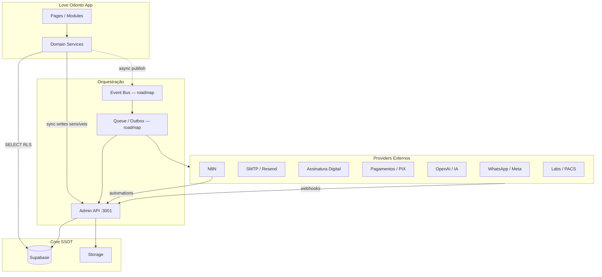
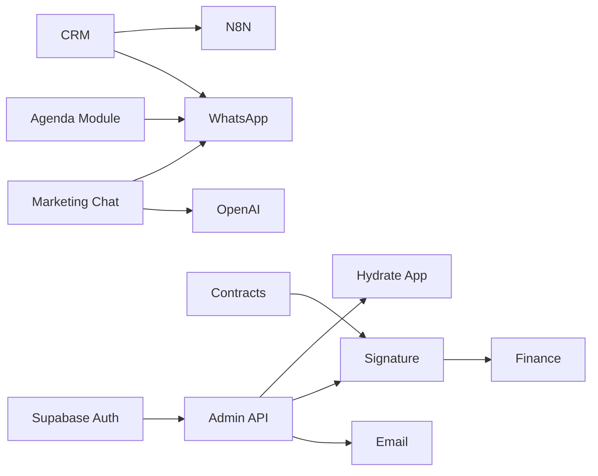

# Love Odonto V2 — Master Integration (Constituição Oficial de Integrações)

**Documento:** `docs/platform/LOVE_ODONTO_V2_MASTER_INTEGRATION.md`  
**Versão:** 1.0.0  
**Data:** 2026-06-29  
**Status:** Oficial — referência normativa para todas as integrações atuais e futuras do Love Odonto V2.  
**Complemento de:** [`LOVE_ODONTO_V2_MASTER_ARCHITECTURE.md`](../constitution/LOVE_ODONTO_V2_MASTER_ARCHITECTURE.md) · [`LOVE_ODONTO_V2_MASTER_BUSINESS_RULES.md`](../constitution/LOVE_ODONTO_V2_MASTER_BUSINESS_RULES.md) · [`LOVE_ODONTO_V2_MASTER_DATABASE.md`](../constitution/LOVE_ODONTO_V2_MASTER_DATABASE.md) · [`LOVE_ODONTO_V2_MASTER_QA.md`](../constitution/LOVE_ODONTO_V2_MASTER_QA.md) · [`LOVE_ODONTO_V2_MASTER_API.md`](./LOVE_ODONTO_V2_MASTER_API.md) · [`LOVE_ODONTO_V2_MASTER_SECURITY.md`](./LOVE_ODONTO_V2_MASTER_SECURITY.md) · [`LOVE_ODONTO_V2_MASTER_DEVELOPMENT_GUIDE.md`](./LOVE_ODONTO_V2_MASTER_DEVELOPMENT_GUIDE.md)

**Regra de ouro:** nenhuma integração pode ser implementada fora deste padrão. Em conflito com implementação legada, **este documento prevalece** até revisão formal da arquitetura.

**Escopo:** arquitetura, contratos, eventos, providers e políticas de integração. **Não** contém código executável.

**Legenda de estado:** ✅ implementado · 🔄 parcial / transição · ⏳ roadmap

---

## Índice

1. [Filosofia das Integrações](#1-filosofia-das-integrações) · 2. [Objetivos](#2-objetivos) · 3. [Princípios obrigatórios](#3-princípios-obrigatórios) · 4. [Arquitetura oficial](#4-arquitetura-oficial-de-integrações) · 5–6. [Síncronas / Assíncronas](#5-integrações-síncronas) · 7–9. [Contratos / Versionamento / Compatibilidade](#7-contratos-de-comunicação) · 10–12. [APIs externas / Webhooks / Eventos](#10-estratégia-de-apis-externas) · 13. [Event Catalog](#13-event-catalog-oficial) · 14–20. [Filas / Retry / Idempotência / CB / Timeout / DLQ / Rate limit](#14-estratégia-de-filas) · 21–22. [Monitoramento / Observabilidade](#21-monitoramento) · 23–29. [Segurança / Auth / OAuth / JWT / Keys / HMAC / Replay](#23-segurança-das-integrações) · 30–54. [Integrações oficiais](#30-integrações-oficiais-do-love-odonto) · 55–59. [Offline / Cache / Auditoria / Logs / Erros](#55-estratégia-offline) · 60. [Roadmap](#60-roadmap)

**Apêndices:** [Matrizes](#apêndice-a--matrizes) · [Padrões](#apêndice-b--padrões-oficiais) · [Checklists](#apêndice-c--checklists) · [Regras proibidas](#apêndice-d--regras-proibidas) · [Roadmap detalhado](#apêndice-e--roadmap-detalhado)

---

## 1. Filosofia das Integrações

Integrações no Love Odonto V2 conectam o **core clínico multi-tenant** a canais externos (mensageria, pagamentos, assinatura, IA, laboratórios) sem comprometer SSOT, isolamento ou LGPD.

| Premissa | Significado |
|----------|-------------|
| **Tenant boundary** | Toda integração é escopada por `tenant_id` — credenciais, eventos, logs |
| **Admin API como gate** | Writes sensíveis e secrets nunca no browser |
| **Contrato antes de código** | Provider, auth, eventos e idempotência documentados aqui |
| **Async by default** | Side effects externos preferencialmente assíncronos |
| **Observabilidade nativa** | Toda integração deixa trilha auditável |
| **Fail safe** | Falha externa não corrompe SSOT — retry/DLQ/degraded mode |

---

## 2. Objetivos

| Objetivo | Métrica |
|----------|---------|
| **Interoperabilidade previsível** | 100% integrações novas seguem envelope + event catalog |
| **Isolamento** | Zero cross-tenant em eventos/webhooks |
| **Resiliência** | Retry bounded; DLQ para falhas permanentes |
| **Conformidade** | LGPD opt-out, auditoria, minimização payload |
| **Evolução** | Versionamento sem breaking silent |
| **Ecossistema** | Base para marketplace/SDK (Fase 3–5) |

---

## 3. Princípios obrigatórios

| ID | Princípio |
|----|-----------|
| **INT-P01** | Credenciais por tenant em `tenant_integrations` — nunca hardcoded frontend |
| **INT-P02** | Webhook inbound sempre autenticado (secret/HMAC) |
| **INT-P03** | Eventos com nome UPPER_SNAKE_CASE versionados |
| **INT-P04** | Payload inclui `tenant_id`, `event_version`, `idempotency_key` |
| **INT-P05** | Idempotência obrigatória em consumers |
| **INT-P06** | Timeout finito em toda chamada externa |
| **INT-P07** | Retry exponential backoff com teto |
| **INT-P08** | Auditoria em integrações financeiras, assinatura, RBAC |
| **INT-P09** | Logs sem PII/tokens |
| **INT-P10** | Documentação + teste antes de prod |

---

## 4. Arquitetura oficial de integrações



### Camadas

| Camada | Responsabilidade |
|--------|------------------|
| **UI** | Dispara ação; nunca guarda API key provider |
| **Service** | Monta payload; chama API ou publica evento |
| **Admin API** | Valida tenant; executa com service role; recebe webhooks |
| **Event Bus** | Roteamento desacoplado (roadmap) |
| **Provider** | Sistema externo |

---

## 5. Integrações síncronas

**Quando usar:** leitura imediata, validação pré-write, upload Storage, tenant-context.

| Exemplo | Latência alvo | Timeout |
|---------|---------------|---------|
| `GET tenant-context` | < 2s | 15s client |
| Upload logo Storage | < 5s | 30s |
| `can()` permission check | < 50ms | local |
| Provider lookup (futuro) | < 3s | 10s |

**Regra INT-SYNC-001:** UI não bloqueia > 3s sem loading state; operações > 10s devem ser async.

---

## 6. Integrações assíncronas

**Quando usar:** WhatsApp bulk, webhooks processamento, sync assinatura, campanhas, N8N, billing evaluate.

| Padrão | Estado |
|--------|--------|
| Webhook ack rápido + worker | 🔄 signature webhook ack only |
| Outbox IDB → replay API | ⏳ |
| Supabase Queues / pg_cron | ⏳ |
| N8N workflow trigger | ⏳ |

**Regra INT-ASYNC-001:** Webhook responde 200 em < 5s; processamento pesado em fila.

---

## 7. Contratos de comunicação

Alinhado a [`LOVE_ODONTO_V2_MASTER_API.md`](./LOVE_ODONTO_V2_MASTER_API.md) §11–12.

### Envelope outbound (evento)

```json
{
  "event": "APPOINTMENT_CONFIRMED",
  "event_version": "1.0",
  "idempotency_key": "uuid",
  "tenant_id": "uuid",
  "occurred_at": "ISO-8601",
  "actor": { "user_id": "uuid", "type": "user" },
  "data": { }
}
```

### Envelope API response

```json
{
  "success": true,
  "data": { },
  "meta": { "apiVersion": "v1", "requestId": "uuid" },
  "error": null
}
```

---

## 8. Versionamento

| Artefato | Esquema |
|----------|---------|
| Eventos | `event_version` semver minor |
| Webhooks payload | `schema_version` field |
| API pública | `/api/v1` path (roadmap) |
| Provider adapters | `{provider}_adapter_v{N}` |

**Depreciação:** 90 dias staging → prod; eventos duplicados proibidos — usar alias documentado.

---

## 9. Compatibilidade

| Regra | Descrição |
|-------|-----------|
| **Additive only** | Novos campos opcionais em minor version |
| **Breaking** | Major bump + dual consume period |
| **Unknown fields** | Consumers ignoram campos desconhecidos |
| **Unknown events** | Log + DLQ — não crash |

---

## 10. Estratégia de APIs externas

| Diretriz | Norma |
|----------|-------|
| Chamadas | Somente server-side ou service layer com proxy API |
| Config | `tenant_integrations.config_json` — secrets server vault |
| Adapter pattern | Um adapter por provider |
| Circuit breaker | Após N falhas — open 60s (roadmap) |
| Sandbox | Staging credentials separadas |

---

## 11. Estratégia de Webhooks

### Inbound (provider → Love Odonto)

| Rota atual | Auth | Estado |
|------------|------|--------|
| `POST /api/signature/webhook` | `x-signature-secret` | ✅ |

### Outbound (Love Odonto → tenant webhook URL)

| Campo | Norma |
|-------|-------|
| URL | Configurável em clinic profile / tenant_integrations |
| Assinatura | HMAC-SHA256 body (roadmap) |
| Retry | 3 tentativas exponential |
| Log | `webhook_logs` (roadmap Supabase) |

---

## 12. Estratégia de Eventos

| Fase | Mecanismo |
|------|-----------|
| **Atual** | Side effects inline em services + logs IDB |
| **Fase 2** | Event catalog + outbox table |
| **Fase 3** | Supabase Realtime / Queues broadcast |

**Regra:** produtor publica evento **após** commit SSOT (Postgres ou API success).

---

## 13. Event Catalog oficial

Formato de documentação por evento: **Origem · Destino · Payload · Responsável · Idempotência · Auditoria · Retry · Logs**

### 13.1 Pacientes

| Evento | Origem | Destino | Status |
|--------|--------|---------|--------|
| `PATIENT_CREATED` | `patientService` / IDB | CRM, analytics | 🔄 IDB |
| `PATIENT_UPDATED` | patientService | Search index | 🔄 |
| `PATIENT_DELETED` | — | — | ⏳ soft delete preferido |
| `PATIENT_ARCHIVED` | patientService | Audit | ⏳ |
| `PATIENT_RESTORED` | patientService | Audit | ⏳ |

**Payload mínimo:** `{ patient_id, tenant_id, legacy_id?, name, cpf_hash?, updated_fields[] }`  
**Idempotency key:** `{tenant_id}:PATIENT_CREATED:{patient_id}`  
**Auditoria:** clinical_audit (roadmap) · **Retry:** N/A sync · **Logs:** stability dev

---

### 13.2 CRM / Leads

| Evento | Origem | Destino | Status |
|--------|--------|---------|--------|
| `LEAD_CREATED` | crmService | Marketing Chat, N8N | 🔄 IDB |
| `LEAD_UPDATED` | crmService | Automations | 🔄 |
| `LEAD_CONVERTED` | crmService | PATIENT_CREATED trigger | 🔄 |
| `LEAD_STAGE_CHANGED` | crmService | crmAutomations | 🔄 |

**Payload:** `{ lead_id, tenant_id, stage_id, phone?, email? }`  
**Idempotency:** `{tenant_id}:LEAD_CONVERTED:{lead_id}`  
**Auditoria:** crmMessageLogs · **Retry:** async automation ⏳

---

### 13.3 Agenda

| Evento | Origem | Destino | Status |
|--------|--------|---------|--------|
| `APPOINTMENT_CREATED` | agendaService | WhatsApp queue, calendar | 🔄 IDB |
| `APPOINTMENT_CONFIRMED` | agendaService | NOTIFICATION_SENT | 🔄 |
| `APPOINTMENT_CANCELLED` | agendaService | NOTIFICATION_SENT | 🔄 |
| `APPOINTMENT_RESCHEDULED` | agendaService | NOTIFICATION_SENT | ⏳ |
| `PATIENT_CHECKIN` | flowService | Flow board | 🔄 |
| `PATIENT_CALLED` | flowService | Display | 🔄 |
| `PATIENT_IN_CHAIR` | flowService | Flow board | 🔄 |

**Payload appointment:** `{ appointment_id, tenant_id, patient_id, professional_id, starts_at, status }`  
**Idempotency:** `{tenant_id}:APPOINTMENT_CONFIRMED:{appointment_id}:{status_version}`  
**Auditoria:** appointment logs IDB · **Retry:** WhatsApp async ⏳

---

### 13.4 Clínico / Prontuário

| Evento | Origem | Destino | Status |
|--------|--------|---------|--------|
| `CONSULTATION_STARTED` | clinicalService | Timer, audit | 🔄 |
| `CONSULTATION_FINISHED` | clinicalService | Journey, billing | 🔄 |
| `ODONTOGRAM_UPDATED` | odontogramV2Store | Audit | 🔄 IDB |
| `TREATMENT_APPROVED` | planningService | Budget, contract | 🔄 |
| `CLINICAL_DOCUMENT_UPLOADED` | clinicalGuideService | Storage | 🔄 |

**Auditoria:** RN-PRO-006 — **Retry:** Storage upload retry 3x

---

### 13.5 Orçamentos e Contratos

| Evento | Origem | Destino | Status |
|--------|--------|---------|--------|
| `BUDGET_CREATED` | budgetService | CRM, finance | 🔄 |
| `BUDGET_APPROVED` | budgetService | CONTRACT_CREATED | 🔄 |
| `CONTRACT_CREATED` | contractService | Signature provider | 🔄 |
| `CONTRACT_SENT` | contractService | NOTIFICATION_SENT | 🔄 |
| `CONTRACT_SIGNED` | webhook signature | contractService, finance | 🔄 parcial |
| `CONTRACT_CANCELLED` | contractService | Audit | 🔄 |

**Webhook mapping:** `document_signed` → `CONTRACT_SIGNED`  
**Idempotency:** `{tenant_id}:CONTRACT_SIGNED:{external_id}`  
**Auditoria:** contract_audit_logs ✅

---

### 13.6 Financeiro

| Evento | Origem | Destino | Status |
|--------|--------|---------|--------|
| `PAYMENT_CREATED` | financeService | Gateway | 🔄 IDB |
| `PAYMENT_RECEIVED` | gateway webhook | financeService | ⏳ |
| `PAYMENT_OVERDUE` | billing job | NOTIFICATION_SENT | ⏳ |
| `RECEIVABLE_CREATED` | financeService | CRM | 🔄 |
| `BOLETO_GENERATED` | financeService | Provider | 🔄 structure |

**Auditoria:** finance audit roadmap · **Retry:** gateway webhook 5x

---

### 13.7 Usuários / RBAC / Tenant

| Evento | Origem | Destino | Status |
|--------|--------|---------|--------|
| `USER_CREATED` | Admin API | Auth, email | ✅ |
| `USER_UPDATED` | Admin API | identity_events | ✅ |
| `USER_DISABLED` | Admin API | Auth revoke | ✅ |
| `PERMISSION_CHANGED` | access-bundle | Auth metadata, cache invalidate | ✅ |
| `TENANT_CREATED` | Platform provision | Console, seed | ✅ |
| `TENANT_UPDATED` | Platform | tenant-context | ✅ |
| `TENANT_BLOCKED_BILLING` | Platform billing | App warnings | ✅ |
| `IDENTITY_PROVISIONED` | IdentityService | identity_events | ✅ |
| `INVITATION_SENT` | Admin API | Email provider | ✅ |

**Auditoria:** identity_events ✅ · **Logs:** `[IDENTITY_AUDIT]`

---

### 13.8 Storage

| Evento | Origem | Destino | Status |
|--------|--------|---------|--------|
| `STORAGE_FILE_UPLOADED` | Storage client | clinic-profile, RH | ✅ logos |
| `STORAGE_FILE_DELETED` | Admin API | Audit | ⏳ |

**Payload:** `{ bucket, path, tenant_id, mime, size_bytes, entity_type, entity_id }`

---

### 13.9 Marketing / IA

| Evento | Origem | Destino | Status |
|--------|--------|---------|--------|
| `AI_CONVERSATION_STARTED` | marketingChatService | IA provider | 🔄 IDB |
| `AI_CONVERSATION_FINISHED` | marketingChatService | Reports | 🔄 |
| `AI_MESSAGE_RECEIVED` | webhook WhatsApp | Inbox | ⏳ |
| `CAMPAIGN_SENT` | marketingChatService | Provider | ⏳ |
| `NOTIFICATION_SENT` | notificationService | WhatsApp/SMS/Email | 🔄 partial |

**Payload notification:** `{ channel, tenant_id, template_id, recipient_hash, status }`  
**LGPD:** opt-out check RN-JRN-029

---

### 13.10 Platform / Billing

| Evento | Origem | Destino | Status |
|--------|--------|---------|--------|
| `INVOICE_CREATED` | platformBilling | Console | ✅ |
| `INVOICE_PAID` | Console action | Tenant unblock | ✅ |
| `SUBSCRIPTION_PLAN_CHANGED` | Console | tenant_modules | ✅ |

---

## 14. Estratégia de Filas

| Fila | Uso | Estado |
|------|-----|--------|
| WhatsApp outbound | Confirmações agenda | ⏳ |
| Email transactional | Convites, reset | ✅ inline server |
| Webhook processing | Signature status sync | ⏳ |
| N8N triggers | Automações CRM | ⏳ |
| Outbox IDB | Offline replay | ⏳ |

**Naming:** `{tenant_id}.{domain}.{action}` — roadmap

---

## 15. Retry

| Contexto | Tentativas | Backoff | Teto |
|----------|------------|---------|------|
| HTTP provider outbound | 3 | exponential 1s, 4s, 16s | 30s total |
| Webhook inbound processing | 5 | provider-driven | — |
| Admin API client | 2 | transient only | 15s |
| Email send | 3 | 5 min | 24h DLQ |

**INT-RETRY-001:** Proibido retry infinito.

---

## 16. Idempotência

| Mecanismo | Aplicação |
|-----------|-----------|
| `idempotency_key` header/body | API writes |
| Natural keys | `(tenant_id, email)`, `(tenant_id, external_id)` |
| Event dedup store | `{tenant_id}:{event}:{idempotency_key}` TTL 7d |
| Webhook | `externalId + event` |

---

## 17. Circuit Breaker

| Estado | Condição | Ação |
|--------|----------|------|
| **Closed** | Normal | Pass-through |
| **Open** | 5 falhas / 60s | Fail fast; degraded UI |
| **Half-open** | Após 60s | 1 probe |

Estado: ⏳ roadmap — manual disable provider em `tenant_integrations` até lá.

---

## 18. Timeout

| Integração | Connect | Read | Total |
|------------|---------|------|-------|
| Admin API (client) | 5s | 15s | 15s |
| Supabase | 5s | 30s | 30s |
| Email API | 5s | 30s | 30s |
| WhatsApp API | 5s | 15s | 15s |
| Webhook response | — | — | **5s** |
| OpenAI | 5s | 60s | 60s |

**INT-TIMEOUT-001:** Proibido timeout infinito.

---

## 19. Dead Letter Queue

| Fila | DLQ | Retenção | Ação |
|------|-----|----------|------|
| webhook_process | `webhook_dlq` | 30d | Manual replay |
| notification | `notification_dlq` | 14d | Alert ops |
| payment | `payment_dlq` | 90d | Finance review |

Estado: ⏳ — hoje log + manual intervention.

---

## 20. Rate Limit

| Superfície | Limite alvo |
|------------|-------------|
| Supabase Auth login | Provider default |
| Admin API public | 100 req/min/IP ⏳ |
| Webhook inbound | 1000 req/min/IP ⏳ |
| WhatsApp outbound | Provider tier |
| OpenAI | Tenant quota config |

---

## 21. Monitoramento

| Métrica | Alerta |
|---------|--------|
| Webhook 401 rate | > 10/h |
| Provider 5xx | > 5% 5min |
| Queue depth | > 1000 |
| DLQ insert rate | > 0 sustained |
| Event lag p99 | > 60s |

---

## 22. Observabilidade das integrações

| Sinal | Destino |
|-------|---------|
| `integration_call` span | requestId, tenant_id, provider, duration, status |
| `event_published` | event name, idempotency_key |
| `webhook_received` | event, externalId — sem body PII |
| Dashboard | Roadmap Grafana/Supabase |

---

## 23. Segurança das integrações

Ver [`LOVE_ODONTO_V2_MASTER_SECURITY.md`](./LOVE_ODONTO_V2_MASTER_SECURITY.md) §38–39.

| Controle | Obrigatório |
|----------|-------------|
| Tenant isolation | ✅ |
| Secret server-side | ✅ |
| HMAC webhooks | 🔄 inbound partial |
| PII minimization payload | ✅ |
| SSRF URL whitelist | ✅ outbound |
| Opt-out LGPD marketing | ✅ |

---

## 24. Autenticação

| Tipo integração | Mecanismo |
|-----------------|-----------|
| App → Admin API | Bearer JWT |
| Console → Platform API | JWT + `X-Platform-Key` |
| Provider → Webhook | Secret / HMAC |
| Server → Provider | API Key / OAuth |
| Tenant config | `tenant_integrations` server read |

---

## 25. OAuth

| Provider | Fluxo | Estado |
|----------|-------|--------|
| Google Calendar | OAuth2 PKCE tenant | ⏳ |
| Google Drive | OAuth2 scoped | ⏳ |
| Meta WhatsApp Business | System user token | ⏳ |
| Meta Ads | Business OAuth | ⏳ |

**Regra:** tokens OAuth em vault server — refresh automático; nunca frontend.

---

## 26. JWT

- App JWT Supabase para chamadas Admin API
- Validar `getUser` server-side
- Não usar JWT provider externo como sessão app

---

## 27. API Keys

| Key | Escopo | Storage |
|-----|--------|---------|
| `PLATFORM_API_KEY` | Console ↔ API | server env |
| `EMAIL_API_KEY` | Resend/SendGrid | server env |
| `SIGNATURE_WEBHOOK_SECRET` | Webhook verify | server env |
| Tenant provider keys | Per tenant | `tenant_integrations` vault ⏳ |

---

## 28. Assinaturas HMAC

### Padrão outbound webhook (roadmap)

```
X-Love-Signature: sha256=HMAC(secret, timestamp + "." + body)
X-Love-Timestamp: unix epoch
```

Tolerância clock skew: ±300s

### Inbound atual

`x-signature-secret` header equality — upgrade para HMAC planejado.

---

## 29. Replay Protection

| Mecanismo | Descrição |
|-----------|-----------|
| Timestamp window | Reject if > 5 min old |
| Nonce store | `{tenant_id}:{nonce}` TTL 10 min |
| Idempotency key | Dedup processing |

---

## 30. Integrações oficiais do Love Odonto

Catálogo canônico de providers suportados ou planejados.

| # | Integração | Direção | Auth | SSOT config | Status |
|---|------------|---------|------|-------------|--------|
| 31 | WhatsApp | Bi | OAuth/API Key | tenant_integrations | 🔄 wa.me + IDB |
| 32 | Meta Ads | Out | OAuth | tenant_integrations | ⏳ |
| 33 | Meta CAPI | Out | Pixel + token | tenant_integrations | ⏳ |
| 34 | Google Calendar | Bi | OAuth | tenant_integrations | ⏳ |
| 35 | Google Drive | Out | OAuth | tenant_integrations | ⏳ |
| 36 | SMTP / Email | Out | API Key | server env + templates | ✅ Resend/SG |
| 37 | SMS | Out | API Key | tenant_integrations | ⏳ |
| 38 | OpenAI | Out | API Key | tenant_integrations | 🔄 Chat IDB |
| 39 | IA Conversacional | Bi | API Key | marketing settings | 🔄 |
| 40 | N8N | Bi | Webhook secret | tenant_integrations | ⏳ |
| 41 | Pagamentos | Bi | Gateway keys | tenant_integrations | ⏳ |
| 42 | PIX | Bi | Gateway | tenant_integrations | ⏳ |
| 43 | Cartão | Bi | Gateway PCI | tenant_integrations | ⏳ |
| 44 | Assinatura Digital | In | Webhook secret | Admin API | ✅ partial |
| 45 | Laboratórios | Bi | HL7/FHIR/API | tenant_integrations | ⏳ |
| 46 | Radiologia PACS | Out/In | DICOMweb | tenant_integrations | ⏳ |
| 47 | Convênios | In/Out | TISS/API operadora | tenant_integrations | 🔄 módulo |
| 48 | Marketplace | Bi | Plugin SDK | platform registry | ⏳ |
| 49 | Plugins | Bi | Signed manifest | platform | ⏳ |
| 50 | SDK público | Out | API Key OAuth | developer portal | ⏳ |
| 51 | Webhooks públicos | In | HMAC | tenant webhook URL | ⏳ |
| 52 | API pública | In | OAuth2 API Key | `/api/v1` | ⏳ |
| 53 | Integrações privadas | — | Tenant-scoped | tenant_integrations | ✅ |
| 54 | Integrações internas | — | JWT/Key | Admin API | ✅ |

---

## 31. WhatsApp

| Aspecto | Norma |
|---------|-------|
| Canais | CRM (`buildWhatsAppLink`), Marketing Chat, agenda confirmações |
| Estado atual | Links `wa.me` + logs IDB `crmMessageLogs` |
| Alvo | WhatsApp Business API via adapter |
| Inbound | Webhook → normalize → `AI_MESSAGE_RECEIVED` |
| Outbound | Template messages; opt-out LGPD |
| Logs | LeadMessageLog, webhook_logs |
| Credenciais | `tenant_integrations.whatsapp` |

---

## 32. Meta Ads

- OAuth Business Manager
- Eventos CRM → Custom Audiences (hashed PII)
- Sem PII raw em payload API

---

## 33. Meta Conversion API

- Server-side events: `LEAD_CREATED`, `APPOINTMENT_CONFIRMED`
- Hash email/phone SHA256
- `event_id` idempotency

---

## 34. Google Calendar

- OAuth per tenant/professional
- Sync `APPOINTMENT_*` bidirectional
- Conflict resolution: SSOT Love Odonto wins unless `external_source=google`

---

## 35. Google Drive

- Export PDF contrato/prontuário (permission gated)
- Scoped folder per tenant

---

## 36. SMTP

| Provider | Uso | Arquivo |
|----------|-----|---------|
| Resend / SendGrid | Convites, reset, onboarding | `server/email/` |
| Supabase SMTP | Auth default fallback | Supabase dashboard |

Templates tenant-scoped; sem PII desnecessária.

---

## 37. SMS

- Provider adapter (Twilio/Zenvia roadmap)
- OTP futuro MFA
- Opt-out flag por contato

---

## 38. OpenAI

- Server proxy only
- Redact CPF/nome paciente em prompts
- Tenant quota limits
- Log prompt hash — não content prod

---

## 39. IA Conversacional

- Módulo Marketing Chat Inteligente
- Knowledge base tenant-scoped
- Handoff humano obrigatório
- Tools allowlist — sem financeiro autônomo

Ref: [`marketing-chat-inteligente-arquitetura-loveodonto.md`](../modules/marketing-chat-inteligente-arquitetura-loveodonto.md)

---

## 40. N8N

- Self-hosted ou cloud tenant-dedicated
- Triggers: event catalog webhooks outbound
- Actions: Admin API authenticated
- Sem acesso service role direto

---

## 41. Pagamentos

- Gateway abstraction layer Admin API
- Webhooks payment status → `PAYMENT_RECEIVED`
- PCI: cartão never touches Love Odonto servers (tokenization)

---

## 42. PIX

- QR dinâmico via gateway
- Webhook confirmação
- Idempotency `txid`

---

## 43. Cartão

- Checkout hosted / token gateway
- Sem PAN storage

---

## 44. Assinatura Digital

| Provider | Clicksign, DocuSign, ZapSign, etc. |
|----------|-----------------------------------|
| Inbound | `POST /api/signature/webhook` ✅ |
| Events | document_sent → signed → completed |
| SSOT | `generated_contracts` + Storage PDF |
| Espelho | `POST /internal/app/contracts/generated` |

---

## 45. Laboratórios

- HL7/FHIR/API REST adapter
- Resultados → prontuário anexo
- tenant_integrations.laboratory

---

## 46. Radiologia

- DICOMweb / PACS link
- Storage bucket `clinical-imaging`
- Metadata Postgres — binário Storage

---

## 47. Convênios

- Módulo convênios — guias, glosas, TISS roadmap
- Integração operadoras via API/file exchange
- Eventos: `GUIDE_SUBMITTED`, `GLOSS_RECEIVED` (roadmap)

---

## 48. Marketplace futuro

- Registry plugins certificados Love Odonto
- Manifest assinado + sandbox tenant
- Revenue share platform

---

## 49. Plugins

- iframe/API sandbox
- Permission declaration manifest
- Review + security scan before publish

---

## 50. SDK público

- `@loveodonto/sdk` npm (roadmap)
- OAuth2 client credentials per developer app
- Scoped to tenant with admin consent

---

## 51. Webhooks públicos

Tenant-configured URL recebe envelope event catalog com HMAC.

---

## 52. API pública

- Read-heavy: appointments, patients (scoped)
- Write via explicit scopes
- Rate limit + audit

---

## 53. Integrações privadas

Config em `tenant_integrations` — visível apenas tenant admins.

---

## 54. Integrações internas

| Integração | Entre |
|------------|-------|
| App ↔ Admin API | JWT |
| Console ↔ Platform API | Key + JWT |
| Admin API ↔ Supabase | Service role |
| Scripts ↔ Supabase | Service role ops only |

---

## 55. Estratégia Offline

- Outbox queue local → replay on reconnect
- Integrações pausadas offline — no silent drop
- Banner degraded mode

---

## 56. Cache

- Não cachear respostas provider > 5 min exceto catálogos
- Invalidar tenant_integrations cache on config change
- Event consumers stateless

---

## 57. Auditoria

| Integração | Audit trail |
|------------|-------------|
| RBAC / User | identity_events ✅ |
| Contract signature | contract_audit_logs ✅ |
| Webhook | webhook_logs ⏳ |
| Payment | billing_events ⏳ |
| Marketing send | message logs 🔄 |

---

## 58. Logs

**Permitido:** tenant_id, provider, event, status, duration_ms, external_id

**Proibido:** CPF, body mensagem, tokens, Authorization, PAN

---

## 59. Tratamento de erros

| Classe | HTTP | Ação |
|--------|------|------|
| Provider timeout | 504 | Retry |
| Provider 4xx config | 502 | Alert tenant admin |
| Invalid signature | 401 | Reject + log |
| Unknown event | 200 ack + DLQ | ⏳ |
| SSOT failure | 500 | No retry webhook; fix data |

Envelope error alinhado Master API §11.

---

## 60. Roadmap

Ver [Apêndice E](#apêndice-e--roadmap-detalhado).

---

## Apêndice A — Matrizes

### A.1 Matriz de Integrações

| Integração | Tipo | Auth | Direção | Tenant scope | Prod | Staging |
|------------|------|------|---------|--------------|------|---------|
| Admin API | Internal | JWT | Bi | ✅ | ✅ | ✅ |
| Email | External | API Key | Out | Global+tenant | ✅ | ✅ |
| Signature webhook | External | Secret | In | Per contract | ✅ | ✅ |
| WhatsApp | External | OAuth/Key | Bi | ✅ | 🔄 | 🔄 |
| Supabase Auth | Internal | JWT | Bi | ✅ | ✅ | ✅ |
| OpenAI | External | API Key | Out | ✅ | 🔄 | 🔄 |
| N8N | External | HMAC | Bi | ✅ | ⏳ | ⏳ |
| PIX/Gateway | External | Key | Bi | ✅ | ⏳ | ⏳ |
| Google | External | OAuth | Bi | ✅ | ⏳ | ⏳ |
| Meta | External | OAuth | Out | ✅ | ⏳ | ⏳ |

### A.2 Matriz de Eventos (amostra)

| Evento | Produtor | Consumers | Sync/Async | Priority |
|--------|----------|-----------|------------|----------|
| USER_CREATED | Admin API | Email, identity_events | Sync | Alta |
| APPOINTMENT_CONFIRMED | agendaService | WhatsApp, NOTIFICATION | Async | Média |
| CONTRACT_SIGNED | webhook | finance, contract | Async | Alta |
| PERMISSION_CHANGED | access-bundle | Auth, cache | Sync | Alta |
| LEAD_CONVERTED | crmService | PATIENT_CREATED | Sync | Média |
| PAYMENT_RECEIVED | gateway | finance | Async | Alta |

### A.3 Matriz de Segurança

| Integração | TLS | Auth | HMAC | RLS | Audit | LGPD |
|------------|-----|------|------|-----|-------|------|
| Webhook signature | ✅ | Secret | ⏳ | N/A | ⏳ | N/A |
| Email | ✅ | Key | N/A | N/A | ✅ | ✅ |
| WhatsApp | ✅ | OAuth | ⏳ | ✅ | 🔄 | ✅ |
| OpenAI | ✅ | Key | N/A | ✅ | ⏳ | ✅ |
| Public API | ✅ | OAuth | N/A | ✅ | ⏳ | ✅ |

### A.4 Matriz de Autenticação

| Mecanismo | Uso | Onde secret |
|-----------|-----|-------------|
| Bearer JWT Supabase | App, API | localStorage |
| X-Platform-Key | Console | server env |
| Webhook secret | Inbound providers | server env |
| API Key provider | Outbound | server / tenant_integrations |
| OAuth refresh | Google, Meta | vault server |
| HMAC | Outbound tenant webhooks | tenant secret |

### A.5 Matriz de Criticidade

| Nível | Integrações | RTO | Fallback |
|-------|-------------|-----|----------|
| **Crítica** | Auth, Admin API, Supabase | 1h | Fail closed |
| **Alta** | Email convites, Signature | 4h | Queue retry |
| **Média** | WhatsApp, Payments | 8h | Manual notify |
| **Baixa** | Meta Ads, Analytics | 24h | Pause campaigns |

### A.6 Matriz de Dependências



**Regra:** proibida dependência circular — usar event bus (Fase 2).

---

## Apêndice B — Padrões oficiais

### B.1 Envelope Request (API)

| Campo | Header/Body |
|-------|---------------|
| Auth | `Authorization: Bearer {jwt}` |
| Tenant | Derived JWT — never body alone |
| Idempotency | `Idempotency-Key: uuid` |
| Version | `X-Api-Version: v1` |
| Content | `Content-Type: application/json` |

### B.2 Envelope Response

Ver §7 — `success`, `data`, `meta`, `error`

### B.3 Headers webhook inbound

| Header | Obrigatório |
|--------|-------------|
| `Content-Type` | application/json |
| `x-signature-secret` ou HMAC | ✅ |
| `X-Request-Id` | Recomendado |

### B.4 Status HTTP

| Code | Uso integração |
|------|----------------|
| 200 | Success / webhook ack |
| 202 | Accepted async |
| 401 | Auth fail |
| 409 | Idempotency conflict |
| 422 | Validation |
| 429 | Rate limit |
| 502/503 | Provider down — retry |
| 504 | Timeout |

### B.5 Paginação / Filtros / Ordenação

Query: `limit`, `offset`, `cursor`, `sort=field:asc`, `filter[field]=value` — whitelist documentada por endpoint.

### B.6 Retries / Timeouts / Circuit Breaker

Ver §15–18.

### B.7 Cache

- Provider metadata TTL 5 min
- No cache webhook payloads

---

## Apêndice C — Checklists

### C.1 Nova integração

- [ ] Entrada matriz A.1
- [ ] Auth mechanism defined
- [ ] tenant_integrations schema
- [ ] Event catalog entries
- [ ] Security review
- [ ] LGPD assessment
- [ ] Staging test
- [ ] Master Integration updated
- [ ] QA cases

### C.2 Novo webhook

- [ ] Secret/HMAC
- [ ] Idempotency
- [ ] Timeout < 5s ack
- [ ] DLQ plan
- [ ] Replay protection
- [ ] Logs sans PII

### C.3 Novo evento

- [ ] Nome UPPER_SNAKE_CASE
- [ ] event_version
- [ ] Payload schema
- [ ] Producers/consumers listed
- [ ] Idempotency key formula
- [ ] Audit requirements

### C.4 Nova fila

- [ ] Naming convention
- [ ] Retry policy
- [ ] DLQ
- [ ] Monitoring

### C.5 Novo provider / gateway / SDK / plugin / automação

- [ ] Adapter interface
- [ ] Sandbox credentials
- [ ] Rate limits
- [ ] Error mapping
- [ ] Deprecation policy

### C.6 Nova API (pública)

- [ ] OAuth/scopes
- [ ] Rate limit
- [ ] Version path
- [ ] OpenAPI spec

---

## Apêndice D — Regras proibidas

| # | Proibição |
|---|-----------|
| ❌ 1 | Chamadas diretas provider sem contrato/adapter |
| ❌ 2 | Integração sem autenticação |
| ❌ 3 | Webhook sem assinatura/secret |
| ❌ 4 | Retry infinito |
| ❌ 5 | Timeout infinito |
| ❌ 6 | Integração sensível sem auditoria |
| ❌ 7 | Integração sem logs |
| ❌ 8 | Integração sem versionamento |
| ❌ 9 | Integração sem documentação neste Master |
| ❌ 10 | Integração sem testes |
| ❌ 11 | Integração sem isolamento tenant |
| ❌ 12 | service_role no frontend |
| ❌ 13 | Chamadas cross-tenant |
| ❌ 14 | Dependência circular entre integrações |
| ❌ 15 | Eventos duplicados (mesmo nome, semantics divergentes) |
| ❌ 16 | Payload sem `event_version` |
| ❌ 17 | Breaking API sem depreciação |
| ❌ 18 | PII raw em Meta CAPI / logs |
| ❌ 19 | OAuth token no browser storage long-term |
| ❌ 20 | Webhook SSRF to internal URLs |

---

## Apêndice E — Roadmap detalhado

| Fase | Nome | Entregas |
|------|------|----------|
| **1** | **Padronização** | Este documento; signature webhook hardened; email provider; event catalog v1; tenant_integrations vault |
| **2** | **Eventos** | Outbox table; webhook_logs Supabase; HMAC outbound; WhatsApp API adapter; NOTIFICATION_SENT queue |
| **3** | **Marketplace** | Plugin manifest; sandbox; registry; convênios TISS |
| **4** | **SDK Público** | OAuth developer portal; `/api/v1`; rate limit; OpenAPI |
| **5** | **Ecossistema** | Partner network; certified integrations; revenue share; ISO/SOC aligned ops |

### Fase 1 — checklist atual

- [x] Email transactional server
- [x] Signature webhook inbound
- [x] tenant_integrations table
- [x] CRM WhatsApp link + logs
- [ ] Event envelope uniform
- [ ] webhook_logs persistence
- [ ] Integration adapter base class

---

## Controle de revisão

| Versão | Data | Alteração |
|--------|------|-----------|
| 1.0.0 | 2026-06-29 | Versão inicial — Master Integration V2 |

---

## Critérios de aceite (este documento)

| Critério | Status |
|----------|--------|
| Arquitetura oficial integrações | ✅ §4 |
| Catálogo oficial eventos | ✅ §13 (40+ eventos) |
| Contratos documentados | ✅ §7, Apêndice B |
| Segurança documentada | ✅ §23–29, Matriz A.3 |
| Estratégia APIs | ✅ §10 |
| Estratégia Webhooks | ✅ §11, §44 |
| Estratégia Eventos | ✅ §12–13 |
| Estratégia Filas | ✅ §14 |
| Retry / Idempotência | ✅ §15–16 |
| Auditoria / Logs | ✅ §57–58 |
| Checklists | ✅ Apêndice C |
| Roadmap | ✅ §60, Apêndice E |
| Regras proibidas | ✅ Apêndice D |

### Referências

- [`LOVE_ODONTO_V2_MASTER_API.md`](./LOVE_ODONTO_V2_MASTER_API.md) §15–17
- [`LOVE_ODONTO_V2_MASTER_SECURITY.md`](./LOVE_ODONTO_V2_MASTER_SECURITY.md) §38–40
- [`CRM.md`](../modules/CRM.md) — WhatsApp
- [`marketing-chat-inteligente-modelagem-dados.md`](../modules/marketing-chat-inteligente-modelagem-dados.md)
- [`architecture-audit-love-odonto-v2.md`](../reports/architecture-audit-love-odonto-v2.md)

---

*Love Odonto V2 — Este documento é a Constituição Oficial de Integrações. Alterações exigem revisão explícita e bump de versão nesta seção.*
