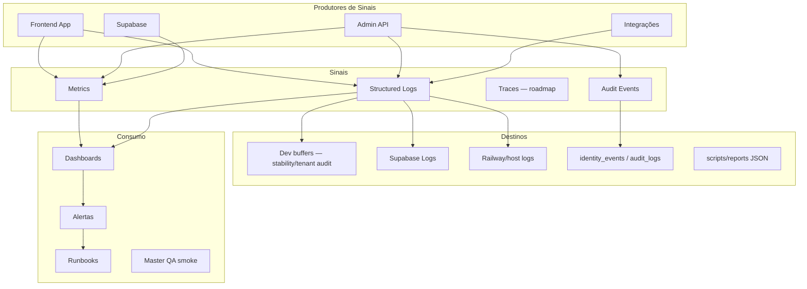

# Love Odonto V2 — Master Observability (Constituição Oficial de Observabilidade)

**Documento:** `docs/platform/LOVE_ODONTO_V2_MASTER_OBSERVABILITY.md`  
**Versão:** 1.0.0  
**Data:** 2026-06-29  
**Status:** Oficial — referência normativa para logs, métricas, traces, alertas e operação do Love Odonto V2.  
**Complemento de:** [`LOVE_ODONTO_V2_MASTER_ARCHITECTURE.md`](../constitution/LOVE_ODONTO_V2_MASTER_ARCHITECTURE.md) · [`LOVE_ODONTO_V2_MASTER_QA.md`](../constitution/LOVE_ODONTO_V2_MASTER_QA.md) · [`LOVE_ODONTO_V2_MASTER_API.md`](./LOVE_ODONTO_V2_MASTER_API.md) · [`LOVE_ODONTO_V2_MASTER_SECURITY.md`](./LOVE_ODONTO_V2_MASTER_SECURITY.md) · [`LOVE_ODONTO_V2_MASTER_INTEGRATION.md`](./LOVE_ODONTO_V2_MASTER_INTEGRATION.md) · [`LOVE_ODONTO_V2_MASTER_DEVELOPMENT_GUIDE.md`](./LOVE_ODONTO_V2_MASTER_DEVELOPMENT_GUIDE.md)

**Regra de ouro:** nenhum componente novo é aprovado sem produzir sinais conforme este documento. Em conflito com implementação legada, **este documento prevalece** até revisão formal da arquitetura.

**Escopo:** filosofia, padrões, matrizes, KPIs, SLOs, runbooks e roadmap. **Não** contém código executável.

**Legenda:** ✅ implementado · 🔄 parcial · ⏳ roadmap

---

## Índice

1. [Filosofia de Observabilidade](#1-filosofia-de-observabilidade) · 2. [Objetivos](#2-objetivos) · 3. [Princípios](#3-princípios) · 4. [Arquitetura](#4-arquitetura-de-observabilidade) · 5–10. [Logging / Structured / Correlation / Request / Trace / Distributed Tracing](#5-logging) · 11–13. [Métricas / KPIs](#11-métricas) · 14–16. [Health / Readiness / Liveness](#14-health-checks) · 17–19. [Dashboards / Alertas / Monitoramento](#17-dashboards) · 20–22. [SLA / SLO / Error Budget](#20-sla) · 23–26. [Performance / Latência / Throughput / HTTP](#23-performance) · 27–34. [Por superfície](#27-banco-de-dados) · 35–39. [Auditoria / Incidentes / RCA / Pós-incidente / Runbooks](#35-auditoria) · 40. [Roadmap](#40-roadmap)

**Apêndices:** [Matrizes](#apêndice-a--matrizes) · [Padrões](#apêndice-b--padrões-oficiais) · [Checklists](#apêndice-c--checklists) · [Regras proibidas](#apêndice-d--regras-proibidas) · [Roadmap detalhado](#apêndice-e--roadmap-detalhado)

---

## 1. Filosofia de Observabilidade

Observabilidade no Love Odonto V2 responde **por que** o sistema falhou para um tenant específico — não apenas **se** falhou.

| Premissa | Significado |
|----------|-------------|
| **Tenant-aware** | Todo sinal operacional carrega `tenant_id` quando aplicável |
| **Three pillars** | Logs + métricas + traces (traces em roadmap) |
| **Security-first logging** | Observabilidade ≠ dump de PII |
| **Actionable alerts** | Alerta sem runbook e owner é ruído |
| **Progressive maturity** | Fase 1 logging → Fase 5 full observability |
| **Dev/prod parity** | Mesmos event names; sinks diferentes |

---

## 2. Objetivos

| Objetivo | Indicador |
|----------|-----------|
| **Detectar regressões auth/tenant** | MTTD < 15 min staging |
| **Diagnosticar falhas multi-camada** | Correlation ID end-to-end |
| **Proteger SLOs** | Error budget visível |
| **Auditar operações críticas** | 100% RBAC/identity com trail |
| **Operação SaaS** | Dashboard platform + tenant health |
| **Post-mortem data** | Logs estruturados retidos 90d+ |

---

## 3. Princípios

| ID | Princípio |
|----|-----------|
| **OBS-P01** | Logs estruturados JSON — não string concatenada |
| **OBS-P02** | `tenant_id` em todo log de domínio clínico |
| **OBS-P03** | Correlation/request ID propagado Frontend → API → Supabase ops |
| **OBS-P04** | Erros nunca silenciosos — log + métrica + user feedback |
| **OBS-P05** | Métricas RED (Rate, Errors, Duration) por serviço |
| **OBS-P06** | Health checks sem dados sensíveis |
| **OBS-P07** | Retenção proporcional criticidade |
| **OBS-P08** | DEV: `console.debug` guardado; PROD: sink centralizado |
| **OBS-P09** | Auditoria ≠ debug log — destinos separados |
| **OBS-P10** | Nova API/integração inclui checklist observabilidade |

---

## 4. Arquitetura de Observabilidade



### Superfícies instrumentadas

| Superfície | Logs | Métricas | Traces | Audit |
|------------|------|----------|--------|-------|
| Frontend | ✅ stability | ⏳ | ⏳ | 🔄 tenant audit buffer |
| Admin API | 🔄 console.error | ⏳ | ⏳ | ✅ identity |
| Supabase | Dashboard | Dashboard | ⏳ | RLS |
| Integrações | ⏳ | ⏳ | ⏳ | ⏳ webhook_logs |

---

## 5. Logging

### 5.1 Tipos de log

| Tipo | Propósito | Destino |
|------|-----------|---------|
| **Application** | Debug operacional | Host / dev buffer |
| **Stability** | Auth, tenant, backend | `stabilityLogService` ✅ |
| **Tenant audit** | Fluxo tenant/auth timing | `tenantAuditLog` ✅ |
| **Security audit** | RBAC, identity, admin | `identity_events` ✅ |
| **Business audit** | Prontuário, contratos | DB tables ⏳ |
| **Integration** | Provider calls | ⏳ |

### 5.2 Implementação atual (referência)

**Stability events** (`src/services/stabilityLogService.js`):

`AUTH_OK`, `AUTH_FAILED`, `TENANT_CONTEXT_OK`, `TENANT_CONTEXT_FAILED`, `SUPABASE_CONFIG_OK`, `SUPABASE_CONFIG_FAILED`, `BACKEND_OK`, `BACKEND_FAILED`, `ROUTE_ERROR`

**Tenant audit tags** (`src/services/tenantAuditLog.js`):

`TENANT_BOOTSTRAP`, `TENANT_VALIDATION`, `TENANT_CONTEXT`, `TENANT_GUARD`, `TENANT_AUTH`, `TENANT_API`

---

## 6. Structured Logging

### 6.1 Formato canônico (alvo V2)

```json
{
  "timestamp": "2026-06-29T12:00:00.000Z",
  "level": "info",
  "service": "admin-api",
  "event": "TENANT_CONTEXT_FETCH",
  "correlation_id": "uuid",
  "request_id": "uuid",
  "tenant_id": "uuid",
  "user_id": "uuid",
  "duration_ms": 142,
  "status": "ok",
  "http_status": 200,
  "message": "Human readable summary",
  "meta": { }
}
```

### 6.2 Regras

- Campos flat preferidos a nested profundo
- `message` curto; detalhes em `meta`
- Arrays limitados — não logar payloads grandes
- UTF-8 JSON lines (NDJSON) em produção

---

## 7. Correlation ID

| Aspecto | Norma |
|---------|-------|
| **Geração** | UUID v4 no primeiro hop (browser ou API gateway) |
| **Propagação** | Header `X-Correlation-Id` |
| **Escopo** | Uma jornada usuário (login → action → API) |
| **Storage client** | sessionStorage `love_odonto_correlation_id` ⏳ |
| **Logs** | Campo obrigatório em toda cadeia |

**OBS-CORR-001:** Eventos sem `correlation_id` em fluxos multi-hop → não deployável (Fase 2+).

---

## 8. Request ID

| Aspecto | Norma |
|---------|-------|
| **Geração** | Por request HTTP — UUID |
| **Header** | `X-Request-Id` |
| **Response** | Echo in `meta.requestId` (Master API envelope) |
| **Unicidade** | Um request = um ID |

Diferença: **Request ID** = uma chamada HTTP; **Correlation ID** = jornada completa (N requests).

---

## 9. Trace ID

| Aspecto | Norma |
|---------|-------|
| **Padrão** | OpenTelemetry `trace_id` 32 hex |
| **Estado** | ⏳ Fase 4 |
| **Interim** | `correlation_id` como trace surrogate |

---

## 10. Distributed Tracing

| Fase | Stack |
|------|-------|
| **Atual** | Manual correlation via headers ⏳ |
| **Fase 4** | OpenTelemetry SDK — browser + Node |
| **Export** | OTLP → Grafana Tempo / Honeycomb |

Spans mínimos: `http.client`, `http.server`, `supabase.query`, `integration.call`

---

## 11. Métricas

### 11.1 Taxonomia

| Tipo | Exemplos |
|------|----------|
| **Counter** | `http_requests_total`, `auth_failures_total` |
| **Gauge** | `active_sessions`, `queue_depth` |
| **Histogram** | `http_request_duration_ms`, `tenant_context_duration_ms` |

### 11.2 Labels obrigatórios

`service`, `environment`, `tenant_id` (quando cardinality controlada — usar sampling ou agregação para high-cardinality)

### 11.3 Naming

Prefixo `love_odonto_` — snake_case — unidades no sufixo (`_seconds`, `_total`, `_bytes`)

---

## 12. KPIs Técnicos

| KPI | Definição | Alvo inicial |
|-----|-----------|--------------|
| **API availability** | % uptime `/health` | 99.5% |
| **Tenant-context p95** | Latência snapshot | < 2s |
| **Auth success rate** | AUTH_OK / (AUTH_OK+FAILED) | > 99% |
| **Error rate 5xx** | 5xx / total API | < 0.5% |
| **Supabase query p95** | PostgREST | < 500ms |
| **Frontend stability events** | TENANT_CONTEXT_FAILED rate | < 1% sessions |
| **Migration success** | Staging apply sem rollback | 100% |
| **Backup success** | Pre-apply jobs | 100% |

---

## 13. KPIs Funcionais

| KPI | Definição | Owner |
|-----|-----------|-------|
| **Login success** | Usuário entra em < 30s | Produto |
| **Agenda load** | Tela agenda interativa < 3s | Módulo agenda |
| **RBAC sync** | Permissão reflete em < 5 min | Platform |
| **Convite delivery** | Email enviado < 2 min | Platform |
| **Assinatura sync** | Webhook → status < 5 min | Contratos |
| **WhatsApp delivery** | ⏳ provider SLA | Comercial |

---

## 14. Health Checks

| Endpoint | Tipo | Superfície |
|----------|------|------------|
| `GET /health` | Liveness | Admin API ✅ |
| `GET /internal/app/identity-health` | Domain | Identities ✅ |
| `POST /internal/app/identity-health/evaluate` | Deep | Identities ✅ |
| `/stability/health` | Diagnostic UI | Frontend ✅ |
| `npm run smoke` | Stack | CI/local ✅ |
| `npm run check:admin-api` | API probe | CI ✅ |
| Supabase Dashboard | Infra | Platform ✅ |

---

## 15. Readiness Checks

Readiness = pronto para receber tráfego (dependências OK).

| Check | Pass criteria | Estado |
|-------|---------------|--------|
| Supabase reachable | Query simples | ⏳ `/ready` |
| Service role valid | Auth admin ping | ⏳ |
| Email provider | Config present | 🔄 env check |
| Migrations applied | Version match | ⏳ |
| Env alignment | preflight-local | ✅ |

**Alvo:** `GET /ready` retorna 200 só se dependências críticas OK.

---

## 16. Liveness Checks

Liveness = processo vivo (restart se fail).

| Check | Endpoint |
|-------|----------|
| Admin API alive | `GET /health` ✅ |
| Vite dev server | HTTP 200 `/` |
| Console | HTTP 200 `/login` |

**Regra:** liveness **não** chama Supabase (evita cascade kill).

---

## 17. Dashboards

### 17.1 Dashboards mínimos (roadmap)

| Dashboard | Audiência | Painéis |
|-----------|-----------|---------|
| **Platform Overview** | Ops SaaS | API RED, auth rate, tenants active |
| **Tenant Health** | Suporte | tenant-context failures by tenant |
| **Security** | Security | 401/403 spike, identity events |
| **Integrations** | Eng | webhook success, DLQ depth |
| **Database** | DBA | connections, slow queries, RLS |
| **Frontend Stability** | Eng | stability events aggregate |

### 17.2 Estado atual

- Supabase Dashboard ✅
- Railway logs ✅
- `/stability/health` dev UI ✅
- Grafana unified ⏳

---

## 18. Alertas

Ver [Apêndice A.3 — Matriz de Alertas](#a3-matriz-de-alertas).

**Regras:**

- Todo alerta tem **owner** e **runbook link**
- Severidade define canal (Slack vs PagerDuty)
- Alertas flapping → ajustar threshold

---

## 19. Monitoramento

| Camada | Ferramenta | Frequência |
|--------|------------|------------|
| Uptime API | External probe ⏳ | 1 min |
| Supabase | Dashboard + advisors | Contínuo |
| Logs | Host + Supabase | Contínuo |
| Smoke | `npm run smoke` | Pre-deploy |
| QA checklist | Master QA | Release |
| Identity audit script | `npm run audit:identity-api` | Manual |

---

## 20. SLA

| Serviço | SLA alvo | Janela |
|---------|----------|--------|
| App clínica disponível | 99.5% | Mensal |
| Admin API | 99.5% | Mensal |
| Auth login | 99.9% | Mensal |
| Email transacional | 99% | Mensal |
| Supabase (managed) | Conforme plano Supabase | — |

**Exclusões:** manutenção comunicada, force majeure, cliente offline.

---

## 21. SLO

| SLO | Target | Measurement window |
|-----|--------|-------------------|
| API success rate | 99.5% | 30d rolling |
| tenant-context p95 | < 2s | 7d |
| Error budget 5xx | 0.5% | 30d |
| Auth availability | 99.9% | 30d |
| Webhook ack | 99% < 5s | 7d |

---

## 22. Error Budget

| SLO | Budget 30d | Ação se esgotado |
|-----|------------|------------------|
| API 99.5% | ~3.6h downtime | Freeze features; focus reliability |
| Auth 99.9% | ~43 min | Priority incident |

**Processo:** error budget review quinzenal em staging/prod.

---

## 23. Performance

| Área | Budget |
|------|--------|
| First Contentful Paint | < 2s prod |
| Tenant context blocking | < 15s timeout max |
| IDB load worker | < 5s p95 |
| API handler | < 500ms p95 (excl. external) |

---

## 24. Latência

| Operação | p50 alvo | p95 alvo | Timeout |
|----------|----------|----------|---------|
| `GET /health` | 10ms | 50ms | 1s |
| `GET tenant-context` | 500ms | 2s | 15s |
| Supabase SELECT simple | 50ms | 300ms | 30s |
| Storage upload logo | 1s | 5s | 30s |
| Identity provision | 2s | 8s | 30s |

---

## 25. Throughput

| Recurso | Limite conhecido |
|---------|------------------|
| Supabase connection pool | Plano Supabase |
| Admin API | Single instance Railway — scale horizontal ⏳ |
| PostgREST | Rate limit Supabase |
| Frontend IDB | Single browser — worker offload ✅ |

---

## 26. Erros HTTP

### 26.1 Classificação

| Classe | Ação observabilidade |
|--------|---------------------|
| **4xx client** | Log info; métrica `http_4xx_total` label route |
| **401/403** | Log security; alert if spike |
| **404 tenant** | Stability TENANT_CONTEXT_FAILED |
| **409 conflict** | Log business; no page |
| **422 validation** | Log warn + code |
| **5xx server** | Log error; alert; request_id mandatory |
| **502/503/504** | BACKEND_FAILED stability event |

### 26.2 Mapeamento frontend

`AUTH_FAILED` ≠ `TENANT_CONTEXT_FAILED` ≠ `BACKEND_FAILED` — nunca agregar (STABILITY_CHECKLIST).

---

## 27. Banco de Dados

| Sinal | Fonte |
|-------|-------|
| Slow queries | Supabase Query Performance |
| Connections | Supabase Dashboard |
| RLS violations | Zero rows unexpected — app metrics ⏳ |
| Migration version | CLI / MCP |
| Advisors security | `get_advisors` pós-migration |
| Table bloat | ⏳ periodic job |

**Queries sanity pós-migration:** órfãos, cross-tenant counts — Master QA.

---

## 28. Supabase

| Componente | Monitorar |
|------------|-----------|
| Auth | Failed logins, MFA ⏳ |
| PostgREST | 5xx, latency |
| Realtime | Connections ⏳ |
| Storage | Egress, errors |
| Edge Functions | ⏳ invocations |
| Logs | Log drain ⏳ |

**Project refs:** staging `tckdjyunwmdpqmewrwvt` · prod `uoepkwhqztmsjnzirpev`

---

## 29. Admin API

| Sinal | Implementação |
|-------|---------------|
| Liveness | `GET /health` ✅ |
| Version | `version` field in health ✅ |
| Identity health | `/internal/app/identity-health` ✅ |
| Error logs | `console.error` — migrate structured ⏳ |
| Request timing | ⏳ middleware |
| Identity audit | `[IDENTITY_AUDIT]` ✅ |

**Métricas alvo:** `admin_api_request_duration_ms`, `admin_api_errors_total{status}`

---

## 30. Frontend

| Sinal | Implementação |
|-------|---------------|
| Stability buffer | `window.__LOVE_ODONTO_STABILITY_LOGS__` ✅ |
| Tenant audit buffer | `window.__TENANT_AUDIT_LOGS__` ✅ |
| Route errors | `ROUTE_ERROR` ✅ |
| Env guard | `SUPABASE_CONFIG_FAILED` ✅ |
| Error boundary | `ErrorBoundary` component |
| `/stability/health` | Diagnostic page ✅ |

**Produção:** export stability to remote sink ⏳ — hoje dev-focused.

---

## 31. IndexedDB

| Sinal | Norma |
|-------|-------|
| Load duration | Worker timing ⏳ |
| Quota exceeded | Log + user toast |
| DB_VERSION migration | Log version bump |
| Tenant guard block | TENANT_GUARD stability |
| Corruption | Fail loud + recovery runbook |

---

## 32. Storage

| Métrica | Alerta |
|---------|--------|
| Upload fail rate | > 5% |
| Upload duration p95 | > 10s |
| 413 payload | Track — logo too large |
| Egress | Budget monthly |

---

## 33. IA

| Sinal | Norma |
|-------|-------|
| Request latency | p95 < 60s |
| Token usage | Per tenant quota |
| Error rate | Provider 5xx |
| **Não logar** | Prompt content prod |

Eventos: `AI_CONVERSATION_STARTED`, `AI_CONVERSATION_FINISHED` — Master Integration §13.

---

## 34. Integrações

| Integração | Logs | Métricas | Alertas |
|------------|------|----------|---------|
| Email | send result | delivery rate | fail > 5% |
| Signature webhook | event, externalId | ack latency | 401 spike |
| WhatsApp | ⏳ | ⏳ | ⏳ |
| N8N | ⏳ | ⏳ | ⏳ |
| Payment gateway | ⏳ | ⏳ | ⏳ |

Ver Master Integration §21–22.

---

## 35. Auditoria

Observabilidade de **negócio/compliance** — separada de debug logs.

| Fonte | Escopo |
|-------|--------|
| `identity_events` | Auth, RBAC, identity ✅ |
| `audit_logs` | Platform console ✅ |
| `contract_audit_logs` | Contratos ✅ |
| `tenantAuditLog` | Tenant flow dev buffer ✅ |
| `scripts/reports/*.json` | Migrations/backfill ✅ |
| clinical_audit | ⏳ |

**Retenção audit:** 12–24 meses mínimo — Master Security.

---

## 36. Incidentes

| Severidade | Exemplo | MTTA | MTTR |
|------------|---------|------|------|
| SEV-1 | Cross-tenant leak | 15 min | 4h |
| SEV-2 | Auth down | 30 min | 8h |
| SEV-3 | tenant-context degraded | 2h | 24h |
| SEV-4 | Single tenant config | 4h | 72h |

Ver Master Security §47 e [Apêndice A.5](#a5-matriz-de-incidentes).

---

## 37. Root Cause Analysis

### 37.1 Metodologia

1. Timeline com correlation IDs
2. Five Whys
3. Classificar: code / config / infra / third-party
4. Identificar detection gap
5. Action items com owner

### 37.2 Evidências obrigatórias

- Stability logs export
- API host logs (request_id)
- Supabase logs window
- identity_events query
- Deploy/migration correlation

---

## 38. Pós-incidente

| Entregável | Prazo |
|------------|-------|
| Post-mortem doc | 5 dias úteis SEV-1/2 |
| Action items | Tracked in backlog |
| Runbook update | Antes de close |
| QA regression case | Se aplicável |
| LGPD notification | 72h se dados pessoais |

Template: blameless — foco sistema.

---

## 39. Runbooks

| Runbook | Trigger | Link |
|---------|---------|------|
| Auth failure spike | AUTH_FAILED rate | ⏳ `docs/playbooks/` |
| Tenant context down | TENANT_CONTEXT_FAILED | STABILITY_CHECKLIST ✅ |
| Admin API down | /health fail | LOCAL_DEV ✅ |
| Supabase unreachable | 503 API | ⏳ |
| Migration rollback | Apply fail | Constitution §25 |
| Secret rotation | Leak suspected | Master Security ⏳ |
| Identity repair | identity-health fail | identity routes ✅ |

**Regra:** todo alerta Apêndice A.3 linka runbook.

---

## 40. Roadmap

Ver [Apêndice E](#apêndice-e--roadmap-detalhado).

---

## Apêndice A — Matrizes

### A.1 Matriz de Logs

| Evento / Tag | Nível | Service | tenant_id | correlation_id | Retenção | PII |
|--------------|-------|---------|-----------|----------------|----------|-----|
| AUTH_OK | info | frontend | opcional | ⏳ | 30d dev | ❌ |
| AUTH_FAILED | warn | frontend | opcional | ⏳ | 90d | ❌ |
| TENANT_CONTEXT_OK | info | frontend | ✅ | ⏳ | 30d | ❌ |
| TENANT_CONTEXT_FAILED | error | frontend | ✅ | ⏳ | 90d | ❌ |
| BACKEND_FAILED | error | frontend | ✅ | ⏳ | 90d | ❌ |
| TENANT_API | debug | frontend | ✅ | ⏳ | 7d dev | ❌ |
| TENANT_GUARD | warn | frontend | ✅ | ⏳ | 90d | ❌ |
| identity_events | audit | api/db | ✅ | ⏳ | 24m | ❌ |
| [IDENTITY_AUDIT] | info | api | ✅ | ⏳ | 90d | ❌ |
| console.error 5xx | error | api | ✅ | ⏳ | 90d | ❌ |
| webhook signature | info | api | ✅ | ⏳ | 90d | ❌ |
| migration report | audit | scripts | ✅ | N/A | permanente | ❌ |

### A.2 Matriz de Métricas

| Métrica | Tipo | Labels | SLO related |
|---------|------|--------|-------------|
| `love_odonto_http_requests_total` | counter | service, route, status | ✅ |
| `love_odonto_http_duration_ms` | histogram | service, route | ✅ |
| `love_odonto_auth_success_total` | counter | — | ✅ |
| `love_odonto_tenant_context_duration_ms` | histogram | — | ✅ |
| `love_odonto_tenant_context_failures_total` | counter | reason | ✅ |
| `love_odonto_supabase_query_duration_ms` | histogram | table | ⏳ |
| `love_odonto_webhook_received_total` | counter | event | ⏳ |
| `love_odonto_integration_errors_total` | counter | provider | ⏳ |
| `love_odonto_idb_load_duration_ms` | histogram | — | ⏳ |

### A.3 Matriz de Alertas

| Alerta | Condição | Sev | Owner | Runbook |
|--------|----------|-----|-------|---------|
| API down | /health fail 3x | SEV-2 | Ops | LOCAL_DEV |
| 5xx rate high | > 1% 5min | SEV-2 | Eng | ⏳ |
| Auth fail spike | > 50/min | SEV-3 | Eng | STABILITY |
| Tenant context fail | > 10% sessions | SEV-3 | Eng | STABILITY |
| Cross-tenant signal | any | SEV-1 | Security | ⏳ |
| Supabase advisor critical | any | SEV-2 | DBA | migration |
| Webhook 401 burst | > 20/h | SEV-3 | Eng | Integration |
| Error budget burn | 50% in 7d | SEV-3 | Eng | ⏳ |
| Backup fail | job fail | SEV-2 | Ops | backup |
| DLQ depth | > 100 | SEV-3 | Eng | Integration |

### A.4 Matriz de KPIs

| KPI | Tipo | Meta | Fonte |
|-----|------|------|-------|
| Availability | Técnico | 99.5% | Uptime probe |
| tenant-context p95 | Técnico | 2s | Metrics |
| Login success | Funcional | 99% | Auth metrics |
| RBAC sync time | Funcional | 5 min | Audit |
| Smoke pass rate | Processo | 100% | CI |
| Migration zero orphan | Processo | 100% | QA SQL |
| Mean time to detect | Processo | < 15m | Incidents |

### A.5 Matriz de Incidentes

| SEV | Impacto | Exemplo | Comunicação | Evidência |
|-----|---------|---------|-------------|-----------|
| 1 | Multi-tenant / dados | Cross-tenant leak | Tenants + ANPD | Logs+queries |
| 2 | Plataforma down | Auth/API | Status page | Health+metrics |
| 3 | Degraded | tenant-context lento | Internal | Stability |
| 4 | Isolated | Um tenant config | Tenant admin | Audit |

### A.6 Matriz de Severidade (logs)

| Nível | Uso | Exemplo |
|-------|-----|---------|
| **debug** | Dev only | TENANT_API timing |
| **info** | Normal ops | AUTH_OK, health |
| **warn** | Degraded | TENANT_GUARD, 4xx business |
| **error** | Failure | 5xx, TENANT_CONTEXT_FAILED |
| **fatal** | Process crash | Uncaught exception |

---

## Apêndice B — Padrões oficiais

### B.1 Campos obrigatórios (log estruturado)

| Campo | Obrigatório quando |
|-------|-------------------|
| `timestamp` | Sempre |
| `level` | Sempre |
| `service` | Sempre |
| `event` | Sempre |
| `message` | Sempre |
| `tenant_id` | Domínio clínico |
| `user_id` | Ação autenticada |
| `correlation_id` | Multi-hop (Fase 2+) |
| `request_id` | HTTP server |
| `duration_ms` | Operações timed |
| `status` | ok / error |
| `error_code` | Se error |

### B.2 Retenção

| Classe | Dev | Staging | Prod |
|--------|-----|---------|------|
| Debug | 7d | 7d | ❌ |
| Application | 30d | 30d | 90d |
| Security | 90d | 90d | 12m |
| Audit | N/A | 12m | 24m |
| Reports JSON | N/A | permanente | permanente |

### B.3 Correlação

```
Browser session → correlation_id
  └─ Request 1 → request_id_a → tenant-context
  └─ Request 2 → request_id_b → clinic-profile
```

### B.4 Dashboards mínimos

Ver §17.1 — 6 dashboards roadmap.

### B.5 Métricas obrigatórias por módulo

| Módulo | Métricas mínimas |
|--------|------------------|
| **Auth** | success/fail, duration |
| **Tenant** | context ok/fail, duration |
| **Admin API** | RED por route |
| **RH** | provision success/fail |
| **Agenda** | load duration ⏳ |
| **Financeiro** | payment webhook ⏳ |
| **CRM** | lead convert ⏳ |
| **Integrações** | provider errors, latency |

---

## Apêndice C — Checklists

### C.1 Nova API / endpoint

- [ ] Structured log success/error
- [ ] `request_id` in response meta
- [ ] Métricas RED ⏳
- [ ] 4xx/5xx classified
- [ ] Auditoria se sensível
- [ ] Runbook if critical
- [ ] Master API documented

### C.2 Novo módulo

- [ ] Stability events defined
- [ ] tenant_id in logs
- [ ] Error states UI + log
- [ ] KPIs funcionais listed
- [ ] QA smoke cases
- [ ] Dashboard panel ⏳

### C.3 Nova integração

- [ ] Provider metrics
- [ ] Timeout + retry logged
- [ ] webhook_logs ⏳
- [ ] DLQ alert
- [ ] Master Integration updated

### C.4 Nova migration

- [ ] Pre/post query metrics
- [ ] Report JSON archived
- [ ] Advisors check
- [ ] Rollback timing documented

### C.5 Novo serviço (frontend)

- [ ] Errors propagated — não swallow
- [ ] tenantId param logged
- [ ] Duration for slow ops

### C.6 Novo componente

- [ ] Error boundary se route-level
- [ ] Loading/error UI estados
- [ ] Sem console.log desprotegido

---

## Apêndice D — Regras proibidas

| # | Proibição |
|---|-----------|
| ❌ 1 | Logs contendo dados sensíveis (CPF, prontuário, tokens, senhas) |
| ❌ 2 | Logs de domínio clínico sem `tenant_id` |
| ❌ 3 | Erros silenciosos (empty catch) |
| ❌ 4 | Falhas sem rastreabilidade (sem event/log) |
| ❌ 5 | APIs sem métricas (Fase 2+) |
| ❌ 6 | Integrações sem monitoramento |
| ❌ 7 | Alertas sem responsável definido |
| ❌ 8 | Dashboards sem definição de audiência/painéis |
| ❌ 9 | Eventos multi-hop sem `correlation_id` (Fase 2+) |
| ❌ 10 | Logs em formato não estruturado em prod |
| ❌ 11 | `console.log` desprotegido em produção |
| ❌ 12 | Agregar AUTH_FAILED com TENANT_CONTEXT_FAILED |
| ❌ 13 | Health check que expõe secrets |
| ❌ 14 | Alertas sem runbook |
| ❌ 15 | Métricas high-cardinality sem sampling (tenant_id raw em counter global) |

---

## Apêndice E — Roadmap detalhado

| Fase | Nome | Entregas |
|------|------|----------|
| **1** | **Logging** | Structured JSON server; correlation_id; expand stability prod sink; identity audit complete |
| **2** | **Métricas** | Prometheus/OpenMetrics Admin API; RED dashboards; SLO tracking; alert rules |
| **3** | **Dashboards** | Grafana unified; Platform + Tenant Health; error budget panel |
| **4** | **Tracing** | OpenTelemetry browser+Node; trace_id; span supabase/integration |
| **5** | **Observabilidade completa** | SIEM; anomaly detection; full runbooks; SOC2 evidence; synthetic monitoring |

### Fase 1 — estado atual

- [x] stabilityLogService
- [x] tenantAuditLog
- [x] GET /health
- [x] identity-health endpoints
- [x] /stability/health UI
- [x] npm run smoke
- [x] identity_events DB
- [ ] Structured server logs
- [ ] correlation_id propagation
- [ ] Prod log drain

---

## Controle de revisão

| Versão | Data | Alteração |
|--------|------|-----------|
| 1.0.0 | 2026-06-29 | Versão inicial — Master Observability V2 |

---

## Critérios de aceite (este documento)

| Critério | Status |
|----------|--------|
| Arquitetura observabilidade | ✅ §4 |
| Padrões de logs | ✅ §5–10, Apêndice B |
| Padrões de métricas | ✅ §11–12, A.2 |
| Padrões monitoramento | ✅ §19 |
| KPIs documentados | ✅ §12–13, A.4 |
| Dashboards documentados | ✅ §17 |
| Alertas documentados | ✅ §18, A.3 |
| Roadmap definido | ✅ §40, Apêndice E |
| Checklists criados | ✅ Apêndice C |
| Regras proibidas | ✅ Apêndice D |

### Referências

- [`STABILITY_CHECKLIST.md`](../playbooks/STABILITY_CHECKLIST.md)
- [`LOVE_ODONTO_V2_MASTER_SECURITY.md`](./LOVE_ODONTO_V2_MASTER_SECURITY.md) §23, §47
- [`LOVE_ODONTO_V2_MASTER_INTEGRATION.md`](./LOVE_ODONTO_V2_MASTER_INTEGRATION.md) §21–22
- [`LOVE_ODONTO_V2_MASTER_QA.md`](../constitution/LOVE_ODONTO_V2_MASTER_QA.md) §10 smoke

---

*Love Odonto V2 — Este documento é a Constituição Oficial de Observabilidade. Alterações exigem revisão explícita e bump de versão nesta seção.*
