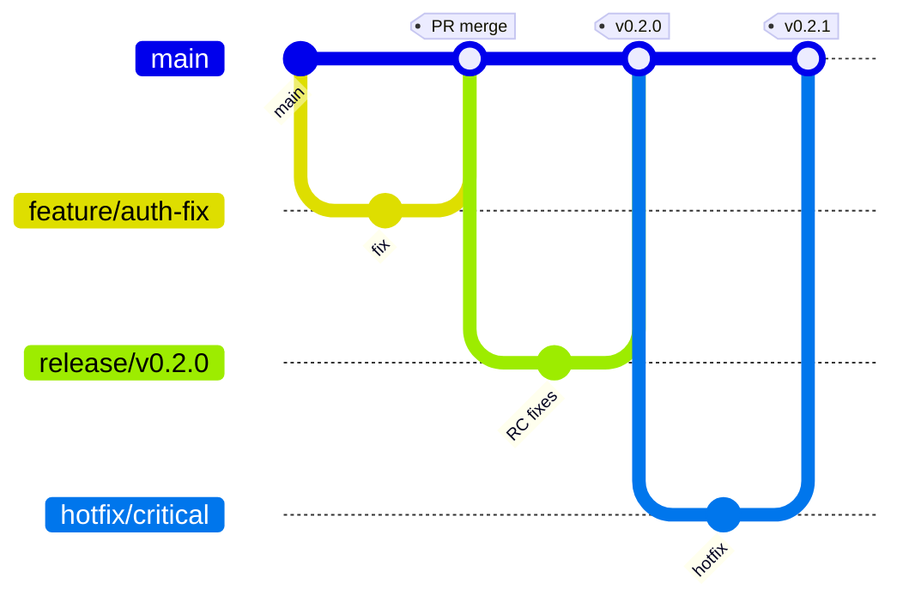

# Love Odonto V2 — Master Release Management (Constituição Oficial)

**Documento:** `docs/platform/LOVE_ODONTO_V2_MASTER_RELEASE_MANAGEMENT.md`  
**Versão:** 1.0.0  
**Data:** 2026-06-29  
**Status:** Oficial — referência normativa para versionamento, deploy, rollback e governança de releases do Love Odonto V2.  
**Complemento de:** [`LOVE_ODONTO_V2_MASTER_ARCHITECTURE.md`](../constitution/LOVE_ODONTO_V2_MASTER_ARCHITECTURE.md) · [`LOVE_ODONTO_V2_MASTER_QA.md`](../constitution/LOVE_ODONTO_V2_MASTER_QA.md) · [`LOVE_ODONTO_V2_MASTER_API.md`](./LOVE_ODONTO_V2_MASTER_API.md) · [`LOVE_ODONTO_V2_MASTER_SECURITY.md`](./LOVE_ODONTO_V2_MASTER_SECURITY.md) · [`LOVE_ODONTO_V2_MASTER_INTEGRATION.md`](./LOVE_ODONTO_V2_MASTER_INTEGRATION.md) · [`LOVE_ODONTO_V2_MASTER_OBSERVABILITY.md`](./LOVE_ODONTO_V2_MASTER_OBSERVABILITY.md) · [`LOVE_ODONTO_V2_MASTER_DEVELOPMENT_GUIDE.md`](./LOVE_ODONTO_V2_MASTER_DEVELOPMENT_GUIDE.md)

**Regra de ouro:** nenhuma alteração chega em **produção** fora deste processo. Em conflito com prática ad hoc, **este documento prevalece** até revisão formal.

**Escopo:** processos, gates, matrizes e checklists de release. **Não** contém código executável.

**Legenda:** ✅ implementado · 🔄 parcial · ⏳ roadmap

---

## Índice

1. [Filosofia de Release Management](#1-filosofia-de-release-management) · 2. [Objetivos](#2-objetivos) · 3. [Princípios](#3-princípios) · 4–8. [Versionamento / Branches / Git Flow / Naming](#4-estratégia-de-versionamento) · 9–11. [PR / Review / Merge](#9-pull-requests) · 12–16. [CI/CD / Build / Testes / QA / Homologação](#12-pipelines-cicd) · 17. [Release Candidate](#17-release-candidate) · 18–20. [Deploy Dev / Staging / Produção](#18-deploy-dev) · 21–23. [Smoke / Health / Go-No-Go](#21-smoke-test) · 24–27. [Rollback / Hotfix / Flags / Freeze](#24-rollback) · 28–32. [Janela / Aprovações / Notes / Comunicação / Auditoria](#28-janela-de-deploy) · 33–35. [Métricas / DORA / Risco](#33-métricas-de-release) · 36–38. [Checklists / Aceite](#36-checklist-pré-deploy) · 39–40. [Roadmap / Governança](#39-roadmap)

**Apêndices:** [Matrizes](#apêndice-a--matrizes) · [Checklists](#apêndice-b--checklists) · [Regras proibidas](#apêndice-c--regras-proibidas) · [Roadmap detalhado](#apêndice-d--roadmap-detalhado)

---

## 1. Filosofia de Release Management

Releases no Love Odonto V2 tratam **dados clínicos e multi-tenant** — erro de deploy não é bug visual, é risco operacional e LGPD.

| Premissa | Significado |
|----------|-------------|
| **Staging é lei** | Produção nunca recebe o que staging não validou |
| **Evidência, não confiança** | Checklist assinado + relatórios JSON |
| **Reversibilidade** | Todo deploy structural tem rollback testado |
| **Cadência previsível** | Releases planejadas; hotfix é exceção documentada |
| **Separação de camadas** | Frontend, API, migrations e backfill podem ter ciclos distintos |
| **Fail closed** | Gate falhou → no-go automático |

---

## 2. Objetivos

| Objetivo | Indicador |
|----------|-----------|
| **Zero deploy não autorizado** | 100% releases com Go/No-Go |
| **Detectar regressão cedo** | Smoke + QA staging antes prod |
| **MTTR baixo** | Rollback < 30 min (app/API) |
| **Rastreabilidade** | Release notes + git tag + migration log |
| **Conformidade** | Gate produção Constitution §25 |
| **Melhoria contínua** | Métricas DORA trimestrais |

---

## 3. Princípios

| ID | Princípio |
|----|-----------|
| **REL-P01** | Staging before production — sempre |
| **REL-P02** | Nenhum merge sem review + testes verdes |
| **REL-P03** | Migrations/backfill: dry-run → apply staging → gate prod |
| **REL-P04** | Backup pré-apply obrigatório (dados prod) |
| **REL-P05** | Smoke + health pós-deploy obrigatórios |
| **REL-P06** | Release notes para toda release user-facing |
| **REL-P07** | Hotfix branch curta; backport documentado |
| **REL-P08** | Feature flags para rollout gradual (roadmap) |
| **REL-P09** | Janela de manutenção para mudanças structural prod |
| **REL-P10** | Auditoria: quem aprovou, quando, qual versão |

---

## 4. Estratégia de Versionamento

| Artefato | Esquema | Exemplo |
|----------|---------|---------|
| **App (npm)** | SemVer | `0.1.0` → `1.0.0` GA |
| **Admin API** | SemVer + health `version` field | `2026-06-26-identity-unified` ✅ |
| **Migrations SQL** | Sequencial `NNN_*` | `019_*` |
| **IndexedDB** | `DB_VERSION` integer | bump em schema IDB |
| **Docs Masters** | Header version | `1.0.0` |
| **Release tag Git** | `v{major}.{minor}.{patch}` | `v0.2.0` |

---

## 5. Semantic Versioning

| Bump | Quando |
|------|--------|
| **MAJOR** | Breaking API, cutover SSOT módulo, RBAC breaking |
| **MINOR** | Feature compatível, migration aditiva |
| **PATCH** | Bugfix, docs, ajuste config |

**Pré-1.0.0:** MINOR pode conter breaking — comunicar em release notes.

---

## 6. Estratégia de Branches

| Branch | Propósito | Deploy alvo |
|--------|-----------|-------------|
| `main` | Produção estável | Produção (após gate) |
| `staging` | Homologação integrada | Staging ⏳ branch dedicada |
| `release/vX.Y.Z` | RC estabilização | Staging |
| `feature/*` | Desenvolvimento | Local / preview |
| `fix/*` | Bugfix normal | Via PR → main/staging |
| `hotfix/*` | Correção urgente prod | Prod após fast-track |

**Estado atual:** fluxo via PR → `main` 🔄 — branch `staging` dedicada ⏳.

---

## 7. Git Flow oficial



### Regras

1. Features nascem de `main` (ou `staging` quando existir)
2. Release branch congela escopo — só bugfixes
3. Hotfix de `main` — merge back to release branch if open
4. Tags anotadas em todo deploy prod

---

## 8. Naming Convention

| Item | Padrão |
|------|--------|
| Branch feature | `feature/{ticket}-{descricao-curta}` |
| Branch fix | `fix/{ticket}-{descricao}` |
| Branch hotfix | `hotfix/{ticket}-{descricao}` |
| Branch release | `release/v{major}.{minor}.{patch}` |
| Git tag | `v{major}.{minor}.{patch}` |
| RC tag | `v{major}.{minor}.{patch}-rc.{n}` |
| Migration | `NNN_descricao_snake.sql` |
| Backfill report | `{script}-{dryrun\|backup}-{ISO}.json` |

---

## 9. Pull Requests

### Template mínimo

```markdown
## Release impact
- [ ] App frontend  [ ] Admin API  [ ] Console  [ ] Migration  [ ] Backfill

## Checklists
- [ ] Master Architecture §33
- [ ] Master QA gates G1–G5
- [ ] Master Security (se sensível)
- [ ] Rollback plan (se migration/backfill)

## Evidências
- npm test / smoke output
- Staging validation (se aplicável)
```

Ver [`LOVE_ODONTO_V2_MASTER_DEVELOPMENT_GUIDE.md`](./LOVE_ODONTO_V2_MASTER_DEVELOPMENT_GUIDE.md) §22.

---

## 10. Code Review

| Mudança | Revisores mínimos |
|---------|-------------------|
| Feature normal | 1 |
| Auth / RBAC / RLS | 2 |
| Migration structural | 2 + DBA sign-off |
| Backfill prod | 2 + ops sign-off |
| Hotfix prod | 1 senior + post-merge review |

Checklist revisor: Development Guide §23.

---

## 11. Critérios de Merge

| Critério | Bloqueante |
|----------|------------|
| `npm test` verde | ✅ |
| `npm run lint` sem erros novos críticos | ✅ |
| Review aprovada | ✅ |
| Sem secrets no diff | ✅ |
| Checklist feature §29 Dev Guide | ✅ |
| QA staging (se user-facing) | ✅ release |
| Migration tested staging | ✅ se SQL |

**Merge proibido** se gate G1–G5 QA falhar (release).

---

## 12. Pipelines CI/CD

| Estágio | Comando / ação | Estado |
|---------|----------------|--------|
| Preflight | `npm run env:check` | ✅ manual |
| Lint | `npm run lint` | 🔄 |
| Type-check | `npm run type-check` | ✅ |
| Unit tests | `npm test` | ✅ |
| Build | `npm run build` | ✅ |
| Smoke | `npm run smoke` | ✅ local |
| Deploy preview | Vercel PR preview | ⏳ |
| Deploy staging | Auto on `staging` branch | ⏳ |
| Deploy prod | Manual approved | 🔄 |

**REL-CI-001:** Pipeline prod exige aprovação manual + Go/No-Go até Fase 3.

---

## 13. Build

| Superfície | Comando | Output | Host |
|------------|---------|--------|------|
| App | `npm run build` | `dist/` | Vercel |
| Console | `npm run console:build` | `console/dist/` | Vercel ⏳ |
| Admin API | `cd server && npm start` | Node | Railway |

**Pré-build release:** `npm run build` + `npm run preview` local — DEPLOY.md §4.

**Env build-time:** `VITE_*` baked — validar antes deploy; rebuild obrigatório se env change.

---

## 14. Testes Automatizados

| Tipo | Comando | Gate |
|------|---------|------|
| Unit | `npm test` | Merge + release |
| Type-check | `npm run type-check` | Release |
| Smoke | `npm run smoke` | Pre-deploy |
| Admin API | `npm run check:admin-api` | Staging |
| Identity audit | `npm run audit:identity-api` | Prod release sensível |

Ver Master QA §2–3.

---

## 15. QA

Fluxo oficial: [`LOVE_ODONTO_V2_MASTER_QA.md`](../constitution/LOVE_ODONTO_V2_MASTER_QA.md) §4.

### Gates G1–G10 (resumo)

| ID | Etapa |
|----|-------|
| G1 | Preflight env |
| G2 | `npm test` |
| G3 | `npm run smoke` |
| G4 | `npm run type-check` |
| G5 | `npm run build` |
| G6 | Migration dry-run staging |
| G7 | Apply staging + SQL validation |
| G8 | Checklist funcional staging |
| G9 | Homologação UAT |
| G10 | Pós-deploy prod |

---

## 16. Homologação

| Aspecto | Norma |
|---------|-------|
| Ambiente | Staging Supabase `tckdjyunwmdpqmewrwvt` |
| Tenant teste | Implanprime staging `7aba7127-409c-4ea4-8dbc-807efc5e189c` |
| Duração | Mínimo 24h soak para releases major |
| UAT | Product owner sign-off |
| Casos | Master QA §6–7 — críticos 100% |
| Evidência | Screenshots + checklist assinado |

**Proibido** homologar em produção.

---

## 17. Release Candidate

| Artefato RC | Descrição |
|-------------|-----------|
| Tag | `vX.Y.Z-rc.N` |
| Branch | `release/vX.Y.Z` |
| Escopo congelado | Só P0/P1 fixes |
| Duração | 2–5 dias típico |
| Saída | Tag `vX.Y.Z` + deploy staging final → prod |

**RC checklist:** Apêndice B.1.

---

## 18. Deploy Dev

| Alvo | Método |
|------|--------|
| Local | `npm run dev` / `npm run dev:all` |
| Supabase | Staging credentials only |
| Migrations | Local/staging project |
| Dados | Seed / anonimizado |

**Proibido** dev local apontando prod writes.

---

## 19. Deploy Staging

| Componente | Processo |
|------------|----------|
| **Frontend** | Vercel preview ou env staging ⏳ |
| **Admin API** | Railway staging service ⏳ |
| **Migrations** | Supabase MCP/CLI → `tckdjyunwmdpqmewrwvt` |
| **Backfill** | `--dry-run` → `--apply` + reports JSON |
| **Validação** | G6–G8 QA + SQL sanity |

**Ordem deploy staging:** migrations → backfill → API → frontend (ou API+frontend paralelo se compatível).

---

## 20. Deploy Produção

### 20.1 Gate obrigatório (Constitution §25)

1. Dry-run aprovado (`apply_gate.ok = true`)
2. Backup `pre-apply-full-backup-*.json`
3. Relatório dry-run arquivado
4. Rollback testado em staging
5. Janela de manutenção comunicada
6. Go/No-Go meeting
7. G1–G10 QA evidenciado

### 20.2 Ambiente

| Componente | Ref / host |
|------------|------------|
| Supabase | `uoepkwhqztmsjnzirpev` |
| App | Vercel → loveodonto.com.br |
| Admin API | Railway public URL |
| Console | Vercel ⏳ |

### 20.3 Ordem produção (structural)

1. Comunicar janela
2. Backup full
3. Apply migration (se houver)
4. Apply backfill (se houver) + validation SQL
5. Deploy Admin API
6. Deploy frontend (+ Console)
7. Smoke prod
8. Pós-deploy checklist G10
9. Monitoramento 24h heightened

**REL-PROD-001:** Deploy direto prod sem staging → **proibido**.

---

## 21. Smoke Test

| Escopo | Comando / ação |
|--------|----------------|
| Local pre-deploy | `npm run smoke` ✅ |
| Admin API | `npm run check:admin-api` ✅ |
| Prod pós-deploy | Master QA §10 — S1–S9 |
| Auth | Login staging/prod test user |
| Tenant | tenant-context OK |
| Health | `GET /health` 200 |

Eventos stability: `AUTH_OK`, `TENANT_CONTEXT_OK`, `BACKEND_OK`.

---

## 22. Health Check

| Check | Endpoint | Quando |
|-------|----------|--------|
| Liveness API | `GET /health` | Pós-deploy API |
| Identity | `/internal/app/identity-health` | Release auth |
| Frontend | `/stability/health` | Dev/staging |
| Supabase | Dashboard | Migration deploy |
| Uptime probe | External ⏳ | Contínuo prod |

Ver Master Observability §14–16.

---

## 23. Go / No-Go

### Participantes

| Papel | Voto |
|-------|------|
| Tech Lead | Obrigatório |
| QA / Release manager | Obrigatório |
| Product Owner | Obrigatório (user-facing) |
| Ops / DBA | Obrigatório (migration) |
| Security | Se escopo sensível |

### Critérios Go

- [ ] Todos gates G1–G9 verdes
- [ ] Rollback plano documentado
- [ ] Release notes draft
- [ ] Comunicação agendada
- [ ] On-call definido 24h

### No-Go automático

- Smoke fail
- Caso crítico QA fail
- Backup fail
- `apply_gate.ok = false`
- Error budget esgotado (Observability §22)

---

## 24. Rollback

### 24.1 Tipos

| Tipo | Método | RTO alvo |
|------|--------|----------|
| **App/API** | Redeploy tag anterior Vercel/Railway | 15 min |
| **Migration additive** | Forward fix migration | 1h |
| **Migration destructive** | Restore PITR Supabase | 2–4h |
| **Backfill** | Restore JSON backup + script rollback | 2h |
| **Feature flag** | Disable flag | 5 min ⏳ |

### 24.2 Processo

1. Declarar incident SEV
2. Comunicar stakeholders
3. Executar rollback runbook
4. Smoke pós-rollback
5. Post-mortem 5 dias

Ver Apêndice A.5 e Master Security §45.

**REL-RB-001:** Rollback sem procedimento documentado → proibido em prod.

---

## 25. Hotfix

| Aspecto | Norma |
|---------|-------|
| Branch | `hotfix/{ticket}-desc` from `main` |
| Escopo | Mínimo — só correção |
| QA | Smoke + caso regressão afetado |
| Review | 1 senior — fast track |
| Version | PATCH bump |
| Merge | `main` + tag imediato |
| Backport | `release/*` branch if open |
| Documentação | Hotfix notes + post-mortem se SEV-1/2 |

**Hotfix checklist:** Apêndice B.2.

---

## 26. Feature Flags

| Fonte | Uso |
|-------|-----|
| `tenant.flags` / modules | Produto tenant-scoped |
| `RequireFeatureFlag` | Route guard |
| `import.meta.env` | Build-time only — não runtime prod toggle |
| Platform console | ⏳ global flags |

**Rollout:** staging → % tenants → GA — Master Development Guide §16.

---

## 27. Release Freeze

| Tipo | Período | Escopo |
|------|---------|--------|
| **Code freeze** | 48h antes prod major | Features only — fixes OK |
| **Holiday freeze** | Comunicado | All non-critical |
| **Incident freeze** | Durante SEV-1 | All prod deploys |

Exceção: hotfix com Go/No-Go emergency.

---

## 28. Janela de Deploy

| Ambiente | Janela preferida (BRT) |
|----------|------------------------|
| Staging | Seg–Qui 09:00–18:00 |
| Produção app/API | Ter/Qui 22:00–02:00 |
| Produção migration | Sáb 08:00–14:00 |
| Hotfix | Anytime com aprovação |

**Comunicação:** tenants afetados 48h antes (structural).

---

## 29. Aprovações

Ver [Apêndice A.4 — Matriz de Aprovações](#a4-matriz-de-aprovações).

---

## 30. Release Notes

### Estrutura obrigatória

```markdown
# Love Odonto vX.Y.Z — YYYY-MM-DD

## Resumo
[1–3 frases]

## Novidades
- …

## Correções
- …

## Breaking changes
- … (se houver)

## Migrations / Ops
- Migration NNN aplicada — rollback: …

## QA
- Casos críticos: N/N pass

## Known issues
- …
```

**Público:** changelog tenant-facing + internal ops appendix.

---

## 31. Comunicação

| Audiência | Canal | Quando |
|-----------|-------|--------|
| Equipe eng | Slack/internal | RC start |
| Tenants | Email/in-app ⏳ | 48h antes maintenance |
| Status | Status page ⏳ | During incident |
| ANPD | Legal | Se breach LGPD |

---

## 32. Auditoria

| Evento | Registro |
|--------|----------|
| Go/No-Go decision | Ticket + attendees |
| Deploy prod | Tag, timestamp, executor |
| Migration apply | `scripts/reports/*.json` |
| Rollback | Incident ticket + timeline |
| Hotfix | Release notes + PR link |

Retenção: 24 meses mínimo.

---

## 33. Métricas de Release

| Métrica | Definição |
|---------|-----------|
| Release frequency | Deploys prod / mês |
| Lead time | Commit → prod |
| Change failure rate | % deploys com rollback/hotfix |
| MTTR | Tempo rollback |
| Gate pass rate | % PRs pass G1–G5 first try |
| Staging soak time | Horas RC em staging |

---

## 34. Indicadores DORA

| Métrica DORA | Alvo Love Odonto (12m) |
|--------------|------------------------|
| **Deployment frequency** | Semanal → diário (Fase 3) |
| **Lead time for changes** | < 1 semana |
| **Change failure rate** | < 15% |
| **Time to restore** | < 1 hora (app/API) |

Review trimestral com plano de melhoria.

---

## 35. Gestão de Risco

Ver [Apêndice A.6 — Matriz de Riscos](#a6-matriz-de-riscos).

**Classificação release:**

| Nível | Exemplos | Gate extra |
|-------|----------|------------|
| **L1 Low** | UI copy, CSS | G1–G5 |
| **L2 Medium** | Feature IDB | + staging QA |
| **L3 High** | Auth, RBAC, API | + 2 reviewers |
| **L4 Critical** | Migration, backfill prod | + backup + janela + DBA |

---

## 36. Checklist Pré-Deploy

Ver Apêndice B.6 — consolidado:

- [ ] G1–G5 QA gates
- [ ] Release notes draft
- [ ] Rollback plan
- [ ] Env vars verified (Vercel + Railway)
- [ ] Supabase project ref confirmed
- [ ] Backup (if structural)
- [ ] Go/No-Go scheduled
- [ ] On-call assigned

---

## 37. Checklist Pós-Deploy

- [ ] Smoke prod S1–S9
- [ ] `GET /health` 200
- [ ] Login test prod (smoke user)
- [ ] tenant-context OK
- [ ] No 5xx spike 30 min
- [ ] Migration validation SQL (if applicable)
- [ ] Release notes published
- [ ] Tag git pushed
- [ ] G10 QA checklist
- [ ] 24h monitoring watch

---

## 38. Critérios de Aceite (release)

Release **aceita** quando:

- [ ] Versão taggeada
- [ ] Release notes publicadas
- [ ] G1–G10 evidenciado
- [ ] Smoke prod pass
- [ ] Nenhum SEV-1/2 aberto relacionado
- [ ] Auditoria registrada
- [ ] Rollback validated (L3/L4)

---

## 39. Roadmap

Ver [Apêndice D](#apêndice-d--roadmap-detalhado).

---

## 40. Governança

| Papel | Responsabilidade |
|-------|------------------|
| **Release Manager** | Coordena RC, Go/No-Go, checklists |
| **Tech Lead** | Aprova arquitetura e rollback |
| **QA Lead** | Evidência Master QA |
| **Product Owner** | UAT e comunicação tenant |
| **Ops / DBA** | Migrations, backup, Supabase |
| **Security** | Review L3/L4 sensível |

**Cadência:** release planning quinzenal; retrospectiva pós-release major.

**Conflitos:** este documento + Master QA prevalecem sobre prática informal.

**Revisão documento:** bump version header; ADR para mudanças processo major.

---

## Apêndice A — Matrizes

### A.1 Matriz de Ambientes

| Ambiente | Supabase ref | App host | API host | Dados | Writes prod-like |
|----------|--------------|----------|----------|-------|------------------|
| **Local** | Staging creds | `:5176` | `:3001` | Seed/dev | ❌ |
| **Staging** | `tckdjyunwmdpqmewrwvt` | Vercel preview ⏳ | Railway staging ⏳ | Anon Implanprime | ✅ |
| **Produção** | `uoepkwhqztmsjnzirpev` | loveodonto.com.br | Railway prod | Clínicas reais | ✅ gate |

### A.2 Matriz de Branches

| Branch | Merge target | Deploy | Delete after |
|--------|--------------|--------|--------------|
| `feature/*` | `main` / `release/*` | Local | Merge |
| `fix/*` | `main` | Staging | Merge |
| `release/v*` | `main` | Staging → Prod | After tag |
| `hotfix/*` | `main` | Prod fast | After tag |
| `main` | — | Prod | Permanent |

### A.3 Matriz de Releases

| Tipo | Version bump | Staging min | RC | Janela prod |
|------|--------------|-------------|-----|-------------|
| **Standard** | MINOR/PATCH | 24h | Opcional PATCH | Ter/Qui night |
| **Major** | MAJOR | 72h | Obrigatório | Sáb |
| **Hotfix** | PATCH | Smoke | Não | Emergency |
| **Ops only** | N/A | SQL validate | Não | Sáb |
| **Docs only** | N/A | N/A | Não | Anytime |

### A.4 Matriz de Aprovações

| Ação | Tech Lead | QA | PO | Ops/DBA | Security |
|------|-----------|-----|-----|---------|----------|
| Merge feature L1 | — | — | — | — | — |
| Merge L3 | ✅ | — | — | — | — |
| Deploy staging | ✅ | ✅ | — | — | — |
| Deploy prod app | ✅ | ✅ | ✅ | — | — |
| Migration prod | ✅ | ✅ | ✅ | ✅ | — |
| Backfill prod | ✅ | ✅ | ✅ | ✅ | ✅ |
| Hotfix prod | ✅ | ✅ | — | — | se sensível |
| Go/No-Go | ✅ | ✅ | ✅ | se ops | se L4 |

### A.5 Matriz de Rollbacks

| Cenário | Trigger | Método | Owner | RTO |
|---------|---------|--------|-------|-----|
| Bad deploy app | 5xx spike | Vercel rollback | Ops | 15m |
| Bad deploy API | health fail | Railway rollback | Ops | 15m |
| Bad migration | data corrupt | PITR / forward fix | DBA | 4h |
| Bad backfill | orphan rows | JSON restore | Ops | 2h |
| Feature regression | SEV-3 | Flag off ⏳ | Eng | 5m |

### A.6 Matriz de Riscos

| Risco | Prob. | Impacto | Mitigação |
|-------|-------|---------|-----------|
| Skip staging | M | Crítico | REL-PROD-001 proibido |
| Migration sem backup | B | Crítico | Gate §25 |
| Env mismatch VITE/API | M | Alto | preflight + smoke |
| Rollback untested | M | Alto | Staging drill |
| Friday deploy | M | Médio | Janela policy |
| Hotfix scope creep | M | Médio | Hotfix checklist |

---

## Apêndice B — Checklists

### B.1 Nova Release (RC → Prod)

- [ ] Scope frozen; release branch created
- [ ] `npm test` + smoke + build green
- [ ] Staging deploy complete
- [ ] QA G8 casos críticos 100%
- [ ] UAT sign-off G9
- [ ] Release notes draft
- [ ] Rollback tested (L3/L4)
- [ ] Go/No-Go realizado
- [ ] Tag `vX.Y.Z` created
- [ ] Prod deploy + pós-deploy B.6
- [ ] Retrospective scheduled

### B.2 Hotfix

- [ ] Branch `hotfix/*` from main
- [ ] Minimal diff
- [ ] Regression test added
- [ ] Smoke pass
- [ ] Senior review
- [ ] PATCH version bump
- [ ] Deploy prod
- [ ] Tag + hotfix notes
- [ ] Backport if needed

### B.3 Rollback

- [ ] SEV declared
- [ ] Stakeholders notified
- [ ] Rollback method selected (A.5)
- [ ] Execute runbook
- [ ] Smoke post-rollback
- [ ] Root cause timeline started
- [ ] Post-mortem scheduled

### B.4 Feature Flag rollout

- [ ] Flag defined tenant-scoped
- [ ] Staging enabled first
- [ ] Monitor metrics 24h
- [ ] Gradual % rollout ⏳
- [ ] GA remove flag code deadline set

### B.5 Migração (staging → prod)

- [ ] SQL reviewed 2 reviewers
- [ ] Staging apply + advisors clean
- [ ] Dry-run prod + `apply_gate.ok`
- [ ] Backup `pre-apply-full-backup-*.json`
- [ ] Rollback script tested staging
- [ ] Janela comunicada
- [ ] Apply prod + validation queries
- [ ] Report archived

### B.6 Produção (deploy dia)

- [ ] Apêndice B.1 ou hotfix complete
- [ ] Env vars double-checked
- [ ] Go/No-Go GO
- [ ] Deploy ordem §20.3
- [ ] Smoke §21
- [ ] Health §22
- [ ] Pós-deploy §37
- [ ] Audit §32

### B.7 Homologação

- [ ] Staging environment current
- [ ] Test users creds valid
- [ ] Master QA §6 módulo checklist
- [ ] Críticos 100%
- [ ] UAT PO sign-off
- [ ] Known issues documented
- [ ] Go recommendation to release manager

---

## Apêndice C — Regras proibidas

| # | Proibição |
|---|-----------|
| ❌ 1 | Deploy direto em produção sem staging validation |
| ❌ 2 | Merge sem QA (G1–G5 mínimo) |
| ❌ 3 | Merge sem code review |
| ❌ 4 | Rollback sem procedimento documentado |
| ❌ 5 | Release sem versionamento/tag |
| ❌ 6 | Hotfix sem documentação (notes/PR) |
| ❌ 7 | Deploy structural sem backup |
| ❌ 8 | Deploy sem smoke test |
| ❌ 9 | Deploy sem health check |
| ❌ 10 | Alteração prod fora janela aprovada (L3/L4) |
| ❌ 11 | Alteração sem release notes (user-facing) |
| ❌ 12 | Alteração sem plano de rollback (L3/L4) |
| ❌ 13 | Migration prod sem apply staging |
| ❌ 14 | Backfill prod sem dry-run |
| ❌ 15 | Go/No-Go sem participantes obrigatórios |
| ❌ 16 | Deploy sexta-feira L3/L4 (exceto hotfix) |
| ❌ 17 | Testes de escrita em tenant produção real |

---

## Apêndice D — Roadmap detalhado

| Fase | Nome | Entregas |
|------|------|----------|
| **1** | **Git Flow** | Branch policy; PR template; tags; release notes template; este documento |
| **2** | **CI/CD** | GitHub Actions: test+lint+build; smoke CI; branch protection |
| **3** | **Deploy Automatizado** | Staging auto-deploy; prod manual gate; Vercel+Railway pipelines |
| **4** | **Feature Flags** | Platform flag service; gradual rollout; freeze bypass |
| **5** | **Release Management Enterprise** | DORA dashboard; automated rollback; blue-green; SOC2 change control |

### Fase 1 — estado atual

- [x] Manual QA deploy flow
- [x] npm test / smoke / build scripts
- [x] Staging Supabase operational
- [x] Gate produção Constitution documented
- [x] DEPLOY.md operational guide
- [ ] Branch `staging` dedicated
- [ ] GitHub branch protection
- [ ] Release notes template in repo ⏳

---

## Controle de revisão

| Versão | Data | Alteração |
|--------|------|-----------|
| 1.0.0 | 2026-06-29 | Versão inicial — Master Release Management V2 |

---

## Critérios de aceite (este documento)

| Critério | Status |
|----------|--------|
| Processo oficial releases | ✅ §17, B.1 |
| Processo deploy | ✅ §18–20 |
| Processo rollback | ✅ §24, A.5, B.3 |
| Processo hotfix | ✅ §25, B.2 |
| Processo QA | ✅ §15, Master QA ref |
| Processo homologação | ✅ §16, B.7 |
| Versionamento | ✅ §4–5 |
| Branches | ✅ §6–8, A.2 |
| Checklists | ✅ §36–37, Apêndice B |
| Roadmap | ✅ §39, Apêndice D |
| Regras proibidas | ✅ Apêndice C |

### Referências

- [`LOVE_ODONTO_V2_MASTER_QA.md`](../constitution/LOVE_ODONTO_V2_MASTER_QA.md) §4, §10–12
- [`LOVE_ODONTO_V2_MASTER_ARCHITECTURE.md`](../constitution/LOVE_ODONTO_V2_MASTER_ARCHITECTURE.md) §25
- [`LOVE_ODONTO_V2_MASTER_OBSERVABILITY.md`](./LOVE_ODONTO_V2_MASTER_OBSERVABILITY.md) §14, §36
- [`STABILITY_CHECKLIST.md`](../playbooks/STABILITY_CHECKLIST.md)
- [`DEPLOY.md`](../../DEPLOY.md)

---

*Love Odonto V2 — Este documento é a Constituição Oficial de Release Management. Alterações exigem revisão explícita e bump de versão nesta seção.*
