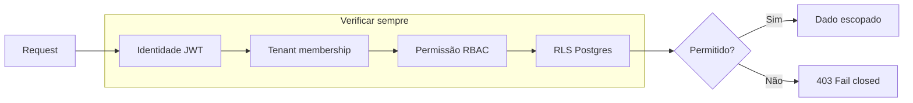

# Love Odonto V2 — Master Security (Constituição Oficial de Segurança)

**Documento:** `docs/platform/LOVE_ODONTO_V2_MASTER_SECURITY.md`  
**Versão:** 1.0.0  
**Data:** 2026-06-29  
**Status:** Oficial — referência normativa para todas as decisões de segurança do Love Odonto V2.  
**Complemento de:** [`LOVE_ODONTO_V2_MASTER_ARCHITECTURE.md`](../constitution/LOVE_ODONTO_V2_MASTER_ARCHITECTURE.md) · [`LOVE_ODONTO_V2_MASTER_BUSINESS_RULES.md`](../constitution/LOVE_ODONTO_V2_MASTER_BUSINESS_RULES.md) · [`LOVE_ODONTO_V2_MASTER_DATABASE.md`](../constitution/LOVE_ODONTO_V2_MASTER_DATABASE.md) · [`LOVE_ODONTO_V2_MASTER_QA.md`](../constitution/LOVE_ODONTO_V2_MASTER_QA.md) · [`LOVE_ODONTO_V2_MASTER_API.md`](./LOVE_ODONTO_V2_MASTER_API.md) · [`LOVE_ODONTO_V2_MASTER_DEVELOPMENT_GUIDE.md`](./LOVE_ODONTO_V2_MASTER_DEVELOPMENT_GUIDE.md)

**Regra de ouro:** nenhum código, migration, integração ou deploy é aprovado se violar este documento. Em conflito com implementação legada, **este documento prevalece** até revisão formal da arquitetura.

**Escopo:** políticas, controles, matrizes e checklists de segurança. **Não** contém código executável nem alterações de implementação.

---

## Índice

1. [Filosofia de Segurança](#1-filosofia-de-segurança)
2. [Objetivos de Segurança](#2-objetivos-de-segurança)
3. [Princípios obrigatórios](#3-princípios-obrigatórios)
4. [Modelo Zero Trust](#4-modelo-zero-trust)
5. [Segurança Multi-Tenant](#5-segurança-multi-tenant)
6. [Segurança do Supabase](#6-segurança-do-supabase)
7. [Segurança da Admin API](#7-segurança-da-admin-api)
8. [Segurança do Storage](#8-segurança-do-storage)
9. [Segurança do IndexedDB](#9-segurança-do-indexeddb)
10. [Segurança das Sessões](#10-segurança-das-sessões)
11. [Autenticação](#11-autenticação)
12. [Autorização](#12-autorização)
13. [RBAC](#13-rbac)
14. [Claims JWT](#14-claims-jwt)
15. [Refresh Tokens](#15-refresh-tokens)
16. [MFA (roadmap)](#16-mfa-roadmap)
17. [Gestão de Segredos](#17-gestão-de-segredos)
18. [Service Role](#18-service-role)
19. [Criptografia](#19-criptografia)
20. [Dados sensíveis](#20-dados-sensíveis)
21. [LGPD](#21-lgpd)
22. [Auditoria](#22-auditoria)
23. [Logs de Segurança](#23-logs-de-segurança)
24. [Monitoramento](#24-monitoramento)
25. [Alertas](#25-alertas)
26. [Rate Limiting](#26-rate-limiting)
27. [Proteção contra abuso](#27-proteção-contra-abuso)
28. [Proteção contra enumeração](#28-proteção-contra-enumeração)
29. [Proteção contra brute force](#29-proteção-contra-brute-force)
30. [Proteção contra CSRF](#30-proteção-contra-csrf)
31. [Proteção contra XSS](#31-proteção-contra-xss)
32. [Proteção contra SQL Injection](#32-proteção-contra-sql-injection)
33. [Proteção contra SSRF](#33-proteção-contra-ssrf)
34. [Proteção contra IDOR](#34-proteção-contra-idor)
35. [Segurança do Upload](#35-segurança-do-upload)
36. [Segurança de Arquivos](#36-segurança-de-arquivos)
37. [Segurança de Assets](#37-segurança-de-assets)
38. [Segurança das Integrações](#38-segurança-das-integrações)
39. [Segurança dos Webhooks](#39-segurança-dos-webhooks)
40. [Segurança da IA](#40-segurança-da-ia)
41. [Segurança Offline](#41-segurança-offline)
42. [Segurança do Cache](#42-segurança-do-cache)
43. [Segurança dos Logs](#43-segurança-dos-logs)
44. [Backup](#44-backup)
45. [Restore](#45-restore)
46. [Disaster Recovery](#46-disaster-recovery)
47. [Plano de Incidentes](#47-plano-de-incidentes)
48. [Plano de Vulnerabilidades](#48-plano-de-vulnerabilidades)
49. [Plano de Atualizações](#49-plano-de-atualizações)
50. [Checklist obrigatório de segurança](#50-checklist-obrigatório-de-segurança)

**Apêndices:** [Matrizes](#apêndice-a--matrizes) · [Classificação de dados](#apêndice-b--classificação-de-dados) · [Políticas oficiais](#apêndice-c--políticas-oficiais) · [Checklists por artefato](#apêndice-d--checklists-por-artefato) · [Regras proibidas](#apêndice-e--regras-proibidas) · [Roadmap](#apêndice-f--roadmap-de-segurança)

---

## 1. Filosofia de Segurança

A segurança do Love Odonto V2 não é um módulo isolado — é **propriedade transversal** de produto, engenharia e operações.

| Premissa | Significado |
|----------|-------------|
| **Dados de saúde são críticos** | Prontuário, imagens e financeiro exigem controles equivalentes a sistemas regulados |
| **Multi-tenant é risco sistêmico** | Um vazamento cross-tenant compromete toda a plataforma |
| **Defesa em profundidade** | Nenhuma camada única (UI, RLS ou API) substitui as demais |
| **Fail closed** | Dúvida sobre identidade, tenant ou permissão → negar |
| **Evidência auditável** | Operações sensíveis deixam trilha verificável |
| **Segurança by design** | Controles definidos antes da implementação, não como remendo |

---

## 2. Objetivos de Segurança

| Objetivo | Métrica de sucesso |
|----------|-------------------|
| **Confidencialidade** | Zero incidentes cross-tenant confirmados |
| **Integridade** | Writes canônicos via API/RLS; sem corrupção silenciosa |
| **Disponibilidade** | RTO/RPO documentados (§46); backups testados |
| **Autenticidade** | Identidade verificada em toda rota sensível |
| **Não repúdio** | Auditoria em acessos, RBAC, contratos e prontuário |
| **Conformidade LGPD** | Direitos do titular atendíveis com evidência |
| **Resiliência** | Plano de incidentes exercitado em staging |

---

## 3. Princípios obrigatórios

| ID | Princípio |
|----|-----------|
| **SEC-P01** | Menor privilégio — acesso mínimo necessário por role e ambiente |
| **SEC-P02** | Separação de duties — provisionamento ≠ auditoria ≠ billing |
| **SEC-P03** | Tenant-first — todo dato operacional escopado por `tenant_id` UUID |
| **SEC-P04** | SSOT seguro — Supabase + Admin API; browser nunca service role |
| **SEC-P05** | Secrets fora do código — env vars / secret manager do host |
| **SEC-P06** | RLS obrigatório — toda tabela `public` exposta |
| **SEC-P07** | Autorização em `app_metadata` — nunca `user_metadata` para RBAC |
| **SEC-P08** | Staging before prod — migrations e backfills validados antes |
| **SEC-P09** | Minimização de logs — sem PII/tokens em produção |
| **SEC-P10** | Revisão de segurança em mudanças críticas (auth, RLS, RBAC, LGPD) |

---

## 4. Modelo Zero Trust



### Regras Zero Trust

| Camada | Verificação |
|--------|-------------|
| **Edge** | HTTPS obrigatório em prod |
| **Admin API** | `requireAppUser` / `requireConsoleAccess` |
| **Postgres** | RLS + helpers SECURITY DEFINER |
| **Storage** | Policy por bucket + path `{tenant_id}/…` |
| **Frontend** | Guards UI — **não** substituem server |

**SEC-ZT-001:** Nunca confiar em origem de rede (localhost, VPN, IP interno) como substituto de autenticação.

---

## 5. Segurança Multi-Tenant

### 5.1 Isolamento

| Controle | Implementação |
|----------|---------------|
| PK/FK | `tenant_id NOT NULL` + FK → `tenants` |
| RLS | Policies por tenant em todas tabelas de domínio |
| API | Membership validada server-side — body não define tenant |
| IDB | `TENANT_GUARDED_COLLECTIONS` — write bloqueado sem tenant |
| Storage | Path prefix `{tenant_id}/` |

### 5.2 Resolução de tenant

| Fonte válida | Fonte inválida |
|--------------|----------------|
| `GET /internal/app/tenant-context` | Primeira clínica do IDB |
| JWT + `tenant_users` membership | Slug `tenant-1` |
| Parâmetro validado server-side | Heurística client-side |

### 5.3 Proibições

- Cross-tenant read/write por design ou bug
- Fallback silencioso quando tenant-context falha (exceto read-only documentado e controlado)
- Query sem filtro tenant em domínio migrado

Referência: Constituição §6, Master API §9.

---

## 6. Segurança do Supabase

### 6.1 Postgres

| Controle | Norma |
|----------|-------|
| RLS | `ENABLE ROW LEVEL SECURITY` em toda tabela exposta |
| Helpers | `app_user_is_tenant_admin`, `app_user_admin_tenant_id` — SECURITY DEFINER |
| Recursão | Proibido subquery direta em `tenant_users` dentro de policy de `tenant_users` |
| Advisors | `get_advisors` sem critical pendente pós-migration |
| Service role | Apenas Admin API / scripts ops — nunca browser |

### 6.2 Auth

| Controle | Norma |
|----------|-------|
| Provider | Supabase Auth (email/password SaaS) |
| PKCE | Flow platform client (`flowType: 'pkce'`) |
| Redirect URLs | Whitelist explícita no projeto Supabase |
| Convites | Links one-time; processados em `firstAccessSession.js` |
| Metadata sensível | `app_metadata` only para RBAC |

### 6.3 Realtime (quando habilitado)

- Subscriptions apenas em dados já autorizados por RLS
- Nunca canal global cross-tenant

### 6.4 Ambientes

| Ambiente | Project ref |
|----------|-------------|
| Staging | `tckdjyunwmdpqmewrwvt` |
| Produção | `uoepkwhqztmsjnzirpev` |

**SEC-SB-001:** Dev local usa credentials staging — nunca service role de produção em máquina de desenvolvedor sem autorização.

---

## 7. Segurança da Admin API

**Entry:** `server/index.js` · porta **3001** (dev)

### 7.1 Autenticação de rotas

| Prefixo | Middleware | Credencial |
|---------|------------|------------|
| `/internal/app/*` | `requireAppUser` | Bearer JWT Supabase |
| `/internal/platform/*` | `requireConsoleAccess` | `X-Platform-Key` e/ou JWT console |
| `/public/platform/*` | Conforme rota | Rate limit futuro |
| `/api/signature/webhook` | Secret header | `SIGNATURE_WEBHOOK_SECRET` |
| `/health` | Nenhum | Liveness only — sem dados |

### 7.2 Validações obrigatórias

1. Token válido via `supabase.auth.getUser(accessToken)`
2. `tenant_id` da membership vs recurso (rotas mutáveis)
3. Role admin/master para operações de acesso
4. Resposta de erro sem stack trace em produção
5. Auditoria em provisionamento, RBAC, identities

### 7.3 CORS

- Prod: whitelist explícita (`ADMIN_API_CORS_ORIGINS`)
- **Proibido** `*` em produção real
- Dev: proxy Vite `/internal/app` → `:3001`

### 7.4 Secrets server

Ver §17 — `SUPABASE_SERVICE_ROLE_KEY`, `PLATFORM_API_KEY`, `SIGNATURE_WEBHOOK_SECRET`, `EMAIL_API_KEY`.

---

## 8. Segurança do Storage

### 8.1 Buckets oficiais

| Bucket | Leitura | Escrita | Path |
|--------|---------|---------|------|
| `clinic-logos` | Pública (logo) | Admin tenant RLS | `{tenant_id}/{file}` |
| `clinical-guides` | Autenticada tenant | Profissional/admin | `{tenant_id}/{guide_id}/{file}` |

### 8.2 Buckets roadmap

`collaborator-photos`, `patient-files`, `clinical-imaging`, `contract-pdfs`, `signature-evidence` — cada um exige migration com policy RLS antes de uso.

### 8.3 Controles

| ID | Regra |
|----|-------|
| **SEC-STG-001** | Validar MIME e tamanho antes de persistir URL |
| **SEC-STG-002** | Proibido base64 persistente em coluna Postgres |
| **SEC-STG-003** | URLs HTTPS only — sem `http://` em prod |
| **SEC-STG-004** | Signed URLs para buckets privados |
| **SEC-STG-005** | Não overwrite silencioso de contrato assinado |

---

## 9. Segurança do IndexedDB

### 9.1 Papel de segurança

IndexedDB é **cache derivado** — não boundary de segurança primária. Dados sensíveis em IDB herdam risco de dispositivo comprometido.

### 9.2 Controles atuais

| Controle | Descrição |
|----------|-----------|
| Tenant guard | Coleções em `TENANT_GUARDED_COLLECTIONS` exigem tenant |
| Isolamento lógico | Writes taggeados com `tenant_id` |
| Sem secrets | Nunca service role, senhas ou tokens completos |
| DB_VERSION | Migrations IDB versionadas |

### 9.3 Riscos aceitos (transição)

- Dados clínicos legados ainda em IDB até cutover Supabase
- Mitigação: guards app, logout limpa sessão, roadmap migração

### 9.4 Proibições

- Acesso IDB direto de componentes — via `src/db/`
- IDB como única cópia pós-cutover de domínio
- Export IDB com PII sem auditoria

---

## 10. Segurança das Sessões

### 10.1 Armazenamento

| Key | Conteúdo | Local |
|-----|----------|-------|
| `appgestaoodonto-platform-auth` | JWT Supabase (access + refresh) | localStorage |
| `appgestaoodonto.session` | Sessão reduzida app | localStorage |

### 10.2 Política de sessão

| Aspecto | Norma |
|---------|-------|
| Duração access token | Controlada Supabase Auth (default projeto) |
| Refresh | Automático via client SDK |
| Idle timeout UI | Roadmap — hoje depende expiração JWT |
| Troca tenant | Re-fetch tenant-context; invalidar caches |
| Logout | `signOut()` + limpar TenantContext + caches sensíveis |
| Sessões paralelas | Permitidas — revogação via `revoke-sessions` (identities) |

### 10.3 Sessão legado (deprecada)

Auth bcrypt em IDB `userAuth` — **proibido** em prod/staging real; remover após 100% SaaS.

---

## 11. Autenticação

### 11.1 Modos

| Modo | Status | Fluxo |
|------|--------|-------|
| **SaaS Supabase** | Canônico | `signInWithPassword` → JWT → hydrate → tenant-context |
| **Legado local** | Deprecado | bcrypt IDB — fail closed em prod |

### 11.2 Fluxos protegidos

| Fluxo | Rota / mecanismo |
|-------|------------------|
| Login | `/login` |
| Primeiro acesso | `/primeiro-acesso` + convite Supabase |
| Recovery | `/redefinir-senha` |
| Convite | `/convite` |
| Ativação | `/activate` |
| Termos | `/aceitar-termos` |

### 11.3 Validação server

`requireAppUser` → `supabase.auth.getUser(token)` — falha retorna **401** sem vazar detalhes de projeto.

### 11.4 Alinhamento de projeto

`envGuard.js` valida que app, server e Console apontam ao **mesmo** Supabase Auth.

---

## 12. Autorização

Autorização ocorre em **três camadas** — todas obrigatórias onde aplicável:

```
JWT válido → membership tenant → permissão RBAC → RLS Postgres
```

| Camada | Onde | Fail mode |
|--------|------|-----------|
| **Route guard** | `RequireRole`, `RequireModule`, `can()` | UI oculta/bloqueia |
| **Admin API** | Handler server | 403 JSON |
| **RLS** | Postgres | Zero rows / policy deny |

**SEC-AUTHZ-001:** UI alone **nunca** é suficiente para operações sensíveis.

---

## 13. RBAC

### 13.1 Modelo

```
permission_catalog (184 permissões seed)
    ↓
role_permission_defaults
    ↓
tenant_users + overrides
    ↓
Auth app_metadata (transição)
    ↓
accessService.can()
```

### 13.2 Escrita canônica

`POST /internal/app/collaborators/access-bundle` → Auth `app_metadata` + auditoria.

### 13.3 Bypass documentado

Roles `master`, `owner`, `admin` — bypass em `accessService.js`; **não** duplicar na UI.

### 13.4 Nova permissão

1. Seed `permission_catalog`
2. `role_permission_defaults`
3. Caso QA RBAC
4. Documentar em Master Database

### 13.5 Separação de domínios

- `equipe:*` ≠ `configuracoes_usuarios_acessos:*` (RN-RH-011)

---

## 14. Claims JWT

### 14.1 Claims confiáveis

| Claim | Uso |
|-------|-----|
| `sub` | `auth.users.id` — identidade |
| `email` | Display / audit (não autorização sole) |
| `app_metadata` | RBAC snapshot, tenant hints |
| `aud`, `exp`, `iss` | Validação Supabase |

### 14.2 Claims proibidas para autorização

| Claim | Motivo |
|-------|--------|
| `user_metadata` | Editável pelo usuário |
| Custom claims client-side | Não verificados server |

### 14.3 Helpers RLS

`auth.uid()` + funções SECURITY DEFINER — não confiar em claim custom sem validação membership.

**SEC-JWT-001:** Toda rota Admin API revalida JWT — não cachear identidade além do request.

---

## 15. Refresh Tokens

| Aspecto | Norma |
|---------|-------|
| Armazenamento | localStorage via Supabase SDK (`storageKey` platform) |
| Rotação | Gerenciada Supabase Auth |
| Falha refresh | Tratar como logout forçado — redirect login |
| Pós RBAC change | Recomendado refresh sessão / re-login |
| Revogação admin | `POST /internal/app/identities/:id/revoke-sessions` |

**SEC-RT-001:** Refresh token **nunca** enviado a terceiros ou logado.

---

## 16. MFA (roadmap)

| Fase | Escopo |
|------|--------|
| **R1** | MFA Supabase Auth para Console operators |
| **R2** | MFA opcional tenant admin |
| **R3** | MFA obrigatório master/platform |
| **R4** | Step-up auth para operações críticas (RBAC bulk, export prontuário) |

Até implementação: senha forte + RBAC + auditoria compensam parcialmente.

---

## 17. Gestão de Segredos

### 17.1 Inventário

| Secret | Onde | Expor ao browser |
|--------|------|------------------|
| `SUPABASE_SERVICE_ROLE_KEY` | server/.env, Railway | ❌ |
| `SUPABASE_ANON_KEY` / `VITE_*_ANON_KEY` | app, server | ✅ anon only |
| `PLATFORM_API_KEY` | server, console | ❌ (header server-to-server) |
| `SIGNATURE_WEBHOOK_SECRET` | server | ❌ |
| `EMAIL_API_KEY` | server | ❌ |
| JWT access/refresh | browser localStorage | ⚠️ escopo sessão |

### 17.2 Regras

| ID | Regra |
|----|-------|
| **SEC-SEC-001** | `.env` gitignored — nunca commit |
| **SEC-SEC-002** | Rotação trimestral ou pós-incidente |
| **SEC-SEC-003** | Staging ≠ prod secrets |
| **SEC-SEC-004** | CI usa secrets do host — não repo |
| **SEC-SEC-005** | `.env.example` sem valores reais |

---

## 18. Service Role

### Política oficial

| Permitido | Proibido |
|-----------|----------|
| `server/index.js` handlers | Qualquer arquivo `src/` |
| Scripts ops (`scripts/`, `server/lib/`) | Console browser |
| CI job autorizado | Logs, screenshots, PR comments |
| Identity provision server-side | Frontend `VITE_*` service role |

**SEC-SR-001:** Service role bypassa RLS — todo uso deve ser explícito, auditável e mínimo.

**SEC-SR-002:** Preferir RLS + JWT quando operação cabe no client autenticado.

---

## 19. Criptografia

| Camada | Mecanismo |
|--------|-----------|
| **Trânsito** | TLS 1.2+ (HTTPS) — Supabase, API, Storage |
| **Repouso DB** | Criptografia gerenciada Supabase (AES) |
| **Repouso Storage** | Criptografia gerenciada Supabase |
| **Senhas Auth** | bcrypt/scrypt via Supabase Auth |
| **Senha legado IDB** | bcryptjs — deprecado |
| **Backups JSON** | Armazenar em local seguro; considerar criptografia at-rest ops |
| **E2E app-level** | Roadmap — não implementado |

---

## 20. Dados sensíveis

Dados sensíveis incluem: prontuário, CID, imagens clínicas, dados financeiros, CPF, contratos, consentimentos, credenciais integração.

| Controle | Aplicação |
|----------|-----------|
| RBAC mínimo | RN-PRO-001, RN-PRO-002 |
| Auditoria | RN-PRO-006 |
| Export controlado | RN-PRO-003 |
| Storage privado | Buckets não públicos |
| Mascaramento logs | §43 |

Ver [Apêndice B — Classificação de dados](#apêndice-b--classificação-de-dados).

---

## 21. LGPD

### 21.1 Base legal (tratamento)

| Tratamento | Base legal típica |
|------------|-------------------|
| Operação clínica / prontuário | Tutela da saúde + execução contrato (Art. 7º, VII/VIII) |
| Cadastro colaborador | Execução contrato trabalho / legítimo interesse |
| Billing SaaS | Execução contrato |
| Marketing / WhatsApp | Consentimento (Art. 7º, I) |
| Logs de segurança | Legítimo interesse / obrigação legal |

### 21.2 Consentimento

- Contratos e TCLE: fluxo assinatura documentado (RN-CTR-*, RN-ATD-011)
- Marketing: opt-out obrigatório (RN-JRN-029)
- Cookies/tracking: política privacy — roadmap site

### 21.3 Revogação

- Marketing: flag opt-out por contato/tenant
- Consentimento clínico: retificação/arquivamento — não delete físico de evidência legal

### 21.4 Retenção

| Categoria | Retenção indicativa |
|-----------|---------------------|
| Prontuário | Mínimo legal CFM/COFEN — typically 20 anos |
| Contratos assinados | Prazo legal + 5 anos |
| Logs auditoria | 12–24 meses |
| Logs debug | 30 dias max |
| Backups ops | 90 dias rolling |

### 21.5 Anonimização e exclusão

- Exclusão tenant: processo platform com backup legal hold
- Anonimização paciente: processo administrativo RN-PRO-004
- Hard delete prontuário: **proibido** — arquivamento lógico (RN-PRO-007)

### 21.6 Portabilidade

- Export paciente via permissão dedicada + auditoria
- Formato estruturado (JSON/PDF) — roadmap API dedicada

### 21.7 Direitos do titular

| Direito | Canal |
|---------|-------|
| Acesso | Admin clínica + processo DPO |
| Correção | Prontuário retificação |
| Eliminação | Análise legal — nem sempre aplicável saúde |
| Portabilidade | Export controlado |
| Oposição | Marketing opt-out |
| Revogação consentimento | Registro + cessação tratamento |

### 21.8 DPO e registros

- Registro de operações de tratamento — roadmap `LOVE_ODONTO_V2_MASTER_LGPD.md`
- Incidentes com dados pessoais → §47 em 72h ANPD quando aplicável

Ver [Apêndice A.6 — Matriz LGPD](#a6-matriz-lgpd).

---

## 22. Auditoria

### 22.1 Eventos auditáveis (obrigatório)

| Domínio | Destino |
|---------|---------|
| Identidade / acesso | `identity_events` |
| Platform admin | `audit_logs` |
| Contratos | `contract_audit_logs` |
| Acesso colaborador | `GET .../access-audit` |
| Prontuário | Roadmap tabela `clinical_audit_logs` |
| Backfill/migration | `scripts/reports/*.json` |

### 22.2 Campos mínimos

`actor_user_id`, `tenant_id`, `action`, `entity_type`, `entity_id`, `ip`, `origin`, `result`, `created_at`

### 22.3 Política

**SEC-AUD-001:** Operação administrativa sem auditoria → **não deployável**.

---

## 23. Logs de Segurança

| Tipo | Exemplos | Retenção |
|------|----------|----------|
| Auth success/fail | `[IDENTITY_AUDIT]`, stability | 12 meses |
| RBAC change | access-bundle | Permanente DB |
| API 401/403 spike | Server access log | 90 dias |
| Webhook reject | signature invalid | 90 dias |
| Migration apply | scripts/reports | Permanente ops |

---

## 24. Monitoramento

| Fonte | Escopo | Ambiente |
|-------|--------|----------|
| Supabase Dashboard | Auth errors, DB metrics | Staging/prod |
| Railway/host logs | API 5xx | Prod |
| `stabilityLogService` | Auth/tenant/backend | Dev/staging |
| `/stability/health` | Diagnóstico | Dev/staging |
| `get_advisors` | Security advisors Supabase | Pós-migration |

**Roadmap:** SIEM centralizado, métricas 401/403 rate, alertas anômalos cross-tenant.

---

## 25. Alertas

| Alerta | Condição | Severidade |
|--------|----------|------------|
| Cross-tenant probe | Query retorna tenant_id diverso | **Crítica** |
| Auth failure spike | > N falhas/min por IP | Alta |
| Service role leak | Secret detectado em repo | **Crítica** |
| RLS disabled | Advisor critical | **Crítica** |
| Webhook auth fail | > N rejects/h | Média |
| Backup fail | Job backup falhou | Alta |

**Canal:** equipe ops + owner arquitetura — roadmap PagerDuty/Slack.

---

## 26. Rate Limiting

| Superfície | Estado | Alvo |
|------------|--------|------|
| Supabase Auth | Supabase built-in | Login/signup |
| Admin API | Roadmap | Por IP + user |
| Webhooks públicos | Roadmap | Por IP |
| Storage upload | Supabase quotas | Por tenant |

**SEC-RL-001:** Endpoints públicos (`/public/*`, webhooks) **devem** ter rate limit antes de GA.

---

## 27. Proteção contra abuso

- Quotas Supabase por projeto
- Tamanho máximo upload Storage
- Paginação obrigatória listas grandes
- Timeout client tenant-context (~15s)
- Bloqueio billing tenant (`block-for-billing`)

---

## 28. Proteção contra enumeração

| Vetor | Mitigação |
|-------|-----------|
| Login email | Mensagem genérica "credenciais inválidas" |
| Convite | Token opaque UUID |
| Reset password | Resposta uniforme independente existência email |
| Tenant slug | UUID — não expor lista tenants |
| API errors | Sem revelar se user existe em outro tenant |

---

## 29. Proteção contra brute force

| Camada | Controle |
|--------|----------|
| Supabase Auth | Rate limit + lockout nativo |
| Admin API | Roadmap rate limit |
| Senha policy | Mínimo 8 + complexidade (§ Apêndice C) |
| MFA | Roadmap §16 |

---

## 30. Proteção contra CSRF

| Contexto | Mitigação |
|----------|-----------|
| Admin API | Bearer JWT — não cookie session |
| Supabase Auth | SameSite cookies SDK |
| Webhooks | Secret header — não browser |
| Forms app | Same-origin + JWT |

**SEC-CSRF-001:** API stateless JWT — CSRF clássico de cookie não se aplica ao fluxo principal.

---

## 31. Proteção contra XSS

| Controle | Norma |
|----------|-------|
| React default | Escape JSX |
| HTML user content | Sanitize (DOMPurify onde rich text) |
| CSP | Roadmap header strict |
| `dangerouslySetInnerHTML` | Proibido sem sanitize |
| URLs | Validar protocolo `https:` |

---

## 32. Proteção contra SQL Injection

| Camada | Mitigação |
|--------|-----------|
| PostgREST | Queries parametrizadas |
| Admin API | Supabase client — sem SQL string concat |
| Scripts ops | Parameterized queries / tagged templates |
| RPC | `search_path` fixo SECURITY DEFINER |

**SEC-SQL-001:** SQL dinâmico concatenado com input user → **proibido**.

---

## 33. Proteção contra SSRF

| Vetor | Mitigação |
|-------|-----------|
| Webhook outbound | Whitelist URLs integração |
| Admin API fetch | Não expor proxy genérico |
| Image URL import | Validar scheme/host |
| N8N | Self-hosted tenant-scoped |

---

## 34. Proteção contra IDOR

| Controle | Descrição |
|----------|-----------|
| UUIDs | IDs opaque — não sequenciais |
| RLS | Row filter por tenant + role |
| API | Validar resource pertence ao tenant do JWT |
| Storage | Path inclui `tenant_id` |
| IDB | Tenant guard collections |

**SEC-IDOR-001:** `tenant_id` no body sem validação membership → **proibido**.

---

## 35. Segurança do Upload

### Fluxo seguro

```
1. Autenticar (JWT)
2. Validar MIME whitelist + tamanho max
3. Upload Storage path {tenant_id}/…
4. Persistir URL HTTPS metadado Postgres
5. Auditar se sensível
```

### Limites recomendados

| Tipo | MIME | Tamanho max |
|------|------|-------------|
| Logo | image/png, image/jpeg, image/webp | 2 MB |
| Documento | application/pdf | 10 MB |
| Imagem clínica | image/*, dicom (futuro) | 25 MB |

### Proibições

- Executáveis (`.exe`, `.js`, `.html` upload)
- SVG upload sem sanitize (XSS vector)
- Base64 em coluna DB

---

## 36. Segurança de Arquivos

- Scan malware — roadmap (ClamAV pipeline)
- Versionamento por object key — contratos assinados imutáveis
- Download signed URL com TTL curto
- Watermark PDF sensível — roadmap

---

## 37. Segurança de Assets

| Tipo | Local | Controle |
|------|-------|----------|
| Brand estático | `src/assets/`, `public/` | Repo — sem PII |
| Logo clínica | Storage | Tenant RLS |
| Favicon | `public/` | Público |
| Áudio welcome | `public/audio/` | Público |

---

## 38. Segurança das Integrações

| Integração | Controles |
|------------|-----------|
| WhatsApp/Meta | Token por tenant; webhook verify |
| Email (Resend/SendGrid) | API key server; SPF/DKIM |
| Google Ads | OAuth scoped |
| N8N | Auth + tenant isolation |
| Assinatura digital | Webhook secret §39 |
| IA externa | Redaction PII; no cross-tenant context |

Credenciais em `tenant_integrations` — nunca hardcoded frontend.

---

## 39. Segurança dos Webhooks

### Assinatura digital (`POST /api/signature/webhook`)

| Controle | Valor |
|----------|-------|
| Header | `x-signature-secret` ou `x-webhook-secret` |
| Env | `SIGNATURE_WEBHOOK_SECRET` |
| Falha auth | 401 — sem processar payload |
| Idempotência | `externalId` + `event` |
| Resposta | < 5s — 200 JSON |

### Webhooks futuros

- HMAC-SHA256 body signature
- Timestamp tolerance ±5 min
- Replay protection nonce store

---

## 40. Segurança da IA

| Risco | Controle |
|-------|----------|
| Cross-tenant leak | Context scoped tenant_id |
| PII in prompt | Redaction pipeline |
| Prompt injection | System prompt hardening; tool allowlist |
| Ações destrutivas | IA não executa delete/estorno autônomo |
| Logs | Sem prompt com CPF/saúde em prod logs |
| Retention | Embeddings tenant-scoped |

---

## 41. Segurança Offline

**Estado:** roadmap — fila outbox não é SSOT.

| Diretriz | Norma |
|----------|-------|
| Read offline | Cache IDB + banner stale |
| Write offline | Fila encrypted local — replay autenticado |
| Conflitos | Merge UI — não silent overwrite |
| Logout offline | Limpar fila sensível |

---

## 42. Segurança do Cache

| Cache | Risco | Mitigação |
|-------|-------|-----------|
| localStorage JWT | XSS theft | CSP + sanitize; short-lived access |
| IDB clínico | Device theft | Logout clear; OS disk encrypt |
| TenantContext | Stale permissions | Refresh 5 min; invalidate pós RBAC |
| CDN logo | Tampering | HTTPS + immutable hash URL |

**SEC-CACHE-001:** Cache nunca substitui autorização server-side.

---

## 43. Segurança dos Logs

### Permitido logar

- `requestId`, `tenant_id`, `user_id` (UUID), `action`, `duration_ms`, `http_status`

### Proibido logar

- CPF, CNPJ completo, CID
- Tokens JWT, refresh, service role
- Header `Authorization`
- Senhas, `password`, recovery links completos
- Corpo prontuário / diagnóstico
- PII em `console.log` produção

### Frontend

```javascript
if (import.meta.env?.DEV) console.debug('…');
```

---

## 44. Backup

### Política oficial

| Tipo | Frequência | Retenção | Responsável |
|------|------------|----------|-------------|
| Supabase PITR | Contínuo (plano Supabase) | Conforme plano | Supabase |
| Pre-apply JSON | Antes de backfill/migration dados | Permanente ops | Scripts |
| Export staging | Semanal (ops) | 90 dias | Equipe |
| IDB dev | Manual | N/A | Dev local |

### Gate produção

1. `pre-apply-full-backup-*.json`
2. Dry-run aprovado
3. Rollback testado staging

Referência: Constituição §25.

---

## 45. Restore

### Política oficial

| Cenário | Procedimento |
|---------|--------------|
| Row-level erro | Script rollback + backup JSON |
| Migration fail mid-way | Restore PITR Supabase (janela) |
| Tenant delete acidental | Legal hold backup — processo platform |
| IDB corrupt dev | `db:reset:dev` |

**SEC-RES-001:** Restore produção exige janela aprovada + comunicação clínica + evidência QA pós-restore.

---

## 46. Disaster Recovery

| Métrica | Alvo inicial | Roadmap |
|---------|--------------|---------|
| **RPO** | 24h (PITR Supabase) | 1h |
| **RTO** | 4h API + DB | 1h |
| **RTO Storage** | 8h | 2h |

### Cenários

1. Supabase region down → status page + comunicação tenants
2. Admin API down → app read-only cache (degraded) — não write IDB como SSOT
3. Auth down → fail closed login
4. Storage down → upload blocked; reads cached URLs até TTL

---

## 47. Plano de Incidentes

### Severidades

| Nível | Exemplo | SLA resposta |
|-------|---------|--------------|
| **SEV-1** | Cross-tenant data leak | 15 min |
| **SEV-2** | Auth bypass, service role leak | 1 h |
| **SEV-3** | Webhook abuse, elevated 403 | 4 h |
| **SEV-4** | Scan/low impact | 24 h |

### Fluxo

```
1. Detectar → 2. Conter → 3. Erradicar → 4. Recuperar → 5. Post-mortem → 6. ANPD se LGPD
```

### Papéis

| Papel | Responsabilidade |
|-------|------------------|
| **Incident Commander** | Coordena resposta |
| **Tech Lead** | Contenção técnica |
| **DPO/Legal** | LGPD 72h |
| **Comms** | Status tenants |

Ver [Apêndice A.5 — Matriz resposta incidentes](#a5-matriz-de-resposta-a-incidentes).

---

## 48. Plano de Vulnerabilidades

| Atividade | Frequência |
|-----------|------------|
| `npm audit` | Semanal CI |
| Dependabot/Snyk | Contínuo |
| Supabase advisors | Pós-migration |
| Pentest externo | Roadmap Fase 3 |
| Bug bounty | Roadmap pós-GA |

### SLA patch

| Severidade CVE | Patch |
|----------------|-------|
| Critical | 72h |
| High | 7 dias |
| Medium | 30 dias |
| Low | Próximo sprint |

---

## 49. Plano de Atualizações

| Componente | Política |
|------------|----------|
| `@supabase/supabase-js` | Minor monthly review |
| Node runtime | LTS only — Railway |
| React/Vite | Quarterly |
| Migrations | Staging → prod gate |
| Secrets | Rotate quarterly |

**SEC-UPD-001:** Major version bump exige regressão QA auth + tenant + RBAC.

---

## 50. Checklist obrigatório de segurança

Toda mudança que toca segurança deve responder:

- [ ] Tenant isolation preservado?
- [ ] RLS considerado/implementado?
- [ ] Auth obrigatória na rota?
- [ ] RBAC validado server-side?
- [ ] Sem secrets no diff?
- [ ] Sem PII/tokens em logs?
- [ ] Auditoria se operação sensível?
- [ ] Staging validado antes prod?
- [ ] LGPD impacto avaliado?
- [ ] Master Security + API consultados?

---

## Apêndice A — Matrizes

### A.1 Matriz de riscos

| ID | Risco | Prob. | Impacto | Score | Controles | Owner |
|----|-------|-------|---------|-------|-----------|-------|
| R-01 | Cross-tenant leak | M | Crítico | **Alto** | RLS, API validation, QA | Eng |
| R-02 | Service role exposure | B | Crítico | **Alto** | SEC-SR-*, env guard | Eng |
| R-03 | JWT theft (XSS) | M | Alto | Alto | CSP, sanitize, short TTL | Eng |
| R-04 | IDB device theft | M | Alto | Alto | Logout, migration SSOT | Eng |
| R-05 | Webhook spoof | M | Médio | Médio | Secret header | Eng |
| R-06 | Brute force login | M | Médio | Médio | Supabase rate limit | Supabase |
| R-07 | LGPD breach | B | Crítico | Alto | Audit, minimização | DPO |
| R-08 | Backup fail | B | Alto | Médio | PITR + pre-apply | Ops |
| R-09 | Insider abuse admin | B | Alto | Médio | Audit logs, least privilege | Ops |
| R-10 | IA prompt leak | M | Alto | Alto | Tenant scope, redaction | Eng |

**Legenda prob.:** B=Baixa M=Média A=Alta

### A.2 Matriz de permissões (resumo)

| Role | Tenant mgmt | RBAC write | RH | Prontuário | Financeiro | Platform |
|------|-------------|------------|-----|------------|------------|----------|
| master/owner/admin | ✅ | ✅ | ✅ | ✅* | ✅* | ❌ |
| clinico | ❌ | ❌ | read | ✅* | limited | ❌ |
| recepcao | ❌ | ❌ | read | read* | ❌ | ❌ |
| financeiro | ❌ | ❌ | read | ❌ | ✅* | ❌ |
| leitura | ❌ | ❌ | read | read* | read* | ❌ |
| platform operator | N/A | N/A | N/A | N/A | N/A | ✅ |

\* Conforme permissões granulares `permission_catalog` — role é baseline only.

### A.3 Matriz de criticidade (serviços)

| Serviço | Criticidade | Dados | Auth | RTO |
|---------|-------------|-------|------|-----|
| Supabase Auth | **Crítica** | Credenciais | JWT | 1h |
| Supabase Postgres | **Crítica** | Todos canônicos | RLS | 1h |
| Admin API | **Crítica** | Orquestração | JWT+Key | 2h |
| Storage | Alta | Binários | Policy | 4h |
| IndexedDB | Média | Cache legado | App session | N/A |
| Email provider | Alta | Convites | API key | 8h |
| Webhooks entrada | Média | Assinatura | Secret | 4h |

### A.4 Matriz de classificação dos dados

Ver [Apêndice B](#apêndice-b--classificação-de-dados).

### A.5 Matriz de resposta a incidentes

| SEV | Exemplo | Contenção imediata | Comunicação | Evidência |
|-----|---------|-------------------|-------------|-----------|
| 1 | Cross-tenant | Disable endpoint; rotate keys | Tenants + ANPD | Logs, queries |
| 2 | Token leak | Revoke sessions; rotate JWT secret | Internal | Access logs |
| 3 | Webhook abuse | Block IP; rotate secret | Internal | Webhook logs |
| 4 | Dependency CVE | Patch deploy | Changelog | npm audit |

### A.6 Matriz LGPD

| Dado | Titular | Base legal | Retenção | Criptografia | Auditoria | Direitos |
|------|---------|------------|----------|--------------|-----------|----------|
| Prontuário | Paciente | Saúde/contrato | 20a | TLS+at-rest | Obrigatória | Acesso, retificação |
| CPF paciente | Paciente | Contrato | 20a | at-rest | Sim | Portabilidade |
| Colaborador RH | Empregado | Contrato | 10a pós vínculo | at-rest | Sim | Acesso |
| Logs auth | Usuário | Legítimo interesse | 12m | TLS | Sim | Acesso limitado |
| Marketing lead | Lead | Consentimento | Até opt-out | at-rest | Sim | Exclusão |
| Billing tenant | Clínica | Contrato | 5a fiscal | at-rest | Sim | Acesso |

---

## Apêndice B — Classificação de dados

| Nível | Definição | Exemplos |
|-------|-----------|----------|
| **Público** | Divulgação sem dano | Logo marca, termos públicos |
| **Interno** | Uso operacional interno | Config módulo, catálogo permissões |
| **Confidencial** | Dano reputacional/legal | Dados clínica, billing |
| **Sensível** | LGPD dados pessoais | CPF, e-mail, endereço paciente |
| **Crítico** | LGPD saúde + impacto severo | Prontuário, CID, radiografias |

### Por nível — controles obrigatórios

| Nível | Quem acessa | Onde pode ficar | Retenção | Criptografia | Auditoria |
|-------|-------------|-----------------|----------|--------------|-----------|
| **Público** | Todos | CDN, repo | Indefinida | TLS trânsito | Não |
| **Interno** | Staff Love Odonto / tenant user | Supabase RLS | 5a | TLS + at-rest | Opcional |
| **Confidencial** | RBAC tenant | Supabase RLS | Contrato | TLS + at-rest | Sim |
| **Sensível** | RBAC mínimo | Supabase RLS; não logs | Legal | TLS + at-rest | Sim |
| **Crítico** | Need-to-know | Supabase + Storage privado | Legal saúde | TLS + at-rest | **Obrigatória** |

---

## Apêndice C — Políticas oficiais

### C.1 Política de senhas

| Regra | Valor |
|-------|-------|
| Comprimento mínimo | 8 caracteres |
| Maiúscula | 1 obrigatória |
| Número | 1 obrigatório |
| Especial | 1 obrigatório |
| Histórico | Roadmap — Supabase Auth |
| Expiração | Não forçada (NIST aligned) |
| Transport | HTTPS only |
| Armazenamento | Supabase Auth hash — nunca plaintext |

Referência: `src/utils/passwordStrength.js`, Admin API validação 8 chars em access-bundle.

### C.2 Política de sessão

- Access token Supabase default TTL
- Auto-refresh habilitado SDK
- Logout explicit limpa storage keys
- Revogação admin via identities API

### C.3 Política de logout

1. `supabase.auth.signOut()`
2. `clearStoredSession()`
3. Invalidar TenantContext
4. Redirect `/login`
5. Não manter JWT em memória global

### C.4 Política de bloqueio

| Tipo | Gatilho | Efeito |
|------|---------|--------|
| Usuário | `has_system_access=false` | Login negado |
| Tenant billing | `block-for-billing` | API/UI degraded |
| Tenant status | `blocked`/`suspended` | tenant-context warnings |
| Identity | `deactivate` | Auth revoked |

### C.5 Política de backup

Ver §44.

### C.6 Política de restore

Ver §45.

### C.7 Política de incidentes

Ver §47.

### C.8 Política de acesso

- Least privilege RBAC
- Platform operators separados de tenant users
- Debug endpoints (`debug-user-context`) **desabilitados prod**
- Acesso produção DB via Supabase dashboard — MFA roadmap, audit log

### C.9 Política de service_role

Ver §18.

### C.10 Política de buckets

- Um bucket por classe de dado
- RLS policy antes de uso prod
- Path `{tenant_id}/…` mandatory
- MIME whitelist por bucket
- Revisão anual policies

---

## Apêndice D — Checklists por artefato

### D.1 Nova API

- [ ] Auth middleware
- [ ] Tenant validation
- [ ] RBAC server-side
- [ ] Envelope erro sem stack
- [ ] Auditoria se sensível
- [ ] Documentada Master API
- [ ] Rate limit se público
- [ ] Teste segurança

### D.2 Novo bucket

- [ ] Migration policy SQL
- [ ] Path tenant prefix
- [ ] MIME/size limits
- [ ] Público vs privado decidido
- [ ] Master API §7 atualizado

### D.3 Nova tabela

- [ ] `tenant_id NOT NULL` (se domínio)
- [ ] RLS enable + policies CRUD
- [ ] Índices `(tenant_id, …)`
- [ ] Advisors clean
- [ ] Master Database atualizado

### D.4 Nova migration

- [ ] Staging first
- [ ] SECURITY DEFINER review
- [ ] Sem broad GRANT
- [ ] Rollback plan
- [ ] Security checklist §6

### D.5 Nova integração

- [ ] Credencial por tenant
- [ ] Secret server-side
- [ ] LGPD base legal
- [ ] Audit outbound calls
- [ ] SSRF review

### D.6 Novo webhook

- [ ] HMAC/secret validation
- [ ] Idempotência
- [ ] Timeout < 5s
- [ ] Rate limit
- [ ] Log sem payload sensível

### D.7 Nova feature

- [ ] Checklist §50
- [ ] LGPD impact
- [ ] Threat model 5 min
- [ ] QA security cases

### D.8 Novo módulo

- [ ] RBAC permissions seeded
- [ ] RLS all tables
- [ ] SSOT declared
- [ ] Audit plan

### D.9 Novo endpoint

- [ ] Ver D.1
- [ ] IDOR test
- [ ] 401/403 behavior

### D.10 Nova autenticação

- [ ] ADR obrigatório
- [ ] envGuard alignment
- [ ] Session policy
- [ ] QA auth regression

---

## Apêndice E — Regras proibidas

| # | Proibição |
|---|-----------|
| ❌ 1 | `service_role` no frontend ou `VITE_*` service key |
| ❌ 2 | Bypass RLS via client anon com policy frouxa |
| ❌ 3 | JWT aceito sem validação server (`getUser`) |
| ❌ 4 | Tenant inferido / fallback padrão |
| ❌ 5 | SQL concatenado com input user |
| ❌ 6 | Upload sem validação MIME/tamanho |
| ❌ 7 | Arquivos executáveis em Storage |
| ❌ 8 | Base64 persistente em DB |
| ❌ 9 | Logs contendo CPF |
| ❌ 10 | Logs contendo token JWT/refresh |
| ❌ 11 | Logs contendo senha |
| ❌ 12 | Logs contendo header Authorization |
| ❌ 13 | Fallback dev/staging apontando prod writes |
| ❌ 14 | Secrets em código fonte |
| ❌ 15 | Credenciais hardcoded |
| ❌ 16 | Acesso cross-tenant |
| ❌ 17 | Service role fora server/scripts ops |
| ❌ 18 | Acesso admin sem auditoria |
| ❌ 19 | Autorização via `user_metadata` |
| ❌ 20 | CORS `*` em produção |
| ❌ 21 | Debug endpoints em produção |
| ❌ 22 | Export prontuário sem auditoria |
| ❌ 23 | Hard delete prontuário |
| ❌ 24 | IA com contexto multi-tenant |

---

## Apêndice F — Roadmap de Segurança

| Fase | Foco | Entregas |
|------|------|----------|
| **Fase 1 — Hardening** | Controles atuais consolidados | RLS completo Fase 1, RBAC audit, secrets hygiene, staging gate, este documento |
| **Fase 2 — Observabilidade** | Detecção | SIEM, alertas 401/403, dashboard security, log aggregation |
| **Fase 3 — Pentest** | Validação externa | Pentest app+API, remediação, retest |
| **Fase 4 — ISO 27001** | GRC formal | ISMS, risk register, policies, internal audit |
| **Fase 5 — SOC 2 Type II** | Confiança enterprise | Controles evidenciados 12 meses, auditor externo |

### Fase 1 — detalhe (atual)

- [x] RLS tenant isolation migrations 009–019
- [x] Admin API auth middleware
- [x] Password policy UI
- [x] identity_events audit
- [ ] Rate limiting API
- [ ] MFA Console
- [ ] CSP headers
- [ ] Clinical audit logs table

---

## Controle de revisão

| Versão | Data | Alteração |
|--------|------|-----------|
| 1.0.0 | 2026-06-29 | Versão inicial — Constituição Master Security V2 |

---

## Critérios de aceite (este documento)

| Critério | Status |
|----------|--------|
| Arquitetura de segurança definida | ✅ §4–§9 |
| LGPD definida | ✅ §21 + Matriz A.6 |
| RLS documentado | ✅ §5–§6 |
| JWT documentado | ✅ §11, §14–§15 |
| Sessões documentadas | ✅ §10 |
| RBAC documentado | ✅ §12–§13 |
| Logs documentados | ✅ §23, §43 |
| Auditoria documentada | ✅ §22 |
| Backup documentado | ✅ §44 |
| Restore documentado | ✅ §45 |
| Incidentes documentados | ✅ §47 + Matriz A.5 |
| Checklist criado | ✅ §50 + Apêndice D |
| Regras proibidas criadas | ✅ Apêndice E |
| Roadmap criado | ✅ Apêndice F |

### Próximos documentos recomendados

| Documento | Propósito |
|-----------|-----------|
| `LOVE_ODONTO_V2_MASTER_LGPD.md` | Registro tratamento + DPO procedures |
| `docs/playbooks/INCIDENT_RESPONSE.md` | Runbook operacional SEV-1 |
| `docs/playbooks/SECRET_ROTATION.md` | Procedimento rotação keys |
| Threat model por módulo | STRIDE por domínio clínico |

### Referências

- [`LOVE_ODONTO_V2_MASTER_ARCHITECTURE.md`](../constitution/LOVE_ODONTO_V2_MASTER_ARCHITECTURE.md) §22, §28
- [`LOVE_ODONTO_V2_MASTER_API.md`](./LOVE_ODONTO_V2_MASTER_API.md) §8, §14
- [`LOVE_ODONTO_V2_MASTER_DEVELOPMENT_GUIDE.md`](./LOVE_ODONTO_V2_MASTER_DEVELOPMENT_GUIDE.md) §26
- [`architecture-audit-love-odonto-v2.md`](../reports/architecture-audit-love-odonto-v2.md)
- [`STABILITY_CHECKLIST.md`](../playbooks/STABILITY_CHECKLIST.md)

---

*Love Odonto V2 — Este documento é a Constituição Oficial de Segurança. Alterações exigem revisão explícita e bump de versão nesta seção.*
