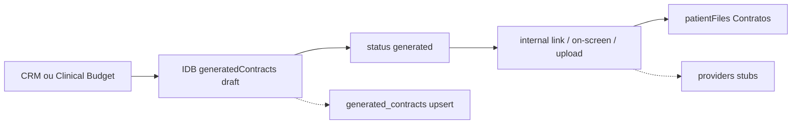

# PHASE_10_1 — Contracts Discovery and Legacy Audit

**Status:** CONCLUÍDA (discovery only)  
**Baseline branch:** `main`  
**Baseline commit:** `b95eff1` (`b95eff1b5f151326b218d0f97482bb387c12f993` — *hotfix: desbloqueia build Vercel e isola type-check*)  
**Escopo:** auditoria factual do módulo atual de Contratos e Consentimentos  
**Alterações de código:** nenhuma  
**Migrations executadas:** nenhuma  
**Commit:** não realizado  
**Dependências instaladas:** nenhuma  
**Infraestrutura:** congelada (não alterada)

---

## 1. Objetivo

Mapear o estado real do módulo de contratos/consentimentos no Love Odonto — arquivos, rotas, services, stores IndexedDB, schema Supabase, integrações (orçamento, prontuário, odontograma, financeiro), permissões, PDF, assinatura e testes — para fundamentar a Fase 10 sem alterar comportamento.

## 2. Escopo

| In scope | Out of scope |
|----------|--------------|
| Inventário factual do legado | Implementação de domínio novo |
| Mapa de dependências e consumidores | Migrations / RLS novas |
| Gap analysis vs arquitetura Phase 10 | UI final / editor visual |
| Proposta de cutover gradual | Assinatura externa real |
| Riscos de regressão | Commit / publish / deploy |

## 3. Veredito executivo

O módulo **já existe e está operacional no cliente**, com UI em `/gestao/contratos`, geração a partir de orçamento (CRM e clínico), assinatura interna por link/tela/upload, snapshots parciais e sync SaaS **best-effort**.

| Dimensão | Estado atual |
|----------|--------------|
| Fonte de verdade runtime | **IndexedDB** (`loadDb` / `withDb`) — blob monólito da clínica |
| Persistência remota | Migration `006_app_contracts.sql` — subset (templates, blocks, generated, audit) |
| Repository V3 dedicado | **Ausente** |
| Feature flags de contratos | **Ausentes** |
| Storage de PDF/assinatura | Data URLs no IndexedDB / `patientFiles` — **sem bucket Supabase** |
| Providers externos | Stubs (`SIGNATURE_PROVIDER_NOT_CONFIGURED`) |
| Domain event `CONTRACT_SIGNED` | Registrado no registry; **sem publisher dedicado** |
| Arquitetura Phase 10 (versões imutáveis, packages, envelopes, ledger) | **Não implementada** |

Núcleo atual: `generatedContracts[]` com `renderedHtml` / snapshots embutidos, não um grafo de entidades imutáveis (`contract_versions` + envelopes + files).

---

## 4. Arquitetura as-is

```text
Orçamento (CRM | Clinical)
  → GenerateContractModal / ClinicalContractSection
  → createContractDraft / createGeneratedContractDraft  (IndexedDB)
  → snapshots + hashtags (#tag) → renderedHtml
  → finalizeGeneratedContract (status=generated)
  → send digital | on-screen | upload
  → /assinatura/:token (público) OU ContractSignModal
  → signed/completed → patientFiles (categoria Contratos)
  → sync opcional POST /internal/app/contracts/generated → generated_contracts
```



---

## 5. Inventário de arquivos

### 5.1 Services

| Arquivo | Papel |
|---------|-------|
| `src/services/contractService.js` | CRUD templates/blocos; draft/finalize/cancel; audit logs IDB |
| `src/services/contractModuleService.js` | Orquestração: drafts+snapshots, sign, version, settings, quote helpers |
| `src/services/contractPdfService.js` | html2canvas + jsPDF; print |
| `src/services/contractRenderService.js` | contexto, filtros de blocos |
| `src/services/contractSignatureFlowService.js` | envio digital, webhook, chart |
| `src/services/contractSignatureAuditService.js` | trilha de assinatura |
| `src/services/contractValidationService.js` | readiness + validação pré-geração |
| `src/services/contractDashboardService.js` | KPIs do shell |
| `src/services/contractSaasSyncService.js` | espelho SaaS |
| `src/services/cancelContractSecureService.js` | cancelamento com frase de confirmação |
| `src/services/signatureProviderService.js` | adapters (internal + stubs externos) |
| `src/services/signatureEmailService.js` | e-mail (simulado) |
| `src/services/clinicalTcleAttachmentService.js` | bridge Documentos → TCLE |
| `src/services/clinicalBudgetContractBridge.js` | enrich budget clínico para variáveis |

### 5.2 Domínio / constants / UI shell

| Arquivo |
|---------|
| `src/contracts/contractConstants.js` |
| `src/contracts/contractVariableResolver.js` |
| `src/contracts/hashtagRegistry.js` |
| `src/contracts/contractTcleRegistry.js` |
| `src/contracts/contractQualificationTemplates.js` |
| `src/contracts/contractConditionalClauses.js` |
| `src/contracts/defaultContractSeed.js` |
| `src/contracts/treatmentContractSeed.js` |
| `src/contracts/clinicTechnicalResponsible.js` |
| `src/contracts/contractsShellConfig.js` |
| `src/contracts/print.css` |
| `src/contracts/ui/ContractsShellLayout.jsx` |
| `src/contracts/ui/ContractUi.jsx` |

### 5.3 Pages

| Arquivo | Rota |
|---------|------|
| `src/pages/contratos/ContractsDashboardPage.jsx` | `/gestao/contratos` |
| `src/pages/contratos/ContractsPendentesPage.jsx` | `.../pendentes` |
| `src/pages/contratos/ContractsAssinadosPage.jsx` | `.../assinados` |
| `src/pages/contratos/ContractsModelosPage.jsx` | `.../modelos` |
| `src/pages/contratos/ContractsTermosPage.jsx` | `.../termos` |
| `src/pages/contratos/ContractsAssinaturasPage.jsx` | `.../assinaturas` |
| `src/pages/contratos/ContractsConfigPage.jsx` | `.../configuracoes` |
| `src/pages/contratos/ContractSignPublicPage.jsx` | `/assinatura/:token` (pública) |
| `src/pages/admin/AdminContratosConsentimentosPage.jsx` | **órfã** — não montada; redirects apontam para shell novo |

### 5.4 Components

| Área | Arquivos |
|------|----------|
| Módulo | `src/components/contracts/*` (Generate, Detail, Sign, Send, Panel, Editor, Readiness, SignatureCanvas) |
| Clínico | `src/components/clinical/ClinicalContractSection.jsx`, `src/components/clinical/contract/*` |
| Budgets | `src/components/budgets/PatientBudgetsContractsTab.jsx` |

### 5.5 Server / DB / migrations / utils

| Arquivo | Papel |
|---------|-------|
| `server/lib/contractsGeneratedApi.js` | `POST /internal/app/contracts/generated` |
| `scripts/supabase/optInContract.mjs` | opt-in sync |
| `supabase/migrations/006_app_contracts.sql` | schema remoto parcial |
| `supabase/migrations/015_permission_catalog_seed.sql` | perms |
| `supabase/migrations/021_app_financial_core.sql` | `contract_id` text em financial |
| `src/db/schema.js` | stores IDB |
| `src/db/migrations.js` | v47 seed; v51 snapshots/assinaturas; v53 signature requests/audits |
| `src/utils/documentTemplates.js` | TCLEs clínicos (`DOCUMENT_CATEGORIES.CONSENTIMENTOS`) — mundo paralelo |

---

## 6. Rotas e navegação

| Entry | Valor |
|-------|--------|
| Menu | `menuConfig.js` → id `contratos`, `/gestao/contratos`, roles UI `admin\|gerente\|recepcao` |
| Shell | `contractsShellConfig.js` — 7 abas |
| Protected | `ProtectedApp.jsx` nested sob `ContractsShellLayout` |
| Redirects | `/admin/contratos` → `/gestao/contratos`; `/admin/consentimentos` → `/gestao/contratos/termos` |
| Pública | `App.jsx` → `/assinatura/:token` |
| Permission gate | `routePermissionMap.js` → `admin_contratos:view` |

---

## 7. Funções-chave por service

### `contractService.js`
`ensureContractsSeeded`, `listContractTemplates`, `getContractTemplate`, `listBlocksForTemplate`, `upsertContractBlock`, `setBlockActive`, `createClinicCustomTemplate`, `updateClinicCustomTemplate`, `duplicateClinicTemplate`, `deleteClinicTemplate`, `restoreSystemDefaultTemplate`, `composeTemplateHtml`, `composeTemplateHtmlForContext`, `assertPatientReadyForContract`, `validateTemplateHashtags`, `createGeneratedContractDraft`, `updateDraftGeneratedContract`, `finalizeGeneratedContract`, `cancelGeneratedContract`, `listGeneratedContracts`, `getGeneratedContract`, `listContractAuditLogs`

### `contractModuleService.js`
`ensureContractsModuleSeeded`, `normalizeContract`, `registerContractEvent`, `getContractSettings`, `saveContractSettings`, `createContractDraft`, `isContractEditable`, `listPatientContracts`, `listContractsByStatus`, `getContractDetails`, `sendContractForSignature`, `getContractBySignToken`, `markContractViewed`, `signContractOnScreen`, `signContractViaLink`, `uploadSignedContractAttachment`, `createContractNewVersion`, `hasSignedContractForQuote`, `getContractStatusForQuote`, `canStartTreatmentWithoutContract`, `listTemplatesByCategory`, `listTemplatesByTreatment`, `setDefaultTemplateForTreatment`

### Assinatura / PDF / sync
- Flow: `canSendContractForSignature`, `sendContractForDigitalSignature`, `applySignatureCompletion`, `saveSignedContractToPatientChart`, `processSignatureWebhookEvent`
- PDF: `downloadContractPdfFromElement`, `contractHtmlWithSignatures`, `printContractElement`
- Sync: `syncGeneratedContractToSaas` → handler `createContractsGeneratedHandler`
- Cancel: `cancelContractSecure` + frase `CANCELAR CONTRATO`

---

## 8. Contratos de dados atuais

### 8.1 Status (`CONTRACT_STATUS`)

```text
draft, generated, sent, viewed,
signed_by_patient, signed_by_clinic, completed,
awaiting_data, ready_to_send, vigente, rescindido,
signed, refused, canceled, expired, replaced
```

**Postgres CHECK (006):** apenas `draft | generated | signed | canceled` — **subset** do enum app. Sync SaaS pode falhar ou truncar semanticamente status intermediários.

### 8.2 Editabilidade

`isContractEditable` permite edição em `draft` e `generated` (conteúdo ainda mutável após “geração”, antes de assinatura).

### 8.3 Shape principal `generatedContracts` (IDB)

Campos observados / usados: `id`, `clinicId`, `tenant_id`, `patientId`, `quoteId`, `quoteSource` (`crm_budget`\|`clinical_budget`), `budgetId?`, `templateId`, `templateVersion`, `contractNumber` (`CTR-YYYY-NNNNN`), `finalContent`, `renderedHtml`, `pdfUrl`, `status`, timestamps, `metadata`, `title`, `category`, `treatmentType`, snapshots (`patient|clinic|professional|clinical|financialSnapshotJson`, `totalValueSnapshot`), `documentHash` (**simpleHash djb2-like, não crypto**), `parentContractId`, `replacedById`, `version`, `signatureRequestId`, `lockedAt`, campos de cancelamento.

### 8.4 Stores IndexedDB relacionadas

```text
contractTemplates
contractBlocks
generatedContracts
contractAuditLogs
contractSeqByClinic
contractSignatures
contractEvents
contractAttachments
contractSignLinks
contractSignatureRequests
contractSignatureAudits
contractSettings
```

Nota: `contractCancelAudit` é escrito pelo cancel seguro sem entrada tipada em `createDefaultDb()`.

### 8.5 Schema Supabase (`006_app_contracts.sql`)

| Tabela | Escopo |
|--------|--------|
| `contract_templates` | id text, tenant_id, name, type system/clinic, content, version, is_active |
| `contract_blocks` | template_id, content, condition_type, order_index |
| `generated_contracts` | patient_id, quote_id, quote_source, rendered_html, pdf_url, status (4), metadata jsonb |
| `contract_audit_logs` | contract_id, action, user_id, metadata |

RLS: `app_user_can_access_tenant(tenant_id)`.

**Ausente no Postgres (só IDB):** signatures, sign links, signature requests/audits, attachments, events, settings, packages, versions imutáveis, odontogram/financial snapshot tables, envelopes.

### 8.6 Variáveis dinâmicas atuais

Motor usa **hashtags `#tag`** (`hashtagRegistry.js` / `contractVariableResolver.js`), não Mustache `{{clinic.legalName}}`. Exemplos: `#pacienteNomeCompleto`, `#procedimentos`, `#totalContrato`, `#dentes`, `#formaPagamento`, `#numeroContrato`, `#testemunha1Nome`.

---

## 9. Integrações mapeadas

### 9.1 Orçamento

| Fonte | Link |
|-------|------|
| Clinical | `quoteSource=clinical_budget`, `quoteId≈appointmentId`, `budgetId` opcional; status budget `CONTRATO_GERADO`; `ClinicalContractSection`; `clinicalBudgetLockService.markBudgetContractGenerated` |
| CRM | `quoteSource=crm_budget`; `GenerateContractModal` em `CrmOrcamentosPage` |
| Helpers | `hasSignedContractForQuote`, `getContractStatusForQuote`, `canStartTreatmentWithoutContract` |
| Bridge | `clinicalBudgetContractBridge.enrichClinicalBudgetContext` |
| Lock | contrato ativo (`draft/generated/sent/viewed/signed`) ou receivables/financings bloqueiam edição |

### 9.2 Paciente / prontuário

- `listPatientContracts` + `PatientContractsPanel` / Care Central / `PatientBudgetsContractsTab`
- Pós-assinatura: `saveSignedContractToPatientChart` → `patientFiles` categoria `Contratos`
- Timeline: `patientCareTimelineService` filtra `contratos`
- Eventos clínicos locais: `contract_canceled`, `contract_pdf_generated` (não são domain events V3)

### 9.3 Odontograma

- **Indireto:** `#dentes` / procedimentos vêm do orçamento (`tooth|region|dente|teeth`)
- **Não** lê `patientOdontograms` / V2 para snapshot imutável dedicado
- Histórico odontograma existe (`patientOdontogramHistory`) mas **não** é vinculado ao contrato

### 9.4 Financeiro

- Snapshot: `financialSnapshotJson` no draft
- `linkFinancingToContract` / `linkFinancingToClinicalContract`
- Supabase `021`: `contract_id` text em `financial_accounts_receivable` / `financial_financings`
- Ativação financeira hoje ocorre na **aprovação do orçamento** (`processApprovedBudgetFinance`), não no evento `contract.signed`
- Origin types receivables incluem `contract` e `treatment_plan`

### 9.5 Domain events

- Registry: `CONTRACT_SIGNED` (`domainEventRegistry.ts` / `domainEventTypes.ts`) — aggregate `contract`
- **Sem** `scheduleContractSignedDomainEvent` / publisher em `src/services`
- Padrão a espelhar: `financialDomainEventPublisher.js`

### 9.6 Documentos / TCLE paralelo

`documentTemplates.js` (categoria consentimentos) + `clinicalTcleAttachmentService` mapeia anexos clínicos → `metadata.attachedTcleIds`. Dois mundos de consentimento coexistindo.

---

## 10. PDF, assinatura e storage

### PDF

| Path | Lib | Saída |
|------|-----|-------|
| `contractPdfService` | jspdf + html2canvas | PDF client-side |
| `generateProfessionalContractPdf` (clínico) | HTML Blob + `window.print` | **não** jsPDF canônico |
| `pdfmake` no package.json | — | **sem uso em `src/`** |

### Assinatura

| Canal | Estado |
|-------|--------|
| Internal link `/assinatura/:token` | Funcional (IDB `contractSignLinks`) |
| On-screen | Funcional (`SignatureCanvas`) |
| Upload PDF assinado | Funcional |
| E-mail | Simulado (`delivered: true, simulated: true`) |
| Clicksign/DocuSign/ZapSign/D4Sign/ICP | Stubs → throw |
| Webhook | `processSignatureWebhookEvent` mapeia eventos → status |

Níveis legais internos já tipados: `electronic_simple`, `electronic_advanced`, `icp_qualified`.

### Storage

| Recurso | Bucket |
|---------|--------|
| Logos | `clinic-logos` |
| Guias clínicos | `clinical-guides` |
| Fotos colaboradores | `collaborator-photos` |
| **Contratos / evidências / assinaturas** | **nenhum** — data URLs no IDB |

---

## 11. Permissões (RBAC)

### Catálogo (`src/permissions/catalog.js`)

```text
prontuario_contratos: view, create, edit, send, sign, delete
prontuario_consentimentos: view, create, edit, send
admin_contratos: view, create, edit, delete, update_template, generate,
                 print, export_pdf, cancel, view_audit, edit_system_clause
admin_consentimentos: view, create, edit, delete
```

### Defaults relevantes (`roleDefaults.js`)

| Perfil | Contratos |
|--------|-----------|
| administrativo / gerente | full `admin_contratos` |
| comercial | `generate`, `view` |
| financeiro | `prontuario_contratos:view` |
| dentista | `prontuario_contratos:view/create` + `admin_contratos:generate` |
| recepção | **sem** perms de contrato no default (menu UI ainda lista recepção) |

Seed espelhado em `015_permission_catalog_seed.sql`.

**Gap vs Phase 10:** granularidade proposta (`contracts:approve`, `contracts:create_addendum`, `contract_signatures:*`, `contract_settings:*`, segregação Master SaaS) **não existe**.

---

## 12. Feature flags

Nenhuma flag `contracts_*` em `tenantAccess` / `ROUTE_FEATURE_FLAG_RULES`.  
Gate real: permissões + settings locais (`contractRequiredBeforeTreatment`, etc.).

Flags Phase 10 (§27 do brief) precisam ser criadas do zero na foundation.

---

## 13. Testes existentes (negócio)

| Arquivo |
|---------|
| `src/__tests__/contractModuleService.test.js` |
| `src/__tests__/contractSignatureFlow.test.js` |
| `src/__tests__/contractVariableResolver.test.js` |
| `src/__tests__/contractsHashtags.test.js` |
| `src/__tests__/contractBudgetFlow.test.js` |
| `src/__tests__/contractAccessUtils.test.js` |
| `src/__tests__/fullBudgetContractFlowValidation.test.js` |
| `src/__tests__/budgetContractStabilityGuards.test.js` |
| `src/__tests__/professionalContractTemplate.test.js` |
| `src/__tests__/clinicalTcleAttachment.test.js` |
| `src/__tests__/clinicTechnicalResponsible.test.js` |
| Cobertura parcial: `apiCoreWave3dMigration`, smoke/stabilization, budget edit access |

**Falsos positivos “Contract” (não são módulo jurídico):** `repositoryV3*Contract*`, `rhTestFlagContract`, `phase92*Storage*Contract*`.

---

## 14. Gap analysis — legado × arquitetura Phase 10

| Entidade / princípio Phase 10 | Legado atual | Gap |
|-------------------------------|-------------|-----|
| `contract_templates` + versions imutáveis | Templates IDB + version int; content mutável | Sem `contract_template_versions` PUBLISHED imutável |
| `contracts` + máquina de estados | `generatedContracts` com enum expandido | Sem estados `READY_FOR_REVIEW` / `PENDING_INTERNAL_APPROVAL` / `PARTIALLY_SIGNED` formais |
| `contract_versions` snapshot | Snapshots embutidos + `renderedHtml` | Sem entidade versão; hash fraco; mutável em `generated` |
| `contract_packages` | Inexistente | TCLEs via metadata; sem pacote documental |
| `contract_parties` | Qualificação em texto / hashtags | Sem partes normalizadas |
| `contract_treatments` | Embutido em HTML `#procedimentos` | Sem vínculo normalizado |
| `contract_odontogram_snapshots` | Inexistente | Só dentes do budget |
| `contract_financial_snapshots` | `financialSnapshotJson` | Sem tabela / hash dedicado; financeiro ativa no budget |
| `signature_policies` / envelopes / signers | Settings + sign links + signatures IDB | Sem envelope formal; providers stubs |
| `contract_files` + storage privado | Data URLs | Sem bucket; sem SHA-256 real; risco de quota/PII |
| `contract_audit_events` append-only + hash chain | Arrays mutáveis IDB | Sem ledger verificável |
| Verificação pública QR | Inexistente | — |
| Idempotência / optimistic lock | Parcial / local | Sem `idempotency_key` / `row_version` |
| Feature flags | Ausentes | Cutover sem interruptor |
| Dual PDF paths | jsPDF vs HTML profissional | Sem PDF canônico assinado |
| Consentimentos granulares LGPD | Categorias + documentTemplates | Aceites não modelados por finalidade |
| Master SaaS sem acesso clínico | Não auditado neste discovery para break-glass | Precisa política explícita |

---

## 15. Consumidores e riscos de regressão

### Consumidores críticos (não quebrar na cutover)

1. `ClinicalContractSection` / atendimento clínico  
2. `GenerateContractModal` / `CrmOrcamentosPage`  
3. `clinicalBudgetLockService` / `budgetEditAccessUtils`  
4. `patientCareTimelineService` / Care Central  
5. `financingsService.linkFinancingToContract`  
6. Fluxo público `/assinatura/:token`  
7. Sync `POST /internal/app/contracts/generated`  
8. Permissões `admin_contratos:*` / `prontuario_contratos:*` em rotas e UI  

### Riscos principais (mapeados ao brief §25)

| # | Risco | Evidência no legado |
|---|-------|---------------------|
| R1 | Dados mutáveis pós-emissão | Editável em `generated`; odontograma/financeiro vivos |
| R2 | Promessa jurídica | UI/docs precisam manter linguagem técnica (já há classificação legal tipada) |
| R3 | Duplicação financeira | Financeiro ativa no approve, não no signed |
| R4 | Vazamento PII/saúde | Data URLs + token público em IDB do browser do paciente |
| R5 | Webhook falso | Providers stubs; validação criptográfica ausente |
| R6 | Edição pós-assinatura | `createContractNewVersion` só a partir de signed; cancel assinado limitado |
| R10 | PDF ≠ banco | Dois geradores; hash não crypto |
| R11 | Legado | IDB + Postgres subset; exclusão automática proibida |
| Extra | Status enum app ≫ Postgres | Sync SaaS frágil |
| Extra | Recepção no menu sem perms default | UX inconsistente |
| Extra | Página admin órfã | Código morto potencial |

---

## 16. Proposta de cutover gradual

Ordem alinhada ao brief §31 (não iniciar por editor visual nem provider externo):

```text
10.1 Discovery ✅ (este relatório)
 → 10.2 Domain foundation (tipos, estados, validators, feature flags, interfaces)
 → 10.3 Persistência revisável (migrations manuais; RLS; sem apply automático)
 → 10.4 Templates versionados
 → 10.5 Generation + snapshots + packages
 → 10.6 PDF canônico + storage
 → 10.7 Signature foundation (internal)
 → 10.8 External provider (quando escolhido)
 → 10.9 Budget/financial por evento
 → 10.10 Odontogram/clinical
 → 10.11 Portal
 → 10.12 Audit/evidence
 → 10.13 Permissions
 → 10.14 Legacy adapter (somente leitura)
 → 10.15 Stabilization
 → 10.16 Controlled rollout
```

### Estratégia de coexistência (recomendada)

| Camada | Estratégia |
|--------|------------|
| Leitura | Adapter unificado: contratos novos (schema Phase 10) + legado IDB/Postgres `generated_contracts` em **read-only** |
| Escrita nova | Apenas com `contracts_module_enabled` + tenant piloto |
| Escrita legada | Mantida enquanto flag OFF; sem exclusão |
| Sync 006 | Congelar expansão; tratar como espelho legado até cutover write |
| Financeiro | Continuar origem `budget_id`; adicionar ativação por `contract.signed` com idempotência (Phase 10.9) |
| UI shell | Reusar rotas `/gestao/contratos`; evoluir abas sem quebrar redirects admin |

### Mapeamento legado → alvo (conceitual)

| Legado | Alvo Phase 10 |
|-------|---------------|
| `contractTemplates` + `contractBlocks` | `contract_templates` + `contract_template_versions` + clause library |
| `generatedContracts` | `contracts` + `contract_versions` (+ snapshots filhos) |
| `contractSignLinks` + `contractSignatures` + requests | `signature_envelopes` + `signature_signers` |
| `contractAttachments` / `pdfUrl` data URL | `contract_files` + Storage privado |
| `contractEvents` / `contractAuditLogs` / signature audits | `contract_audit_events` append-only |
| `metadata.attachedTcleIds` | `contract_consents` + `contract_packages` |
| Hashtags `#tag` | Variáveis tipadas `{{...}}` com bridge de compatibilidade |

---

## 17. Confirmações finais (gate Phase 10.1)

| Item | Status |
|------|--------|
| Nenhum código de produto alterado | ✅ |
| Nenhuma migration criada/aplicada | ✅ |
| Supabase remoto não alterado | ✅ |
| Storage remoto não alterado | ✅ |
| IndexedDB preservado | ✅ |
| Nenhuma dependência instalada | ✅ |
| Commit não realizado | ✅ |
| Legado não removido | ✅ |
| Mapa de dependências completo | ✅ |
| Proposta de cutover documentada | ✅ |

---

## 18. Recomendações — próxima phase

**PHASE_10.2 — Domain foundation**

1. Definir tipos/enums/schemas alinhados ao brief §5–§8, com **bridge** para status/categorias legados.  
2. Implementar máquina de transição + imutabilidade pós-`locked_at` em testes unitários puros.  
3. Introduzir feature flags §27 (default OFF).  
4. Interfaces de repositório (sem UI, sem provider externo, sem migration apply).  
5. Documentar contrato de compatibilidade hashtag `#` ↔ `{{var}}`.  
6. Não tocar no IndexedDB operacional até 10.3+ com adapter.

### Perguntas abertas para o product/owner (antes de 10.3)

1. Qual provedor externo de assinatura será o primeiro (Clicksign / ZapSign / outro)?  
2. Financeiro deve **passar** a ativar somente após `SIGNED`, ou manter activate-on-budget-approve + vínculo jurídico?  
3. Pacote documental obrigatório mínimo por procedimento: lista oficial da clínica?  
4. Destino do conteúdo em `AdminContratosConsentimentosPage` (deprecar oficialmente)?

---

**FIM Phase 10.1 — aguardar aprovação formal para PHASE_10.2.**
)
