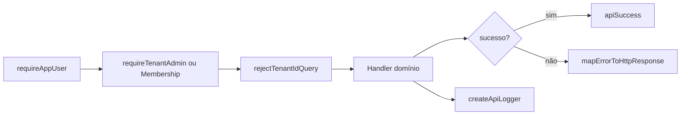

# PHASE 4.10 — API Core: Auditoria e Design

**Documento:** `docs/reports/PHASE_4_10_API_CORE_AUDIT_AND_DESIGN.md`  
**Data:** 2026-07-08  
**Escopo:** auditoria + design **somente** — zero código, zero banco, zero Supabase, zero migrations, zero produção, zero commit.  
**Complemento:** `PHASE_4_10_API_INFRASTRUCTURE_AUDIT_AND_DESIGN.md` (visão infra geral)  
**Base normativa:** `docs/platform/LOVE_ODONTO_V3_MASTER_API_ARCHITECTURE.md`  
**Base factual:** `PHASE_4_OFFICIAL_API_AUDIT.md`, `PHASE_4_9_DEBUG_USER_CONTEXT_AUDIT.md`, `server/index.js`, `server/lib/*Api*.js`

---

## 1. Sumário executivo

Existem **8 endpoints** no escopo desta fase — 7 Phase 4 oficiais em `server/lib/*Api*.js` + `GET /debug-user-context` (legado inline em `index.js`). Todos compartilham dependências de `server/index.js` (auth, tenant, audit) sem uma camada **API Core** unificada.

| Problema | Impacto |
|---------|---------|
| Infra espalhada em `index.js` (~4300 linhas) + copy-paste nos handlers | Drift de contrato |
| 3 resolvers de tenant com semânticas diferentes | Risco cross-tenant |
| 6× chains `instanceof` para HTTP errors | Status codes inconsistentes |
| `extractPermissionFieldsFromAppMetadata` duplicado | Split-brain RBAC |
| Multipart / rollback / logs copiados | Manutenção cara |

**Proposta:** criar `server/core/` como camada transversal; manter `server/lib/*Api.js` como domínio.

| Gate | Veredicto |
|------|-----------|
| Design API Core completo | ✅ **READY** |
| Refatoração em massa imediata | ❌ **NOT READY** |
| Wave 0 (core puro + testes, zero mudança de contrato) | ✅ **READY** após aprovação |

---

## 2. Endpoints no escopo

| # | Método | Path | Módulo | Padrão |
|---|--------|------|--------|--------|
| 1 | GET | `/internal/app/collaborators` | `collaboratorsApiList.js` | V3 |
| 2 | GET | `/internal/app/collaborators/:id/permissions` | `collaboratorsPermissionsApi.js` | V3 |
| 3 | POST | `/internal/app/collaborators/:id/apply-role-template` | `collaboratorsApplyRoleTemplateApi.js` | V3 |
| 4 | PUT | `/internal/app/collaborators/:id/permissions` | `collaboratorsPutPermissionsApi.js` | V3 |
| 5 | POST | `/internal/app/assets/logo` | `assetsLogoApi.js` | V3 |
| 6 | POST | `/internal/app/assets/avatar` | `assetsAvatarApi.js` | V3 |
| 7 | GET | `/internal/app/assets/avatar/:collaboratorId` | `assetsAvatarApi.js` | V3 |
| 8 | GET | `/internal/app/debug-user-context` | `index.js:2140` | **LEGACY** |

---

## 3. Auditoria por dimensão

### 3.1 Auth

| Item | Implementação atual | Local | Gap vs V3 |
|------|---------------------|-------|-----------|
| Middleware Bearer | `requireAppUser` | `index.js:1876` | Não extraído para `core/auth/` |
| Parse `Authorization` | regex `Bearer (.+)` | `requireAppUser` | OK |
| Validação JWT | `supabase.auth.getUser(token)` | `requireAppUser` | OK |
| Actor | `req.appAuthUser` | middleware | OK |
| 401 sem token | `{ error: 'Token do app ausente.' }` | middleware + handlers | Handlers Phase 4 usam `{ ok: false }` — **inconsistência** |
| 401 token inválido | `explainJwtVerifyFailure` | `index.js:317` | Só no middleware legado |
| 503 rede Supabase | `isSupabaseNetworkError` | `index.js:1869` | Só no middleware |
| Auth Admin read | `getAuthUserMeta` | `index.js:852` | Injetado como dep; deveria ser `core/auth/resolveAuthUser.js` |
| Redundância 401 | `if (!req.appAuthUser?.id)` | 6 handlers Phase 4 | Defensivo duplicado |

**Destino Core:** `server/core/auth/requireAppUser.js`, `server/core/auth/resolveAuthUser.js`

---

### 3.2 Tenant

| Função | Local | Comportamento |
|--------|-------|---------------|
| `resolveActiveTenantUser` | `index.js:545` | Membership ativa; aceita `explicitTenantId` (legado) |
| `getTenantAdminActorOrThrow` | `index.js:588` | Membership + admin role |
| `isActiveTenantUserRow` | `index.js:472` | `status !== inactive`, `is_active !== false` |
| `resolveAuthenticatedTenantForCollaboratorsList` | `collaboratorsApiList.js:169` | Phase 4 member; `TENANT_AMBIGUOUS` |
| `resolveAdminTenantForPermissions` | `collaboratorsPermissionsApi.js:340` | Phase 4 admin; mapeia erros → 403 |
| `assertNoTenantIdQueryParam` | `collaboratorsApiList.js:64` | `TENANT_QUERY_FORBIDDEN` |
| `assertNoTenantIdInBody` | `collaboratorsApplyRoleTemplateApi.js:63` | `TENANT_BODY_FORBIDDEN` |
| `FORBIDDEN_TENANT_IDS` | `collaboratorsApiList.js:6` | `tenant-1`, `tenant_1` |

| Endpoint | `tenant_id` livre | Resolver |
|----------|-------------------|----------|
| Phase 4 (1–7) | ❌ proibido query/body | backend-only |
| `debug-user-context` | ✅ `?tenant_id` | `getTenantAdminActorOrThrow(actor, explicit)` — **LEGACY** |

**Cross-tenant:** Phase 4 valida `tenant_id` na row pós-query (`mapCollaboratorSummary`, updates com `.eq('tenant_id')`). Legado depende de `explicitTenantId` matching actor.

**Destino Core:** `server/core/tenant/resolveTenantContext.js`, `requireTenantMembership.js`, `requireTenantAdmin.js`

---

### 3.3 RBAC

| Papel | Guard atual | Endpoints |
|-------|-------------|-----------|
| `owner` / `admin` / `master` | `isTenantAdminRole` + `getTenantAdminActorOrThrow` | permissions, apply, PUT, assets POST, debug |
| Membership comum | `resolveAuthenticatedTenantForCollaboratorsList` | collaborators list, avatar GET |
| Colaborador RH sem `tenant_user` | `ACCESS_NOT_LINKED` 409 | apply, PUT permissions |
| Usuário inativo | `isActiveTenantUserRow` filtra; Melissa RH inativo **permitido** em avatar POST | apply N/A; avatar admin pode upload |
| Admin bypass runtime | `isTenantAdminRole` em `buildCollaboratorPermissionsPayload` | GET permissions — não persistido |

| Função RBAC | Local |
|-------------|-------|
| `isTenantAdminRole` | `index.js:411` |
| `normalizeRoleValue` | `index.js` + 4 módulos (**duplicado**) |
| `extractPermissionFieldsFromAppMetadata` | `index.js:865` + `collaboratorsPermissionsApi.js:69` (**duplicado**) |
| `loadPermissionCatalogIds` | `collaboratorsPermissionsApi.js:233` |
| `loadRoleDefaultIds` | `collaboratorsPermissionsApi.js:242` |
| `resolvePermissionStateFromSources` | `collaboratorsPermissionsApi.js:105` |
| `validatePermissionsAgainstCatalog` | `collaboratorsPutPermissionsApi.js:126` |
| `materializeCustomPermissionsMap` | `collaboratorsPutPermissionsApi.js:138` |
| `detectRequiresOverwrite` | `collaboratorsApplyRoleTemplateApi.js:105` |

**Destino Core:** `server/core/rbac/roles.js`, `permissions.js`, `guards.js` — somente primitives compartilhadas; payload builders permanecem domínio.

---

### 3.4 Responses

| Tipo | Phase 4 (endpoints 1–7) | Legado (`debug-user-context`) |
|------|-------------------------|-------------------------------|
| Sucesso | `{ ok: true, data, meta }` | flat JSON sem `ok` |
| Erro | `{ ok: false, error, code, details? }` | `{ error: "..." }` sem `code` |
| Validação | 400/413 + `code` | 400 flat |
| Paginação | `meta.page`, `meta.pageSize`, `meta.total` | N/A |

**Não existe** `apiSuccess` / `apiError` centralizado.

**Destino Core:** `server/core/api/response.js`

---

### 3.5 Errors

| Classe / code | HTTP | Módulo(s) |
|---------------|------|-----------|
| `AUTH_REQUIRED` / token ausente | 401 | handlers (inconsistente com middleware) |
| `ADMIN_REQUIRED` | 403 | permissions, assets, apply, PUT |
| `TENANT_MEMBERSHIP_REQUIRED` | 403 | list, avatar GET |
| `TENANT_QUERY_FORBIDDEN` | 400 | Phase 4 |
| `TENANT_BODY_FORBIDDEN` | 400 | apply, PUT |
| `TENANT_AMBIGUOUS` | 403 | list |
| `COLLABORATOR_NOT_FOUND` | 404 | permissions, assets |
| `AVATAR_NOT_FOUND` | 404 | avatar GET |
| `ACCESS_NOT_LINKED` | 409 | apply, PUT |
| `OVERWRITE_CONFIRMATION_REQUIRED` | 409 | apply |
| `FILE_TOO_LARGE` | 413 | logo, avatar |
| `ROLLBACK_FAILED` | 503 | apply, PUT, logo, avatar |
| `STORAGE_UPLOAD_FAILED` | 500 | logo, avatar |
| `DB_WRITE_FAILED` | 500 | logo, avatar |
| `INTERNAL_ERROR` | 500 | fallback |

**Problema:** cada handler implementa 15–40 linhas de `instanceof` mapping. `sendAvatarError` é a única função nomeada.

**Destino Core:** `server/core/api/errors.js` — catálogo §7 V3 + `mapErrorToHttpResponse(err)`

---

### 3.6 Logs

| Padrão Phase 4 | Campos | `request_id` |
|----------------|--------|--------------|
| `started = Date.now()` | ✅ | ❌ ausente |
| `logPayload` | `tenant_id`, `user_id`/`actor_user_id`, `durationMs` | ❌ |
| Tag fixa | `[COLLABORATORS_API_LIST]`, etc. | — |
| Erro | `error: err?.code \|\| err?.message` | — |
| 500 | `console.error` + stack server-side | — |

| Tag | Endpoint |
|-----|----------|
| `[COLLABORATORS_API_LIST]` | GET /collaborators |
| `[COLLABORATOR_PERMISSIONS_API_GET]` | GET permissions |
| `[COLLABORATOR_ROLE_TEMPLATE_APPLY]` | POST apply |
| `[COLLABORATOR_PERMISSIONS_UPDATE]` | PUT permissions |
| `[ASSET_LOGO_UPLOAD]` | POST logo |
| `[ASSET_AVATAR_UPLOAD]` / `[ASSET_AVATAR_SIGNED_URL]` | avatar |
| `[debug-user-context]` | só `console.error` — **fora do padrão** |

**PII:** `debug-user-context` e `tenant-context` logam email em alguns paths — viola §15.3.

**Destino Core:** `server/core/api/logger.js` — `createApiLogger(tag)`, `request_id` opcional v1.1

---

### 3.7 Auditoria

| Mecanismo | Local | Uso |
|-----------|-------|-----|
| `meta.audit_event` | handlers Phase 4 | `ASSET_*_UPLOADED`, read-only flags |
| `appendAccessAuditToAuthUser` | `index.js:896` | RBAC writes → `app_metadata.access_audit_log` |
| `logCollaboratorAccessAudit` | `index.js:839` | Console structured |
| Snapshot pré-write | apply template, PUT permissions | `role`, `role_slug`, `has_custom_permissions`, `app_metadata` |
| Rollback log | `[COLLABORATOR_*_ROLLBACK]` | restore TU após Auth fail |

| Campo | Phase 4 | Legado |
|-------|---------|--------|
| `changed_by` / `updated_by` | `req.appAuthUser.id` em meta | ausente em debug |
| `audit_event` | sim em assets/apply/PUT | não |
| Snapshot | apply + PUT | não |
| Rollback 503 | sim (4 fluxos) | não |

**Destino Core:** `server/core/api/audit.js` — thin wrapper; persistência Auth permanece injetada.

---

### 3.8 Query helpers

| Função | Local | Allowlists |
|--------|-------|------------|
| `parseCollaboratorsListQuery` | `collaboratorsApiList.js:85` | status, orderBy, orderDir, page, pageSize |
| `paginationRange` | `collaboratorsApiList.js:135` | — |
| `sanitizeSearchTerm` | `collaboratorsApiList.js:60` | strip `%(),` max 100 |
| `parseBooleanQuery` | `collaboratorsApiList.js:74` | agenda_enabled |
| `ALLOWED_ORDER_BY` | `collaboratorsApiList.js:27` | 4 campos |
| `ALLOWED_STATUS` | `collaboratorsApiList.js:34` | ativo/inativo |
| `MAX_PAGE_SIZE` | 500 | — |

Demais endpoints **não** usam paginação formal hoje.

**Destino Core:** `pagination.js`, `filters.js`, `sorting.js`

---

### 3.9 Resolvers

| Resolver | Local | Consumidores |
|----------|-------|--------------|
| `resolveCollaboratorInTenant` | `collaboratorsPermissionsApi.js:264` | permissions, apply, PUT, avatar |
| `resolveLinkedTenantUser` | `collaboratorsPermissionsApi.js:320` | permissions, apply, PUT |
| `pickLinkedTenantUser` | `collaboratorsPermissionsApi.js:191` | link scoring |
| `loadPermissionCatalogIds` | `collaboratorsPermissionsApi.js:233` | permissions, apply, PUT |
| `loadRoleDefaultIds` | `collaboratorsPermissionsApi.js:242` | permissions, apply, PUT |
| `resolveClinicProfileForTenant` | `clinicProfileResolver.js` | tenant-context, debug, clinic-profile |
| `buildLogoObjectPath` | `assetsLogoApi.js` | logo |
| `buildAvatarObjectPath` | `assetsAvatarApi.js` | avatar |
| `resolveAvatarObjectPathFromFotoUrl` | `assetsAvatarApi.js` | avatar GET |

**Destino Core resolvers:** shared lookups; path builders storage ficam em `core/storage/storagePaths.js`; permission payload builders ficam domínio.

---

### 3.10 Storage

| Capacidade | Logo (`assetsLogoApi`) | Avatar (`assetsAvatarApi`) | Legado (`clinicLogoStorage.js`) |
|------------|------------------------|----------------------------|--------------------------------|
| Bucket | `clinic-logos` | `collaborator-photos` | `clinic-logos` |
| URL | pública | signed TTL 3600 | pública / aceita data: |
| `validateLogoFileInput` | sim | reutiliza | não |
| MIME magic bytes | `detectImageMimeFromBuffer` | reutiliza | não |
| Extensões | jpg/jpeg/png/webp | idem | por mime |
| Max 2MB | `LOGO_MAX_BYTES` | `AVATAR_MAX_BYTES` | não |
| Multipart busboy | `parseMultipartLogoUpload` | `parseMultipartAvatarUpload` | — |
| Rollback delete | sim | sim | não |
| DB field | `clinic_profiles.logo_url` | `collaborators.foto_url` (path) | `logo_url` URL |

**Destino Core:** `fileValidation.js`, `storagePaths.js`, `signedUrl.js`, `storageRollback.js`

---

### 3.11 Rollback

| Padrão | Fluxo | HTTP se rollback fail |
|--------|-------|----------------------|
| **Storage→DB** | upload OK → DB fail → `remove([path])` | 503 `ROLLBACK_FAILED` |
| **TU→Auth** | TU update OK → Auth fail → restore TU snapshot | 503 `ROLLBACK_FAILED` |
| Snapshot campos | `role`, `role_slug`, `has_custom_permissions`, `app_metadata` | apply |
| Snapshot campos | `has_custom_permissions`, `app_metadata` | PUT |

**Sem** helper `runWithCompensation` genérico.

**Destino Core:** `server/core/api/rollback.js` + `server/core/storage/storageRollback.js`

---

### 3.12 Duplicações (matriz consolidada)

| ID | Código duplicado | Ocorrências | Prioridade extração |
|----|------------------|-------------|---------------------|
| D1 | Handler skeleton (401, tenant, log, catch) | 6 handlers | Alta |
| D2 | Error `instanceof` chains | 6 handlers | **Crítica** |
| D3 | `normalizeText` | 8 arquivos | Alta |
| D4 | `normalizeRoleValue` | 5 arquivos | Média |
| D5 | `extractPermissionFieldsFromAppMetadata` | `index.js` + permissionsApi | **Crítica** |
| D6 | `PRODUCTION_PROJECT_REF` | 6 módulos lib | Baixa (grep testes) |
| D7 | `assertNoTenantId*` query/body | 3 locais | Média → `validation.js` |
| D8 | Multipart busboy parser | logo + avatar | Alta |
| D9 | `assertNoForbidden*FormFields` | logo, avatar, apply | Média |
| D10 | Storage upload + rollback | logo + avatar | Alta |
| D11 | Auth write + TU rollback | apply + PUT | Alta |
| D12 | `createRequestLogger` pattern | 6 handlers | Média |
| D13 | Domain error classes (15+) | por módulo | Baixa — manter domínio, mapear no core |

---

## 4. Inventário completo — funções atuais

### 4.1 `server/index.js` (infra compartilhada)

| Categoria | Funções |
|-----------|---------|
| Auth | `requireAppUser`, `explainJwtVerifyFailure`, `decodeJwtPayload`, `getAuthUserMeta`, `getValidAuthUserId*` |
| Tenant | `resolveActiveTenantUser`, `getTenantAdminActorOrThrow`, `isActiveTenantUserRow`, `linkAuthUserToTenantMembership` |
| RBAC | `isTenantAdminRole`, `normalizeRoleValue`, `extractPermissionFieldsFromAppMetadata` |
| Audit | `appendAccessAuditToAuthUser`, `logCollaboratorAccessAudit`, `logCollabInviteProdAudit`, `insertAuditLog` |
| Util | `normalizeText`, `normalizeEmail`, `normalizeDatabaseError`, `maskEmail`, `resolveClientIp` |

### 4.2 `server/lib/*Api*.js` (Phase 4)

| Módulo | Exports principais |
|--------|-------------------|
| `collaboratorsApiList.js` | query parse, pagination, `resolveAuthenticatedTenantForCollaboratorsList`, `createCollaboratorsListHandler` |
| `collaboratorsPermissionsApi.js` | `resolveCollaboratorInTenant`, `resolveLinkedTenantUser`, `resolveAdminTenantForPermissions`, permission read, handler |
| `collaboratorsApplyRoleTemplateApi.js` | `applyRoleTemplateToLinkedUser`, body parse, handler |
| `collaboratorsPutPermissionsApi.js` | `putCollaboratorPermissionsToLinkedUser`, body parse, handler |
| `assetsLogoApi.js` | upload, multipart, validation, handler |
| `assetsAvatarApi.js` | upload, signed URL, multipart, `sendAvatarError`, handlers POST/GET |

### 4.3 Satélites (fora API Core HTTP, não mover)

| Módulo | Motivo |
|--------|--------|
| `rhBackfillToSupabase.js`, `collaboratorIdBackfill.js` | Scripts ops |
| `rhShadowReadQa.js`, `rhExportIndexedDb.js` | QA tools |
| `stagingSeedImplanprime.js` | Seed staging |
| `server/identity/*` | Domínio identity separado |

---

## 5. Proposta de estrutura alvo — `server/core/`

```text
server/core/
├── api/
│   ├── response.js          # apiSuccess(data, meta), apiError(err)
│   ├── errors.js            # ApiError, HTTP_MAP, mapErrorToHttpResponse
│   ├── logger.js            # createApiLogger(tag), withDuration
│   ├── audit.js             # recordAuditEvent, buildAuditMeta
│   ├── pagination.js        # parsePageQuery, paginationRange
│   ├── filters.js           # sanitizeSearchTerm, parseBooleanQuery
│   ├── sorting.js           # parseOrderQuery(allowlist)
│   ├── validation.js        # assertNoTenantIdQuery/Body, assertForbiddenFields
│   └── rollback.js          # runWithCompensation, AuthTuRollback
│
├── auth/
│   ├── requireAppUser.js    # Express middleware
│   └── resolveAuthUser.js   # getAuthUserMeta, getUserFromBearer
│
├── tenant/
│   ├── resolveTenantContext.js   # membership + admin unificado Phase 4
│   ├── requireTenantMembership.js # middleware → req.tenantContext
│   └── requireTenantAdmin.js      # middleware → req.tenantContext
│
├── rbac/
│   ├── roles.js             # isTenantAdminRole, normalizeRoleValue
│   ├── permissions.js       # extractPermissionFieldsFromAppMetadata (ÚNICA cópia)
│   └── guards.js            # assertAdmin, assertMembership (throws ApiError)
│
├── resolvers/
│   ├── collaboratorResolver.js    # resolveCollaboratorInTenant (move from permissions)
│   ├── tenantUserResolver.js      # resolveLinkedTenantUser, pickLinkedTenantUser
│   ├── permissionCatalogResolver.js # loadPermissionCatalogIds, loadRoleDefaultIds
│   └── clinicProfileResolver.js   # thin reexport/wrap clinicProfileResolver.js existente
│
└── storage/
    ├── fileValidation.js    # validateImageFileInput (merge logo/avatar)
    ├── storagePaths.js      # buildLogoPath, buildAvatarPath, resolveAvatarPathFromFotoUrl
    ├── signedUrl.js         # createSignedUrl(bucket, path, ttl)
    └── storageRollback.js   # uploadThenDbWithRollback
```

### 5.1 O que permanece em `server/lib/*Api.js` (domínio)

| Responsabilidade | Exemplo |
|------------------|---------|
| Orquestração do endpoint | `createCollaboratorPermissionsHandler` |
| Regras de negócio RBAC | `buildCollaboratorPermissionsPayload`, `materializeCustomPermissionsMap` |
| Writes sensíveis | `applyRoleTemplateToLinkedUser`, `putCollaboratorPermissionsToLinkedUser` |
| Mapeamento de rows | `mapCollaboratorListRow`, `buildAccessBlock` |
| Parsers de body específicos | `parsePutPermissionsBody`, `parseApplyRoleTemplateBody` |
| Classes de erro de domínio | `CollaboratorPermissionsNotFoundError`, etc. |

### 5.2 O que **não** compartilhar

| Item | Motivo |
|------|--------|
| `buildRoleTemplateAppMetadata` vs `buildManualOverrideAppMetadata` | Semânticas distintas |
| Payload GET permissions completo | Contrato domínio |
| `debug-user-context` flat response | LEGACY — não forçar envelope até Wave 4 |
| Provision / IdentityService | Outro bounded context |
| Resolução `explicitTenantId` legado | Isolar em adapter LEGACY |

---

## 6. Mapa antes / depois

### 6.1 Dependências — hoje

```text
index.js (auth, tenant, audit, 4300 linhas)
    ↓ inject deps
server/lib/*Api.js (handler + domínio + infra copy-paste)
    ↓
Supabase service_role
```

### 6.2 Dependências — alvo

```text
index.js (wiring rotas + DI supabase + LEGACY inline)
    ↓
server/core/* (auth, tenant, api, rbac, resolvers, storage)
    ↓
server/lib/*Api.js (domínio puro — handlers finos)
    ↓
Supabase service_role
```

### 6.3 Fluxo handler Phase 4 — alvo



### 6.4 Migração por endpoint

| Endpoint | Core primeiro | Domínio permanece |
|----------|---------------|-------------------|
| GET /collaborators | pagination, filters, membership, response | `fetchCollaboratorsListPage` |
| GET /permissions | admin, response, logger, collaboratorResolver | `buildCollaboratorPermissionsPayload` |
| POST /apply-role-template | admin, rollback, audit, response | `applyRoleTemplateToLinkedUser` |
| PUT /permissions | admin, rollback, audit, response | `putCollaboratorPermissionsToLinkedUser` |
| POST /assets/logo | admin, storage, fileValidation, response | `updateClinicProfileLogoUrlOnly` |
| POST/GET /assets/avatar | admin/membership, storage, signedUrl | `uploadAvatarAsset`, `readAvatarSignedUrl` |
| GET /debug-user-context | **Wave 4 LEGACY** — gate DEV only | inline até deprecação |

---

## 7. Definições operacionais (itens 1–10)

### 7.1 O que extrair primeiro

| Ordem | Módulo Core | Razão |
|-------|-------------|-------|
| 1 | `api/errors.js` + `api/response.js` | Maior ROI; zero mudança de rota |
| 2 | `rbac/permissions.js` | Elimina split-brain `extractPermissionFields` |
| 3 | `api/validation.js` | `assertNoTenantId*` unificado |
| 4 | `api/logger.js` | DRY logs sem mudar payload |
| 5 | `auth/requireAppUser.js` | Extração mecânica |
| 6 | `tenant/*` | Antes de middleware guards |
| 7 | `storage/fileValidation.js` + `storageRollback.js` | DRY assets |
| 8 | `api/rollback.js` | apply + PUT |
| 9 | `resolvers/*` | Após tenant estável |
| 10 | Middleware guards | Piloto collaborators |

### 7.2 Ordem segura de refatoração

```text
Wave 0: core/api + core/rbac (sem rotas)
Wave 1: core/auth extract + testes parity
Wave 2: core/tenant + piloto GET /collaborators
Wave 3: core/storage → refatorar logo + avatar
Wave 4: core/rollback → apply + PUT
Wave 5: refatorar permissions handlers (errors central)
Wave 6: LEGACY debug-user-context (gate + envelope opcional)
```

### 7.3 Como evitar regressão

| Tática | Detalhe |
|--------|---------|
| Vitest golden | Manter suites atuais 100% verdes por PR |
| Contract snapshots | JSON fixture por endpoint (status + body shape) |
| PR único por concern | Nunca misturar core + domínio + legado no mesmo PR |
| Reexport temporário | `index.js` reexporta core com mesmo nome durante transição |
| Feature flag opcional | `USE_API_CORE=1` por rota piloto |

### 7.4 Testes a manter

| Suite | Testes ~ |
|-------|----------|
| `collaboratorsListApi.test.js` | 24 |
| `collaboratorsPermissionsApi.test.js` | 29 |
| `collaboratorsApplyRoleTemplateApi.test.js` | sim |
| `collaboratorsPutPermissionsApi.test.js` | 26 |
| `assetsLogoApi.test.js` | 23 |
| `assetsAvatarApi.test.js` | 30 |

**Regra:** nenhum PR de core pode reduzir contagem ou alterar assertions de contrato sem amendment.

### 7.5 Novos testes a criar

| Suite | Escopo |
|-------|--------|
| `server/core/api/errors.test.js` | cada `code` → HTTP §7 V3 |
| `server/core/api/response.test.js` | shape envelope |
| `server/core/api/validation.test.js` | tenant_id forbidden |
| `server/core/api/logger.test.js` | durationMs, campos obrigatórios |
| `server/core/api/rollback.test.js` | compensation success/fail |
| `server/core/rbac/permissions.test.js` | parity extractPermissionFields |
| `server/core/tenant/resolveTenantContext.test.js` | admin, member, ambiguous |
| `server/core/storage/fileValidation.test.js` | MIME, ext, size, base64 |
| `server/core/contracts/*.snapshot.json` | opcional v1.1 — contract freeze |

### 7.6 Validar que contrato não mudou

| Método | Quando |
|--------|--------|
| Vitest existente | Todo PR |
| Snapshot `ok/data/meta` keys | Após Wave 2+ |
| Diff manual `PHASE_4_*_CONTRACT.md` | Endpoints sensíveis |
| Smoke staging | Quando RC-03 desbloqueado |
| Checklist §30 V3 Master API | Gate release |

### 7.7 Rollback da refatoração

| Nível | Ação |
|-------|------|
| PR | `git revert` — Vitest deve passar no parent |
| Deploy | Versão anterior Admin API |
| Feature flag | Desligar `USE_API_CORE` por rota |
| Dados | Refatoração é **sem migration** — rollback = código apenas |

### 7.8 LEGACY / DEPRECATED

| Rota / função | Tag | Ação |
|---------------|-----|------|
| `GET /debug-user-context` | `LEGACY` | Gate DEV/STAGING; não promover prod (4.9) |
| `?tenant_id` em rotas V2 | `LEGACY` | Documentar em `core/tenant/legacyExplicitTenant.js` |
| `extractPermissionFields` em `index.js` | `DEPRECATED` após Wave 0 | Reexport de `core/rbac/permissions.js` |
| `clinicLogoStorage.js` data: upload | `LEGACY` | Substituído por POST /assets/logo |
| `POST /collaborators/access-bundle` | `DEPRECATED` | Substituído por PUT /permissions |

**Convenção:** comentário `// @legacy` + entrada em matriz §31 Master API.

### 7.9 Critérios de aceite — API Core pronta

- [ ] `server/core/api/errors.js` mapeia 100% dos codes dos 7 endpoints Phase 4
- [ ] `extractPermissionFieldsFromAppMetadata` existe em **um** arquivo
- [ ] `requireAppUser` extraído; comportamento 401 idêntico
- [ ] `resolveTenantContext` cobre admin + membership Phase 4
- [ ] `fileValidation` unificado; logo + avatar usam o mesmo módulo
- [ ] `rollback` unificado; 4 fluxos usam helpers core
- [ ] 6 handlers Phase 4 usam `apiSuccess` / `mapErrorToHttpResponse`
- [ ] Vitest Phase 4: **0 regressões** vs baseline atual
- [ ] Novos testes core ≥ 8 suites
- [ ] `index.js` reduzido (meta: −30% linhas infra, não obrigatório Wave 0–3)
- [ ] Documentação matriz V3 §31 atualizada
- [ ] `debug-user-context` marcado LEGACY com gate documentado (pode ser Wave 6)

---

## 8. Plano de tickets

### Wave 0 — Core foundation (zero mudança de contrato HTTP)

| ID | Ticket | Entregável |
|----|--------|------------|
| C0.1 | `core/api/response.js` + testes | `apiSuccess`, `apiError` |
| C0.2 | `core/api/errors.js` + testes | `mapErrorToHttpResponse` |
| C0.3 | `core/rbac/permissions.js` — unificar extract | remove dup `index.js` |
| C0.4 | `core/api/validation.js` | assertNoTenantId* |
| C0.5 | `core/api/logger.js` | `createApiLogger` |

### Wave 1 — Auth + Tenant

| ID | Ticket | Entregável |
|----|--------|------------|
| C1.1 | `core/auth/requireAppUser.js` | extract + teste parity |
| C1.2 | `core/auth/resolveAuthUser.js` | `getAuthUserMeta` move |
| C1.3 | `core/tenant/resolveTenantContext.js` | unify Phase 4 resolvers |
| C1.4 | `core/tenant/requireTenantMembership.js` | middleware |
| C1.5 | `core/tenant/requireTenantAdmin.js` | middleware |

### Wave 2 — Piloto + Storage

| ID | Ticket | Entregável |
|----|--------|------------|
| C2.1 | Piloto: GET `/collaborators` usa core | 24/24 Vitest |
| C2.2 | `core/storage/fileValidation.js` | merge logo/avatar validation |
| C2.3 | `core/storage/storageRollback.js` | DRY upload rollback |
| C2.4 | Refatorar `assetsLogoApi` handler | 23/23 Vitest |
| C2.5 | Refatorar `assetsAvatarApi` handlers | 30/30 Vitest |

### Wave 3 — RBAC writes + Resolvers

| ID | Ticket | Entregável |
|----|--------|------------|
| C3.1 | `core/api/rollback.js` — Auth+TU | apply + PUT usam core |
| C3.2 | Refatorar apply-role-template handler | Vitest verde |
| C3.3 | Refatorar PUT permissions handler | 26/26 Vitest |
| C3.4 | `core/resolvers/collaboratorResolver.js` | move + reexport |
| C3.5 | Refatorar GET permissions handler | 29/29 Vitest |

### Wave 4 — LEGACY (defer)

| ID | Ticket | Entregável |
|----|--------|------------|
| C4.1 | `debug-user-context` gate DEV/STAGING | 4.9 recomendação |
| C4.2 | Adapter `legacyExplicitTenant.js` | tenant-context, users/list |
| C4.3 | Deprecation notice `access-bundle` | docs only |

---

## 9. Riscos

| Risco | Prob. | Impacto | Mitigação |
|-------|-------|---------|-----------|
| Mudança HTTP 400→403 em admin errors | Média | Médio | Golden tests; changelog |
| Import circular core↔domínio | Média | Alto | Core nunca importa `lib/*Api` |
| Multipart no middleware quebra stream | Baixa | Alto | Parser permanece no handler |
| Unificar extractPermissionFields altera RBAC | Baixa | Crítico | Parity test index vs core |
| Refatorar rollback mascara erro original | Média | Médio | `cause` em ApiError.details |
| Legado quebra ao aplicar rejectTenantId | Alta | Alto | Adapter LEGACY isolado |
| `index.js` DI quebra rotas não-Phase4 | Média | Alto | Reexports; PRs pequenos |

---

## 10. Conclusão

### 10.1 Estado atual

A Admin API V3 tem **7 endpoints convergidos por convenção**, mas **sem API Core**. A infraestrutura transversal está em `index.js` e copiada nos handlers — ~12 duplicações críticas identificadas.

### 10.2 Recomendação

1. Criar `server/core/` conforme árvore §5 — **não** `server/middleware/` separado (guards ficam em `core/tenant/`).  
2. Extrair **errors + response + permissions** primeiro (Wave 0).  
3. Piloto em `GET /collaborators` antes de writes sensíveis.  
4. Manter domínio RH/RBAC/assets em `server/lib/*Api.js`.  
5. Tratar `debug-user-context` como **LEGACY** fora do core até Wave 4.  
6. Não iniciar refatoração de rotas legadas (`tenant-context`, `users/list`) junto com Phase 4.

### 10.3 Veredicto final

| Pergunta | Resposta |
|----------|----------|
| Auditoria + design API Core completo? | ✅ **READY** |
| Iniciar refatoração de endpoints agora? | ❌ **NOT READY** |
| Iniciar Wave 0 (`server/core/api` + testes)? | ✅ **READY** após aprovação deste documento |
| Produção | **Intocada** |

---

## 11. Confirmações desta entrega

| Item | Status |
|------|--------|
| Código alterado | ❌ Nenhum |
| Endpoints novos | ❌ Nenhum |
| Banco / Supabase / migrations | ❌ Nenhum |
| Produção | ❌ Intocada |
| Commit | ❌ Nenhum |
| Relatório criado | ✅ `PHASE_4_10_API_CORE_AUDIT_AND_DESIGN.md` |

---

*Love Odonto V2/V3 — Phase 4.10 API Core Audit & Design. Somente auditoria e design.*
