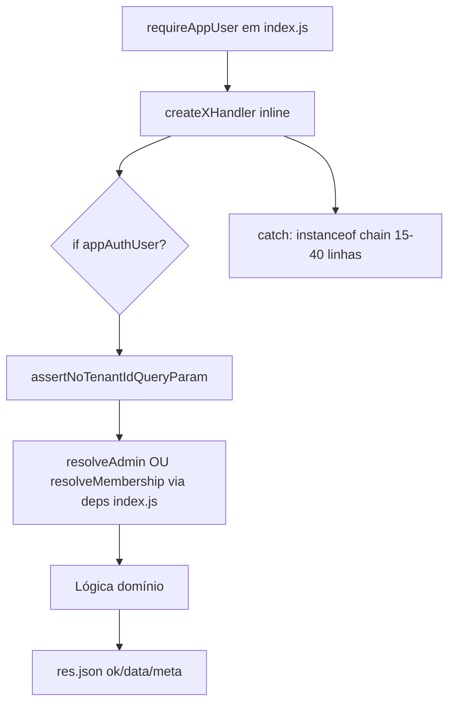
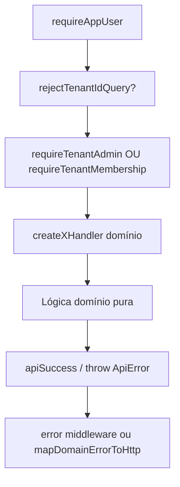

# PHASE 4.10 — Auditoria e Design: Infraestrutura Admin API V3

**Documento:** `docs/reports/PHASE_4_10_API_INFRASTRUCTURE_AUDIT_AND_DESIGN.md`  
**Data:** 2026-07-08  
**Escopo:** auditoria + design **somente** — zero código, zero banco, zero Supabase, zero migrations, zero produção, zero commit.  
**Base normativa:** `docs/platform/LOVE_ODONTO_V3_MASTER_API_ARCHITECTURE.md`  
**Base factual:** `PHASE_4_OFFICIAL_API_AUDIT.md`, `PHASE_4_9_DEBUG_USER_CONTEXT_AUDIT.md`, `server/index.js`, `server/lib/*Api*.js`

---

## 1. Sumário executivo

A Admin API já possui **7 endpoints Phase 4 oficiais** extraídos para `server/lib/*Api*.js`, com padrões V3 parcialmente convergidos (envelope `{ ok, data, meta }`, rejeição de `tenant_id` query em rotas novas, logs com tags). Porém, **não existe camada comum** — a maior parte da infraestrutura vive em `server/index.js` (~4300 linhas) e é **reimportada por injeção de dependência** nos handlers.

| Dimensão | Estado atual | Risco |
|----------|--------------|-------|
| Auth middleware | 1 função (`requireAppUser`) em `index.js` | Baixo — estável, mas não extraída |
| Tenant / membership | 3 resolvers sobrepostos | **Alto** — semântica divergente legado vs Phase 4 |
| RBAC admin | Duplicado inline + `resolveAdminTenantForPermissions` | Médio |
| Envelope / erros | 6 handlers com `instanceof` chains copiadas | **Alto** — drift de HTTP codes |
| Paginação / filtros | Só em `collaboratorsApiList.js` | Baixo — ok isolado |
| Rollback | 4 padrões (Storage×2, Auth×2) sem helper | **Alto** — copy-paste |
| Storage | Logo legado + Phase 4.8C/4.8E paralelos | Médio |
| Middleware folder | **Inexistente** | — |

**Veredicto desta fase:**

| Gate | Status |
|------|--------|
| Design + inventário + plano de tickets | ✅ **READY** |
| Iniciar refatoração em massa agora | ❌ **NOT READY** — exige fundação (`api/core`) + testes de infra antes de mover handlers |

---

## 2. Inventário — funções atuais por categoria

### 2.1 Autenticação

| Função | Local | Uso |
|--------|-------|-----|
| `requireAppUser` | `server/index.js:1876` | Middleware Express — JWT Bearer → `supabase.auth.getUser` → `req.appAuthUser` |
| `requireConsoleAccess` | `server/index.js:1849` | Console platform (`/internal/platform/*`) |
| `getConsoleActorFromBearerToken` | `server/index.js:1819` | Auth console |
| `decodeJwtPayload` | `server/index.js:118` | Diagnóstico JWT (issuer mismatch) |
| `explainJwtVerifyFailure` | `server/index.js:317` | Mensagens 401 amigáveis |
| `isSupabaseNetworkError` | `server/index.js:1869` | 503 em falha de rede |
| `getAuthUserMeta` | `server/index.js:852` | `auth.admin.getUserById` — injetado nos handlers RBAC |
| `getValidAuthUserId` / `WithRetry` | `server/index.js:811+` | Provisionamento legado |
| `findAuthUserByEmail` | `server/index.js:794` | Invite/provision |

**Observação:** Phase 4 handlers repetem `if (!req.appAuthUser?.id) return 401` mesmo após `requireAppUser` — redundância defensiva copiada 6×.

### 2.2 Tenant e membership

| Função | Local | Semântica |
|--------|-------|-----------|
| `resolveActiveTenantUser` | `index.js:545` | Membership ativa; aceita `explicitTenantId` query/body (legado) |
| `getTenantUserByAuthUserId` | `index.js:584` | Alias de `resolveActiveTenantUser` |
| `getTenantAdminActorOrThrow` | `index.js:588` | Membership + `isTenantAdminRole` |
| `isActiveTenantUserRow` | `index.js:472` | Filtro status/is_active |
| `linkAuthUserToTenantMembership` | `index.js:484` | Auto-link por email (legado) |
| `resolveAuthenticatedTenantForCollaboratorsList` | `collaboratorsApiList.js:169` | Phase 4 member — **rejeita** multi-tenant ambíguo |
| `resolveAdminTenantForPermissions` | `collaboratorsPermissionsApi.js:340` | Phase 4 admin — mapeia erros → `CollaboratorsListForbiddenError` |
| `assertNoTenantIdQueryParam` | `collaboratorsApiList.js:64` | `TENANT_QUERY_FORBIDDEN` |
| `assertNoTenantIdInBody` | `collaboratorsApplyRoleTemplateApi.js:63` | `TENANT_BODY_FORBIDDEN` |
| `FORBIDDEN_TENANT_IDS` | `collaboratorsApiList.js:6` | `tenant-1`, `tenant_1` |

**Divergência crítica:**

| Resolver | `tenant_id` explícito | Guard |
|----------|----------------------|-------|
| Legado (`tenant-context`, `debug-user-context`, `users/list`, …) | ✅ aceita `?tenant_id` / body | membership ou admin |
| Phase 4+ (`collaborators`, permissions, assets) | ❌ proibido | membership ou admin via backend |

### 2.3 Admin / RBAC

| Função | Local | Uso |
|--------|-------|-----|
| `isTenantAdminRole` | `index.js:411` | `owner` \| `admin` \| `master` |
| `normalizeRoleValue` | `index.js:391` + cópias em 4 módulos | Normalização role |
| `extractPermissionFieldsFromAppMetadata` | `index.js:865` **e** `collaboratorsPermissionsApi.js:69` | **DUPLICADO** |
| `loadPermissionCatalogIds` | `collaboratorsPermissionsApi.js:233` | Catálogo 184 |
| `loadRoleDefaultIds` | `collaboratorsPermissionsApi.js:242` | Template por role |
| `resolvePermissionStateFromSources` | `collaboratorsPermissionsApi.js:105` | Leitura efetiva |
| `sparseOverridesFromEffectiveMap` | `collaboratorsPermissionsApi.js:83` | PUT permissions |
| `materializeCustomPermissionsMap` | `collaboratorsPutPermissionsApi.js:138` | PUT permissions |
| `validatePermissionsAgainstCatalog` | `collaboratorsPutPermissionsApi.js:126` | PUT permissions |
| `detectRequiresOverwrite` | `collaboratorsApplyRoleTemplateApi.js:105` | Apply template |
| `buildRoleTemplateAppMetadata` | `collaboratorsApplyRoleTemplateApi.js:122` | Apply template |
| `buildManualOverrideAppMetadata` | `collaboratorsPutPermissionsApi.js:156` | PUT permissions |
| `appendAccessAuditToAuthUser` | `index.js:896` | Audit RBAC em `app_metadata` |

### 2.4 Envelope de resposta

| Padrão | Onde | Formato |
|--------|------|---------|
| **V3 Phase 4** | `collaboratorsApiList`, `collaboratorsPermissionsApi`, `collaboratorsApplyRoleTemplateApi`, `collaboratorsPutPermissionsApi`, `assetsLogoApi`, `assetsAvatarApi` | `{ ok: true, data, meta }` / `{ ok: false, error, code, details? }` |
| **Legado flat** | `debug-user-context` | Campos soltos, sem `ok` |
| **Legado error** | `tenant-context`, `clinic-profile`, maioria `index.js` | `{ error: "..." }` sem `code` |
| **Legado success** | `users/list`, `tenant-context` parcial | `{ success: true, ... }` |
| **Identity routes** | `server/identity/routes.js` | `{ ok: true }` misturado com `{ message }` |

**Não existe** helper `apiSuccess` / `apiError` compartilhado.

### 2.5 Erros

| Tipo | Local | HTTP mapping |
|------|-------|--------------|
| `CollaboratorsListQueryError` | `collaboratorsApiList.js` | 400 |
| `CollaboratorsListForbiddenError` | `collaboratorsApiList.js` | 403 |
| `CollaboratorPermissionsNotFoundError` | `collaboratorsPermissionsApi.js` | 404 |
| `CollaboratorApplyTemplate*` (4 classes) | `collaboratorsApplyRoleTemplateApi.js` | 409/404/503/500 |
| `CollaboratorPutPermissions*` (4 classes) | `collaboratorsPutPermissionsApi.js` | idem |
| `AssetsLogo*` / `AssetsAvatar*` (5+ classes cada) | assets APIs | 400/413/403/503/500 |
| `sendAvatarError` | `assetsAvatarApi.js:395` | **Único mapper nomeado** |
| Demais handlers | inline `instanceof` chains | ~15–40 linhas duplicadas cada |

`normalizeDatabaseError` (`index.js:165`) — só rotas legadas.

### 2.6 Paginação

| Função | Local | Escopo |
|--------|-------|--------|
| `parseCollaboratorsListQuery` | `collaboratorsApiList.js:85` | page, pageSize, filtros, order |
| `paginationRange` | `collaboratorsApiList.js:135` | `{ from, to }` Supabase range |
| `DEFAULT_PAGE`, `MAX_PAGE_SIZE` | `collaboratorsApiList.js` | Constantes |

**Nenhum** endpoint Phase 4 além de `GET /collaborators` usa paginação formal hoje.

### 2.7 Ordenação e filtros

| Função | Local | Allowlists |
|--------|-------|------------|
| `parseCollaboratorsListQuery` | `collaboratorsApiList.js` | `ALLOWED_ORDER_BY`, `ALLOWED_STATUS` |
| `sanitizeSearchTerm` | `collaboratorsApiList.js:60` | search ILIKE |
| `parseBooleanQuery` | `collaboratorsApiList.js:74` | `agenda_enabled` |

Padrão **correto e isolado** — candidato a `server/lib/api/filters.js` + `sorting.js` + `pagination.js`.

### 2.8 Logs e auditoria

| Função / tag | Local | Tipo |
|--------------|-------|------|
| `[COLLABORATORS_API_LIST]` | `collaboratorsApiList.js` | Log estruturado sucesso/erro |
| `[COLLABORATOR_PERMISSIONS_API_GET]` | `collaboratorsPermissionsApi.js` | idem |
| `[COLLABORATOR_ROLE_TEMPLATE_APPLY]` | `collaboratorsApplyRoleTemplateApi.js` | idem |
| `[COLLABORATOR_PERMISSIONS_UPDATE]` | `collaboratorsPutPermissionsApi.js` | idem |
| `[ASSET_LOGO_UPLOAD]` | `assetsLogoApi.js` | idem |
| `[ASSET_AVATAR_UPLOAD]` / `[ASSET_AVATAR_SIGNED_URL]` | `assetsAvatarApi.js` | idem |
| `[TENANT_AUDIT]` | `index.js` tenant-context | **Inclui email** — fora do padrão §15 |
| `[debug-user-context]` | `index.js` | só `console.error` |
| `logCollaboratorAccessAudit` | `index.js:839` | Audit console |
| `logCollabInviteProdAudit` | `index.js:831` | Audit invite prod |
| `appendAccessAuditToAuthUser` | `index.js:896` | Persistência `access_audit_log` |
| `insertAuditLog` | `index.js:1796` | Console platform |

**Padrão handler Phase 4:** `started = Date.now()`, `logPayload`, `durationMs` — copiado 6× sem factory.

### 2.9 Resolvers de domínio

| Resolver | Local | Consumidores |
|----------|-------|--------------|
| `resolveCollaboratorInTenant` | `collaboratorsPermissionsApi.js:264` | permissions GET, apply template, PUT permissions, avatar POST/GET |
| `resolveLinkedTenantUser` | `collaboratorsPermissionsApi.js:320` | permissions, apply, PUT |
| `mapCollaboratorSummary` | `collaboratorsPermissionsApi.js:163` | permissions chain |
| `pickLinkedTenantUser` | `collaboratorsPermissionsApi.js:191` | link tenant_user ↔ collaborator |
| `buildAccessBlock` | `collaboratorsPermissionsApi.js:199` | permissions payload |
| `buildCollaboratorPermissionsPayload` | `collaboratorsPermissionsApi.js:376` | GET permissions |
| `fetchCollaboratorsListPage` | `collaboratorsApiList.js:207` | GET collaborators |
| `resolveClinicProfileForTenant` | `clinicProfileResolver.js` | tenant-context, debug, clinic-profile |

### 2.10 Rollback

| Padrão | Onde | Fluxo |
|--------|------|-------|
| **Storage → DB** | `assetsLogoApi.js`, `assetsAvatarApi.js` | upload OK → DB fail → `remove` object → `ROLLBACK_FAILED` 503 |
| **tenant_users → Auth** | `collaboratorsApplyRoleTemplateApi.js`, `collaboratorsPutPermissionsApi.js` | TU update OK → Auth fail → restore TU snapshot → `ROLLBACK_FAILED` 503 |
| **Provision** | `index.js` provision | delete auth/tenant em catch |
| **Ops scripts** | `rhBackfillToSupabase.js`, `collaboratorIdBackfill.js` | rollback de backup JSON |

**Sem** helper genérico `withRollback` / `runWithCompensation`.

### 2.11 Storage

| Módulo | Bucket | URL | Rollback |
|--------|--------|-----|----------|
| `clinicLogoStorage.js` | `clinic-logos` | pública (`getPublicUrl`) | ❌ sem rollback |
| `assetsLogoApi.js` | `clinic-logos` | pública | ✅ delete on DB fail |
| `assetsAvatarApi.js` | `collaborator-photos` | signed TTL 3600 | ✅ delete on DB fail |
| `validateLogoFileInput` | — | MIME magic bytes | reutilizado por avatar |
| `parseMultipartLogoUpload` / `parseMultipartAvatarUpload` | — | busboy | **~90% duplicado** |

### 2.12 Utilitários duplicados (cross-cutting)

| Símbolo | Ocorrências |
|---------|-------------|
| `normalizeText` | `index.js`, `collaboratorsApiList`, `collaboratorsPermissionsApi`, `collaboratorsApplyRoleTemplateApi`, `collaboratorsPutPermissionsApi`, `assetsLogoApi`, `assetsAvatarApi`, `clinicProfileResolver` |
| `normalizeRoleValue` | `index.js`, `collaboratorsPermissionsApi`, `collaboratorsApplyRoleTemplateApi`, `collaboratorsPutPermissionsApi` |
| `PRODUCTION_PROJECT_REF` | 6 módulos `server/lib/*Api*.js` (grep estático em testes) |
| `extractPermissionFieldsFromAppMetadata` | `index.js` + `collaboratorsPermissionsApi.js` (**lógica idêntica**) |

---

## 3. Endpoints — mapa V3 vs legado

### 3.1 Phase 4 oficiais (padrão convergente)

| Método | Path | Módulo | Tenant P6 | Envelope V3 | Testes |
|--------|------|--------|-----------|-------------|--------|
| GET | `/internal/app/collaborators` | `collaboratorsApiList.js` | ✅ | ✅ | 24 |
| GET | `/internal/app/collaborators/:id/permissions` | `collaboratorsPermissionsApi.js` | ✅ | ✅ | 29 |
| POST | `/internal/app/collaborators/:id/apply-role-template` | `collaboratorsApplyRoleTemplateApi.js` | ✅ | ✅ | sim |
| PUT | `/internal/app/collaborators/:id/permissions` | `collaboratorsPutPermissionsApi.js` | ✅ | ✅ | 26 |
| POST | `/internal/app/assets/logo` | `assetsLogoApi.js` | ✅ | ✅ | 23 |
| POST | `/internal/app/assets/avatar` | `assetsAvatarApi.js` | ✅ | ✅ | 30 |
| GET | `/internal/app/assets/avatar/:collaboratorId` | `assetsAvatarApi.js` | ✅ | ✅ | (mesmo arquivo) |

### 3.2 Legado / híbrido (candidatos migração tardia)

| Método | Path | Problemas vs V3 |
|--------|------|-----------------|
| GET | `/internal/app/tenant-context` | `?tenant_id`, envelope legado, log com email |
| GET | `/internal/app/debug-user-context` | ver `PHASE_4_9` — NOT READY |
| PUT | `/internal/app/clinic-profile` | `tenant_id` body, `success: true`, logo legado `data:` |
| GET | `/internal/app/users/list` | `tenant_id` query obrigatório, `{ success: true }` |
| POST | `/internal/app/collaborators/access-bundle` | parcial → substituído por PUT permissions |
| POST | `/internal/app/collaborators/link` | `tenant_id` body |
| PATCH | `/internal/app/collaborators/:id/access` | inline handler |
| + ~20 rotas identity/platform | formatos mistos |

---

## 4. Duplicações encontradas (prioridade)

| ID | Duplicação | Arquivos | Impacto |
|----|------------|----------|---------|
| D1 | Handler skeleton (401, tenant, log, catch) | 6× `create*Handler` | Manutenção |
| D2 | Error `instanceof` mapping | 6 handlers + avatar `sendAvatarError` | Drift HTTP codes |
| D3 | `extractPermissionFieldsFromAppMetadata` | `index.js` + `collaboratorsPermissionsApi.js` | Bug split-brain |
| D4 | `normalizeText` / `normalizeRoleValue` | 8 arquivos | Ruído |
| D5 | Multipart busboy parser | `assetsLogoApi` + `assetsAvatarApi` | ~90% igual |
| D6 | Storage upload + rollback | logo + avatar | Padrão repetido |
| D7 | Auth write + TU rollback | apply template + PUT permissions | Quase idêntico |
| D8 | `assertNoForbidden*FormFields` | logo, avatar, apply body | Lista campos similar |
| D9 | `PRODUCTION_PROJECT_REF` grep | 6 módulos | Ok para testes; centralizar constante |
| D10 | Admin tenant resolution | `getTenantAdminActorOrThrow` injetado + wrapper `resolveAdminTenantForPermissions` | Camadas sobrepostas |

---

## 5. Proposta de estrutura alvo

### 5.1 Princípios de separação

| Camada | Responsabilidade | Regra |
|--------|------------------|-------|
| **middleware/** | Cross-cutting HTTP: auth, guards, parse guards | Sem lógica de domínio RH |
| **lib/api/** | Infra compartilhada V3: envelope, erros, tenant, pagination | Sem regras de negócio RBAC |
| **lib/<domínio>Api.js** | Orquestração endpoint + regras de negócio | Mantém handlers factory `createXHandler` |
| **index.js** | Wiring rotas + DI Supabase + funções legado até migração | Encolher progressivamente |

### 5.2 Árvore proposta

```text
server/
├── middleware/
│   ├── requireAppUser.js          ← extrair de index.js
│   ├── requireConsoleAccess.js    ← extrair (platform)
│   ├── requireTenantMembership.js ← resolveActiveTenantUser → req.tenantContext
│   ├── requireTenantAdmin.js      ← getTenantAdminActorOrThrow → req.tenantContext
│   ├── rejectTenantIdQuery.js     ← assertNoTenantIdQueryParam como middleware
│   └── requestContext.js          ← requestId, startedAt (opcional v1.1)
│
├── lib/api/
│   ├── constants.js               ← PRODUCTION_PROJECT_REF, FORBIDDEN_TENANT_IDS
│   ├── normalize.js               ← normalizeText, normalizeEmail, normalizeRoleValue
│   ├── errors.js                  ← ApiError base + mapErrorToHttpResponse
│   ├── response.js                ← apiSuccess, apiError
│   ├── tenantContext.js           ← resolveMembershipTenant, resolveAdminTenant
│   ├── requestLog.js              ← createRequestLogger(tag), logStructured
│   ├── audit.js                   ← thin wrapper appendAccessAudit + console audit
│   ├── pagination.js              ← parsePageQuery, paginationRange
│   ├── sorting.js                 ← parseOrderQuery(allowlist)
│   ├── filters.js                 ← parseBooleanQuery, sanitizeSearchTerm
│   ├── multipart.js               ← createMultipartParser({ fields, fileField, maxBytes })
│   ├── storage.js                 ← uploadWithRollback, createSignedUrl, deleteObject
│   ├── rollback.js                ← runWithCompensation, authTuRollback
│   └── permissionsMetadata.js     ← extractPermissionFieldsFromAppMetadata (ÚNICA cópia)
│
├── lib/collaboratorsApiList.js     ← domínio (permanece)
├── lib/collaboratorsPermissionsApi.js
├── lib/collaboratorsApplyRoleTemplateApi.js
├── lib/collaboratorsPutPermissionsApi.js
├── lib/assetsLogoApi.js
├── lib/assetsAvatarApi.js
└── index.js                        ← só wiring + legado
```

### 5.3 O que deve ser **middleware**

| Middleware | Entrada | Saída `req` | Quando |
|------------|---------|-------------|--------|
| `requireAppUser` | `Authorization` | `req.appAuthUser` | Toda rota `/internal/app/*` |
| `rejectTenantIdQuery` | `req.query.tenant_id` | — ou 400 | Phase 4+ apenas |
| `requireTenantMembership` | `req.appAuthUser` | `req.tenantContext = { tenantId, tenantUser, role }` | Endpoints membro (list, avatar GET) |
| `requireTenantAdmin` | `req.appAuthUser` | `req.tenantContext` (admin) | Endpoints admin |
| `requestLogger` (opcional) | tag | `req.apiLog` | v1.1 |

**Não** colocar em middleware: resolução de colaborador, catálogo de permissões, upload de arquivo (precisa stream body).

### 5.4 O que deve ser **helper** (`lib/api/`)

| Helper | Motivo |
|--------|--------|
| `apiSuccess` / `apiError` | Envelope único §6 V3 |
| `mapDomainErrorToHttp` | Substituir 6 chains `instanceof` |
| `resolveMembershipTenant` | Unificar `resolveAuthenticatedTenantForCollaboratorsList` + partes de `resolveAdminTenantForPermissions` |
| `pagination` / `sorting` / `filters` | Reuso futuro (users list V3, audit list) |
| `createMultipartParser` | DRY logo/avatar |
| `storage.uploadWithRollback` | DRY assets |
| `rollback.authTuSnapshot` | DRY apply + PUT |
| `createRequestLogger` | DRY logPayload + durationMs |
| `normalize.*` | DRY 8 cópias |

### 5.5 O que deve permanecer **domínio**

| Módulo | Manter específico |
|--------|-------------------|
| `collaboratorsPermissionsApi` | `resolveCollaboratorInTenant`, `buildCollaboratorPermissionsPayload`, permission state machine |
| `collaboratorsApplyRoleTemplateApi` | `applyRoleTemplateToLinkedUser`, overwrite detection |
| `collaboratorsPutPermissionsApi` | `materializeCustomPermissionsMap`, sparse overrides write |
| `assetsLogoApi` | `buildLogoObjectPath`, `updateClinicProfileLogoUrlOnly` |
| `assetsAvatarApi` | `buildAvatarObjectPath`, `resolveAvatarObjectPathFromFotoUrl`, signed URL |
| `collaboratorsApiList` | `mapCollaboratorListRow`, `fetchCollaboratorsListPage` |

### 5.6 O que **não** compartilhar

| Item | Motivo |
|------|--------|
| Payload builders RBAC (`buildRoleTemplateAppMetadata` vs `buildManualOverrideAppMetadata`) | Semânticas diferentes |
| Path builders logo vs avatar | Buckets e políticas URL distintas |
| Resolução legado `explicitTenantId` | Manter isolado em rotas V2 até deprecação |
| `IdentityService` / provision | Domínio identity separado |
| Scripts ops (`rhBackfill*`) | Fora HTTP API |

---

## 6. Mapa antes / depois

### 6.1 Fluxo handler Phase 4 — hoje



### 6.2 Fluxo alvo



### 6.3 Tabela de migração por endpoint

| Endpoint | Middleware alvo | Helpers alvo | Domínio permanece |
|----------|-----------------|--------------|-------------------|
| GET `/collaborators` | membership + reject query | pagination, filters, apiSuccess | `fetchCollaboratorsListPage` |
| GET `/:id/permissions` | admin + reject query | apiSuccess, requestLog | `buildCollaboratorPermissionsPayload` |
| POST `/:id/apply-role-template` | admin + reject query | apiError, rollback.auth | `applyRoleTemplateToLinkedUser` |
| PUT `/:id/permissions` | admin + reject query | apiError, rollback.auth | `putCollaboratorPermissionsToLinkedUser` |
| POST `/assets/logo` | admin + reject query | multipart, storage, apiError | `uploadLogoAsset` |
| POST/GET `/assets/avatar` | admin POST / membership GET | multipart, storage, signed URL | `uploadAvatarAsset`, `readAvatarSignedUrl` |

---

## 7. Plano de implementação — tickets pequenos

> **Regra:** cada ticket = PR revisável + testes + zero regressão nos Vitest existentes.

### Wave 0 — Fundação (sem mudar rotas)

| Ticket | Entrega | Risco |
|--------|---------|-------|
| **4.10-T0.1** | `server/lib/api/normalize.js` + `constants.js` | Baixo |
| **4.10-T0.2** | `server/lib/api/errors.js` + `response.js` + testes unitários | Baixo |
| **4.10-T0.3** | `server/lib/api/permissionsMetadata.js` — mover `extractPermissionFieldsFromAppMetadata`; `index.js` reexporta | Médio — unificar cópia |
| **4.10-T0.4** | `server/lib/api/requestLog.js` | Baixo |
| **4.10-T0.5** | `server/lib/api/rollback.js` (storage + auth TU) | Médio |

### Wave 1 — Middleware (opt-in, 1 rota piloto)

| Ticket | Entrega | Risco |
|--------|---------|-------|
| **4.10-T1.1** | Extrair `requireAppUser.js` — `index.js` importa | Baixo |
| **4.10-T1.2** | `rejectTenantIdQuery.js` | Baixo |
| **4.10-T1.3** | `requireTenantMembership.js` + `requireTenantAdmin.js` | Médio |
| **4.10-T1.4** | Piloto: wire middleware só em `GET /collaborators` | Médio |

### Wave 2 — DRY handlers Phase 4 (um por PR)

| Ticket | Entrega | Risco |
|--------|---------|-------|
| **4.10-T2.1** | Refatorar `collaboratorsApiList` → `apiError` + middleware | Médio |
| **4.10-T2.2** | Refatorar `collaboratorsPermissionsApi` handler | Médio |
| **4.10-T2.3** | Refatorar `collaboratorsApplyRoleTemplateApi` + `rollback.auth` | Alto |
| **4.10-T2.4** | Refatorar `collaboratorsPutPermissionsApi` + `rollback.auth` | Alto |
| **4.10-T2.5** | `multipart.js` + refatorar logo + avatar | Médio |
| **4.10-T2.6** | `storage.js` + refatorar upload rollback assets | Médio |

### Wave 3 — Consolidação resolvers

| Ticket | Entrega | Risco |
|--------|---------|-------|
| **4.10-T3.1** | `tenantContext.js` unifica membership/admin | Alto |
| **4.10-T3.2** | Mover `resolveCollaboratorInTenant` → `lib/api/resolveCollaborator.js` (reexport domínio) | Médio |
| **4.10-T3.3** | Documentar contrato OpenAPI parcial Phase 4 | Baixo |

### Wave 4 — Legado (defer)

| Ticket | Entrega | Risco |
|--------|---------|-------|
| **4.10-T4.1** | `tenant-context` → envelope V3 | Alto — breaking client |
| **4.10-T4.2** | `debug-user-context` gate DEV/STAGING (4.9) | Médio |
| **4.10-T4.3** | Deprecar `access-bundle` | Médio |
| **4.10-T4.4** | `users/list` → envelope + tenant backend-only | Alto |

**Ordem segura:** T0 → T1.4 (piloto) → T2.1 → T2.2 → T2.5 → T2.3/T2.4 → T3 → T4.

---

## 8. Testes necessários

### 8.1 Infraestrutura nova (antes de migrar handlers)

| Suite | Casos |
|-------|-------|
| `api/normalize.test.js` | trim, role, email |
| `api/errors.test.js` | cada `code` → HTTP status §7 V3 |
| `api/response.test.js` | envelope success/error shape |
| `api/tenantContext.test.js` | membership, admin, ambiguous, forbidden tenants |
| `api/pagination.test.js` | page bounds, MAX_PAGE_SIZE |
| `api/rollback.test.js` | storage compensation, auth TU restore |
| `api/multipart.test.js` | limit, MIME reject, forbidden fields |

### 8.2 Regressão obrigatória por ticket

Após cada refatoração, rodar **suite Phase 4 completa**:

```text
collaboratorsListApi.test.js
collaboratorsPermissionsApi.test.js
collaboratorsApplyRoleTemplateApi.test.js
collaboratorsPutPermissionsApi.test.js
assetsLogoApi.test.js
assetsAvatarApi.test.js
```

Meta: **0 regressões**; contagem de testes ≥ atual (~162 só Phase 4).

### 8.3 Testes middleware (supertest opcional v1.1)

- 401 sem Bearer em rota piloto
- 403 non-admin em rota admin
- 400 `TENANT_QUERY_FORBIDDEN` com `?tenant_id=`

---

## 9. Riscos de regressão

| Risco | Mitigação |
|-------|-----------|
| Mudança silenciosa de HTTP status (400→403) | Golden tests por endpoint; changelog |
| `extractPermissionFields` unificação altera comportamento | Testes parity index vs permissions antes/depois |
| Middleware quebra ordem Express (body parser) | Multipart permanece no handler; middleware só pré-auth |
| Rollback helper mascara erro original | Preservar `cause` em `ApiError.details` |
| Legado depende de `?tenant_id` | Não aplicar `rejectTenantIdQuery` em rotas V2 até T4 |
| `index.js` DI quebra imports circulares | `lib/api/*` não importa domínio; domínio importa api |

---

## 10. Plano de rollback (implementação)

| Nível | Ação |
|-------|------|
| **Por PR** | Revert branch; Vitest deve passar no commit anterior |
| **Middleware** | Feature flag `USE_V3_MIDDLEWARE=1` por rota (env) — opcional T1 |
| **Helpers** | Domínio pode importar helper novo ou função antiga via reexport temporário |
| **Produção** | Não promover até homolog staging RC-03 desbloqueado |
| **Dados** | Refatoração infra é **sem migration** — rollback = deploy anterior |

---

## 11. Critérios de aceite (para iniciar refatoração)

A refatoração Wave 1+ só inicia quando:

- [ ] `server/lib/api/errors.js` + `response.js` existem com testes ≥ 90% dos codes Phase 4
- [ ] `extractPermissionFieldsFromAppMetadata` existe em **um** lugar
- [ ] `requireAppUser` extraído sem mudar comportamento (smoke manual ou teste)
- [ ] Piloto `GET /collaborators` passa Vitest 24/24 pós-middleware
- [ ] Documento de contrato amendment publicado (`PHASE_4_10` → V3 arch §31 update)
- [ ] Staging disponível para smoke opcional (não bloqueante para Wave 0–1 local)

---

## 12. Conclusão

### 12.1 Estado atual

A infraestrutura V3 **existe de forma emergente**: os handlers Phase 4 convergiram por convenção (envelope, tags, tenant backend), mas **compartilham ~40% de código estrutural por copy-paste**. `server/index.js` continua monólito de auth, tenant, audit e ~25 rotas legadas.

### 12.2 Recomendação

1. **Criar `server/lib/api/`** como fundação — sem tocar rotas na Wave 0.  
2. **Extrair middleware** de forma incremental com piloto em `GET /collaborators`.  
3. **Unificar erros e envelope** antes de migrar writes sensíveis (apply template, PUT permissions).  
4. **Manter domínio RH/RBAC/assets** nos módulos `*Api.js` atuais.  
5. **Adiar legado** (`tenant-context`, `debug-user-context`, `users/list`) para Wave 4.  
6. **Não** criar middleware de multipart nem resolver colaborador genérico prematuramente.

### 12.3 Veredicto

| Pergunta | Resposta |
|----------|----------|
| Design Phase 4.10 completo? | ✅ **READY** |
| Pode iniciar refatoração imediata em todos endpoints? | ❌ **NOT READY** |
| Pode iniciar Wave 0 (fundação + testes, zero mudança de rota)? | ✅ **READY** após aprovação deste documento |
| Produção | **Intocada** nesta e nas próximas waves até gate release |

---

## 13. Confirmações desta entrega

| Item | Status |
|------|--------|
| Código alterado | ❌ Nenhum |
| Banco / Supabase / migrations | ❌ Nenhum |
| Produção | ❌ Intocada |
| Commit | ❌ Nenhum |
| Relatório criado | ✅ `PHASE_4_10_API_INFRASTRUCTURE_AUDIT_AND_DESIGN.md` |

---

*Love Odonto V2/V3 — Phase 4.10 API Infrastructure Audit & Design. Somente auditoria e design.*
