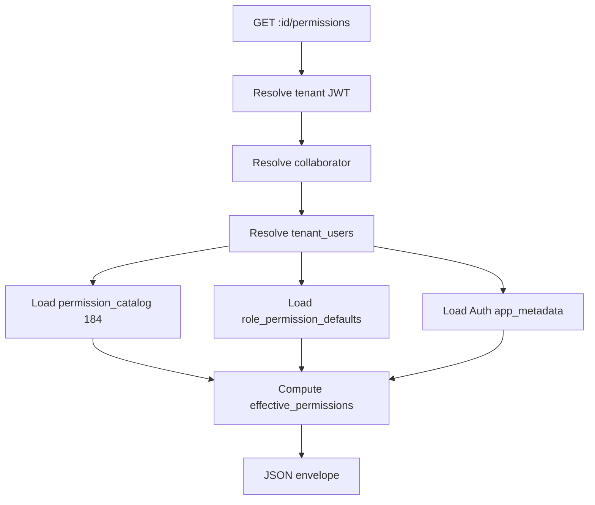

# Phase 4.3 — Contrato Oficial: `GET /internal/app/collaborators/:id/permissions`

**Documento:** `docs/reports/PHASE_4_3_GET_COLLABORATOR_PERMISSIONS_API_CONTRACT.md`  
**Data:** 2026-07-07  
**Base:** Phase 4 audit · Phase 4.1 contract · Constituição DB/QA  
**Escopo:** Contrato **somente documental** — sem código, endpoint, banco ou commit  
**Versão:** `v1.0.0-draft`

---

## 1. Objetivo do endpoint

Expor a **leitura oficial das permissões efetivas** de um colaborador RH, vinculadas ao **tenant autenticado**, via Admin API.

| Finalidade | Detalhe |
|------------|---------|
| **Primária** | Substituir leituras ad hoc de RBAC (Auth metadata + IDB mirror) na aba **Permissões** do colaborador |
| **Secundária** | Diagnosticar estado Melissa N/184, overrides custom, role template aplicado |
| **Fora de escopo v1** | Escrita (`PUT`, `apply-role-template`, `access-bundle`) |
| **Tipo** | **Read-only** — zero mutação |

**Princípio:** responder **o que o usuário vinculado pode fazer hoje**, distinguindo role default, custom 184/184 e ausência de acesso.

---

## 2. Fonte oficial das permissões hoje (runtime)

| Camada | Papel hoje | Leitura v1 API |
|--------|------------|----------------|
| **`permission_catalog`** (Supabase) | Catálogo global **184** permissões | ✅ SELECT read-only |
| **`role_permission_defaults`** (Supabase) | **175** mapeamentos `role_slug → permission_id` | ✅ SELECT read-only |
| **`tenant_users`** (Supabase) | Membership, `role`/`role_slug`, status acesso, vínculo colaborador | ✅ SELECT |
| **Auth `app_metadata`** | **Runtime canônico de escrita** (`custom_permissions`, `permission_overrides`, `has_custom_permissions`) | ✅ Admin API `getAuthUserMeta` |
| **`collaborators`** (Supabase) | Ficha RH — **não** contém RBAC | ✅ Resolver `:id` |
| **IndexedDB** (`permissionsCatalog`, `userPermissions`) | Mirror UI / `can()` local | ❌ **Proibido** no handler |
| **`tenant_user_permissions`** | **Não migrada** | ❌ v1 (placeholder futuro) |

**Escrita canônica atual (referência, não deste endpoint):**  
`POST /internal/app/collaborators/access-bundle` → Auth `app_metadata`.

---

## 3. Fonte oficial alvo (roadmap)

| Fase | SSOT permissões |
|------|-----------------|
| **Hoje (transição)** | `permission_catalog` + `role_permission_defaults` + Auth `app_metadata` snapshot |
| **Fase 2** | `tenant_user_permissions` relacional tenant-scoped |
| **Cutover** | `can()` lê Supabase; `app_metadata` vira cache JWT |

Este endpoint **deve** incluir bloco `sources.tenant_user_permissions` para forward compatibility.

---

## 4. Resolução do colaborador (`:id`)

Parâmetro `:id` — string opaca. Ordem de resolução **no tenant ativo** (fail-fast):

| # | Estratégia | Query | `resolved_by` |
|---|------------|-------|---------------|
| R1 | **UUID** (`collaborators.id`) | `.eq('id', :id)` | `uuid` |
| R2 | **`legacy_id`** (`col-*` / `col-saas-*`) | `.eq('legacy_id', :id)` | `legacy_id` |
| R3 | **`tenant_users.collaborator_uuid`** | TU com `collaborator_uuid = :id` (se UUID) → fetch collaborator | `tenant_user_uuid` |
| R4 | **`tenant_users.collaborator_id`** (text legado) | TU com `collaborator_id = :id` → `collaborator_uuid` ou match legacy | `tenant_user_legacy` |

**Regras:**

- Todas as queries **filtram** `.eq('tenant_id', resolvedTenantId)` + `.is('deleted_at', null)` em `collaborators`.
- Se nenhuma estratégia encontrar row → **404** `COLLABORATOR_NOT_FOUND`.
- **Proibido** resolver colaborador de outro tenant mesmo que `:id` exista globalmente.

**Nota staging (Juliana/Renata):** `tenant_users.collaborator_id` (text) pode divergir de `collaborators.legacy_id`; **R4 + R1/R2 via `collaborator_uuid`** garantem ponte UUID canônica (RC-01.4).

---

## 5. Resolução do usuário vinculado

Após obter `collaborator` (UUID `collaborator.id`):

```text
tenant_users WHERE tenant_id = :resolvedTenantId
  AND (
    collaborator_uuid = :collaborator.id
    OR collaborator_id IN (:collaborator.legacy_id, :collaborator.id)
    OR (email IS NOT NULL AND lower(email) = lower(:collaborator.email))
  )
ORDER BY
  collaborator_uuid match DESC,
  is_active DESC,
  updated_at DESC
LIMIT 1
```

| Resultado | Comportamento |
|-----------|---------------|
| **0 rows** | `access.linked = false` — permissões **não** inferidas de outro user |
| **1 row** | Usar para role + Auth lookup |
| **>1 rows** | Preferir match por `collaborator_uuid`; log warning `[COLLABORATORS_PERMISSIONS_DUPLICATE_TU]` |

**Auth user:** `tenant_users.user_id` → `getAuthUserMeta(user_id)` (service_role admin).

---

## 6. Leitura das permissões atuais

### 6.1 Fluxo de agregação (v1)



| Fonte | Campos lidos |
|-------|--------------|
| **app_metadata** | `has_custom_permissions`, `custom_permissions`, `permission_overrides` |
| **tenant_users** | `role`, `role_slug`, `status`, `is_active`, `has_system_access`, `has_custom_permissions`, `user_id`, `email` |
| **role_permission_defaults** | `permission_id[]` WHERE `role_slug = normalizedRole` |
| **permission_catalog** | `id`, `module_key`, `action_key`, labels (para UI futura) |
| **tenant_user_permissions** | *(v2)* `permission_id`, `allowed` WHERE `tenant_user_id` |

**Helper existente (referência lógica):** `extractPermissionFieldsFromAppMetadata` (`server/index.js:857`).

**Helper frontend (espelhar no server, sem IDB):** `resolvePermissionStateFromTenantUser` (`collaboratorPermissionPersistence.js`).

---

## 7. Diferenciar permissões padrão vs custom 184/184

| Modo | Condição | Campos resposta |
|------|----------|-----------------|
| **Role default** | `has_custom_permissions === false` AND `permission_overrides` vazio | `effective_permissions` = merge(catalog, role_defaults) |
| **Sparse overrides** | `permission_overrides` não vazio, `has_custom_permissions === false` | overrides ≠ default por perm |
| **Custom full (184/184)** | `has_custom_permissions === true` AND `custom_permissions` objeto com **184** keys | `effective_allowed_count === 184` |

**Contagem 184/184:**

- Denominador = `COUNT(permission_catalog)` via Supabase (**não** array hardcoded IDB).
- Numerador = `COUNT(effective_permissions WHERE value === true)`.
- Expor: `permissions.effective_allowed_count`, `permissions.catalog_count` (184).

**Role default count:** `permissions.role_default_count` = tamanho do set `role_permission_defaults` para o role.

---

## 8. Effective permissions (mapa efetivo)

**Definição:** para cada `permission_id` em `permission_catalog`:

```text
IF has_custom_permissions AND custom_permissions[perm_id] IS boolean:
  effective[perm_id] = custom_permissions[perm_id]
ELSE IF permission_overrides[perm_id] IS boolean:
  effective[perm_id] = permission_overrides[perm_id]
ELSE:
  effective[perm_id] = role_permission_defaults CONTAINS perm_id
```

**Master/owner/admin bypass (documentação only v1):**

- Se `role_slug IN ('master','owner','admin')` OR actor is master → `permissions.admin_bypass = true`; effective = all `true` (184/184) **somente se** `has_system_access !== false`.
- Não duplicar bypass na UI — espelhar `accessService.canManageAccess` / Constituição §11 RBAC.

**Formato:** objeto `{ "perm-modulo-acao": true|false, ... }` (184 entries).

---

## 9. Custom permissions (explicit)

Retornar bloco separado:

| Campo | Quando |
|-------|--------|
| `custom_permissions` | Objeto completo se `has_custom_permissions === true`; senão `null` |
| `permission_overrides` | Sempre objeto (pode ser `{}`) |
| `has_custom_permissions` | boolean |
| `is_full_custom` | `true` se `effective_allowed_count === catalog_count` |

---

## 10. Role template aplicado

| Campo | Valor |
|-------|-------|
| `role_template` | `normalizeRoleValue(tenant_users.role \|\| role_slug)` |
| `role_template_label` | Label PT (mapa existente `ROLE_LABELS` ou catálogo) |
| `role_defaults` | Array `permission_id[]` de `role_permission_defaults` |
| `template_source` | `"supabase.role_permission_defaults"` |

**Nota:** `POST .../apply-role-template` (futuro) **reaplica** defaults; este GET apenas **reporta** o template efetivo do membership atual.

---

## 11. Validação de tenant

**Mesma política Phase 4.2** (`collaboratorsApiList.js`):

| Regra | Detalhe |
|-------|---------|
| Resolver tenant | `resolveActiveTenantUser(authUserId, '', email)` — **sem** `?tenant_id` |
| Query `tenant_id` | **Proibida** → 400 `TENANT_QUERY_FORBIDDEN` |
| Fallbacks proibidos | `tenant-1`, seed, primeira clínica, IDB |
| Multi-clínica | 403 `TENANT_AMBIGUOUS` |

---

## 12. Validação RBAC (quem pode chamar)

| Requisito | v1 |
|-----------|-----|
| JWT app | ✅ `requireAppUser` |
| Membership ativa | ✅ |
| **Papel mínimo** | **Admin clínica** — `getTenantAdminActorOrThrow` (`owner` \| `admin` \| `master`) |

**Justificativa:** leitura de permissões de **outros** colaboradores é operação administrativa (aba Permissões, LO-QA-USR-003). Diferente de `GET /collaborators` (roster read para membros).

**Self-read (futuro v1.1):** colaborador ler **próprias** permissões via `:id` = seu `collaborator_uuid` — fora do escopo v1 (admin-only).

---

## 13. Bloqueio cross-tenant

| Check | Ação |
|-------|------|
| `collaborators.tenant_id` | MUST = `resolvedTenantId` |
| `tenant_users.tenant_id` | MUST = `resolvedTenantId` |
| Pós-map row validation | Rejeitar row com tenant divergente → 500 `TENANT_ISOLATION` (nunca vazar) |
| Auth user | Deve pertencer ao mesmo tenant (TU query já garante) |

---

## 14. Colaborador sem acesso ao sistema

Quando **não** existe `tenant_users` vinculado OU `user_id` NULL:

```json
"access": {
  "linked": false,
  "tenant_user_id": null,
  "user_id": null,
  "system_status": "none",
  "has_system_access": false,
  "role_slug": null,
  "invitation_status": "none"
},
"permissions": {
  "catalog_count": 184,
  "has_custom_permissions": false,
  "custom_permissions": null,
  "permission_overrides": {},
  "role_template": null,
  "role_defaults": [],
  "effective_permissions": {},
  "effective_allowed_count": 0,
  "note": "Colaborador RH sem vínculo de acesso ao sistema."
}
```

**HTTP 200** — não 404 (colaborador RH existe; acesso é que ausente).

---

## 15. Melissa inativa (caso explícito staging)

**Contexto documentado (RC-01):**

| Campo | Melissa staging |
|-------|-----------------|
| `collaborators.status` | `ativo` |
| `tenant_users.status` | `inactive` |
| `has_system_access` | `false` (typical) |
| RBAC salvo | Pode ter `has_custom_permissions: true` + 184/184 em `app_metadata` |
| Login | **Bloqueado** (LO-QA-USR-002) |

**Resposta esperada para admin GET:**

```json
"access": {
  "linked": true,
  "system_status": "inactive",
  "has_system_access": false,
  "role_slug": "gerente",
  "rh_status": "ativo",
  "membership_status": "inactive"
},
"permissions": {
  "has_custom_permissions": true,
  "effective_allowed_count": 184,
  "catalog_count": 184,
  "note": "Permissões persistidas; acesso ao sistema inativo — login bloqueado."
}
```

**Regra normativa:** **não** conflar `collaborators.status` com `tenant_users.status`; expor ambos explicitamente.

---

## 16. Envelope de resposta

### 16.1 Sucesso — HTTP 200

```json
{
  "ok": true,
  "data": {
    "collaborator": {
      "id": "140c5833-7fe8-429a-ace2-ba79d774d85a",
      "legacy_id": "col-c52fd5ce-4bc9-4c7d-a4c0-298525d401a3",
      "tenant_id": "7aba7127-409c-4ea4-8dbc-807efc5e189c",
      "apelido": "Melissa",
      "nome_completo": "Melissa Eduarda Guimarães",
      "email": "melissa+staging@implanprime.test",
      "status": "ativo"
    },
    "access": {
      "linked": true,
      "tenant_user_id": "tu-uuid",
      "user_id": "auth-uuid",
      "system_status": "inactive",
      "has_system_access": false,
      "membership_status": "inactive",
      "rh_status": "ativo",
      "role_slug": "gerente",
      "invitation_status": "accepted"
    },
    "permissions": {
      "catalog_count": 184,
      "role_default_count": 28,
      "effective_allowed_count": 184,
      "has_custom_permissions": true,
      "is_full_custom": true,
      "admin_bypass": false,
      "role_template": "gerente",
      "role_defaults": ["perm-comercial_captacao_leads-view", "..."],
      "custom_permissions": { "perm-...": true },
      "permission_overrides": {},
      "effective_permissions": { "perm-...": true }
    },
    "sources": {
      "collaborator": "supabase.collaborators",
      "membership": "supabase.tenant_users",
      "runtime_permissions": "auth.app_metadata",
      "catalog": "supabase.permission_catalog",
      "role_defaults": "supabase.role_permission_defaults",
      "tenant_user_permissions": "not_migrated"
    }
  },
  "meta": {
    "tenant_id": "7aba7127-409c-4ea4-8dbc-807efc5e189c",
    "collaborator_ref": "col-c52fd5ce-4bc9-4c7d-a4c0-298525d401a3",
    "resolved_by": "legacy_id",
    "read_only": true
  }
}
```

### 16.2 Payload size

- `effective_permissions` com 184 keys é **aceitável** v1 (admin-only, cache HTTP optional v1.1).
- v1.1 opcional: `?include=effective` (default true) ou `summary_only=true` (counts only).

---

## 17. Erros possíveis

| HTTP | `code` | Causa |
|------|--------|-------|
| 401 | — | JWT ausente/inválido |
| 403 | `TENANT_MEMBERSHIP_REQUIRED` | Actor sem TU ativa |
| 403 | `TENANT_AMBIGUOUS` | Multi-clínica |
| 403 | `ADMIN_REQUIRED` | Actor não admin clínica |
| 400 | `TENANT_QUERY_FORBIDDEN` | `?tenant_id` na query |
| 400 | `INVALID_COLLABORATOR_ID` | `:id` vazio |
| 404 | `COLLABORATOR_NOT_FOUND` | ID não resolve no tenant |
| 404 | `CATALOG_NOT_SEEDED` | `permission_catalog` vazio |
| 500 | `TENANT_ISOLATION` | Row cross-tenant detectada |
| 500 | — | Erro inesperado Supabase/Auth |
| 503 | — | Supabase indisponível (522/rede) |

---

## 18. Logs / auditoria

### 18.1 Structured console (v1)

```js
console.log('[COLLABORATORS_PERMISSIONS_READ]', {
  user_id,
  tenant_id,
  collaborator_id,
  collaborator_ref,
  resolved_by,
  linked: boolean,
  system_status,
  has_custom_permissions,
  effective_allowed_count,
  durationMs,
});
```

### 18.2 Proibições

- **Não** logar `custom_permissions` completo (PII/volume).
- **Não** escrever `app_metadata`, `tenant_users`, `audit_logs` v1.

---

## 19. Testes obrigatórios

| # | Caso | Esperado |
|---|------|----------|
| T1 | Sem Authorization | 401 |
| T2 | Actor sem TU | 403 |
| T3 | Actor não admin | 403 `ADMIN_REQUIRED` |
| T4 | `?tenant_id=` na query | 400 `TENANT_QUERY_FORBIDDEN` |
| T5 | Resolve por UUID | 200 |
| T6 | Resolve por `legacy_id` | 200 |
| T7 | Resolve via `tenant_users.collaborator_uuid` | 200 |
| T8 | `:id` inexistente | 404 |
| T9 | Colaborador outro tenant | 404 (não 403 leak) |
| T10 | Sem TU vinculado | 200 `access.linked=false` |
| T11 | Melissa-like inactive | 200 `system_status=inactive`, permissions preserved |
| T12 | Role default only (Paulo) | `has_custom_permissions=false`, count ≈ role_default_count |
| T13 | Custom 184/184 | `effective_allowed_count === catalog_count` |
| T14 | `orderBy`/mutação | N/A — GET only |
| T15 | Zero IndexedDB imports | static grep |
| T16 | Zero produção refs | static grep |
| T17 | Mock Supabase catalog 184 | integration |

**Suite sugerida:** `src/__tests__/collaboratorsPermissionsApi.test.js`

---

## 20. Plano de implementação

| Step | Ação | Arquivo |
|------|------|---------|
| 1 | `resolveCollaboratorInTenant(tenantId, idParam)` | `server/lib/collaboratorsPermissionsApi.js` |
| 2 | `resolveLinkedTenantUser(tenantId, collaborator)` | idem |
| 3 | `loadPermissionCatalog(supabase)` + `loadRoleDefaults(role)` | idem — **Supabase**, não IDB |
| 4 | `computeEffectivePermissions(...)` — port lógica `collaboratorPermissionPersistence` | idem |
| 5 | Reutilizar `resolveAuthenticatedTenantForCollaboratorsList` + **admin** guard | import de `collaboratorsApiList.js` |
| 6 | `GET /internal/app/collaborators/:id/permissions` | `server/index.js` |
| 7 | Testes Vitest | `src/__tests__/collaboratorsPermissionsApi.test.js` |
| 8 | Documentar em `LOVE_ODONTO_V2_MASTER_API.md` | docs |

**Dependências:**

- Phase 4.2 ✅ (tenant resolution pattern)
- `permission_catalog` seed 015 aplicado no ambiente
- Staging recovery (validação live)

**Não implementar neste step:** PUT, apply-template, writes.

---

## 21. Plano de rollback

| Nível | Ação |
|-------|------|
| R0 | Remover rota GET `:id/permissions` |
| R1 | Frontend continua `useCollaboratorAccessForm` + `access-bundle` read via TU/API existente |
| R2 | Zero migration — read-only |
| RTO | Imediato |

---

## 22. Veredicto final

### Contrato Phase 4.3

## ✅ **READY**

Especificação completa para implementação read-only alinhada à Constituição V2, Phase 4.1/4.2, Melissa/184 edge cases e roadmap `tenant_user_permissions`.

### Implementação em código

## ❌ **NOT READY**

| Bloqueador | Detalhe |
|------------|---------|
| **B1** | Staging Supabase **`BLOCKED_EXTERNAL`** (522) — impede validação Melissa/Paulo live |
| **B2** | Server **não** possui ainda loader Supabase de `role_permission_defaults` (hoje frontend usa IDB via `accessService`) |
| **B3** | Tabela `tenant_user_permissions` **inexistente** — v1 OK com placeholder, mas Fase 2 pendente |
| **B4** | Endpoint **não codificado** — depende Phase 4.2 patterns + nova lib |

**Desbloqueio:** recovery staging + implementar lib + testes mock (paralelo) → então **READY PARA IMPLEMENTAÇÃO EXECUTADA**.

---

## Apêndice A — Referências

| Artefato | Path |
|----------|------|
| Phase 4 audit | `docs/reports/PHASE_4_OFFICIAL_API_AUDIT.md` |
| GET collaborators | `docs/reports/PHASE_4_1_GET_COLLABORATORS_API_CONTRACT.md` |
| Phase 4.2 impl | `server/lib/collaboratorsApiList.js` |
| DB permissions | `docs/constitution/LOVE_ODONTO_V2_MASTER_DATABASE.md` §5.4 |
| QA Melissa | `docs/constitution/LOVE_ODONTO_V2_MASTER_QA.md` LO-QA-USR-002/003 |
| Identity Melissa | `docs/reports/RH_RC01_IDENTITY_INTEGRITY_AUDIT.md` §Melissa |
| Auth metadata extract | `server/index.js:857` |
| Permission state | `src/services/collaboratorPermissionPersistence.js` |

---

*Phase 4.3 — contrato oficial only. Zero código. Zero commit.*
