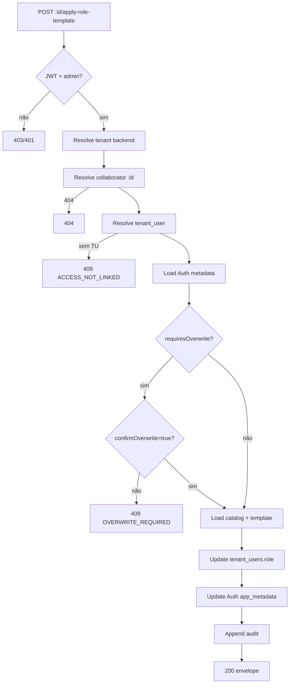

# Phase 4.5 — Contrato Oficial: `POST /internal/app/collaborators/:id/apply-role-template`

**Documento:** `docs/reports/PHASE_4_5_APPLY_ROLE_TEMPLATE_API_CONTRACT.md`  
**Data:** 2026-07-07  
**Base:** Phase 4 audit · Phase 4.3 contract · Phase 4.4 impl (`collaboratorsPermissionsApi.js`)  
**Escopo:** Contrato **somente documental** — sem código, endpoint, banco ou commit  
**Versão:** `v1.0.0-draft`

---

## 1. Objetivo do endpoint

Reaplicar **oficialmente** o template de permissões de um **role** (`role_slug`) sobre um colaborador RH que **já possui acesso ao sistema**, substituindo overrides/custom atuais pelos defaults canônicos de `role_permission_defaults`.

| Finalidade | Detalhe |
|------------|---------|
| **Primária** | Substituir fluxo UI `applyRoleWithDefaults` + save via `access-bundle` por operação **atômica e auditável** no Admin API |
| **Secundária** | Resetar Melissa-like custom 184/184 para defaults de um role escolhido (ex.: `gerente`) |
| **Fora de escopo v1** | Edição granular (`PUT .../permissions`), credenciais, convite, toggle `has_system_access` |
| **Tipo** | **Write sensível** — muta Auth `app_metadata` + `tenant_users` |

**Princípio:** o endpoint **não inventa permissões** — apenas materializa o que está seedado em `role_permission_defaults`, intersectado com `permission_catalog`.

**Diferença crítica vs GET `:id/permissions` (Phase 4.4):**

| Aspecto | GET permissions | POST apply-role-template |
|---------|-----------------|--------------------------|
| Tipo | Read-only | Write |
| Sem `tenant_user` | HTTP 200 `access.linked=false` | HTTP **409** `ACCESS_NOT_LINKED` |
| Custom 184/184 | Apenas reporta | Exige `confirmOverwrite=true` |
| Admin bypass runtime | Reporta `admin_bypass` | **Não persiste** bypass — persiste defaults do seed |

---

## 2. Fonte oficial dos templates

| Fonte | Papel | Uso neste endpoint |
|-------|-------|-------------------|
| **`public.role_permission_defaults`** | SSOT dos templates por `role_slug` | ✅ SELECT → lista `permission_id[]` |
| **`public.permission_catalog`** | Allowlist global (184 permissões) | ✅ SELECT → filtrar IDs válidos |
| **Auth `app_metadata`** | Runtime canônico de escrita RBAC | ✅ UPDATE snapshot |
| **`public.tenant_users`** | Membership + role persistido | ✅ UPDATE `role`, `role_slug`, flags custom |
| **IndexedDB** (`permissionsCatalog`, `userPermissions`) | Mirror UI local | ❌ **Proibido** |
| **Seed/mock hardcoded no handler** | — | ❌ **Proibido** |
| **`tenant_user_permissions`** | Não migrada (Fase 2) | ❌ v1 — placeholder futuro |

**Roles com defaults seedados (migration 015):**

`administrativo`, `comercial`, `financeiro`, `atendimento`, `dentista`, `recepcao`, `profissional`, `gerente`, `owner`, `admin`, `master`

**Contagem:** 175 mapeamentos totais na seed; cada role possui subset distinto (ex.: `gerente` ≈ 28, `atendimento` ≈ 12).

**Regra normativa:** `role_slug` informado no payload **deve existir** em `role_permission_defaults` com **≥ 1** `permission_id` após intersect com catálogo. Roles administrativos (`master`, `owner`, `admin`) possuem defaults **parciais** no seed (~9 each) — **não** implicam 184/184 persistidos; bypass total continua sendo **avaliação runtime** (`isTenantAdminRole`), não efeito deste POST.

---

## 3. Resolução do colaborador (`:id`)

**Reutilizar integralmente** `resolveCollaboratorInTenant` de `server/lib/collaboratorsPermissionsApi.js` (Phase 4.4).

| # | Estratégia | `resolved_by` |
|---|------------|---------------|
| R1 | `collaborators.id` (UUID) | `uuid` |
| R2 | `collaborators.legacy_id` | `legacy_id` |
| R3 | `tenant_users.collaborator_uuid` → fetch collaborator | `tenant_user_uuid` |
| R4 | `tenant_users.collaborator_id` (text) → fetch collaborator | `tenant_user_text` |

**Regras:**

- Filtro obrigatório: `.eq('tenant_id', resolvedTenantId)` + `.is('deleted_at', null)`.
- Colaborador de outro tenant → **404** `COLLABORATOR_NOT_FOUND` (sem vazar existência).
- `:id` vazio → **400** `INVALID_COLLABORATOR_ID`.

---

## 4. Resolução do `tenant_user` vinculado

**Reutilizar** `resolveLinkedTenantUser` de `server/lib/collaboratorsPermissionsApi.js`.

Prioridade de match (mesma Phase 4.3/4.4):

1. `collaborator_uuid === collaborator.id`
2. `collaborator_id === collaborator.legacy_id`
3. `collaborator_id === collaborator.id`
4. Email único no tenant (fallback controlado)

| Resultado | Comportamento **deste POST** |
|-----------|------------------------------|
| **0 rows** | **409** `ACCESS_NOT_LINKED` — colaborador RH existe, mas **não** tem acesso provisionado |
| **1 row** | Prosseguir |
| **>1 rows** | Preferir match por `collaborator_uuid`; log warning `[COLLABORATOR_APPLY_TEMPLATE_DUPLICATE_TU]` |

**Pré-condições adicionais (v1):**

| Check | Erro se falhar |
|-------|----------------|
| `tenant_users.user_id` NOT NULL | **409** `AUTH_USER_MISSING` |
| Auth user existe (`getUserById`) | **409** `AUTH_USER_MISSING` |

**Nota Melissa:** colaborador **inativo** (`status=inactive`, `has_system_access=false`) **pode** receber template — permissões persistem mesmo com login bloqueado (LO-QA-USR-002). Não reativar acesso automaticamente.

---

## 5. Quem pode aplicar template

| Requisito | Detalhe |
|-----------|---------|
| JWT app válido | `requireAppUser` |
| Membership ativa do **actor** | `getTenantAdminActorOrThrow(authUserId, '')` |
| Papel mínimo | **`owner` \| `admin` \| `master`** (`isTenantAdminRole`) |
| Tenant | Resolvido pelo backend — **sem** input do frontend |

**Proibições:**

- Membro não-admin → **403** `ADMIN_REQUIRED`
- Multi-clínica ambígua → **403** `TENANT_AMBIGUOUS`
- Sem TU ativa do actor → **403** `TENANT_MEMBERSHIP_REQUIRED`

---

## 6. RBAC obrigatório

```text
Actor JWT
  → resolveAdminTenantForPermissions (Phase 4.4)
  → getTenantAdminActorOrThrow(actorId, '')  // explicitTenantId VAZIO
  → isTenantAdminRole(actor.role || actor.role_slug)
  → resolveCollaboratorInTenant(tenantId, :id)
  → resolveLinkedTenantUser(tenantId, collaborator)
  → validate payload + overwrite guard
  → load catalog + role defaults
  → transactional write (TU + Auth)
  → audit
```

| Guard | v1 |
|-------|-----|
| Cross-tenant | `collaborator.tenant_id === tenantId` AND `tenant_user.tenant_id === tenantId` |
| Query `?tenant_id=` | **400** `TENANT_QUERY_FORBIDDEN` |
| Body `tenant_id` | **400** `TENANT_BODY_FORBIDDEN` |
| Fallback `tenant-1` | **403** `TENANT_FORBIDDEN` |
| Auto-escalation para `master` | v1.1 — fora do escopo; v1 permite se actor já é admin clínica |
| Self-target (actor aplica em si) | **Permitido** v1 com audit; UI deve confirmar |

---

## 7. Payload permitido

### 7.1 Body JSON

```json
{
  "role_slug": "gerente",
  "confirmOverwrite": true
}
```

| Campo | Tipo | Obrigatório | Regras |
|-------|------|-------------|--------|
| `role_slug` | `string` | ✅ | Normalizado via `normalizeRoleValue`; deve existir em `role_permission_defaults` |
| `confirmOverwrite` | `boolean` | Condicional | **Obrigatório `true`** quando estado atual exige overwrite (§8) |

### 7.2 Campos proibidos / ignorados

| Campo | Ação |
|-------|------|
| `tenant_id` | **400** `TENANT_BODY_FORBIDDEN` |
| `permission_overrides` | **400** `UNSUPPORTED_FIELD` — usar `PUT .../permissions` (futuro) |
| `custom_permissions` | **400** `UNSUPPORTED_FIELD` |
| `password`, `email`, `has_system_access` | **400** — escopo RBAC-only |
| `target_user_id` | **400** — resolvido via `:id` + TU link |

### 7.3 Query string

- **Proibida** `tenant_id` → **400** `TENANT_QUERY_FORBIDDEN`
- Sem outros parâmetros v1.

---

## 8. Confirmação obrigatória para sobrescrever permissões customizadas

Antes de escrever, ler estado atual via `getAuthUserMeta(tenant_user.user_id)` + flags em `tenant_users`:

```text
requiresOverwrite =
  tenant_users.has_custom_permissions === true
  OR app_metadata.has_custom_permissions === true
  OR Object.keys(app_metadata.custom_permissions || {}).length > 0
  OR Object.keys(app_metadata.permission_overrides || {}).length > 0
```

| Condição | Comportamento |
|----------|---------------|
| `requiresOverwrite === false` | `confirmOverwrite` opcional (ignorado se ausente) |
| `requiresOverwrite === true` AND `confirmOverwrite !== true` | **409** `CUSTOM_PERMISSIONS_OVERWRITE_REQUIRED` |
| `requiresOverwrite === true` AND `confirmOverwrite === true` | Prosseguir — **destrutivo** |

**Resposta 409 sugerida:**

```json
{
  "ok": false,
  "code": "CUSTOM_PERMISSIONS_OVERWRITE_REQUIRED",
  "error": "Colaborador possui permissões customizadas. Envie confirmOverwrite=true para substituir pelo template.",
  "data": {
    "has_custom_permissions": true,
    "effective_allowed_count": 184,
    "catalog_count": 184
  }
}
```

**UI existente:** espelhar prompt de `CollaboratorPermissionsHub` (`roleChangePrompt`) — confirmar antes de POST.

---

## 9. Como usar `role_permission_defaults`

### 9.1 Algoritmo de materialização

```text
catalogIds = SELECT id FROM permission_catalog ORDER BY sort_order
templateIds = SELECT permission_id FROM role_permission_defaults WHERE role_slug = :role_slug
validTemplateIds = templateIds FILTER id IN catalogIds

effectiveMap = {}
FOR EACH id IN catalogIds:
  effectiveMap[id] = validTemplateIds CONTAINS id
```

**Propriedades:**

- Denominador sempre = `catalogIds.length` (184 pós-seed 015).
- Numerador = `validTemplateIds.length` = `applied_permissions_count`.
- Permissões fora do catálogo no defaults → **silenciosamente descartadas** (defensivo).
- Permissões do catálogo ausentes no template → persistidas como `false` no mapa efetivo.

### 9.2 Idempotência

Reaplicar o **mesmo** `role_slug` sem custom intermediário → estado estável (200, `changed=false` opcional v1.1).

---

## 10. Como atualizar `app_metadata` (runtime canônico)

**Padrão:** mesma semântica de `POST /internal/app/collaborators/access-bundle` (`server/index.js:2476`), porém **RBAC-only** (sem email/password).

### 10.1 Leitura pré-write

```js
const { data: authData } = await supabase.auth.admin.getUserById(targetUserId);
const prevMeta = authData.user.app_metadata || {};
```

### 10.2 Snapshot pós-template

```js
const nextMeta = {
  ...prevMeta,
  tenant_id: tenantId,           // preservar / garantir
  role: normalizedRoleSlug,
  has_custom_permissions: false,
  permission_overrides: {},
  custom_permissions: undefined, // DELETE key — não enviar objeto vazio como custom
};
// Remover custom_permissions explicitamente (delete key, como access-bundle)
```

**Mapa efetivo:** **não** persistir `effective_permissions` completo (184 keys) em v1 — apenas flags de modo role-default. Runtime reconstrói via GET `:id/permissions`.

**Alternativa v1.1 (defer):** persistir sparse map apenas se necessário para JWT offline — **fora do escopo v1**.

### 10.3 Write Auth

```js
await supabase.auth.admin.updateUserById(targetUserId, { app_metadata: nextMeta });
```

### 10.4 Update `tenant_users`

```js
await supabase.from('tenant_users').update({
  role: normalizedRoleSlug,
  role_slug: normalizedRoleSlug,
  has_custom_permissions: false,  // best-effort se coluna existir
  updated_at: now(),
}).eq('id', tenantUser.id).eq('tenant_id', tenantId);
```

**Não alterar:** `status`, `is_active`, `has_system_access`, `email`, `user_id`, `collaborator_id`, `collaborator_uuid`.

### 10.5 Pós-write

| Ação | v1 | Notas |
|------|-----|-------|
| Revogar sessões JWT | **Opcional v1.1** | Recomendado quando target `system_status=active` |
| Invalidar cache frontend | Responsabilidade caller | Evento `PERMISSION_CHANGED` |
| Dual-write IDB | ❌ Proibido no handler | Frontend RC-05+ |

---

## 11. Compatibilidade futura com `tenant_user_permissions`

| Fase | Comportamento |
|------|---------------|
| **v1 (este contrato)** | Escreve **somente** Auth + `tenant_users`; resposta inclui `sources.tenant_user_permissions: "not_migrated"` |
| **v2 (cutover)** | Após INSERT/UPSERT em `tenant_user_permissions`, manter Auth como cache JWT |
| **v2 write order** | 1) Postgres relacional 2) Auth snapshot 3) audit — rollback se Auth falhar após PG |

**Placeholder resposta:**

```json
"sources": {
  "role_permission_defaults": "supabase",
  "permission_catalog": "supabase",
  "runtime_write": "auth.app_metadata",
  "tenant_user_permissions": "not_migrated"
}
```

**Flag forward-compat (header/body v2):** `persist_relational: true` — ignorado em v1.

---

## 12. Auditoria obrigatória

### 12.1 Console structured log

```js
console.log('[COLLABORATOR_ROLE_TEMPLATE_APPLY]', {
  tenant_id,
  user_id,              // actor
  collaborator_ref,
  collaborator_id,
  tenant_user_id,
  target_user_id,
  resolved_by,
  role_slug,
  previous_role_slug,
  requires_overwrite,
  confirm_overwrite,
  applied_permissions_count,
  catalog_count,
  durationMs,
});
```

**Proibições:** não logar mapas completos de permissões, senhas, tokens.

### 12.2 Persistência em Auth (target user)

Reutilizar `appendAccessAuditToAuthUser(targetUserId, entry)`:

```json
{
  "action": "role_template_applied",
  "audit_event": "COLLABORATOR_ROLE_TEMPLATE_APPLIED",
  "role_slug": "gerente",
  "previous_role_slug": "atendimento",
  "applied_permissions_count": 28,
  "confirm_overwrite": true,
  "actor_user_id": "...",
  "tenant_id": "...",
  "collaborator_id": "...",
  "at": "2026-07-07T19:00:00.000Z"
}
```

### 12.3 Log operacional existente

Emitir também `logCollaboratorAccessAudit({ ... })` alinhado a provision/access flows.

### 12.4 v2 — tabela `audit_logs`

Defer — quando existir, duplicar evento relacional tenant-scoped.

---

## 13. Logs

| Tag | Quando |
|-----|--------|
| `[COLLABORATOR_ROLE_TEMPLATE_APPLY]` | Sucesso / erro de negócio |
| `[COLLABORATOR_APPLY_TEMPLATE_DUPLICATE_TU]` | Warning — múltiplos TU candidatos |
| `[COLLAB_ACCESS_AUDIT]` | Entrada persistida |
| `[COLLAB_ACCESS_AUDIT] falha ao persistir` | Falha não-fatal audit write |

**Guard DEV:** `if (import.meta.env?.DEV)` não se aplica no server — usar `process.env.NODE_ENV !== 'production'` para debug extra.

---

## 14. Erros possíveis

| HTTP | `code` | Causa |
|------|--------|-------|
| 401 | — | JWT ausente/inválido |
| 403 | `TENANT_MEMBERSHIP_REQUIRED` | Actor sem TU ativa |
| 403 | `TENANT_AMBIGUOUS` | Actor multi-clínica |
| 403 | `ADMIN_REQUIRED` | Actor não admin clínica |
| 403 | `TENANT_FORBIDDEN` | `tenant-1` / proibido |
| 400 | `TENANT_QUERY_FORBIDDEN` | `?tenant_id=` |
| 400 | `TENANT_BODY_FORBIDDEN` | `tenant_id` no body |
| 400 | `INVALID_COLLABORATOR_ID` | `:id` vazio |
| 400 | `INVALID_ROLE_SLUG` | `role_slug` ausente/vazio |
| 400 | `UNSUPPORTED_FIELD` | Campos RBAC manual no body |
| 404 | `COLLABORATOR_NOT_FOUND` | `:id` não resolve no tenant |
| 404 | `ROLE_TEMPLATE_NOT_FOUND` | `role_slug` sem rows em `role_permission_defaults` |
| 404 | `CATALOG_NOT_SEEDED` | `permission_catalog` vazio |
| 409 | `ACCESS_NOT_LINKED` | Colaborador sem `tenant_user` / sem acesso provisionado |
| 409 | `AUTH_USER_MISSING` | TU sem `user_id` ou Auth user inexistente |
| 409 | `CUSTOM_PERMISSIONS_OVERWRITE_REQUIRED` | Custom/overrides sem `confirmOverwrite=true` |
| 500 | `TENANT_ISOLATION` | Row cross-tenant detectada |
| 500 | `AUTH_WRITE_FAILED` | Falha `updateUserById` após TU update — ver rollback §15 |
| 500 | — | Erro inesperado |
| 503 | — | Supabase indisponível (522/rede) |

---

## 15. Plano de rollback

### 15.1 Falha antes de qualquer write

- Nenhum side effect — retornar erro adequado.

### 15.2 Falha após TU update, antes Auth

| Passo | Ação |
|-------|------|
| R1 | Tentar reverter `tenant_users.role` / `role_slug` / `has_custom_permissions` para snapshot pré-op |
| R2 | Log `[COLLABORATOR_ROLE_TEMPLATE_ROLLBACK]` |
| R3 | Retornar **500** `AUTH_WRITE_FAILED` |

### 15.3 Falha após Auth, audit falhou

- Auth write **não** reverter automaticamente (estado desejado alcançado).
- Log erro audit; retornar **200** com warning `audit_persisted: false` (v1.1) ou **500** estrito (v1 — escolher na impl.: recomendado **200** + warning, RBAC já aplicado).

### 15.4 Rollback operacional pós-deploy

| Nível | Ação |
|-------|------|
| R0 | Remover rota POST |
| R1 | Frontend volta `applyRoleWithDefaults` + `access-bundle` |
| R2 | Reaplicar template manual via access-bundle existente |
| RTO | Imediato (remover rota) |

### 15.5 Snapshot pré-write (obrigatório)

Guardar em memória durante request:

```text
previous_role_slug
previous_has_custom_permissions
previous_app_metadata.permission_overrides
previous_app_metadata.custom_permissions (hash/count only in logs)
```

---

## 16. Envelope de resposta

### 16.1 Sucesso — HTTP 200

```json
{
  "ok": true,
  "data": {
    "collaborator_id": "140c5833-7fe8-429a-ace2-ba79d774d85a",
    "tenant_user_id": "tu-uuid",
    "target_user_id": "auth-uuid",
    "role_slug": "gerente",
    "previous_role_slug": "atendimento",
    "applied_permissions_count": 28,
    "catalog_count": 184,
    "has_custom_permissions": false,
    "overwrite_confirmed": true,
    "source": "role_permission_defaults"
  },
  "meta": {
    "tenant_id": "7aba7127-409c-4ea4-8dbc-807efc5e189c",
    "collaborator_ref": "col-melissa-staging",
    "resolved_by": "legacy_id",
    "changed_by": "auth-actor-uuid",
    "audit_event": "COLLABORATOR_ROLE_TEMPLATE_APPLIED",
    "read_only": false
  }
}
```

### 16.2 Campos derivados

| Campo | Regra |
|-------|-------|
| `applied_permissions_count` | `COUNT(validTemplateIds)` |
| `has_custom_permissions` | Sempre `false` pós-sucesso |
| `overwrite_confirmed` | Valor efetivo de `confirmOverwrite` usado |
| `source` | Constante `"role_permission_defaults"` v1 |

---

## 17. Testes obrigatórios

| # | Caso | Esperado |
|---|------|----------|
| T1 | Sem Authorization | 401 |
| T2 | Actor sem TU | 403 `TENANT_MEMBERSHIP_REQUIRED` |
| T3 | Actor não admin | 403 `ADMIN_REQUIRED` |
| T4 | `?tenant_id=` | 400 `TENANT_QUERY_FORBIDDEN` |
| T5 | Body `tenant_id` | 400 `TENANT_BODY_FORBIDDEN` |
| T6 | Resolve `:id` por UUID | 200 |
| T7 | Resolve por `legacy_id` | 200 |
| T8 | Resolve via `tenant_user_uuid` | 200 |
| T9 | Colaborador outro tenant | 404 |
| T10 | Colaborador sem TU (Renata-like) | **409** `ACCESS_NOT_LINKED` |
| T11 | TU sem `user_id` | **409** `AUTH_USER_MISSING` |
| T12 | `role_slug` inexistente | 404 `ROLE_TEMPLATE_NOT_FOUND` |
| T13 | Custom 184/184 sem confirm | **409** `CUSTOM_PERMISSIONS_OVERWRITE_REQUIRED` |
| T14 | Custom + `confirmOverwrite=true` | 200, `has_custom_permissions=false` |
| T15 | Melissa inactive + confirm | 200, `system_status` inalterado (via GET follow-up) |
| T16 | `applied_permissions_count` = defaults gerente | 200, count ≈ 28 |
| T17 | Só IDs do catálogo aplicados | mock — nenhum ID alienígena |
| T18 | Auth `app_metadata` limpo | `custom_permissions` removido, overrides `{}` |
| T19 | `tenant_users.role_slug` atualizado | mock spy |
| T20 | Audit entry append | `appendAccessAuditToAuthUser` chamado |
| T21 | Zero IndexedDB imports | static grep |
| T22 | Zero `.insert/.update` em `tenant_user_permissions` | static grep v1 |
| T23 | Idempotência mesmo role | 200 estável |
| T24 | Produção não referenciada como alvo | static grep |

**Suite sugerida:** `src/__tests__/collaboratorsApplyRoleTemplateApi.test.js`  
**Reuso:** mocks de `collaboratorsPermissionsApi.test.js` + spy Auth admin.

---

## 18. Plano de implementação (referência — não executar neste step)

| Step | Ação | Arquivo |
|------|------|---------|
| 1 | `detectRequiresOverwrite(tenantUser, appMetadata)` | `server/lib/collaboratorsApplyRoleTemplateApi.js` |
| 2 | `buildTemplateEffectiveMap(catalogIds, templateIds)` | idem |
| 3 | Reexport/wrap `resolveCollaboratorInTenant`, `resolveLinkedTenantUser`, `resolveAdminTenantForPermissions` | import de `collaboratorsPermissionsApi.js` |
| 4 | `applyRoleTemplateToTarget({ tenantId, tenantUser, roleSlug, actor, confirmOverwrite })` | idem |
| 5 | `POST /internal/app/collaborators/:id/apply-role-template` | `server/index.js` |
| 6 | Testes Vitest T1–T24 | `src/__tests__/collaboratorsApplyRoleTemplateApi.test.js` |
| 7 | Wire frontend `CollaboratorPermissionsHub` → POST dedicado (Phase 4.6+) | `useCollaboratorAccessForm.js` |

**Dependências satisfeitas:**

- Phase 4.4 resolvers ✅ (`collaboratorsPermissionsApi.js`)
- Seed 015 (`permission_catalog`, `role_permission_defaults`) ✅
- Pattern Auth write (`access-bundle`) ✅
- Audit helper (`appendAccessAuditToAuthUser`) ✅

**Dependências pendentes (validação live):**

- Staging Supabase recovery (RC-03.9 `BLOCKED_EXTERNAL`)

---

## 19. Diagrama de fluxo



---

## 20. Veredicto final

### Contrato Phase 4.5

## ✅ **READY PARA IMPLEMENTAÇÃO**

Especificação completa para endpoint write sensível, alinhada à Constituição V2, Phase 4.3/4.4, seed 015, padrão `access-bundle`, guard `confirmOverwrite`, auditoria e roadmap `tenant_user_permissions`.

### Implementação executada + validação live

## ❌ **NOT READY**

| Bloqueador | Detalhe |
|------------|---------|
| **B1** | Endpoint **não codificado** (escopo deste step = contrato only) |
| **B2** | Staging Supabase **`BLOCKED_EXTERNAL`** (522) — impede soak Melissa/gerente live |
| **B3** | Frontend ainda usa `applyRoleWithDefaults` local + `access-bundle` — integração POST pendente |
| **B4** | Política revogação JWT pós-RBAC change não padronizada (v1.1) |

**Desbloqueio:** implementar `collaboratorsApplyRoleTemplateApi.js` + testes mock (paralelo ao recovery staging) → **READY EXECUTADO**; soak live após RC-03 recovery.

---

## Apêndice A — Referências

| Artefato | Path |
|----------|------|
| Phase 4 audit | `docs/reports/PHASE_4_OFFICIAL_API_AUDIT.md` |
| GET permissions contract | `docs/reports/PHASE_4_3_GET_COLLABORATOR_PERMISSIONS_API_CONTRACT.md` |
| GET permissions impl | `server/lib/collaboratorsPermissionsApi.js` |
| access-bundle write | `server/index.js:2341` |
| Auth metadata extract | `server/index.js:857` |
| Audit append | `server/index.js:889` |
| Seed RBAC | `supabase/migrations/015_permission_catalog_seed.sql` |
| UI apply role | `src/hooks/useCollaboratorAccessForm.js:289` |
| QA Melissa | `docs/constitution/LOVE_ODONTO_V2_MASTER_QA.md` LO-QA-USR-002/003 |

---

*Phase 4.5 — contrato oficial only. Zero código. Zero commit. Zero produção.*
