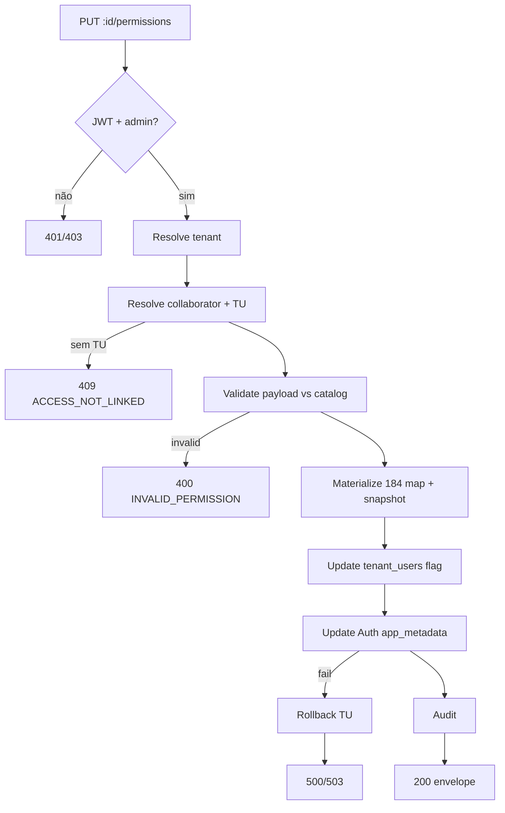

# Phase 4.6 — Contrato Oficial: `PUT /internal/app/collaborators/:id/permissions`

**Documento:** `docs/reports/PHASE_4_6_PUT_COLLABORATOR_PERMISSIONS_API_CONTRACT.md`  
**Data:** 2026-07-07  
**Base:** V3 Master API Architecture · Phase 4.3/4.5 contracts · Phase 4.4/4.5B impl  
**Escopo:** Contrato **somente documental** — sem código, endpoint, banco ou commit  
**Versão:** `v1.0.0-draft`

---

## 1. Objetivo do endpoint

Persistir **manualmente** o mapa de permissões customizadas de um colaborador com acesso ao sistema, substituindo/evoluindo o runtime RBAC canônico em Auth `app_metadata`.

| Finalidade | Detalhe |
|------------|---------|
| **Primária** | Substituir o save granular da aba **Permissões** (`useCollaboratorAccessForm` → `access-bundle`) por operação REST dedicada |
| **Secundária** | Suportar Melissa 184/184, subsets parciais e ajustes admin sem reaplicar template |
| **Fora de escopo v1** | Credenciais, convite, toggle `has_system_access`, CRUD RH |
| **Tipo** | **Write sensível** — muta Auth + `tenant_users` |

**Princípio:** o admin envia **somente** permissões válidas do catálogo; o backend materializa mapa completo (184 keys), marca custom e audita.

---

## 2. Diferença entre `apply-role-template` e `PUT permissions`

| Dimensão | `POST .../apply-role-template` (4.5B) | `PUT .../permissions` (4.6) |
|----------|--------------------------------------|----------------------------|
| **Intenção** | Resetar para **defaults oficiais** de um role | **Override manual** admin |
| **Payload** | `{ role_slug, confirmOverwrite? }` | `{ permissions: { perm-id: bool }, reason? }` |
| **`has_custom_permissions`** | Sempre `false` pós-sucesso | Sempre `true` pós-sucesso |
| **`custom_permissions`** | Removido / limpo | Mapa completo 184 keys persistido |
| **`role_slug` em `tenant_users`** | **Alterado** para template | **Preservado** (não alterar) |
| **`role_template` em app_metadata** | = `role_slug` aplicado | `null` ou `"custom"` (ver §11) |
| **Fonte defaults** | `role_permission_defaults` | `permission_catalog` + merge parcial |
| **Confirmação overwrite** | Obrigatória se já custom | N/A — PUT **é** overwrite explícito |
| **Sem tenant_user** | 409 `ACCESS_NOT_LINKED` | 409 `ACCESS_NOT_LINKED` |
| **Audit event** | `COLLABORATOR_ROLE_TEMPLATE_APPLIED` | `COLLABORATOR_PERMISSIONS_UPDATED` |

**Regra:** não duplicar lógica de `access-bundle` credenciais — PUT permissions é **RBAC-only**.

---

## 3. Fonte oficial de permissões

| Camada | Papel | PUT v1 |
|--------|-------|--------|
| **`permission_catalog`** (Supabase) | Allowlist **184** `permission_id` | ✅ SELECT — validação payload |
| **`role_permission_defaults`** | Base para merge parcial | ✅ SELECT read-only (role atual TU) |
| **Auth `app_metadata`** | Runtime write canônico | ✅ UPDATE `custom_permissions`, flags |
| **`tenant_users`** | Membership + flags | ✅ UPDATE `has_custom_permissions` only |
| **IndexedDB** | Mirror UI | ❌ **Proibido** |
| **`tenant_user_permissions`** | Relacional futuro | ❌ placeholder `"not_migrated"` |

**IDs canônicos:** `permission_catalog.id` — formato `perm-{module_key}-{action_key}` (ex.: `perm-dashboard-view`).  
**Não** aceitar aliases `dashboard:view` no v1 — retornar **400** `INVALID_PERMISSION`.

---

## 4. Resolução do colaborador (`:id`)

**Reutilizar integralmente** `resolveCollaboratorInTenant` (`server/lib/collaboratorsPermissionsApi.js`):

| # | Estratégia | `resolved_by` |
|---|------------|---------------|
| R1 | `collaborators.id` (UUID) | `uuid` |
| R2 | `collaborators.legacy_id` | `legacy_id` |
| R3 | `tenant_users.collaborator_uuid` | `tenant_user_uuid` |
| R4 | `tenant_users.collaborator_id` (text) | `tenant_user_text` |

**Proibições:** cross-tenant → **404** `COLLABORATOR_NOT_FOUND`; `:id` vazio → **400** `INVALID_COLLABORATOR_ID`.  
**Nunca** escrever em `collaborators`.

---

## 5. Resolução do `tenant_user` vinculado

**Reutilizar** `resolveLinkedTenantUser` (Phase 4.4).

| Resultado | PUT v1 |
|-----------|--------|
| **0 rows** | **409** `ACCESS_NOT_LINKED` |
| **1 row** | Prosseguir |
| **`user_id` NULL** | **409** `ACCESS_NOT_LINKED` |
| Auth user inexistente | **409** `AUTH_USER_MISSING` |

**Pré-condição:** diferente do GET — **não** retorna 200 sem vínculo.

---

## 6. Quem pode editar permissões manualmente

| Requisito | v1 |
|-----------|-----|
| JWT app | ✅ `requireAppUser` |
| Admin clínica | ✅ `getTenantAdminActorOrThrow(actorId, '')` + `isTenantAdminRole` |
| Papel mínimo | `owner` \| `admin` \| `master` |

**403** `ADMIN_REQUIRED` se actor não admin.  
**403** `TENANT_MEMBERSHIP_REQUIRED` / `TENANT_AMBIGUOUS` conforme V3 §9.

---

## 7. Payload permitido

### 7.1 Body JSON (normativo)

```json
{
  "permissions": {
    "perm-dashboard-view": true,
    "perm-financeiro_contas_receber-view": false
  },
  "reason": "Ajuste manual pela administração"
}
```

| Campo | Tipo | Obrigatório | Regras |
|-------|------|-------------|--------|
| `permissions` | `Record<string, boolean>` | ✅ | ≥1 entry; keys ⊆ `permission_catalog.id` |
| `reason` | `string` | ❌ | Max 500 chars; audit only — **não** persistir PII sensível |

### 7.2 Campos proibidos

| Campo | Erro |
|-------|------|
| `tenant_id` | **400** `TENANT_BODY_FORBIDDEN` |
| `role_slug` / `role` | **400** `UNSUPPORTED_FIELD` — role preservado do TU |
| `has_custom_permissions` | **400** — sempre `true` pós-write |
| `custom_permissions` (top-level legado) | **400** — usar `permissions` |
| `password`, `email`, `has_system_access` | **400** |
| `target_user_id` | **400** |

### 7.3 Query

- **Proibida** `?tenant_id=` → **400** `TENANT_QUERY_FORBIDDEN`

### 7.4 Valores em `permissions`

- Apenas `true` ou `false` (boolean estrito).
- Key desconhecida → **400** `INVALID_PERMISSION` + `details.invalid_keys[]`.
- Array no lugar de object → **400** `VALIDATION_ERROR`.

---

## 8. Validação contra `permission_catalog`

```text
catalogIds = SELECT id FROM permission_catalog ORDER BY sort_order
payloadKeys = Object.keys(body.permissions)

FOR EACH key IN payloadKeys:
  IF key NOT IN catalogIds → collect invalid_keys

IF invalid_keys.length > 0 → 400 INVALID_PERMISSION

IF payloadKeys.length === 0 → 400 VALIDATION_ERROR
```

**Regra:** nunca persistir permissão fora do catálogo — fail closed.

---

## 9. Como salvar custom permissions em `app_metadata`

### 9.1 Algoritmo de materialização (v1)

```text
1. catalogIds = loadPermissionCatalogIds()
2. roleSlug = normalizeRoleValue(tenant_user.role || tenant_user.role_slug)  // PRESERVAR
3. roleDefaultIds = loadRoleDefaultIds(roleSlug)
4. roleDefaultSet = Set(roleDefaultIds)

5. effectiveMap = {}
   FOR EACH id IN catalogIds:
     IF body.permissions[id] IS boolean:
       effectiveMap[id] = body.permissions[id]
     ELSE:
       effectiveMap[id] = roleDefaultSet.has(id)

6. custom_permissions = effectiveMap   // mapa COMPLETO 184 keys
7. permission_overrides = sparseOverridesFromEffectiveMap(custom_permissions, roleDefaultSet)
8. has_custom_permissions = true
9. role_template = null                // ver §11
10. role = roleSlug                    // preservar membership role
```

**Subset parcial:** keys omitidas no payload herdam **defaults do role atual** (não do estado custom anterior).  
**184/184:** payload pode omitir keys — admin UI envia mapa completo; backend valida `custom_permissions_count === 184`.

**Alternativa UI (recomendada):** frontend envia mapa completo 184 keys após edição — backend ainda valida subset rules.

### 9.2 Write Auth

```js
const nextMeta = {
  ...prevMeta,
  tenant_id: tenantId,
  role: roleSlug,                      // inalterado vs TU
  role_slug: roleSlug,
  role_template: null,
  has_custom_permissions: true,
  custom_permissions: effectiveMap,
  permission_overrides: sparseOverrides,
};
await supabase.auth.admin.updateUserById(user_id, { app_metadata: nextMeta });
```

Espelhar semântica `access-bundle` quando `has_custom_permissions=true` (`server/index.js:2476`).

---

## 10. Como marcar `has_custom_permissions=true`

| Onde | Valor pós-PUT |
|------|---------------|
| `app_metadata.has_custom_permissions` | `true` |
| `tenant_users.has_custom_permissions` | `true` (best-effort se coluna existir) |

**Sempre** após sucesso — inclusive subset parcial (custom explícito).

---

## 11. Como limpar `role_template` aplicado

| Campo | Valor pós-PUT manual |
|-------|---------------------|
| `app_metadata.role_template` | `null` |
| Resposta `data.source` | `"manual_override"` |
| Resposta implícita | role de membership **não** muda — apenas modo permissão vira custom |

**Distinção GET permissions (4.4):**

- `permissions.role_template` reportava role de membership.
- Após PUT manual: GET deve reportar `has_custom_permissions=true`, `role_template` = role membership atual, `sources.custom_permissions=app_metadata`.

---

## 12. Como preservar `role_slug`

**Norma v1:** PUT **não** altera `tenant_users.role` nem `tenant_users.role_slug`.

| Campo | Mutável no PUT? |
|-------|-----------------|
| `tenant_users.role` | ❌ |
| `tenant_users.role_slug` | ❌ |
| `app_metadata.role` | ❌ (sync read-only copy do TU) |
| `app_metadata.role_slug` | ❌ |

Para mudar role + defaults → usar `POST apply-role-template`.

---

## 13. Como calcular `effective_permissions`

Idêntico ao mapa persistido em `custom_permissions` (184 entries):

```text
effective_permissions[permId] = custom_permissions[permId]  // all boolean
effective_allowed_count = COUNT(value === true)
custom_permissions_count = Object.keys(custom_permissions).length  // 184
```

**Admin bypass:** **não** aplicar no PUT — persistir mapa literal enviado/materializado. Bypass continua avaliação runtime GET se role admin + active access.

**Resposta:**

```json
"data": {
  "effective_allowed_count": 184,
  "custom_permissions_count": 184,
  "catalog_count": 184
}
```

---

## 14. Como auditar alteração

### 14.1 Console log

```js
console.log('[COLLABORATOR_PERMISSIONS_UPDATE]', {
  tenant_id,
  actor_user_id,
  collaborator_ref,
  tenant_user_id,
  role_slug,
  custom_permissions_count,
  effective_allowed_count,
  payload_key_count,
  durationMs,
});
```

**Proibições:** não logar mapa completo; não logar `reason` se contiver PII.

### 14.2 Persistência Auth

`appendAccessAuditToAuthUser(targetUserId, { ... })`:

```json
{
  "action": "permissions_updated",
  "audit_event": "COLLABORATOR_PERMISSIONS_UPDATED",
  "role_slug": "gerente",
  "custom_permissions_count": 184,
  "effective_allowed_count": 184,
  "payload_key_count": 12,
  "reason": "Ajuste manual pela administração",
  "actor_user_id": "...",
  "tenant_id": "...",
  "collaborator_id": "..."
}
```

### 14.3 Log operacional

`logCollaboratorAccessAudit({ action: 'permissions_updated', ... })`.

---

## 15. Como fazer rollback

### 15.1 Snapshot pré-write (obrigatório)

```text
snapshot = {
  tenant_user: { has_custom_permissions, role, role_slug },
  app_metadata: { ...full copy... }
}
```

### 15.2 Ordem de write (v1)

```text
1. UPDATE tenant_users SET has_custom_permissions=true
2. UPDATE Auth app_metadata
3. IF Auth fails → ROLLBACK tenant_users snapshot
4. IF rollback fails → 503 ROLLBACK_FAILED
5. Append audit (non-fatal se falhar após Auth OK)
```

**Nota:** preferir update Auth **antes** TU flag se TU update for mais crítico — implementação deve escolher **uma** ordem e documentar; recomendado **mesma ordem 4.5B** (TU → Auth → rollback TU).

### 15.3 JWT cache

v1.1: opcional `revokeAuthUserSessions` se target active — defer v1.

---

## 16. Como lidar com Melissa 184/184

**Contexto staging:** RH `ativo`, TU `inactive`, custom 184/184 possível em `app_metadata`.

| Aspecto | PUT v1 |
|---------|--------|
| Permissões salvas | ✅ Permitido — admin override |
| Login | ❌ Continua bloqueado (`system_status=inactive`) |
| `has_system_access` | ❌ Não alterar |
| Payload Melissa | Mapa 184/184 ou parcial + merge defaults |
| Resposta | `effective_allowed_count: 184`, `has_custom_permissions: true` |

**Norma:** PUT altera **RBAC persistido**, não reativa acesso.

---

## 17. Como lidar com usuário inativo

Mesmas regras §16:

- **409** apenas se **sem** `tenant_user` / sem `user_id`.
- Inativo com TU vinculado → **200** sucesso.
- Não modificar `status`, `is_active`, `has_system_access`.

---

## 18. Como bloquear colaborador sem acesso

| Cenário | HTTP | `code` |
|---------|------|--------|
| Colaborador RH existe, sem TU | **409** | `ACCESS_NOT_LINKED` |
| TU sem `user_id` | **409** | `ACCESS_NOT_LINKED` |
| Renata-like (sem provision) | **409** | `ACCESS_NOT_LINKED` |

**Diferente do GET (4.4):** GET retorna 200 `linked=false`; PUT exige vínculo.

---

## 19. Como preparar `tenant_user_permissions` futuro

| Fase | Comportamento |
|------|---------------|
| **v1** | Write somente Auth + TU flag; resposta/meta: `"tenant_user_permissions": "not_migrated"` |
| **v2 cutover** | UPSERT `tenant_user_permissions(tenant_user_id, permission_id, allowed)` then Auth snapshot |
| **v2 read** | GET permissions prioriza relacional; Auth cache |

**Envelope sources (futuro):**

```json
"sources": {
  "permission_catalog": "supabase",
  "runtime_write": "auth.app_metadata",
  "tenant_user_permissions": "not_migrated"
}
```

---

## 20. Erros possíveis

| HTTP | `code` | Causa |
|------|--------|-------|
| 401 | — | JWT ausente/inválido |
| 403 | `ADMIN_REQUIRED` | Actor não admin |
| 403 | `TENANT_MEMBERSHIP_REQUIRED` | Actor sem TU |
| 403 | `TENANT_AMBIGUOUS` | Multi-clínica |
| 400 | `TENANT_QUERY_FORBIDDEN` | `?tenant_id` |
| 400 | `TENANT_BODY_FORBIDDEN` | `tenant_id` no body |
| 400 | `INVALID_COLLABORATOR_ID` | `:id` vazio |
| 400 | `INVALID_PERMISSION` | Key fora do catálogo |
| 400 | `VALIDATION_ERROR` | `permissions` vazio / tipo inválido |
| 400 | `UNSUPPORTED_FIELD` | Campos proibidos |
| 404 | `COLLABORATOR_NOT_FOUND` | `:id` não resolve no tenant |
| 404 | `CATALOG_NOT_SEEDED` | Catálogo vazio |
| 409 | `ACCESS_NOT_LINKED` | Sem TU / sem Auth user |
| 409 | `AUTH_USER_MISSING` | Auth lookup falhou |
| 500 | `AUTH_WRITE_FAILED` | Auth update falhou pós-TU (TU revertido) |
| 503 | `ROLLBACK_FAILED` | Auth falhou e rollback TU falhou |
| 500 | `INTERNAL_ERROR` | Erro inesperado |
| 503 | `SERVICE_UNAVAILABLE` | Supabase indisponível |

---

## 21. Testes obrigatórios

| # | Caso | Esperado |
|---|------|----------|
| T1 | Sem Authorization | 401 |
| T2 | Actor não admin | 403 `ADMIN_REQUIRED` |
| T3 | `?tenant_id=` | 400 `TENANT_QUERY_FORBIDDEN` |
| T4 | Body `tenant_id` | 400 `TENANT_BODY_FORBIDDEN` |
| T5 | `:id` inexistente | 404 |
| T6 | Colaborador outro tenant | 404 |
| T7 | Sem tenant_user (Renata) | 409 `ACCESS_NOT_LINKED` |
| T8 | TU sem `user_id` | 409 `ACCESS_NOT_LINKED` |
| T9 | Key inválida no payload | 400 `INVALID_PERMISSION` |
| T10 | `permissions` vazio | 400 `VALIDATION_ERROR` |
| T11 | Subset parcial — merge defaults role | 200, omitted keys = role default |
| T12 | Mapa 184/184 completo | 200, `effective_allowed_count` correto |
| T13 | Melissa inactive + 184/184 | 200, `has_custom_permissions=true` |
| T14 | `has_custom_permissions=true` Auth + TU | mock spy |
| T15 | `role_slug` preservado | TU role inalterado |
| T16 | `role_template` limpo | `app_metadata.role_template=null` |
| T17 | Audit append | `appendAccessAuditToAuthUser` |
| T18 | Rollback Auth fail | TU restaurado, 500 |
| T19 | Rollback fail | 503 |
| T20 | Não escreve `collaborators` | static / mock |
| T21 | Não altera `collaborator_uuid/id` | mock |
| T22 | Zero IndexedDB | grep |
| T23 | Produção intocada | grep |
| T24 | Envelope + audit_event | 200 meta |

**Suite sugerida:** `src/__tests__/collaboratorsPutPermissionsApi.test.js`

---

## 22. Plano de implementação

| Step | Ação | Arquivo |
|------|------|---------|
| 1 | `parsePutPermissionsBody(body)` | `server/lib/collaboratorsPutPermissionsApi.js` |
| 2 | `validatePermissionsAgainstCatalog(keys, catalogIds)` | idem |
| 3 | `materializeCustomPermissionsMap(catalogIds, roleDefaultIds, payloadPermissions)` | idem |
| 4 | Reutilizar resolvers Phase 4.4 | import `collaboratorsPermissionsApi.js` |
| 5 | `putCollaboratorPermissions({ ... })` + snapshot/rollback | idem |
| 6 | `PUT /internal/app/collaborators/:id/permissions` | `server/index.js` |
| 7 | Testes T1–T24 | `src/__tests__/collaboratorsPutPermissionsApi.test.js` |
| 8 | Wire frontend (Phase 4.7+) | `useCollaboratorAccessForm.js` |

**Dependências satisfeitas:**

- GET permissions ✅ (4.4)
- apply-role-template ✅ (4.5B)
- Catálogo seed 015 ✅

**Não implementar neste step:** código, migrations, frontend.

---

## 23. Plano de rollback operacional

| Nível | Ação |
|-------|------|
| R0 | Remover rota PUT |
| R1 | Frontend continua `access-bundle` RBAC write |
| R2 | Re-aplicar template via POST apply-role-template |
| R3 | Restaurar snapshot Auth manual via admin console (emergência) |
| RTO | Imediato (remover rota) |

**Rollback request-level:** snapshot §15 — revert TU + Auth em falha parcial.

---

## 24. Envelope de resposta

### 24.1 Sucesso — HTTP 200

```json
{
  "ok": true,
  "data": {
    "collaborator_id": "140c5833-7fe8-429a-ace2-ba79d774d85a",
    "tenant_user_id": "tu-uuid",
    "target_user_id": "auth-uuid",
    "role_slug": "gerente",
    "has_custom_permissions": true,
    "custom_permissions_count": 184,
    "effective_allowed_count": 184,
    "catalog_count": 184,
    "payload_key_count": 184,
    "source": "manual_override"
  },
  "meta": {
    "tenant_id": "7aba7127-409c-4ea4-8dbc-807efc5e189c",
    "collaborator_ref": "col-melissa-staging",
    "resolved_by": "legacy_id",
    "changed_by": "auth-actor-uuid",
    "audit_event": "COLLABORATOR_PERMISSIONS_UPDATED",
    "tenant_user_permissions": "not_migrated"
  }
}
```

### 24.2 Erro — permissão inválida

```json
{
  "ok": false,
  "code": "INVALID_PERMISSION",
  "error": "Permissões inválidas no payload.",
  "details": {
    "invalid_keys": ["dashboard:view", "perm-fake-action"]
  }
}
```

---

## 25. Diagrama de fluxo



---

## 26. Veredicto final

### Contrato Phase 4.6

## ✅ **READY PARA IMPLEMENTAÇÃO**

Especificação completa para PUT permissions manual, alinhada à Constituição V3, Phase 4.3–4.5B, `access-bundle` semantics, Melissa/184, rollback e roadmap relacional.

### Implementação executada + validação live

## ❌ **NOT READY**

| Bloqueador | Detalhe |
|------------|---------|
| **B1** | Endpoint **não codificado** (escopo = contrato only) |
| **B2** | Staging **BLOCKED_EXTERNAL** (522) — soak live indisponível |
| **B3** | Frontend ainda usa `access-bundle` — integração defer Phase 4.7 |
| **B4** | `tenant_user_permissions` inexistente — v1 OK com placeholder |

**Desbloqueio:** implementar `collaboratorsPutPermissionsApi.js` + testes mock (paralelo ao recovery staging).

---

## Apêndice A — Referências

| Artefato | Path |
|----------|------|
| V3 API Architecture | `docs/platform/LOVE_ODONTO_V3_MASTER_API_ARCHITECTURE.md` |
| GET permissions | `docs/reports/PHASE_4_3_GET_COLLABORATOR_PERMISSIONS_API_CONTRACT.md` |
| Apply template | `docs/reports/PHASE_4_5_APPLY_ROLE_TEMPLATE_API_CONTRACT.md` |
| GET impl | `server/lib/collaboratorsPermissionsApi.js` |
| Apply impl | `server/lib/collaboratorsApplyRoleTemplateApi.js` |
| access-bundle | `server/index.js:2341` |
| Seed catálogo | `supabase/migrations/015_permission_catalog_seed.sql` |

---

*Phase 4.6 — contrato oficial only. Zero código. Zero commit. Zero produção.*
