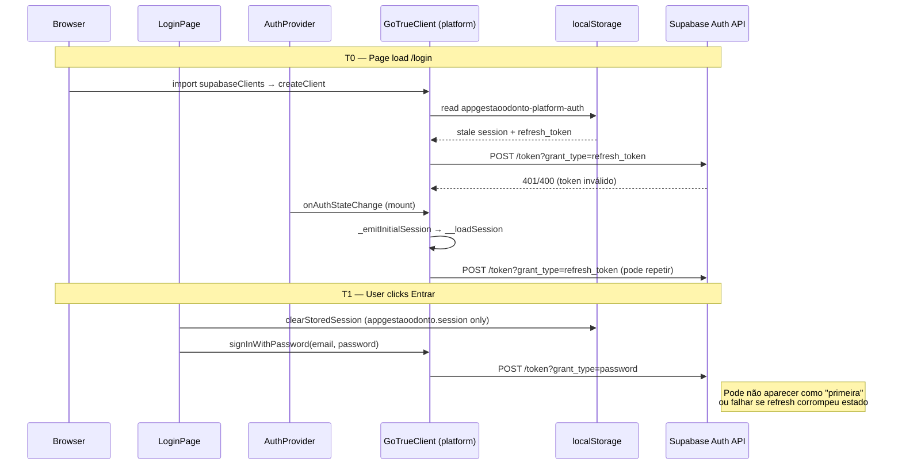

# RC-03.4 — Diagnóstico do Bootstrap Supabase Auth

**Data:** 2026-07-07  
**Escopo:** App clínica (`:5176`), rota `/login`, cliente `supabasePlatformClient`  
**Projeto Supabase (staging):** `tckdjyunwmdpqmewrwvt`  
**Produção:** `uoepkwhqztmsjnzirpev` — **não alterada, não inspecionada, fora do escopo**

---

## 1. Resumo executivo

O login **não falha** em `signInWithPassword()` — o client é criado corretamente e o método é invocado (`Login iniciado` → `chamando signInWithPassword…`).

A primeira requisição de rede observada é:

```http
POST /auth/v1/token?grant_type=refresh_token
```

e **não** `grant_type=password`.

### Causa raiz (diagnóstico)

O refresh **não é disparado pelo fluxo de login**. É disparado **automaticamente pelo `@supabase/auth-js` (GoTrueClient)** ao:

1. **Instanciar** `createClient()` com `persistSession: true` + `autoRefreshToken: true`, via `initialize()` → `_recoverAndRefresh()`.
2. **Registrar** `onAuthStateChange()` (feito pelo `AuthContext` em **toda** montagem do app, inclusive em `/login`), via `_emitInitialSession()` → `_useSession()` → `__loadSession()` → `_callRefreshToken()` quando a sessão em `localStorage` está expirada (ou dentro da margem de expiração).

A chave `localStorage` **`appgestaoodonto-platform-auth`** conserva o `refresh_token` antigo. O submit de login chama apenas `clearStoredSession()`, que remove **`appgestaoodonto.session`** (cache de UI/tenant) — **não** remove o storage do Supabase Auth.

Quando o token armazenado está inválido/revogado/expirado, o refresh falha **antes** ou **em paralelo** ao `grant_type=password`, quebrando a autenticação percebida pelo usuário.

### Quem dispara o refresh (resposta direta)

| Origem | Tipo | Dispara refresh? |
|--------|------|------------------|
| **`GoTrueClient` constructor** (`supabase-js`) | Automático | **SIM** — `_recoverAndRefresh()` |
| **`AuthContext` `onAuthStateChange`** (mount global) | App | **SIM** — `_emitInitialSession` → `__loadSession` |
| **`hydrateSaasUser` → `getPlatformSession`** | App | **SIM** — se sessão app existir no state |
| **`PlatformAuthContext` `getSession` + `onAuthStateChange`** | App | **SIM** — apenas rotas `/platform/*` (não `/login`) |
| **`signInWithPassword`** | App | **NÃO** — usa `grant_type=password` |
| **`LoginPage.clearStoredSession`** | App | **NÃO** — não limpa platform-auth |
| Código app `refreshSession()` | App | **NÃO existe** nenhuma chamada |

---

## 2. Evidências RC-03.3 (confirmadas)

Logs observados no browser (DEV):

```
[AUTH INIT]
platformUrl: https://tckdjyunwmdpqmewrwvt.supabase.co
anonKey exists: true
supabasePlatformClient will be created: true

Login iniciado
[signInSaas] client exists: true
[signInSaas] chamando signInWithPassword…
```

Network: primeira chamada = `grant_type=refresh_token`, não `grant_type=password`.

**Conclusão:** falha é **pré-login / bootstrap**, não credenciais no `signInWithPassword`.

---

## 3. Inventário completo (auditoria solicitada)

### 3.1 `getSession()` — todos os locais no `src/`

| Arquivo | Linha (aprox.) | Cliente | Quando executa |
|---------|----------------|---------|----------------|
| `auth/saasSessionResolver.js` | 132 | **Platform** | `getPlatformSession()` — hydrate, login pós-signIn, bootstrap |
| `auth/PlatformAuthContext.jsx` | 29 | **Platform** | Mount de rotas `/platform/*` |
| `services/saasAuthService.js` | 143 | **Platform** | `fetchSaasAccessBootstrapInternal` sem session explícita |
| `services/contractSaasSyncService.js` | 12 | **Platform** | Sync de contratos SaaS |
| `services/stabilityHealthService.js` | 49 | **Platform** | Health check `/stability/health` |
| `services/rhQaToolsService.js` | 68 | **Platform** | QA Tools (dev) |
| `services/clinicLogoUploadService.js` | 24 | Platform ou App | Upload de logo |
| `services/tenantIdentityService.js` | 42 | **App** | Resolução de tenant (cliente app separado) |
| `utils/firstAccessSession.js` | 196 | **Platform** | `readSession()` — primeiro acesso / recovery |

**Nota:** `getSession()` no GoTrueClient **sempre** `await initializePromise` e, se a sessão persistida estiver expirada, chama `_callRefreshToken()` internamente (`__loadSession`, linhas ~1204–1232 do `GoTrueClient.js`).

---

### 3.2 `refreshSession()` — todos os locais

| Escopo | Resultado |
|--------|-----------|
| `src/**` | **Nenhuma chamada** a `refreshSession()` |
| `@supabase/auth-js` | API pública; refresh ocorre via `_callRefreshToken()` interno |

---

### 3.3 `onAuthStateChange()` — todos os locais

| Arquivo | Linha (aprox.) | Escopo | Comportamento |
|---------|----------------|--------|---------------|
| `auth/AuthContext.jsx` | 319 | **Global** (todas as rotas, incl. `/login`) | Ignora `INITIAL_SESSION`; reage a `SIGNED_OUT` / `SIGNED_IN` se `stored.authMode === 'saas'` |
| `auth/PlatformAuthContext.jsx` | 33 | Apenas `/platform/*` | Atualiza session state do módulo legado |
| `utils/firstAccessSession.js` | 222 | Primeiro acesso / recovery | `waitForSession()` temporário |

**Efeito colateral crítico (supabase-js):** ao registrar `onAuthStateChange`, o client executa:

```
onAuthStateChange(callback)
  → await initializePromise
  → _acquireLock(...)
  → _emitInitialSession(id)
    → _useSession()
      → __loadSession()
        → _callRefreshToken()  // se sessão expirada
```

Isso ocorre **mesmo na rota `/login`**, porque `AuthProvider` envolve todo o app.

---

### 3.4 `initialize()` — todos os locais

| Escopo | Resultado |
|--------|-----------|
| `src/**` | **Nenhuma chamada explícita** |
| `GoTrueClient` constructor | **Chamada automática** em todo `createClient()` com auth persistido |

Trecho relevante (`GoTrueClient.js` ~199–302):

```javascript
// constructor
this.initialize().catch(...)

// _initialize()
await this._recoverAndRefresh();  // ← refresh automático da sessão em storage
```

---

### 3.5 `restoreSession()` — todos os locais

| Escopo | Resultado |
|--------|-----------|
| `src/**` | **Nenhuma chamada** |
| supabase-js | Equivalente funcional = `_recoverAndRefresh()` + leitura de `localStorage` |

---

### 3.6 `persistSession: true`

| Arquivo | Cliente | storageKey |
|---------|---------|------------|
| `lib/supabaseClients.js:38–39` | `supabaseAppClient` | **Padrão** (`sb-<project-ref>-auth-token`) |
| `lib/supabaseClients.js:50–51` | `supabasePlatformClient` | **`appgestaoodonto-platform-auth`** |
| `src/__tests__/rhShadowReadQa.test.js` | Mock test | `false` (somente teste) |

---

### 3.7 `autoRefreshToken: true`

| Arquivo | Cliente |
|---------|---------|
| `lib/supabaseClients.js:39` | `supabaseAppClient` |
| `lib/supabaseClients.js:51` | `supabasePlatformClient` |
| Testes | `false` em mock isolado |

**Efeitos no GoTrueClient com `autoRefreshToken: true`:**

- `_recoverAndRefresh()`: refresh imediato se `expires_at` dentro de `EXPIRY_MARGIN_MS`
- `_startAutoRefresh()`: ticker periódico (`_autoRefreshTokenTick`)
- `_onVisibilityChanged()`: re-`_recoverAndRefresh()` ao voltar para aba visível

---

### 3.8 AuthContexts

| Contexto | Arquivo | Monta em | Usa Supabase Auth |
|----------|---------|----------|-------------------|
| **`AuthProvider`** | `auth/AuthContext.jsx` | **Sempre** (`App.jsx` raiz) | **SIM** — hydrate, onAuthStateChange, login/logout |
| **`PlatformAuthProvider`** | `auth/PlatformAuthContext.jsx` | Apenas `/platform/*` | **SIM** — getSession + onAuthStateChange (legado 5176) |

Para `/login`: apenas **`AuthProvider`** está ativo (não `PlatformAuthProvider`).

---

### 3.9 Session resolvers

| Módulo | Funções-chave | Dispara getSession / refresh indireto |
|--------|---------------|--------------------------------------|
| `auth/saasSessionResolver.js` | `getPlatformSession`, `getPlatformAccessToken`, `resolveSaasUser`, `readPlatformAccessTokenFromStorage` | **SIM** via `getPlatformSession()` |
| `auth/saasSessionResolver.js` | `clearStoredSession` | **NÃO** — só remove `appgestaoodonto.session` |
| `utils/firstAccessSession.js` | `clearPlatformAuthStorage`, `bootstrapFirstAccessSession` | getSession em fluxos de convite/recovery |

---

### 3.10 Bootstraps

| Módulo | Função | Relação com Auth refresh |
|--------|--------|--------------------------|
| `services/saasAuthService.js` | `fetchSaasAccessBootstrap*` | Usa JWT **após** sessão; pode chamar `getSession()` se session null |
| `services/saasTenantBootstrapService.js` | `bootstrapSaasTenantLocalDb` | IndexedDB local — **não** chama Supabase Auth |
| `utils/firstAccessSession.js` | `bootstrapFirstAccessSession` | getSession + onAuthStateChange temporário |
| `GoTrueClient._initialize` | `_recoverAndRefresh` | **Origem principal do refresh** |

---

### 3.11 Listeners automáticos

| Listener | Onde é criado | Quando |
|----------|---------------|--------|
| `GoTrueClient.initialize()` | `createClient()` | Import de `supabaseClients.js` |
| `onAuthStateChange` (AuthContext) | `AuthContext.jsx:317–344` | Mount de `AuthProvider` |
| `onAuthStateChange` (PlatformAuthContext) | `PlatformAuthContext.jsx:33–37` | Mount `/platform/*` |
| `BroadcastChannel(storageKey)` | GoTrueClient constructor | Multi-tab sync (`appgestaoodonto-platform-auth`) |
| `visibilitychange` | GoTrueClient `_handleVisibilityChange` | Tab focus/blur → refresh |
| `_startAutoRefresh` ticker | GoTrueClient pós-init | Token próximo de expirar |
| `window 'saas:user-permissions-synced'` | `AuthContext.jsx:234` | Permissões — **não** auth Supabase |
| `initCollaboratorRhOnlineCacheSync` | `AuthContext.jsx:211` | RH cache — **não** auth Supabase |

---

## 4. Ordem de montagem e execução

### 4.1 Boot da aplicação (`/login`)

```
main.jsx
  └─ import side-effect: utils/firstAccessSession.js
  └─ initDb() (IndexedDB)
  └─ App.jsx
       └─ AuthProvider                    ← monta PRIMEIRO (envolve tudo)
            ├─ import supabaseClients.js
            │    ├─ createClient → supabaseAppClient
            │    │    └─ GoTrueClient.initialize() [#1]
            │    └─ createClient → supabasePlatformClient
            │         └─ GoTrueClient.initialize() [#2]
            │              └─ _recoverAndRefresh()
            │                   └─ POST grant_type=refresh_token  ← PRIMEIRO REFRESH
            ├─ useState(readStoredSession())  → appgestaoodonto.session
            ├─ useEffect [session]
            │    └─ se shouldHydrateAsSaas → hydrateSaasUser → getPlatformSession → getSession
            └─ useEffect [] onAuthStateChange
                 └─ _emitInitialSession → __loadSession → refresh (se expirado)
       └─ TenantProvider
       └─ BrowserRouter
            └─ Route /login → LoginPage
```

### 4.2 Submit de login (momento do clique)

```
LoginPage.handleSubmit
  ├─ clearStoredSession()           → remove só appgestaoodonto.session
  │                                  → NÃO remove appgestaoodonto-platform-auth
  └─ signInSaasWithPassword()
       └─ signInWithPassword()       → POST grant_type=password (sem await initializePromise)
```

**Paralelismo:** `signInWithPassword` **não** usa `_acquireLock` nem `await initializePromise` (GoTrueClient.js ~435). O refresh iniciado no mount pode ainda estar em flight ou ter falhado milissegundos antes.

---

## 5. Stack lógica do refresh (primeiro erro)

### 5.1 Caminho A — Constructor (mais provável no cold start)

```
createClient(platformUrl, platformKey, { auth: { persistSession: true, autoRefreshToken: true, storageKey: 'appgestaoodonto-platform-auth' } })
  GoTrueClient.constructor
    this.initialize()
      _initialize()
        _recoverAndRefresh()
          getItemAsync(localStorage, 'appgestaoodonto-platform-auth')
          // sessão válida + expires_at dentro da margem
          _callRefreshToken(currentSession.refresh_token)
            _request(POST, '/auth/v1/token?grant_type=refresh_token', { refresh_token })
              → ERRO se token revogado/inválido/antigo projeto
```

### 5.2 Caminho B — AuthContext onAuthStateChange (mount, inclusive /login)

```
AuthProvider (useEffect mount)
  supabasePlatformClient.auth.onAuthStateChange(callback)
    GoTrueClient.onAuthStateChange
      await initializePromise
      _emitInitialSession(subscriptionId)
        _useSession()
          __loadSession()
            // expires_at expirado ou dentro de EXPIRY_MARGIN_MS
            _callRefreshToken(currentSession.refresh_token)
              POST /auth/v1/token?grant_type=refresh_token
```

### 5.3 Caminho C — Hydrate (se sessão app ainda no React state)

```
AuthProvider session !== null && shouldHydrateAsSaas(session)
  hydrateSaasUser()
    getPlatformSession()                    // single-flight
      supabasePlatformClient.auth.getSession()
        __loadSession() → _callRefreshToken()  // se expirado
```

**Condição em `/login`:** ocorre se o usuário chegou ao login **sem** `logout()` completo (state React ainda tem `session`, ou `shouldHydrateAsSaas` detecta JWT residual via `readPlatformAccessTokenFromStorage()`).

---

## 6. Por que o refresh acontece **antes** do login

| # | Mecanismo | Explicação |
|---|-----------|------------|
| 1 | **Persistência automática** | `persistSession: true` faz o GoTrueClient ler `localStorage` no boot |
| 2 | **Auto-refresh habilitado** | `autoRefreshToken: true` força refresh proativo de tokens expirados/próximos de expirar |
| 3 | **Storage não limpo no login** | `LoginPage` chama `clearStoredSession()` mas **preserva** `appgestaoodonto-platform-auth` |
| 4 | **AuthProvider global** | `onAuthStateChange` registra-se em `/login` e dispara `_emitInitialSession` → `__loadSession` |
| 5 | **signInWithPassword não espera init** | Password grant não aguarda `initializePromise`; refresh do init compete na rede |
| 6 | **Dois clientes Supabase** | `supabaseAppClient` + `supabasePlatformClient` = **dois** `initialize()` no import (refresh potencial em duas storage keys) |
| 7 | **StrictMode (DEV)** | React 18 StrictMode remonta efeitos → **dois** registros de `onAuthStateChange` em dev |

---

## 7. Storage keys envolvidas

| Key | Conteúdo | Limpo no login? | Limpo no logout? |
|-----|----------|-----------------|------------------|
| `appgestaoodonto-platform-auth` | Sessão Supabase (access + **refresh_token**) | **NÃO** (`clearStoredSession`) | **SIM** (`logout()` AuthContext) |
| `appgestaoodonto.session` | Cache app (userId, tenantId, cachedUser) | **SIM** (`clearStoredSession`) | **SIM** |
| `sb-tckdjyunwmdpqmewrwvt-auth-token` (padrão) | Sessão do `supabaseAppClient` | Não automaticamente | Depende do fluxo |

---

## 8. Diagrama de sequência (login com refresh_token stale)



---

## 9. Quem chama o quê (matriz resumida)

| Componente | getSession | refresh implícito | onAuthStateChange | initialize |
|------------|------------|-------------------|-------------------|------------|
| `supabaseClients.js` (import) | — | **SIM** (constructor) | — | **SIM** (auto) |
| `AuthContext` hydrate | via `getPlatformSession` | **SIM** | registra listener | indireto |
| `AuthContext` login() | via `getPlatformSession` se needed | **SIM** | — | indireto |
| `LoginPage` submit | — | **SIM** (init prévio) | — | indireto |
| `PlatformAuthContext` | **SIM** | **SIM** | **SIM** | indireto |
| `signInSaasWithPassword` | — | não diretamente | — | — |

---

## 10. Veredicto RC-03.4

| Pergunta | Resposta |
|----------|----------|
| **Quem dispara o refresh?** | **`GoTrueClient` do `@supabase/auth-js`**, acionado por `initialize()` → `_recoverAndRefresh()` e por `onAuthStateChange()` → `_emitInitialSession()` → `__loadSession()`. O **`AuthContext`** registra `onAuthStateChange` globalmente e é o principal **gatilho de app** que amplifica o refresh no mount. |
| **Stack do primeiro erro** | `createClient` → `initialize` → `_recoverAndRefresh` → `_callRefreshToken` → `POST .../token?grant_type=refresh_token` |
| **Ordem de execução** | Import clients → auto-init → AuthProvider mount → onAuthStateChange → (opcional) hydrate → user click login → signInWithPassword |
| **Componente que monta primeiro** | **`AuthProvider`** (antes de `LoginPage`) |
| **Quem chama getSession** | `getPlatformSession` (hydrate/login), `AuthContext` listener side-effects, serviços auxiliares (ver §3.1) |
| **Quem chama refreshSession** | **Ninguém no app** — refresh é interno ao supabase-js |
| **Por que refresh antes do login** | Sessão Supabase persistida em `appgestaoodonto-platform-auth` é restaurada automaticamente no boot; login **não limpa** essa chave; refresh de token inválido executa **antes** do password grant |

---

## 11. Escopo deste relatório

- **Diagnóstico apenas** — nenhuma correção aplicada
- **Código não alterado** (exceto logs DEV pré-existentes de RC-03.3, fora do escopo deste RC)
- **Banco / Supabase remoto / produção** — não alterados

---

## 12. Direções para RC-03.5 (correção — fora do escopo RC-03.4)

> Referência para próxima etapa; **não implementado neste RC**.

1. Limpar `appgestaoodonto-platform-auth` **antes** de `signInWithPassword` na tela de login (ou `signOut({ scope: 'local' })`).
2. Avaliar `autoRefreshToken: false` no client platform até login explícito.
3. Adiar registro de `onAuthStateChange` no `AuthContext` até pós-login ou usar guard em rotas públicas.
4. Unificar semântica de logout: `clearStoredSession` vs limpeza platform-auth.
5. Em DEV, considerar impacto do React StrictMode (double mount).

---

*Relatório gerado em RC-03.4 — auditoria estática + análise do `@supabase/auth-js@2.93.3` (GoTrueClient).*
