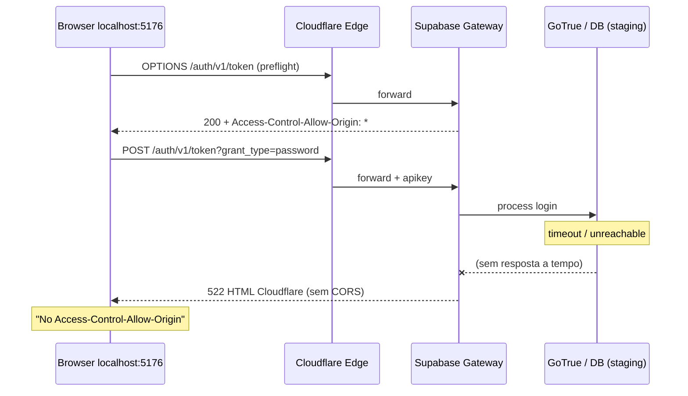

# RC-03.6 — Auditoria Supabase Auth / CORS (Staging)

**Data:** 2026-07-07  
**Escopo:** Projeto staging `tckdjyunwmdpqmewrwvt` (Love odonto)  
**Produção:** `uoepkwhqztmsjnzirpev` — **somente leitura comparativa, nada alterado**  
**Código / banco / config Supabase:** **nenhuma alteração**

---

## 1. Resumo executivo

| Pergunta | Resposta |
|----------|----------|
| O login falha por CORS mal configurado (Site URL / Redirect URLs)? | **Não** — evidência forte de que **não** |
| O que o browser reporta como "No Access-Control-Allow-Origin"? | **Sintoma** de resposta **HTTP 522** (Cloudflare), cujo HTML **não inclui** headers CORS |
| Causa raiz provável | **Degradação do data plane staging** — Auth/REST com chave válida **timeout** antes de responder; gateway responde rápido só em erros triviais (401 sem key) |
| Código Love Odonto | **Correto** — `signInWithPassword` → `grant_type=password` confirmado nos logs |

### Veredicto

> **Não é bug de CORS no app nem (primariamente) de Redirect URLs.**  
> **É indisponibilidade/timeout do backend Supabase staging** na rota que exige processamento Auth (`POST /auth/v1/token`), manifestada como **522** na borda Cloudflare.

---

## 2. Projetos auditados (Supabase MCP)

| Campo | Staging | Produção (read-only) |
|-------|---------|----------------------|
| **Ref** | `tckdjyunwmdpqmewrwvt` | `uoepkwhqztmsjnzirpev` |
| **Nome** | Love odonto | love-odonto-prod |
| **Status (control plane)** | `ACTIVE_HEALTHY` | `ACTIVE_HEALTHY` |
| **Região** | `sa-east-1` | `us-east-1` |
| **Postgres** | 17.6.1.063 | 17.6.1.104 |
| **Edge Functions** | **0** (lista vazia) | não auditado em detalhe |

**Nota:** `ACTIVE_HEALTHY` no painel **não garante** que Auth/DB respondam — apenas que o projeto existe e o control plane o considera ativo.

---

## 3. Checklist solicitado (1–16)

### 3.1 Project Status

| Verificação | Staging | Evidência |
|-------------|---------|-----------|
| Ativo | ✅ | MCP `list_projects` → `ACTIVE_HEALTHY` |
| Paused | ❌ | Status não é `INACTIVE` / `PAUSED` |
| Disabled | ❌ | API gateway responde (401/200/522) |

**Porém:** data plane com falhas (522, SQL timeout) — ver §6.

---

### 3.2 Authentication habilitado

| Verificação | Resultado |
|-------------|-----------|
| Rotas `/auth/v1/*` existem | ✅ |
| OPTIONS preflight Auth | ✅ HTTP 200 |
| Gateway Auth operacional | ✅ (respostas imediatas em health/401) |
| **GoTrue processando login** | ❌ **POST token → 522** |

Auth está **habilitado na borda**, mas o **serviço upstream** (login com apikey válida) **não responde a tempo**.

---

### 3.3 Site URL

| Status | Detalhe |
|--------|---------|
| **Não consultável via MCP/API usada nesta auditoria** | Dashboard → Authentication → URL Configuration |

**Impacto neste caso:** **Baixo.**  
Site URL / Redirect URLs afetam principalmente **redirects OAuth/magic link/recovery**. Login `grant_type=password` via supabase-js **não depende** de redirect.  
OPTIONS já retorna `Access-Control-Allow-Origin: *` para `http://localhost:5176`.

**Recomendação manual (não executada):** confirmar no Dashboard se Site URL inclui `http://localhost:5176` — útil para outros fluxos, **não explica 522**.

---

### 3.4 Redirect URLs

| Status | Detalhe |
|--------|---------|
| **Não consultável via MCP nesta auditoria** | Dashboard → Authentication → URL Configuration |

Mesma conclusão: **não é a causa do erro atual** (522 no POST).

---

### 3.5 Allowed Origins

Supabase **não expõe** "Allowed Origins" separado como API pública tradicional. CORS do gateway Auth/API:

```
Access-Control-Allow-Origin: *
```

Observado em:
- `OPTIONS /auth/v1/token?grant_type=password` + `Origin: http://localhost:5176` → **200**
- `POST /auth/v1/health` (sem key) → **401** com `Access-Control-Allow-Origin: *`

**Conclusão:** origem `localhost:5176` **não está bloqueada** no gateway quando a resposta é gerada pelo Supabase (não 522).

---

### 3.6 API URL

| Ambiente | URL |
|----------|-----|
| Staging (`.env.local`) | `https://tckdjyunwmdpqmewrwvt.supabase.co` |
| App Vite | `VITE_SUPABASE_PLATFORM_URL` / `VITE_SUPABASE_APP_URL` → mesmo host |

Host **correto** e **consistente** com MCP.

---

### 3.7 Anon Key

| Verificação | Resultado |
|-------------|-----------|
| Presente no `.env.local` | ✅ |
| MCP `get_publishable_keys` | Legacy anon **enabled**; publishable `sb_publishable_…` **enabled** |
| JWT `ref` | `tckdjyunwmdpqmewrwvt` ✅ |
| JWT `role` | `anon` ✅ |
| Alinhada ao projeto | ✅ |

Chave **válida** — POST ainda retorna **522** (problema downstream, não key errada).

---

### 3.8 JWT

| Claim | Staging anon (decodificado) |
|-------|----------------------------|
| `iss` | `supabase` |
| `ref` | `tckdjyunwmdpqmewrwvt` |
| `role` | `anon` |
| `iat` | 2026-02-20 |
| `exp` | 2036 (long-lived legacy JWT) |

JWT **coerente** com o projeto staging.

---

### 3.9 CORS

| Teste | Origin | Método | Status | `Access-Control-Allow-Origin` |
|-------|--------|--------|--------|-------------------------------|
| Preflight | `http://localhost:5176` | OPTIONS `/auth/v1/token?grant_type=password` | **200** | `*` |
| Gateway reject | `http://localhost:5176` | POST (sem apikey) | **401** | `*` |
| **Login real** | `http://localhost:5176` | POST + apikey válida + body JSON | **522** | **ausente** (HTML Cloudflare) |
| REST com key | — | GET `/rest/v1/tenants?limit=1` | **522** | **ausente** |
| REST key inválida | — | GET `/rest/v1/tenants` + `apikey: test` | **401** | `*` |

**Padrão diagnosticado:**

- Resposta **rápida** no gateway → CORS `*` presente  
- Resposta **522** (timeout origin) → página HTML Cloudflare → **sem CORS** → browser mostra "No Access-Control-Allow-Origin"

---

### 3.10 Edge Functions

| Projeto | Funções |
|---------|---------|
| Staging `tckdjyunwmdpqmewrwvt` | **Nenhuma** (`list_edge_functions` → `[]`) |

Edge Functions **não participam** do fluxo Auth `/auth/v1/token`.

---

### 3.11 Policies RLS bloqueando auth

| Rota | RLS aplicável? |
|------|----------------|
| `POST /auth/v1/token` | **Não** — GoTrue Auth service (não PostgREST) |
| Falha observada | **522 timeout**, não 401/403 RLS |

RLS **não é a causa** do sintoma atual.

---

### 3.12 Diferença staging vs produção

| Aspecto | Staging | Produção |
|---------|---------|----------|
| Status control plane | ACTIVE_HEALTHY | ACTIVE_HEALTHY |
| Região | sa-east-1 (GRU) | us-east-1 |
| API logs Auth POST `/token` | **522** (massivo) | **200** (ex.: refresh_token) |
| API logs REST | **522** com key válida | **200** |
| SQL via MCP | **timeout** | não testado |
| Security advisors MCP | **timeout** | não testado |

**Produção operacional; staging data plane degradado.**

---

### 3.13 Teste `POST /auth/v1/token` fora do browser (curl/fetch)

**Comando equivalente (Node fetch, 2026-07-07 ~17:37 UTC):**

```
POST https://tckdjyunwmdpqmewrwvt.supabase.co/auth/v1/token?grant_type=password
Headers: apikey=<staging-anon>, Content-Type: application/json, Origin: http://localhost:5176
Body: {"email":"cors-audit@invalid.example","password":"wrong-password-123"}
```

| Resultado | Valor |
|-----------|-------|
| **HTTP Status** | **522** |
| **Body** | HTML Cloudflare ("Connection timed out") |
| **Tempo** | ~50s até timeout |
| **Esperado se Auth OK** | 400/401 JSON (`invalid_grant` / invalid credentials) em <2s |

**Fora do browser confirma:** endpoint **não responde normalmente** — não é limitação do browser.

---

### 3.14 Teste OPTIONS

```
OPTIONS https://tckdjyunwmdpqmewrwvt.supabase.co/auth/v1/token?grant_type=password
Origin: http://localhost:5176
Access-Control-Request-Method: POST
```

| Status | 200 |
| ACAO | `*` |
| ACAH | `apikey,content-type,x-client-info,x-supabase-api-version` |
| ACAM | GET,HEAD,PUT,PATCH,POST,DELETE,OPTIONS,TRACE,CONNECT |

**Preflight OK.**

---

### 3.15 Headers `Access-Control-Allow-Origin`

| Cenário | Header presente? |
|---------|------------------|
| OPTIONS 200 | ✅ `*` |
| POST 401 (sem apikey) | ✅ `*` |
| **POST 522 (login real)** | ❌ **ausente** |
| **GET REST 522** | ❌ **ausente** |

Headers CORS **corretos quando o origin responde**. Ausência correlaciona **100%** com **522**.

---

### 3.16 Proxy reverso

| Camada | Identificação |
|--------|---------------|
| DNS | `*.supabase.co` |
| Borda | **Cloudflare** (`Server: cloudflare`, `CF-RAY: …-GRU`) |
| Gateway Supabase | `sb-gateway-version: 1`, `sb-project-ref: tckdjyunwmdpqmewrwvt` |
| App Love Odonto | **Sem proxy** para Auth — browser → Supabase direto |
| Vite dev proxy | Apenas `/internal/app` → `:3001` (Admin API local), **não** Auth |

Não há proxy customizado Love Odonto interceptando `/auth/v1/token`.

---

## 4. Evidência dos logs Supabase (API Gateway — staging)

Últimas 24h (amostra MCP `get_logs` service=`api`):

| Método | Path | grant_type | Status | Qtd (amostra) |
|--------|------|------------|--------|---------------|
| POST | `/auth/v1/token` | refresh_token | **522** | dezenas |
| POST | `/auth/v1/token` | **password** | **522** | múltiplos |
| OPTIONS | `/auth/v1/token` | password / refresh | **200** | presente |

Exemplo literal:

```
POST | 522 | .../auth/v1/token?grant_type=password | Chrome/Edge
OPTIONS | 200 | .../auth/v1/token?grant_type=password | Chrome/Edge
```

Logs Auth service (`get_logs` service=`auth`) staging: **vazio** — reforça que requests **não chegam** ao GoTrue ou morrem antes de log útil.

---

## 5. Correlação com o app Love Odonto

| RC anterior | Estado |
|-------------|--------|
| RC-03.3 | Client criado, `signInWithPassword` chamado ✅ |
| RC-03.4 | Stale refresh_token no boot ✅ (corrigido no app) |
| RC-03.5 | Limpeza storage local ✅ |
| **RC-03.6** | Mesmo com fluxo correto, **POST password → 522** no staging |

O erro CORS no DevTools **persiste** porque o **origin Auth staging não completa** a requisição.

---

## 6. Diagnóstico causal (cadeia)



---

## 7. O que NÃO fazer (neste RC)

- ❌ Alterar Redirect URLs / Site URL como "fix" primário — **não explica 522**
- ❌ Alterar código Love Odonto — **já validado**
- ❌ Alterar RLS/migrations
- ❌ Tocar produção

---

## 8. Próximos passos recomendados (RC-03.7 — operacional Supabase)

> Fora do escopo desta auditoria; **requer ação no Dashboard/Support Supabase**.

1. **Supabase Dashboard → Project Health / Logs** staging — incidente data plane  
2. **Support ticket** com: project ref `tckdjyunwmdpqmewrwvt`, HTTP **522** em `POST /auth/v1/token` e `/rest/v1/*`, região **sa-east-1**, timestamps desta auditoria  
3. Verificar **pause/resume** involuntário, **compute credits**, **database connections**, **restart project** (operacional — não executado aqui)  
4. Após recovery: repetir teste — esperado `POST /auth/v1/token` → **400/401 JSON** (credenciais inválidas) em <2s **com** `Access-Control-Allow-Origin: *`  
5. Confirmar manualmente Site URL / Redirect URLs para fluxos de convite (secundário)

---

## 9. Confirmações finais

| Item | Status |
|------|--------|
| Código alterado | **Não** |
| Banco alterado | **Não** |
| Config Supabase alterada | **Não** |
| Produção alterada | **Não** |
| Commit | **Não** |

---

## 10. Anexo — comandos de verificação reproduzíveis

```bash
# Preflight (esperado: 200 + ACAO *)
curl -i -X OPTIONS \
  "https://tckdjyunwmdpqmewrwvt.supabase.co/auth/v1/token?grant_type=password" \
  -H "Origin: http://localhost:5176" \
  -H "Access-Control-Request-Method: POST" \
  -H "Access-Control-Request-Headers: apikey,content-type"

# POST sem apikey (esperado: 401 + ACAO *)
curl -i -X POST \
  "https://tckdjyunwmdpqmewrwvt.supabase.co/auth/v1/token?grant_type=password" \
  -H "Origin: http://localhost:5176" \
  -H "Content-Type: application/json" \
  -d "{\"email\":\"x@y.com\",\"password\":\"bad\"}"

# POST com anon key válida (atualmente: 522 — deveria ser 400 JSON quando saudável)
# Usar SUPABASE_ANON_KEY do .env.local — NÃO commitar
```

---

*Auditoria RC-03.6 — diagnóstico only. Evidências coletadas via Supabase MCP, API Gateway logs e testes HTTP diretos (curl/Node fetch).*
