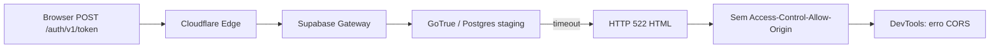

# RC-03.7 — Bloqueio Operacional por Incidente Supabase Staging

**Data:** 2026-07-07  
**Projeto Supabase staging:** `tckdjyunwmdpqmewrwvt` (Love odonto, região `sa-east-1`)  
**Produção:** `uoepkwhqztmsjnzirpev` — **não tocada**  
**Pré-requisito:** RC-03.6 (`docs/reports/RC-03.6_SUPABASE_AUTH_CORS_AUDIT.md`)  
**Alterações:** nenhuma em código, banco, migrations, RLS, config Supabase ou produção  
**Commit:** **não**

---

## 1. Resumo executivo

O **RC-03 (soak test RH read-primary em staging)** está **oficialmente bloqueado** por **incidente externo** no **data plane Supabase staging**.

| Item | Status |
|------|--------|
| Código Love Odonto | ✅ Correto (RC-03.3 a RC-03.5) |
| Config CORS / Auth URLs | ✅ Não é a causa (RC-03.6) |
| Supabase staging data plane | ❌ **Degradado — HTTP 522** |
| Soak manual RC-03 | ⏸ **Suspenso** |
| **Veredicto RC-03** | **`BLOCKED_EXTERNAL`** |

> **Não classificar como NOT READY por falha do app.**  
> O bloqueio é **operacional e externo** — depende de recuperação do projeto Supabase staging.

---

## 2. Ambiente afetado

| Campo | Valor |
|-------|-------|
| **Projeto** | Love odonto (staging) |
| **Project ref** | `tckdjyunwmdpqmewrwvt` |
| **Região** | `sa-east-1` (GRU) |
| **API URL** | `https://tckdjyunwmdpqmewrwvt.supabase.co` |
| **Control plane (MCP)** | `ACTIVE_HEALTHY` |
| **Data plane (Auth / REST / SQL)** | **Indisponível ou timeout (522)** |
| **App local** | `http://localhost:5176` |
| **Ambiente não afetado** | Produção `uoepkwhqztmsjnzirpev` (operacional) |

---

## 3. Sintoma no app

| Onde | O que o usuário vê |
|------|-------------------|
| **Login** (`/login`) | Falha ao autenticar; requisição `POST /auth/v1/token?grant_type=password` não completa |
| **DevTools → Network** | Request para `tckdjyunwmdpqmewrwvt.supabase.co` com status **522** ou pendente até timeout |
| **DevTools → Console** | Erro de **CORS**: `No Access-Control-Allow-Origin` |
| **Impacto downstream** | Impossível executar soak RC-03 (dashboard, Dados da Equipe, QA Tools, Shadow QA) |

O sintoma de CORS **engana** — não indica configuração errada no Love Odonto.

---

## 4. Causa técnica real

| Camada | Comportamento |
|--------|---------------|
| **Gateway Supabase (borda)** | Responde rápido em erros triviais (401 sem apikey) **com** CORS `*` |
| **Origin Auth/REST (data plane)** | Com apikey válida, **não responde a tempo** → Cloudflare retorna **522** |
| **Resposta 522** | Página HTML Cloudflare **sem** headers CORS |
| **Browser** | Reporta "No Access-Control-Allow-Origin" — **efeito colateral**, não causa raiz |

**Causa raiz:** degradação do **data plane** do projeto staging Supabase, não bug de aplicação.

---

## 5. Evidências RC-03.6

Referência completa: `docs/reports/RC-03.6_SUPABASE_AUTH_CORS_AUDIT.md`

| # | Teste | Resultado |
|---|-------|-----------|
| 1 | Project status MCP | `ACTIVE_HEALTHY` (control plane) |
| 2 | `OPTIONS /auth/v1/token` | **200** + `Access-Control-Allow-Origin: *` |
| 3 | `POST /auth/v1/token` sem apikey | **401** + CORS `*` |
| 4 | `POST /auth/v1/token` com anon key válida | **HTTP 522** (~50s timeout), sem CORS |
| 5 | `GET /rest/v1/*` com key válida | **522** |
| 6 | `GET /rest/v1/*` com key inválida | **401** + CORS `*` |
| 7 | Produção (logs MCP) | Auth POST **200** — operacional |
| 8 | Edge Functions staging | **0** |
| 9 | RLS | Não afeta `/auth/v1/token` (GoTrue) |
| 10 | API logs staging (24h) | Massa de **522** em `grant_type=password` e `refresh_token` |
| 11 | SQL via MCP | **Timeout** |
| 12 | App Love Odonto | Client OK; `signInWithPassword()` confirmado |

---

## 6. Impacto no RC-03

| Atividade RC-03 | Status |
|-----------------|--------|
| Checklist manual browser (15 passos) | **Bloqueado** — login impossível |
| Shadow QA em `/dev/qa-tools` | **Bloqueado** — depende de sessão autenticada |
| Validação READ_PRIMARY no runtime | **Bloqueado** — não exercitável sem Auth |
| Testes offline/online/rehydrate | **Bloqueado** |
| Testes automatizados (Vitest) | ✅ Continuam passando (não dependem de Auth live) |
| Promoção para produção | **Permanece proibida** (soak incompleto + incidente staging) |

### Itens RC-03 anteriores (contexto, não bloqueadores primários agora)

O relatório `RH_RC03_STAGING_SOAK_TEST.md` (2026-06-29) listava:

- `VITE_RH_SUPABASE_READ_PRIMARY=false` (E-01)
- Checklist manual pendente (E-02)

Esses itens **permanecem válidos para retomada pós-recovery**, mas **não explicam** a falha atual de login. Enquanto o staging retornar 522, **nenhum ajuste local de env ou código** desbloqueia o soak.

---

## 7. Por que não é erro do Love Odonto

| Evidência | Conclusão |
|-----------|-----------|
| RC-03.3 | Client Supabase criado corretamente; env staging alinhado |
| RC-03.4 | Bootstrap auth (refresh stale) diagnosticado |
| RC-03.5 | Correção de storage local implementada e testada (Vitest 12/12) |
| RC-03.6 | `POST /auth/v1/token` falha **fora do browser** (curl/fetch) com **522** |
| RC-03.6 | Preflight CORS **OK**; gateway responde em rotas triviais |
| RC-03.6 | Produção Auth **200** com mesmo padrão de client |

O Love Odonto envia a requisição correta. O backend staging **não completa** a resposta.

---

## 8. Por que não deve mexer em produção

| Risco | Detalhe |
|-------|---------|
| **Isolamento** | Incidente confinado ao staging `tckdjyunwmdpqmewrwvt` |
| **Produção saudável** | Auth e REST respondem **200** |
| **Escopo RC-03** | Soak é **staging-only**; produção permanece bloqueada até RC-03 READY |
| **Workaround perigoso** | Apontar `.env.local` para produção para "testar login" viola guards RC-02 e expõe dados reais |
| **Migrations / RLS** | Alterações em prod não corrigem 522 no staging |

**Regra:** aguardar recovery do staging; **nunca** usar produção como substituto do soak.

---

## 9. Ações recomendadas

| Prioridade | Ação | Owner |
|------------|------|-------|
| **P0** | Abrir ticket Supabase Support (modelo §10) | Operador / Paulo |
| **P0** | Monitorar Dashboard → Logs / Project Health staging | Operador |
| **P1** | Reexecutar probes RC-03.6 após recovery (curl POST token) | Engenharia |
| **P1** | Retomar soak RC-03 conforme critérios §11 | QA |
| **P2** | Após soak: resolver E-01 (`READ_PRIMARY=true`) se ainda aplicável | Operador |
| **—** | **Não** alterar código, banco, RLS, migrations | Todos |
| **—** | **Não** alterar produção | Todos |
| **—** | **Não** commit destes relatórios salvo pedido explícito | Todos |

### Ações Supabase (operador — Dashboard, se aplicável)

- Verificar **Project Settings → General** (pause, billing, compute)
- **Restart project** (se disponível e autorizado)
- Conferir **Database → Connections** e logs de Postgres
- Escalar via **Support** se 522 persistir >24h

---

## 10. Modelo de mensagem para Supabase Support

**Assunto:** `[Staging] HTTP 522 on Auth and REST — project tckdjyunwmdpqmewrwvt (sa-east-1)`

**Corpo (copiar e enviar):**

---

Hello Supabase Support,

We are experiencing a **data plane outage** on our **staging** project. The control plane reports `ACTIVE_HEALTHY`, but authenticated API requests time out with **HTTP 522** (Cloudflare connection timed out).

**Project details**
- **Project name:** Love odonto (staging)
- **Project ref:** `tckdjyunwmdpqmewrwvt`
- **Region:** `sa-east-1`
- **API URL:** `https://tckdjyunwmdpqmewrwvt.supabase.co`
- **Production project (unaffected):** `uoepkwhqztmsjnzirpev` — Auth/REST working normally

**Symptoms**
- Browser login fails; DevTools shows **"No Access-Control-Allow-Origin"** — this is a **side effect** of 522, not a CORS misconfiguration.
- `OPTIONS /auth/v1/token?grant_type=password` → **200** with `Access-Control-Allow-Origin: *`
- `POST /auth/v1/token` **without** apikey → **401** with CORS headers (gateway responds)
- `POST /auth/v1/token?grant_type=password` **with valid anon key** → **HTTP 522** (~50s timeout), HTML Cloudflare error page, **no CORS headers**
- `GET /rest/v1/*` with valid anon key → **522**
- `GET /rest/v1/*` with invalid key → **401** with CORS headers
- MCP `execute_sql` on staging → **timeout**
- API gateway logs (last 24h): many **522** on `POST /auth/v1/token` (both `grant_type=password` and `grant_type=refresh_token`)

**What we verified**
- Application code sends correct `signInWithPassword()` → `POST /auth/v1/token?grant_type=password`
- Same failure reproduced **outside the browser** (curl / Node fetch)
- Staging has **0 Edge Functions**
- RLS does not apply to GoTrue `/auth/v1/token`
- **No changes** were made to project config, database, or production during investigation

**Expected behavior when healthy**
- `POST /auth/v1/token` with invalid credentials should return **400/401 JSON** in <2 seconds with `Access-Control-Allow-Origin: *`

**Request**
Please investigate the **staging data plane** (GoTrue, PostgREST, Postgres connectivity) for project `tckdjyunwmdpqmewrwvt` and restore normal response times.

**Audit reference:** Internal report RC-03.6 / RC-03.7 (2026-07-07)

Thank you.

---

## 11. Critérios para retomar o RC-03

Retomar soak **somente** quando **todos** os critérios abaixo forem atendidos:

| # | Critério | Como verificar |
|---|----------|----------------|
| R1 | `POST /auth/v1/token?grant_type=password` com anon key retorna **JSON** (400/401 credenciais inválidas ou 200 login válido) em **<5s** | curl / DevTools |
| R2 | Resposta inclui `Access-Control-Allow-Origin` | Headers da resposta |
| R3 | `GET /rest/v1/tenants?limit=1` com anon key retorna **200** ou erro RLS **401/403 JSON** (não 522) | curl |
| R4 | Login Love Odonto staging (`paulo+staging@implanprime.test`) **completa** no browser | Passo 1 do soak |
| R5 | MCP `execute_sql` staging responde sem timeout | Query simples `SELECT 1` |
| R6 | API logs staging sem massa de **522** em Auth/REST | Dashboard / MCP |

### Sequência pós-recovery

1. Confirmar R1–R6  
2. Retomar `RH_RC03_STAGING_SOAK_TEST.md` checklist §3 (15 passos)  
3. Se E-01 ainda aplicável: `VITE_RH_SUPABASE_READ_PRIMARY=true` + restart dev server  
4. Executar Shadow QA → `matchPercent: 100`  
5. Atualizar veredicto soak para **READY** (se 15/15 OK)  
6. Iniciar observação 7–14 dias antes de discussão prod  

---

## 12. Status final

| Campo | Valor |
|-------|-------|
| **RC-03 veredicto** | **`BLOCKED_EXTERNAL`** |
| **Causa** | Incidente Supabase staging — data plane HTTP 522 |
| **Responsável pela correção** | Supabase (infra) + operador (ticket/monitoramento) |
| **Love Odonto** | Sem ação de código necessária para este bloqueio |
| **Produção** | Intocada; permanece fora de escopo RC-03 soak |
| **Próximo RC documental** | Retomar soak após recovery; atualizar `RH_RC03_STAGING_SOAK_TEST.md` |

---

*RC-03.7 — registro oficial de bloqueio operacional. Zero alterações em código, banco, migrations, RLS, config Supabase ou produção.*
