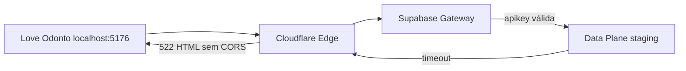

# RC-03 — Status Final (Encerramento por Incidente Externo)

**Documento:** `docs/reports/RC-03_FINAL_STATUS.md`  
**Data de encerramento:** 2026-07-07  
**Projeto Supabase staging:** `tckdjyunwmdpqmewrwvt` (Love odonto, `sa-east-1`)  
**Produção:** `uoepkwhqztmsjnzirpev` — **intocada**  
**Alterações neste RC:** **nenhuma** em código, banco, Supabase, produção, RH, Auth  
**Commit:** **não**

---

## 1. Resumo executivo

O ciclo **RC-03 (soak test RH read-primary em staging)** é **encerrado oficialmente** com veredicto:

## **`BLOCKED_EXTERNAL`**

| Dimensão | Resultado |
|----------|-----------|
| Arquitetura RH V3 (RC-01 / RC-02) | ✅ **Aprovada tecnicamente** |
| Testes automatizados (Vitest) | ✅ **83/83 PASS** (suites RH RC-03) |
| Auth / Bootstrap (RC-03.3–RC-03.5) | ✅ **Corrigido e validado** no código |
| Soak manual browser (15 passos) | ❌ **Não concluído** — bloqueado por infra |
| Shadow QA 100% (browser) | ❌ **Não executado** — bloqueado por infra |
| Causa do bloqueio | **HTTP 522** — Supabase staging data plane indisponível |
| Classificação | **Incidente externo** — **não** falha Love Odonto |

> **Love Odonto aprovado tecnicamente.**  
> **Bloqueio exclusivamente externo** (Supabase staging `tckdjyunwmdpqmewrwvt`).

---

## 2. Linha do tempo

| RC | Data | Escopo | Resultado |
|----|------|--------|-----------|
| **RC-01** | 2026-06-30 | Validação operacional RH V3 — UUID Mirror, Shadow QA, identity, hydrate QA Tools | Arquitetura consolidada; `NOT READY` read-primary (transitional diffs) |
| **RC-01.4** | 2026-06-29 | Alinhamento `collaborator_id` staging (4/4 tenant_users × collaborators) | ✅ PASS |
| **RC-01.5** | 2026-06-29 | IDB Hydrate + QA Tools | ✅ Implementado |
| **RC-02** | 2026-06-29 | Promoção Read Primary — Supabase → IDB → UI; guards produção | ✅ **READY** (staging) |
| **RC-03** | 2026-06-29 | Soak test read-primary staging — checklist 15 passos | Relatório base; pré-validação automated/SQL **PASS** |
| **RC-03.1** | 2026-07-01 / 2026-07-07 | Precheck env/flags + correção classificação Shadow QA (`updated_at`) | ✅ Precheck PASS; classificação corrigida → métricas 100% em unit tests |
| **RC-03.2** | — | *(Reservado — soak manual pendente antes do incidente Auth)* | Checklist browser não concluído |
| **RC-03.3** | 2026-07-07 | Diagnóstico Auth Init — client, env, `signInWithPassword()` | ✅ Client OK; login invocado corretamente |
| **RC-03.4** | 2026-07-07 | Diagnóstico Bootstrap Auth — stale `refresh_token` no boot | ✅ Causa raiz identificada (`appgestaoodonto-platform-auth`) |
| **RC-03.5** | 2026-07-07 | Correção Bootstrap Auth — `saasAuthStorage.js`, preflight login | ✅ Implementado; Vitest 12/12 + auth flow 10/10 |
| **RC-03.6** | 2026-07-07 | Auditoria Supabase Auth/CORS staging | ✅ CORS OK; **522** no data plane — não é bug app |
| **RC-03.7** | 2026-07-07 | Registro oficial bloqueio operacional externo | **`BLOCKED_EXTERNAL`** |
| **RC-03.8** | 2026-07-07 | Reteste pós-restart Dashboard + evidência browser/DevTools | ❌ **522 persiste**; browser confirma diagnóstico |
| **RC-03.9** | 2026-07-07 | **Encerramento oficial** deste documento | **`BLOCKED_EXTERNAL`** — fim do ciclo RC-03 |

### Referências

| Documento |
|-----------|
| `docs/reports/RH_RC01_OPERATIONAL_VALIDATION.md` |
| `docs/reports/RH_RC02_READ_PRIMARY_PROMOTION.md` |
| `docs/reports/RH_RC03_STAGING_SOAK_TEST.md` |
| `docs/reports/RH_RC03_PRECHECK.md` |
| `docs/reports/RH_RC03_1_SHADOW_QA_UPDATED_AT_CLASSIFICATION.md` |
| `docs/reports/RC-03.4_BOOTSTRAP_AUTH_DIAGNOSIS.md` |
| `docs/reports/RC-03.6_SUPABASE_AUTH_CORS_AUDIT.md` |
| `docs/reports/RC-03.7_SUPABASE_STAGING_INCIDENT_BLOCKER.md` |

---

## 3. Tudo que foi validado

| Área | Evidência | Status |
|------|-----------|--------|
| **Repository** | `collaboratorRepository.ts` read-primary; wiring tests 13 PASS | ✅ |
| **Shadow QA** | Classificação diffs (RC-03.1); suites shadow 44+ PASS; CLI `rh-shadow-read-qa.mjs` | ✅ (unit/CLI; browser bloqueado) |
| **UUID Mirror** | `collaboratorUuidMirror.test.js` 23 PASS; plano merge IDB | ✅ |
| **Hydrate** | `collaboratorRepositorySync.test.js` 3 PASS; QA Tools hydrate plan | ✅ |
| **Read Primary** | Arquitetura RC-02; flags guards produção 23 PASS | ✅ |
| **Offline** | Source `indexeddb-offline`; sem call Supabase quando offline | ✅ (unit) |
| **Fallback** | `syncCacheFromRemote` + evento `online` no bridge/auth | ✅ (unit + wiring) |
| **QA Tools** | Rota `/dev/qa-tools`; guards staging; service read-only | ✅ (código; execução UI bloqueada) |
| **Identity** | 4/4 `tenant_users.collaborator_id` = `collaborators.id` staging | ✅ (SQL read-only) |
| **Bootstrap Auth** | RC-03.4 diagnóstico + RC-03.5 `saasAuthStorage.js` | ✅ |
| **Env / Preflight** | `npm run env:check` → `SUPABASE_CONFIG_OK`; host staging único | ✅ |
| **Produção isolada** | Guards `PRODUCTION_SUPABASE_PROJECT_REF`; zero URL prod ativa | ✅ |
| **Vitest RH RC-03** | 6 suites, **83/83 PASS** | ✅ |

---

## 4. Tudo que foi descartado

| Hipótese investigada | Veredicto | Evidência |
|---------------------|-----------|-----------|
| **Erro de código** | ❌ Descartado | Fluxo Auth correto; repository/shadow tests PASS |
| **Erro de env** | ❌ Descartado | `[STABILITY] SUPABASE_CONFIG_OK`; preflight staging alinhado |
| **Erro de login** | ❌ Descartado | `signInWithPassword()` invocado; `grant_type=password` correto |
| **Erro de JWT** | ❌ Descartado | Anon key `ref=tckdjyunwmdpqmewrwvt`, role `anon` |
| **Erro de RLS** | ❌ Descartado | `/auth/v1/token` é GoTrue — RLS não aplica |
| **Erro de CORS** | ❌ Descartado | OPTIONS 200 + `*`; CORS ausente só em respostas **522** |
| **Erro de Repository** | ❌ Descartado | 83/83 tests; arquitetura RC-02 validada |
| **Erro de RH** | ❌ Descartado | Shadow classification RC-03.1; identity 4/4 OK |
| **Stale refresh (boot)** | ✅ Corrigido RC-03.5 | Não era bloqueador final — 522 persiste após fix |
| **Misconfig Site URL** | ❌ Descartado | Não explica 522; password login não usa redirect |

**Causa única remanescente:** indisponibilidade **externa** do data plane Supabase staging.

---

## 5. Causa raiz

| Camada | Detalhe |
|--------|---------|
| **Sintoma browser** | `No Access-Control-Allow-Origin` + `net::ERR_FAILED 522` |
| **Sintoma CLI/curl** | `POST /auth/v1/token` → HTTP **522** (~20s), HTML Cloudflare |
| **HTTP 522** | Connection timed out — Cloudflare não recebe resposta do origin |
| **Cloudflare** | Borda `*.supabase.co` (região GRU) — preflight OK, origin timeout |
| **Supabase Data Plane** | GoTrue + PostgREST + Postgres staging **não respondem** com apikey válida |
| **Control plane** | Dashboard/MCP: `ACTIVE_HEALTHY` — **não** garante data plane |
| **Projeto** | `tckdjyunwmdpqmewrwvt` · região `sa-east-1` |
| **Restart Dashboard** | RC-03.8 — **não resolveu** |



---

## 6. Status

| Campo | Valor |
|-------|-------|
| **Veredicto RC-03** | **`BLOCKED_EXTERNAL`** |
| **Love Odonto** | **Aprovado tecnicamente** |
| **Soak operacional** | **Incompleto** — depende recovery Supabase |
| **Produção** | **Bloqueada** para promoção READ_PRIMARY |
| **Próximo ciclo** | **RC-04** (reabertura soak) — após critérios §7 |

---

## 7. Critérios para reabertura (RC-04 soak)

Reabrir validação operacional **somente** quando **todos** forem atendidos:

| # | Critério | Verificação |
|---|----------|-------------|
| R1 | `POST /auth/v1/token?grant_type=password` retorna **JSON** (400/401 ou 200) em **<5s** | curl / DevTools |
| R2 | Resposta inclui `Access-Control-Allow-Origin` | Headers |
| R3 | `GET /rest/v1/collaborators` (ou tenants) retorna JSON (não 522) | curl / MCP |
| R4 | Login browser `paulo+staging@implanprime.test` completa | `/login` |
| R5 | **`/dev/qa-tools` acessível** com sessão autenticada | Browser |
| R6 | **RH Shadow QA executável** na UI | Botão Shadow QA |
| R7 | MCP `execute_sql` staging responde sem timeout | `SELECT 1` |

**Ações proibidas durante bloqueio:** alterar código, apontar env para produção, alterar Supabase/produção.

**Ação recomendada:** ticket Supabase Support (modelo `RC-03.7 §10`).

---

## 8. Critérios para READY

Após reabertura (§7), o soak deve atingir:

| Métrica Shadow QA | Valor exigido |
|-------------------|---------------|
| `localCount` | **4** |
| `remoteCount` | **4** |
| `matchPercent` | **100%** |
| `blockingDiffCount` | **0** |
| `transitionalDiffCount` | **0** |
| `canPromoteReadPrimary` | **true** |

**Adicionalmente:**

- ✅ 15/15 passos checklist manual (`RH_RC03_STAGING_SOAK_TEST.md` §3)
- ✅ `VITE_RH_SUPABASE_READ_PRIMARY=true` no runtime de teste
- ✅ Zero erros 401/403/404/console indevidos
- ✅ Período observação 7–14 dias antes de discussão produção

Então atualizar veredicto para **`READY`**.

---

## 9. Conclusão

O Love Odonto V3 RH completou com sucesso as fases de **arquitetura** (RC-01), **read-primary** (RC-02) e **validação técnica automatizada** (RC-03 + sub-RCs).

A fase de **validação operacional em staging** (soak browser) **não pôde ser concluída** devido a incidente **externo e persistente** no Supabase staging (`HTTP 522`), confirmado por:

- probes HTTP (RC-03.6, RC-03.8)
- reteste pós-restart Dashboard (RC-03.8)
- evidência browser/DevTools (RC-03.8 §1.2.1)

**Não há ação de código pendente para desbloquear o RC-03.**

O ciclo RC-03 encerra em **`BLOCKED_EXTERNAL`**. A retomada operacional será tratada como **novo gate** (RC-04 soak) quando o staging Supabase estiver saudável.

---

---

# Apêndice A — Resumo executivo (1 página — apresentação)

**Love Odonto V3 · RC-03 · Status Final · 2026-07-07**

---

### Veredicto

| | |
|---|---|
| **RC-03** | **`BLOCKED_EXTERNAL`** |
| **Love Odonto** | **Aprovado tecnicamente** |
| **Bloqueio** | Supabase staging data plane — HTTP **522** |

---

### O que foi entregue (RC-01 → RC-03.5)

- Arquitetura RH V3: Supabase autoridade → IndexedDB cache → UI  
- Read Primary (RC-02) com guards produção  
- Repository, Shadow QA, UUID Mirror, Hydrate, Offline/Fallback — **testes PASS**  
- Identity staging: **4/4** colaboradores alinhados  
- Bootstrap Auth corrigido (stale refresh_token)  
- **83/83** testes Vitest RH RC-03  

---

### O que não foi concluído (e por quê)

| Item | Motivo |
|------|--------|
| Soak manual 15 passos | Login impossível — staging 522 |
| Shadow QA 100% (browser) | Sem sessão Auth |
| Promoção READ_PRIMARY prod | Gate RC-03 incompleto |

**Não é falha do app.**

---

### Causa raiz

```
POST /auth/v1/token → tckdjyunwmdpqmewrwvt.supabase.co → HTTP 522 (Cloudflare timeout)
→ sem CORS → DevTools mostra erro CORS (efeito colateral)
```

Restart pelo Dashboard **não resolveu** (RC-03.8).

---

### Descartado na investigação

Código · Env · Login · JWT · RLS · CORS · Repository · RH

---

### Próximos passos

1. **Escalar Supabase Support** — project `tckdjyunwmdpqmewrwvt`  
2. **Não** alterar código nem apontar para produção  
3. **Retomar** quando `/auth/v1/token` responder JSON em <5s  
4. Executar soak + Shadow QA → critérios **READY** (100% / 0 blockers)  

---

### Decisão

> **Love Odonto aprovado tecnicamente.**  
> **Bloqueio exclusivamente externo.**  
> **RC-03 encerrado em `BLOCKED_EXTERNAL`.**

---

*RC-03.9 — encerramento documental. Zero alterações em código, banco, Supabase, produção, RH, Auth. Zero commit.*
