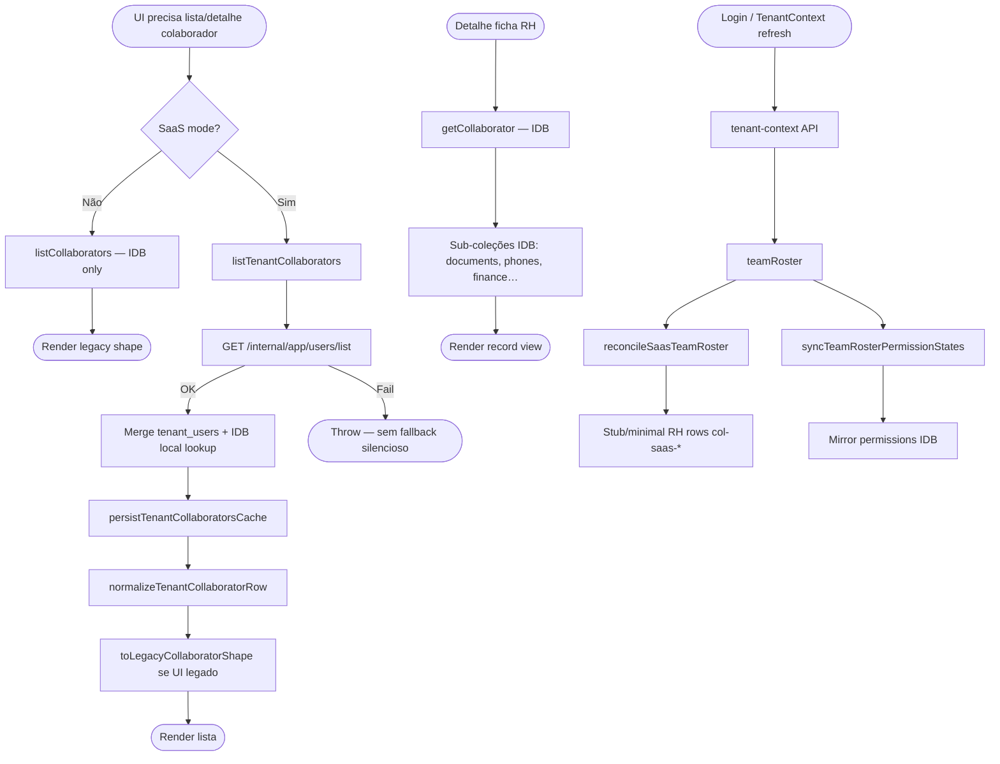
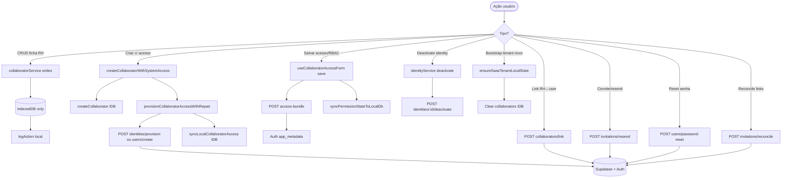

# Love Odonto V3 — Auditoria Técnica RH / Colaboradores (Sprint 1)

**Documento:** `docs/reports/RH_CONSOLIDATION_AUDIT.md`  
**Versão:** 1.0.0  
**Data:** 2026-06-29  
**Status:** Plano oficial para consolidação RH — Love Odonto V3 Sprint 1  
**Tipo:** Auditoria somente leitura — **nenhum código alterado**

**Base normativa:** Constituições V2 + Masters platform (API, Security, Operations, Observability, Release Management, Development Guide)

**Ambiente referência staging:** Supabase `tckdjyunwmdpqmewrwvt` · tenant `7aba7127-409c-4ea4-8dbc-807efc5e189c` · backfill RH aplicado (4 collaborators)

---

## Sumário executivo

O módulo RH/Colaboradores opera hoje em **arquitetura híbrida**: acesso e membership são **canônicos via Admin API → Supabase** (`tenant_users`, `identities`, Auth `app_metadata`), enquanto a **ficha RH rica permanece no IndexedDB** (`collaborators` + 11 coleções satélite). A listagem SaaS unifica API + cache local em `tenantCollaboratorService.js`.

**Gap principal V3:** Supabase `public.collaborators` (migrations 016–019) foi preparado e backfill executado em staging, mas o **frontend ainda não lê/escreve** essa tabela — continua IDB como autoridade da ficha.

**Risco de regressão alto:** agenda, financeiro, comissões, prontuário e CRM consomem `db.collaborators` por `id` text (`col-*`, `col-saas-*`) — cutover exige dual-write + propagação `collaborator_uuid`.

---

## 1. Diagrama completo do módulo RH

```mermaid
flowchart TB
  subgraph ui [Frontend React]
    CP[CollaboratorsPage]
    CU[ConfiguracoesUsuariosPage]
    AU[AdminUsuariosPage]
    IDH[IdentitiesDashboardPage]
    COMP[components/collaborators/*]
    ACC[components/access/*]
    HOOK[useCollaboratorAccessForm]
    CP --> COMP
    CP --> HOOK
    CU --> ACC
  end

  subgraph ctx [Contexts — indiretos]
    AUTH[AuthContext]
    TEN[TenantContext]
    AUTH --> TEN
    TEN -->|teamRoster hydrate| SYNC
  end

  subgraph services [Application Services]
    CS[collaboratorService.js]
    TCS[tenantCollaboratorService.js]
    CAP[collaboratorAccessProvisionService.js]
    CAR[collaboratorAccessRecoveryService.js]
    CPP[collaboratorPermissionPersistence.js]
    TTR[tenantTeamRosterSync.js]
    IDN[identityService.js]
    ACS[accessService.js]
    STB[saasTenantBootstrapService.js]
  end

  subgraph idb [IndexedDB — appgestaoodonto]
    COL[(collaborators)]
    SAT[(collaboratorDocuments…Finance)]
    CA[(collaboratorAccess)]
  end

  subgraph api [Admin API :3001]
    TU[/users/*]
    COLAPI[/collaborators/*]
    IDAPI[/identities/*]
  end

  subgraph sb [Supabase]
    TBL_TU[(tenant_users)]
    TBL_COL[(collaborators UUID)]
    TBL_ID[(identities)]
    AUTH_SB[Auth app_metadata]
    EV[(identity_events)]
  end

  CP --> TCS
  CP --> CS
  HOOK --> CAP
  HOOK --> CPP
  HOOK --> ACS
  TCS --> CAP
  TCS --> IDB_W[persistTenantCollaboratorsCache]
  CS --> COL
  CS --> SAT
  CAP --> api
  IDN --> IDAPI
  TEN --> TTR
  TEN --> CPP
  TTR --> COL
  STB -->|reset SaaS| idb

  CAP --> TU
  CAP --> COLAPI
  CAP --> IDAPI
  api --> TBL_TU
  api --> TBL_COL
  api --> TBL_ID
  api --> AUTH_SB
  api --> EV

  IDB_W --> COL
  IDB_W --> CA

  subgraph consumers [Consumidores cross-módulo — IDB]
    AGD[AgendaPage]
    FIN[financeService / comissões]
    CRM[crmReportsService]
    PRD[clinicalBudgetHubService]
  end
  consumers --> COL
```

---

## 2. Fluxograma de leitura



**Autoridade leitura hoje:**

| Dado | Autoridade | Cache |
|------|------------|-------|
| Lista equipe (SaaS) | Admin API `tenant_users` | IDB merge |
| Ficha RH completa | **IndexedDB** | — |
| Permissões runtime | Auth `app_metadata` + `accessService` | IDB users mirror |
| Identities | Admin API `/identities` | — |
| Supabase `collaborators` | **Não consumido pelo frontend** | — |

---

## 3. Fluxograma de escrita



**Gap V3:** writes de ficha RH **não** dual-write para Supabase `collaborators`.

---

## 4. Lista completa de arquivos

### 4.1 Páginas (rotas)

| Arquivo | Rota | Papel |
|---------|------|-------|
| `src/pages/CollaboratorsPage.jsx` | `/admin/colaboradores` | Hub principal RH + record view |
| `src/pages/ConfiguracoesUsuariosPage.jsx` | `/configuracoes/usuarios` | Usuários/acessos (admin) |
| `src/pages/AdminUsuariosPage.jsx` | `/admin/usuarios` | Admin usuários legado |
| `src/pages/admin/IdentitiesDashboardPage.jsx` | identities admin | Saúde identidades |
| `src/pages/TeamPage.jsx` | `/equipe` | Diretório equipe (parcial) |

### 4.2 Componentes React — colaboradores (28 arquivos)

```
src/components/collaborators/
├── CollaboratorAccessActions.jsx
├── CollaboratorCadastroTab.jsx
├── CollaboratorCreateModal.jsx
├── CollaboratorFormCard.jsx
├── CollaboratorPermissionsPanel.jsx
├── CollaboratorRecordHeader.jsx
├── CollaboratorRhProfileFields.jsx
├── CollaboratorRowActionsMenu.jsx
├── CollaboratorTeamDirectory.jsx
└── record/
    ├── CollaboratorAccessSection.jsx
    ├── CollaboratorCompactHeader.jsx
    ├── CollaboratorExecutiveHeader.jsx
    ├── CollaboratorKpiDashboard.jsx
    ├── CollaboratorOverviewSection.jsx
    ├── CollaboratorPermissionsHub.jsx
    ├── CollaboratorPremiumTabs.jsx
    ├── CollaboratorRecordView.jsx
    ├── CollaboratorSidebarNav.jsx
    ├── RecordUi.jsx
    └── permissions/
        ├── PermissionActionCard.jsx
        ├── PermissionsFeatureBlock.jsx
        ├── PermissionsModuleModal.jsx
        ├── PermissionsProgress.jsx
        ├── PermissionsToolbar.jsx
        └── permissionsConstants.js
```

### 4.3 Componentes — acesso / identidade (7 arquivos)

```
src/components/access/
├── AccessTab.jsx
├── CollaboratorAccessManagementCard.jsx
├── IdentityHealthBanner.jsx
├── IdentityLifecycleModal.jsx
└── ResetPasswordModal.jsx
```

### 4.4 Hooks (2)

| Arquivo | Uso |
|---------|-----|
| `src/hooks/useCollaboratorAccessForm.js` | Form RBAC + provision + save bundle |
| `src/hooks/useCepAutofill.js` | Endereço colaborador (via CollaboratorsPage) |

**Contexts dedicados RH:** nenhum — usa `AuthContext`, `TenantContext`.

### 4.5 Services (core RH)

| Arquivo | Responsabilidade |
|---------|------------------|
| `src/services/collaboratorService.js` | CRUD ficha RH — **IDB authority** |
| `src/services/tenantCollaboratorService.js` | Lista unificada SaaS — **API + IDB merge** |
| `src/services/collaboratorAccessProvisionService.js` | **Todas** chamadas Admin API acesso |
| `src/services/collaboratorAccessRecoveryService.js` | Reconcile estado acesso, repair flows |
| `src/services/collaboratorPermissionPersistence.js` | Mirror RBAC IDB ↔ tenant_users metadata |
| `src/services/tenantTeamRosterSync.js` | Hydrate stubs from teamRoster |
| `src/services/collaboratorPerfLogService.js` | Perf dev guard |
| `src/services/identityService.js` | Identities API wrapper |
| `src/services/accessService.js` | can(), catalog, updateUserAccess |
| `src/services/saasTenantBootstrapService.js` | Reset IDB collaborators on SaaS bootstrap |
| `src/services/userProfileService.js` | Resolve perfil ↔ collaborator |
| `src/services/membershipService.js` | Membership + collaborator link |
| `src/services/userInviteService.js` | Convites legado |
| `src/services/saasUserSeedService.js` | Seed dev |

### 4.6 Utils / constants

| Arquivo |
|---------|
| `src/utils/collaboratorAccessRole.js` |
| `src/utils/collaboratorAccessPanel.js` |
| `src/utils/collaboratorAccessManagement.js` |
| `src/utils/collaboratorTenantLink.js` |
| `src/utils/inviteStatus.js` |
| `src/utils/inviteDeliveryFeedback.js` |
| `src/utils/avatarUtils.js` |
| `src/utils/userDisplayName.js` |
| `src/constants/collaboratorRhCatalog.js` |

### 4.7 IndexedDB

| Arquivo | Papel |
|---------|-------|
| `src/db/schema.js` | 12 coleções `collaborator*` |
| `src/db/migrations.js` | Migrações seed/dedup collaborators |
| `src/db/index.js` | withDb, tenant guard (parcial) |

### 4.8 Admin API (server)

| Arquivo | Papel |
|---------|-------|
| `server/index.js` | Rotas `/internal/app/collaborators/*`, `/users/*` |
| `server/identity/routes.js` + `IdentityService.js` | Identities |
| `server/collaboratorLinkPolicy.js` | Política link email |
| `server/collaboratorInviteDispatch.js` | E-mail convite |
| `server/lib/rhBackfillToSupabase.js` | Backfill RH → Supabase |
| `server/lib/collaboratorIdBackfill.js` | Backfill collaborator_uuid |
| `server/lib/rhExportIndexedDb.js` | Export IDB para backfill |

### 4.9 Migrations Supabase (RH)

| Migration | Conteúdo |
|-----------|----------|
| `005_app_collaborator_access_invites.sql` | Convites/acesso |
| `016_collaborators_core.sql` | Tabela `collaborators` |
| `017_tenant_users_collaborator_uuid.sql` | Coluna UUID |
| `018_tenant_users_collaborator_fk.sql` | FK (gate staging) |
| `019_collaborators_rls.sql` | RLS |

### 4.10 Scripts ops (referência — não executar nesta auditoria)

| Script |
|--------|
| `scripts/rh-backfill-to-supabase.mjs` |
| `scripts/collaborator-id-backfill.mjs` |
| `scripts/manual-collaborator-access-guided.mjs` |

### 4.11 Testes (22 arquivos relevantes)

`collaborators.test.js`, `tenantCollaboratorList.test.js`, `collaboratorIdBackfill.test.js`, `rhBackfillToSupabase.test.js`, `collaboratorAccess*.test.js`, `collaboratorLinkPolicy.test.js`, `collaboratorInviteEmail.test.js`, `identityProvisionFlow.test.js`, `identityHealth.test.js`, `saasTenantBootstrap.test.js`, `collaboratorTenantLink.test.js`, `collaboratorSystemAccess.test.js`, `collaboratorCustomPermissions.test.js`, `userContextPermissionsSync.test.js`, `accessEmailFlow.test.js`, `stagingSeedImplanprime.test.js`, etc.

### 4.12 Documentação módulo

| Arquivo | Nota |
|---------|------|
| `docs/modules/collaborators.md` | **Desatualizado** — ainda diz localStorage |

---

## 5. Lista de dependências

### 5.1 Dependências internas (RH → outros)

| Consumidor | Depende de `collaborators` IDB |
|------------|-------------------------------|
| `AgendaPage` / `appointmentService` | professionalId |
| `financeService`, `commissionCalculationService`, `faturamentoService` | professionalId |
| `clinicalBudgetHubService`, `patientCareTimelineService` | professional lookup |
| `crmReportsService`, `gestaoAtendimentoDashboard` | stats by professional |
| `membershipService`, `userProfileService` | collaboratorId link |
| `DashboardPage` | avatar/display |

### 5.2 Dependências externas (outros → RH)

| Módulo | Acoplamento |
|--------|-------------|
| `TenantContext` | teamRoster → roster sync + permissions |
| `AuthContext` | hydrateSaasUser, collaboratorId session |
| `permissions/permissions.js` | `equipe:*`, `collaborators:*` |
| `navigation/menuConfig.js` | `/admin/colaboradores` |
| `AppAvatar.jsx` | foto colaborador |

### 5.3 Admin API endpoints consumidos pelo RH

| Método | Path | Service |
|--------|------|---------|
| GET | `/internal/app/users/list` | collaboratorAccessProvisionService |
| POST | `/internal/app/users/create` | idem |
| PATCH | `/internal/app/users/:id/access` | idem |
| DELETE | `/internal/app/users/:id` | idem |
| POST | `/internal/app/collaborators/link` | idem |
| POST | `/internal/app/collaborators/access-bundle` | idem |
| PATCH | `/internal/app/collaborators/:id/access` | idem |
| POST | `/internal/app/collaborators/provision` | idem |
| POST | `/internal/app/invitations/resend` | idem |
| POST | `/internal/app/invitations/reconcile` | idem |
| POST | `/internal/app/users/password-reset` | idem |
| GET | `/internal/app/collaborators/access-audit` | idem |
| POST | `/internal/app/identities/provision` | idem + identityService |
| GET/POST | `/internal/app/identities/*` | identityService |
| GET | `/internal/app/tenant-context` | TenantContext (teamRoster) |

### 5.4 Chamadas Supabase diretas (frontend)

| Uso | Cliente |
|-----|---------|
| Auth token only | `supabasePlatformClient` em provision service |
| **Tabela `collaborators`** | **❌ Nenhuma no frontend** |

---

## 6. Mapeamento por eixo (itens 1–20)

| # | Eixo | Estado | Detalhe |
|---|------|--------|---------|
| 1 | Componentes React | 35+ arquivos | Hub `CollaboratorsPage` monolítico (~1400 linhas) |
| 2 | Hooks | 1 principal | `useCollaboratorAccessForm` (~510 linhas) |
| 3 | Contexts | Indiretos | Auth + Tenant — sem RH Context |
| 4 | Services | 10+ | Split claro API vs IDB |
| 5 | Stores IDB | 12 coleções | Ver §4.7 |
| 6 | Supabase direct | **Ausente** | Só via API |
| 7 | Admin API | 15+ rotas | Bem centralizado em provision service |
| 8 | Permissões | Dual | access-bundle + IDB mirror + can() |
| 9 | Auth | Supabase JWT | Provision/repair flows |
| 10 | Cache | persistTenantCollaboratorsCache | Merge API→IDB |
| 11 | Sync | tenantTeamRosterSync | Stubs col-saas-* |
| 12 | Reconcile | invitations/reconcile + recovery service | Link legacy_id/email |
| 13 | Hydrate | TenantContext on load | teamRoster + permissions |
| 14 | Bootstrap | saasTenantBootstrapService | Clears collaborators[] |
| 15 | Offline | IDB authority ficha | Full offline RH edit possível |
| 16 | Deps cruzadas | **Alto** | Agenda/financeiro/comissões |
| 17 | Acoplamentos | ID text IDs | col-* vs UUID |
| 18 | Legado | AdminUsuariosPage, permissions.js arrays | Parcial |
| 19 | Código morto? | `/admin/acessos` redirect | AdminUsuarios overlap |
| 20 | Duplicações | ConfiguracoesUsuarios vs Collaborators access UI | Parcial |

---

## 7. Fontes de dados — classificação

| Domínio | SSOT alvo (V2/V3) | Autoridade hoje | Temporário / cache |
|---------|-------------------|-----------------|-------------------|
| Membership / acesso | `tenant_users` + API | ✅ API/Supabase | IDB `collaboratorAccess` |
| RBAC | Auth `app_metadata` → relacional | 🔄 API metadata | IDB users mirror |
| Identities | `identities` + events | ✅ Supabase | — |
| Ficha RH core | `collaborators` UUID | ❌ **IndexedDB** | — |
| Ficha RH satélites | Supabase normalizado (roadmap) | ❌ **IndexedDB** | — |
| Lista equipe SaaS | API merge | API + cache IDB | persistTenantCollaboratorsCache |
| Fotos | Storage `collaborator-photos` | ❌ base64/fotoUrl IDB | — |
| Convites | API + Auth | ✅ | — |

---

## 8. Fluxos preservar vs remover

### 8.1 Preservar (críticos)

| Fluxo | Motivo |
|-------|--------|
| `listTenantCollaborators` + API users/list | SSOT listagem SaaS |
| `access-bundle` RBAC write | Canônico Security |
| `identities/provision` + repair | Convites/auth |
| `reconcileSaasTeamRoster` | Novo device bootstrap |
| `collaboratorLinkPolicy` server | Email único tenant |
| `useCollaboratorAccessForm` save path | UX RBAC |
| `getProfessionalOptions` | Agenda/financeiro |
| Backfill scripts + reports JSON | Ops gate |

### 8.2 Consolidar / simplificar (V3)

| Fluxo | Ação proposta |
|-------|---------------|
| `listCollaborators` IDB-only path | Deprecar quando SaaS 100% |
| `col-saas-*` synthetic IDs | Migrar para UUID + legacy_id |
| Dual pages ConfiguracoesUsuarios + Collaborators access | Unificar UX |
| `syncLocalCollaboratorAccess` | Substituir por read tenant_users |
| `AdminUsuariosPage` | Merge into Configuracoes or deprecate |
| IDB full ficha write without Supabase | Dual-write → cutover |

### 8.3 Candidatos remoção pós-cutover

| Item | Condição |
|------|----------|
| `toLegacyCollaboratorShape` | UI migrada para normalized row |
| `backfillCollaboratorsPendingAccess` client | Supabase authoritative |
| Synthetic roster stubs | Real RH rows in Supabase |
| `permissions.js` hardcoded catalog duplicate | 100% Supabase catalog |

---

## 9. Riscos de regressão

| ID | Risco | Severidade | Mitigação |
|----|-------|------------|-----------|
| R-01 | Quebra agenda/financeiro por mudança `collaborator.id` | **Crítica** | Manter legacy_id; adapter layer |
| R-02 | RBAC desync IDB vs Auth | Alta | Invalidate após access-bundle; QA LO-QA-USR |
| R-03 | Cross-tenant IDB row | Alta | Add collaborators to tenant guard |
| R-04 | Dual-write conflict timestamps | Alta | `updated_at` merge rules (já parcial) |
| R-05 | FK 018 prod antes backfill | **Crítica** | Gate Constitution — staging only |
| R-06 | Convite/email regressão | Alta | identity + invite tests |
| R-07 | Perda ficha RH no bootstrap clear | Média | Export before bootstrap; SSOT Supabase |
| R-08 | col-saas email slug ID collision | Média | UUID canonical |
| R-09 | Permissions count 184 drift | Média | Supabase catalog seed |
| R-10 | CollaboratorsPage size — bug surface | Média | Split components sprint 2+ |

---

## 10. Dívidas técnicas

| ID | Dívida | Prioridade |
|----|--------|------------|
| TD-01 | Frontend não usa Supabase `collaborators` | P0 |
| TD-02 | Ficha RH 100% IDB (12 coleções) | P0 |
| TD-03 | `collaborators` fora TENANT_GUARDED_COLLECTIONS | P1 |
| TD-04 | Fotos base64/local — não Storage | P1 |
| TD-05 | CollaboratorsPage monolith | P2 |
| TD-06 | docs/modules/collaborators.md desatualizado | P2 |
| TD-07 | Duas UIs acesso (Config + Collaborators) | P2 |
| TD-08 | Synthetic `col-saas-*` IDs | P1 |
| TD-09 | Sem dual-write RH → Supabase | P0 |
| TD-10 | FK 018 não prod | P1 (ops) |
| TD-11 | Satélites RH sem schema Supabase | P1 |
| TD-12 | identity fetch by list scan O(n) | P3 |

---

## 11. Plano de refatoração — Sprint 1 (pequenas etapas)

### Fase A — Fundação (sem cutover)

| Step | Entrega | Risco |
|------|---------|-------|
| A.1 | Atualizar `docs/modules/collaborators.md` alinhado V3 | Nenhum |
| A.2 | Adicionar `collaborators` a tenant guard IDB | Baixo |
| A.3 | Service `collaboratorSupabaseRepository.js` — read-only Supabase | Baixo |
| A.4 | Feature flag `RH_SUPABASE_READ` — compare IDB vs SB staging | Baixo |
| A.5 | Expand tests: list merge + UUID presence | Baixo |

### Fase B — Dual-write

| Step | Entrega | Risco |
|------|---------|-------|
| B.1 | Admin API `PUT/PATCH /collaborators/:uuid` ou direct RLS client write | Médio |
| B.2 | `createCollaborator` / `updateCollaborator` dual-write core fields | Médio |
| B.3 | Propagate `collaborator_uuid` on tenant_users after create | Médio |
| B.4 | Photo upload → Storage bucket | Médio |
| B.5 | Reconciliation job: IDB vs Supabase diff report | Baixo |

### Fase C — Read cutover

| Step | Entrega | Risco |
|------|---------|-------|
| C.1 | `getCollaborator` read Supabase first, IDB fallback | Médio |
| C.2 | `listTenantCollaborators` enrich from Supabase collaborators | Médio |
| C.3 | Migrate `getProfessionalOptions` to UUID + legacy map | **Alto** |
| C.4 | Update agenda/finance references adapter | **Alto** |

### Fase D — Write cutover + cleanup

| Step | Entrega | Risco |
|------|---------|-------|
| D.1 | IDB ficha = cache only (invalidate on write) | Alto |
| D.2 | Remove synthetic col-saas creation | Médio |
| D.3 | Deprecate legacy listCollaborators SaaS-off path | Baixo |
| D.4 | Apply FK 018 prod pós-validation | Ops |
| D.5 | Remove dual-write; IDB satellites migration plan | Alto |

---

## 12. Ordem segura de implementação

```
A.1 → A.2 → A.3 → A.5 → A.4 (staging only)
  → B.1 → B.2 → B.3 → B.5 (validate staging)
  → B.4
  → C.1 → C.2 (staging QA)
  → C.3 → C.4 (module-by-module: agenda → finance → CRM)
  → D.1 → D.2 → D.3
  → D.4 (prod window)
  → D.5 (later sprint)
```

**Regra:** nunca C.3/C.4 antes de B.2 validado em staging com 0 órfãos.

---

## 13. Ordem segura de testes

| Ordem | Suite | Gate |
|-------|-------|------|
| 1 | `npm test` — unit RH existentes | 100% pass |
| 2 | `rhBackfillToSupabase.test.js`, `collaboratorIdBackfill.test.js` | Pass |
| 3 | `tenantCollaboratorList.test.js`, `collaboratorAccess*.test.js` | Pass |
| 4 | LO-QA-RH-* manual staging (Master QA) | Críticos 100% |
| 5 | LO-QA-USR-* RBAC Melissa N/184 | Pass |
| 6 | Smoke `npm run smoke` | Pass |
| 7 | Cross-module: agenda professional pick | Manual |
| 8 | Cross-module: comissão por professionalId | Manual |
| 9 | SQL sanity: órfãos, cross-tenant, UUID coverage | 0 |
| 10 | Prod: smoke pós-deploy only after Go/No-Go | G10 |

---

## 14. Critérios de aceite — RH consolidado (Definition of Done V3)

| # | Critério | Verificação |
|---|----------|-------------|
| CA-01 | Supabase `collaborators` é SSOT ficha core | Frontend read/write primary |
| CA-02 | `tenant_users.collaborator_uuid` FK 100% populado | SQL staging/prod |
| CA-03 | `legacy_id` preservado para agenda/financeiro | Adapter tests |
| CA-04 | Zero writes IDB como autoridade ficha | IDB cache invalidation only |
| CA-05 | Fotos via Storage HTTPS | No base64 DB |
| CA-06 | RLS 019 pass advisors | Security |
| CA-07 | Lista equipe via API + Supabase enrich | tenantCollaboratorService |
| CA-08 | RBAC via access-bundle unchanged | LO-QA-USR |
| CA-09 | Identities/convites unchanged | LO-QA-AUTH |
| CA-10 | Backfill re-run idempotent | dry-run 0 errors |
| CA-11 | Cross-module professional resolution works | Agenda + finance E2E |
| CA-12 | Documentação modules/collaborators + Master DB aligned | Review |
| CA-13 | Performance list < 2s p95 | Observability |
| CA-14 | Tenant guard — no cross-tenant rows | QA MT |
| CA-15 | Rollback plan tested | Release Management |

---

## Apêndice A — Matrizes

### A.1 Incidentes (RH-specific)

| Cenário | SEV | Runbook |
|---------|-----|---------|
| Lista colaboradores vazia pós-deploy | 2 | RB-TENANT-001 |
| RBAC N/184 wrong | 2 | RB-AUTH-001 |
| Convite não enviado | 3 | RB-INT-001 |
| Backfill órfãos > 0 | 1 | RB-DB-001 |

### A.2 SLA (módulo RH)

| Operação | SLO |
|----------|-----|
| Lista colaboradores | p95 < 2s |
| Save ficha | p95 < 3s |
| Save RBAC | p95 < 5s |
| Convite delivery | < 2 min |

### A.3 Escalonamento RH

N1 → N2 (auth/list) → N3 (dual-write/migration) → DBA (backfill prod)

### A.4 Coleções IndexedDB RH

| Coleção | Campos críticos |
|---------|-----------------|
| `collaborators` | id, tenant_id, email, rhCategoria, cargo, status |
| `collaboratorDocuments` | cpf, cnpj |
| `collaboratorPhones` | principal phone |
| `collaboratorWorkHours` | agenda |
| `collaboratorFinance` | comissões |
| `collaboratorAccess` | userId link cache |

---

## Apêndice B — Regras proibidas (consolidação)

| # | Proibição |
|---|-----------|
| ❌ 1 | Cutover frontend antes backfill 100% staging |
| ❌ 2 | FK 018 prod sem gate |
| ❌ 3 | Remover legacy_id antes agenda migrar |
| ❌ 4 | IDB como SSOT pós-declarar cutover |
| ❌ 5 | base64 foto persistente |
| ❌ 6 | Write Supabase sem tenant_id |
| ❌ 7 | Bypass access-bundle para RBAC |

---

## Apêndice C — Referências cruzadas Masters

| Master | Seção RH relevante |
|--------|-------------------|
| Architecture §12–13 | Modelo collaborators + tenant_users |
| Business Rules §11 | RN-RH-* |
| Database §5.2 | collaborators schema |
| QA §6 RH | LO-QA-RH-* |
| API §5 | Endpoints collaborators/users |
| Security §13 RBAC | access-bundle |
| Operations §37 | Ops tenant RH |
| Release Management | Gate backfill prod |

---

## Controle de revisão

| Versão | Data | Alteração |
|--------|------|-----------|
| 1.0.0 | 2026-06-29 | Auditoria inicial Sprint 1 V3 |

---

*Este documento é o plano oficial Sprint 1 — Consolidação RH Love Odonto V3. Implementação requer tickets separados por fase A→D; nenhuma alteração de código faz parte desta entrega.*
