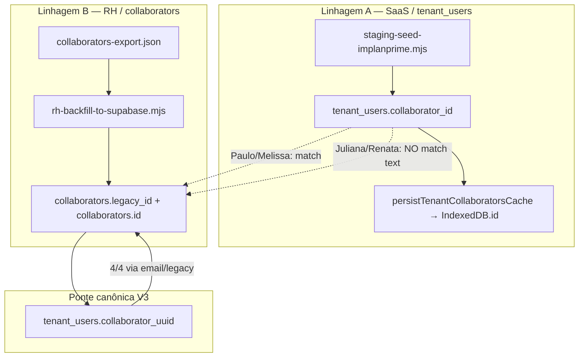

# Love Odonto V3 — RC-01.3 Auditoria de Integridade da Identidade RH

**Documento:** `docs/reports/RH_RC01_IDENTITY_INTEGRITY_AUDIT.md`  
**Ticket:** RC-01.3 — Auditoria de integridade da identidade RH  
**Data:** 2026-06-30  
**Tipo:** **Somente diagnóstico** — nenhum dado, código, banco ou Supabase alterado  
**Ambiente:** Staging Supabase `tckdjyunwmdpqmewrwvt` · Tenant `7aba7127-409c-4ea4-8dbc-807efc5e189c`  
**Produção:** `uoepkwhqztmsjnzirpev` — **não tocada**

---

## Sumário executivo

| Camada | Estado | Avaliação |
|--------|--------|-----------|
| **`tenant_users.collaborator_uuid` → `collaborators.id`** | 4/4 preenchidos, 0 órfãos, 0 duplicatas | **Íntegro** |
| **`tenant_users.collaborator_id` → `collaborators.legacy_id`** | 2/4 alinhados (Paulo, Melissa) · 2/4 divergentes (Juliana, Renata) | **Parcial** |
| **`identities.collaborator_id` (text)** | Espelha `tenant_users.collaborator_id` — mesma divergência | **Parcial** |
| **Shadow QA (correlação só por `legacy_id`)** | Trata Juliana/Renata como ausentes cruzados | **Falso negativo estrutural** |

**Veredicto RC-01.3:** **NO-GO** para promoção read-primary e compare legacy-only · **GO condicional** para operações que usam `collaborator_uuid` como ponte canônica.

A identidade **técnica** (UUID) está correta no Supabase staging. A identidade **legada text** mantém duas linhagens intencionais para Juliana/Renata — espelhando cenário prod documentado no seed.

---

## 1. Tabela `tenant_users`

Consulta read-only (`tenant_id = 7aba7127-409c-4ea4-8dbc-807efc5e189c`):

| email | role (`role_slug`) | status | `has_system_access` | `collaborator_id` (text) | `collaborator_uuid` |
|-------|-------------------|--------|---------------------|--------------------------|---------------------|
| juliana+staging@implanprime.test | administrativo | active | true | `col-saas-c9a3cc7e-d4ab-4934-aad3-56cb0558f1d6` | `6eeabd6b-0a8b-4d88-8715-400e092d3212` |
| melissa+staging@implanprime.test | gerente | **inactive** | false | `col-c52fd5ce-4bc9-4c7d-a4c0-298525d401a3` | `140c5833-7fe8-429a-ace2-ba79d774d85a` |
| paulo+staging@implanprime.test | master | active | true | `col-saas-362c17b7-0abd-4d3f-8669-69c8f409b341` | `9284488d-c0b1-4200-b728-82f757aaf1e0` |
| renata+staging@implanprime.test | administrativo | active | true | `col-c92cf731-eddc-4b0d-9e40-8c77a7a2ee06` | `e3f0f230-4dfa-44f3-9f4d-41c6babcef03` |

**Observações:**

- Os 4 registros possuem `collaborator_uuid` **não nulo**.
- Índice único `(tenant_id, collaborator_uuid)` respeitado — **0 duplicatas**.
- Nenhum `collaborator_uuid` órfão (JOIN com `collaborators` válido para os 4).

---

## 2. Tabela `collaborators`

Consulta read-only (`tenant_id = 7aba7127-409c-4ea4-8dbc-807efc5e189c`, `deleted_at IS NULL`):

| `id` (UUID oficial) | `legacy_id` | email | nome (`apelido` / `nome_completo`) | status | `agenda_enabled` |
|---------------------|-------------|-------|-------------------------------------|--------|------------------|
| `9284488d-c0b1-4200-b728-82f757aaf1e0` | `col-saas-362c17b7-0abd-4d3f-8669-69c8f409b341` | paulo+staging@… | Paulo / Paulo Henrique Silva de Assis | ativo | false |
| `6eeabd6b-0a8b-4d88-8715-400e092d3212` | `col-f93e5dbf-bcc0-4c6d-8f94-f90f7f46bb70` | juliana+staging@… | Dra. Juliana / Juliana | ativo | true |
| `e3f0f230-4dfa-44f3-9f4d-41c6babcef03` | `col-6b85c4cb-345a-4cff-9636-f07ac1aea9f2` | renata+staging@… | Renatinha / Renata Pereira | ativo | false |
| `140c5833-7fe8-429a-ace2-ba79d774d85a` | `col-c52fd5ce-4bc9-4c7d-a4c0-298525d401a3` | melissa+staging@… | Melissa / Melissa Eduarda Guimarães | ativo | false |

Origem: backfill RH (`collaborators-export.json` remapped) — `legacy_id` = chave histórica do export IndexedDB.

---

## 3. Matriz de identidade por e-mail

| email | `tenant_users.collaborator_id` | `tenant_users.collaborator_uuid` | `collaborators.legacy_id` | `collaborators.id` | Match legacy_id | Match uuid | Match email |
|-------|-------------------------------|----------------------------------|---------------------------|-------------------|-----------------|------------|-------------|
| paulo+staging@… | `col-saas-362c17b7-…` | `9284488d-…` | `col-saas-362c17b7-…` | `9284488d-…` | **SIM** | **SIM** | **SIM** |
| melissa+staging@… | `col-c52fd5ce-…` | `140c5833-…` | `col-c52fd5ce-…` | `140c5833-…` | **SIM** | **SIM** | **SIM** |
| juliana+staging@… | `col-saas-c9a3cc7e-…` | `6eeabd6b-…` | `col-f93e5dbf-…` | `6eeabd6b-…` | **NÃO** | **SIM** | **SIM** |
| renata+staging@… | `col-c92cf731-…` | `e3f0f230-…` | `col-6b85c4cb-…` | `e3f0f230-…` | **NÃO** | **SIM** | **SIM** |

### Validação SQL (JOIN `tenant_users` → `collaborators` via `collaborator_uuid`)

| email | `legacy_id_match` | `uuid_match` | `email_match` |
|-------|-------------------|--------------|---------------|
| Paulo | true | true | true |
| Melissa | true | true | true |
| Juliana | **false** | true | true |
| Renata | **false** | true | true |

### Tabela `identities` (espelho do text legado SaaS)

| email | `identities.collaborator_id` | `tenant_users.collaborator_id` | `collaborators.legacy_id` (via uuid) |
|-------|------------------------------|--------------------------------|--------------------------------------|
| paulo+staging@… | `col-saas-362c17b7-…` | igual | igual |
| melissa+staging@… | `col-c52fd5ce-…` | igual | igual |
| juliana+staging@… | `col-saas-c9a3cc7e-…` | igual | **`col-f93e5dbf-…`** (divergente) |
| renata+staging@… | `col-c92cf731-…` | igual | **`col-6b85c4cb-…`** (divergente) |

---

## 4. Análise por pessoa

### Paulo — **ALINHADO**

| Campo | Valor | Observação |
|-------|-------|------------|
| Linhagem SaaS | `col-saas-*` | Criado alinhado ao export no seed |
| `collaborator_id` (TU) | = `collaborators.legacy_id` | OK |
| `collaborator_uuid` (TU) | = `collaborators.id` | OK |
| Risco operacional | Baixo | Referência modelo para cutover |

### Melissa — **ALINHADO (identidade)** · **DIVERGÊNCIA DE STATUS**

| Campo | Valor | Observação |
|-------|-------|------------|
| Linhagem RH export | `col-c52fd5ce-…` | Alinhada em TU e `collaborators.legacy_id` |
| `collaborator_uuid` | = `collaborators.id` | OK |
| Status | `tenant_users.status = inactive` vs `collaborators.status = ativo` | **Não é mismatch de ID** — é política de acesso vs ficha RH |
| Impacto IDB | Melissa pode faltar no cache local (sync TU) apesar de existir em `collaborators` | Ver RC-01.2 |

### Juliana — **DIVERGÊNCIA EXATA (text legado)**

| Identificador | Valor SaaS / TU | Valor RH / `collaborators` |
|---------------|-----------------|----------------------------|
| Text legado | `col-saas-c9a3cc7e-d4ab-4934-aad3-56cb0558f1d6` | `col-f93e5dbf-bcc0-4c6d-8f94-f90f7f46bb70` |
| UUID canônico | `6eeabd6b-0a8b-4d88-8715-400e092d3212` | **igual** (`collaborators.id`) |
| Prefixo | `col-saas-*` (seed SaaS) | `col-*` (export IndexedDB / backfill) |

**Causa documentada:** `DIVERGENT_TENANT_USER_COLLABORATOR_IDS.juliana` em `server/lib/stagingSeedImplanprime.js` — simula prod.

**Ponte UUID:** preenchida pelo backfill RH via **match por e-mail** (não via `collaborator_id` text), pois `resolve_collaborator_uuid_from_legacy(tenant_id, tu.collaborator_id)` **não encontra** linha em `collaborators` para o id `col-saas-c9a3cc7e-…`.

### Renata — **DIVERGÊNCIA EXATA (text legado)**

| Identificador | Valor SaaS / TU | Valor RH / `collaborators` |
|---------------|-----------------|----------------------------|
| Text legado | `col-c92cf731-eddc-4b0d-9e40-8c77a7a2ee06` | `col-6b85c4cb-345a-4cff-9636-f07ac1aea9f2` |
| UUID canônico | `e3f0f230-4dfa-44f3-9f4d-41c6babcef03` | **igual** |
| Prefixo | `col-*` antigo SaaS (divergente do export) | `col-*` export RH |

Mesma mecânica de Juliana — seed intencional + backfill RH + link UUID por e-mail.

---

## 5. Causa raiz provável — duas linhagens de IDs



**Sequência histórica (staging):**

1. **Seed SaaS** (`2026-06-29`) — cria `tenant_users` com:
   - Paulo/Melissa: `collaborator_id` = legacy do export (`export_legacy`)
   - Juliana/Renata: `collaborator_id` = ids **`col-saas-*` / `col-c92cf731-*` divergentes** (`divergent_from_export`)
2. **Migration 017** — adiciona `collaborator_uuid`; backfill SQL automático só resolve quando `collaborator_id` = `collaborators.legacy_id` (vazio antes do RH backfill).
3. **Backfill RH** — insere `collaborators` com `legacy_id` do **export**; popula `collaborator_uuid` em TU por **e-mail** (preservando `collaborator_id` text intacto — política do script).
4. **IndexedDB browser** — repovoado por sync SaaS usando **`tenant_users.collaborator_id`**, não `collaborators.legacy_id` → bifurcação propagada ao client (RC-01.2).

**Resultado:** staging ficou com **duas chaves text** para a mesma pessoa (Juliana/Renata), mas **uma chave UUID** correta.

---

## 6. Identidade canônica oficial — Love Odonto V3 RH

Decisão recomendada para arquitetura e documentação:

| Campo | Papel | Canonicidade | Mutável em cleanup? |
|-------|-------|--------------|---------------------|
| **`collaborators.id`** | UUID oficial da ficha RH no Supabase | **Primária (persistência RH)** | **Nunca** |
| **`collaborators.legacy_id`** | Chave histórica RH / IndexedDB (`id` legado) | **Primária (correlação IDB ↔ Supabase RH)** | Preservar; não reatribuir |
| **`tenant_users.collaborator_uuid`** | FK lógica TU → `collaborators.id` | **Primária (vínculo acesso ↔ RH)** | Só se colaborador recriado (edge) |
| **`tenant_users.collaborator_id`** | Text legado SaaS (`col-*`, `col-saas-*`) | **Transitório** — compat UI/sync legado | **Alinhar** a `collaborators.legacy_id` na fase cleanup |
| **`identities.collaborator_id`** | Snapshot text legado | **Derivado de TU** | Segue alinhamento de TU |
| **IndexedDB `collaborators[].id`** | Espelho local do `legacy_id` | **Deve convergir para `collaborators.legacy_id`** | Via hydrate/mirror, não novo id |

**Regra de ouro V3:**

> Para **autorização, RLS futura (019) e join Supabase**, usar **`collaborator_uuid`**.  
> Para **ficha RH, shadow IDB e appointments legados**, usar **`legacy_id` / IndexedDB.id**.  
> **`tenant_users.collaborator_id` não deve ser usado como chave de compare isolada** quando `collaborator_uuid` estiver preenchido.

---

## 7. Plano seguro de correção em staging

**Restrições do plano (obrigatórias):**

- Sem apagar dados
- Sem alterar `collaborators.id`
- Sem alterar `appointments` / `professionalId` existentes
- Preservar `collaborators.legacy_id`
- Usar `collaborator_uuid` como vínculo canônico já validado

### Fase A — Observabilidade (sem mutação) ✅ *este ticket*

- Auditoria concluída — este documento.

### Fase B — Alinhamento text legado `tenant_users.collaborator_id` (staging only)

**Recomendação:** **Alinhar em staging** antes de cutover read-primary.

| Ação | Script / artefato | Escopo | Risco |
|------|-------------------|--------|-------|
| Dry-run alinhamento text | `scripts/collaborator-id-backfill.mjs` | Juliana: `col-saas-c9a3cc7e-…` → `col-f93e5dbf-…` · Renata: `col-c92cf731-…` → `col-6b85c4cb-…` | Baixo — já modelado em dry-run `2026-06-29` |
| Apply staging | Mesmo script `--apply` + guards staging | Atualiza TU + propaga `identities.collaborator_id` | Médio — exige backup + revalidação |
| **Não alterar** | `collaborator_uuid`, `collaborators.id`, `collaborators.legacy_id` | — | — |

**Alternativa conservadora:** manter text divergente até Sprint cleanup **somente se** Shadow QA e sync IDB forem corrigidos para priorizar UUID (Fase C). **Não recomendado** como estado final — prolonga dual-key no client.

### Fase C — Client / Shadow (código — ticket futuro)

1. Hidratação IDB a partir de `collaborators` (RC-01.2 §12) — usa `legacy_id` canônico RH.
2. Evolução do compare (ver §8).
3. UUID mirror no browser (RC-01.1).

### Fase D — Migration 018 (FK formal)

- Aplicar `018_tenant_users_collaborator_fk.sql` **após** validar 0 órfãos (já true hoje).
- Não depende de alinhar text legado — FK usa `collaborator_uuid`.

### Decisão sobre `tenant_users.collaborator_id` divergente

| Opção | Quando | Veredicto |
|-------|--------|-----------|
| **Manter divergente** até cleanup | Se compare/sync ainda legacy-only | Aceitável **temporariamente** em staging de teste |
| **Alinhar ao `collaborators.legacy_id`** | Antes RC read-primary | **Recomendado** — fecha loop IDB/sync/identities |

---

## 8. Impacto no Shadow QA

### Comportamento atual

`compareCollaborators()` (`collaboratorShadowValidation.ts`) indexa pares **exclusivamente por `legacy_id`**:

```277:287:src/repositories/collaborator/collaboratorShadowValidation.ts
  for (const legacyId of allLegacyIds) {
    const localItem = localMap.get(legacyId);
    const remoteItem = remoteMap.get(legacyId);
    // ...
    if (remoteItem && !localItem) {
      missing_local.push({ ref: toRef(remoteItem) });
```

**Efeito no staging (Juliana/Renata):**

- Remote key `col-f93e5dbf-…` → **missing_local**
- Local key `col-saas-c9a3cc7e-…` → **missing_remote**
- Apesar de `collaborator_uuid` e e-mail corretos no Supabase.

Isso **infla `blockingDiffCount`** sem refletir ruptura da ponte UUID — observabilidade enganosa.

### Correlação recomendada (Ticket futuro — normalização compare)

Ordem de match **determinística**:

| Prioridade | Chave | Condição | Classificação se match |
|------------|-------|----------|--------------------------|
| **1** | UUID | `local.uuid === remote.uuid` (UUID v4 válido) | Match primário |
| **2** | `legacy_id` | Igualdade exata | Match RH histórico |
| **3** | E-mail | Mesmo `tenant_id` + e-mail normalizado | **Fallback controlado** — gerar `transitional_diff` se legacy divergir, **não** `missing_*` duplo |
| **4** | Nenhum | — | `missing_local` / `missing_remote` reais |

**Regras adicionais:**

- Se match por UUID com `legacy_id` diferente → **`transitional_diff`** (`legacy_id_saas_vs_rh`), não blocker, até cleanup text.
- Compare remoto deve expor / mapear `collaborator_uuid` quando disponível (TU não entra no shadow IDB×SB hoje, mas o princípio vale para enrich).
- **Nunca** promover e-mail a match silencioso sem log estrutural.

**Impacto esperado pós-correção do compare (sem mutar dados):**

- Juliana/Renata: de 2× `missing_*` cada → **1 match UUID** + 1 `transitional_diff` legacy (opcional).
- `blockingDiffCount` reduz ~4 entradas fantasma no cenário staging.
- RC-01.2 divergência Melissa (count 3×4) **permanece** até hydrate IDB — compare UUID-first não substitui roster incompleto.

---

## 9. Riscos

| Risco | Severidade | Mitigação |
|-------|------------|-----------|
| Dual-key text (Juliana/Renata) confunde sync IDB | **Alto** | Hydrate RH + alinhamento text ou compare UUID-first |
| Código legado lê só `tenant_users.collaborator_id` | **Alto** | Migrar leitores para `collaborator_uuid` / `legacy_id` RH |
| Shadow QA bloqueia promoção indevidamente | **Médio** | Evoluir compare (§8) |
| `identities.collaborator_id` desatualizado vs RH | **Médio** | Backfill text staging (Fase B) |
| Melissa inactive no TU vs ativo em RH | **Baixo–Médio** | Política explícita: ficha RH ≠ status de login |
| Migration 018 FK sem text alinhado | **Baixo** | FK usa UUID — já íntegro |
| Replicação do padrão em produção | **Alto** | Validar fix em staging antes prod |

---

## 10. Próximos tickets recomendados

| # | Ticket | Escopo | Dependência |
|---|--------|--------|-------------|
| 1 | **RC-01.4** — Alinhamento `collaborator_id` text (staging apply) | `collaborator-id-backfill.mjs` dry-run → apply | Este audit |
| 2 | **RC-01.5** — Hidratação IDB ← Supabase (QA Tools) | `syncCacheFromRemote` guardado | RC-01.2 |
| 3 | **Sprint 1C+** — Shadow compare UUID-first | `collaboratorShadowValidation.ts` | Observabilidade |
| 4 | **RC-01.1** — UUID mirror browser | QA Tools mirror | Hydrate ou roster alinhado |
| 5 | **Migration 018 apply staging** | FK formal `collaborator_uuid` | 0 órfãos ✓ |
| 6 | **Identities sync pós-alignment** | Propagar `legacy_id` RH em `identities` | RC-01.4 |

---

## 11. Conclusão GO / NO-GO

| Decisão | Veredicto | Justificativa |
|---------|-----------|---------------|
| Integridade UUID (`collaborator_uuid` → `collaborators.id`) | **GO** | 4/4 corretos, 0 órfãos, 0 duplicatas |
| Integridade text legado (`collaborator_id` → `legacy_id`) | **NO-GO** | 2/4 divergentes (Juliana, Renata) |
| Shadow QA legacy-only reflete realidade | **NO-GO** | Falsos `missing_*` apesar de UUID correto |
| `RH_SUPABASE_READ_PRIMARY=true` | **NO-GO** | IDB + compare + text legado incompletos |
| Iniciar Fase B (align text staging) | **GO** | Script existente, escopo delimitado, reversível com backup |
| **RC-01.3 overall** | **NO-GO** | Ponte UUID sólida; linhagem text e observabilidade ainda em transição |

---

## Referências

| Artefato | Caminho |
|----------|---------|
| Diagnóstico IDB × Supabase | `docs/reports/RH_RC01_IDB_SUPABASE_DIVERGENCE_DIAGNOSIS.md` |
| Seed staging (divergência intencional) | `server/lib/stagingSeedImplanprime.js` |
| Migration `collaborator_uuid` | `supabase/migrations/017_tenant_users_collaborator_uuid.sql` |
| Migration FK (pendente apply) | `supabase/migrations/018_tenant_users_collaborator_fk.sql` |
| Backfill RH | `scripts/rh-backfill-to-supabase.mjs` |
| Backfill text legado (dry-run existente) | `scripts/collaborator-id-backfill.mjs` |
| Shadow compare | `src/repositories/collaborator/collaboratorShadowValidation.ts` |
| Dry-run backfill text | `scripts/reports/collaborator-id-backfill-dryrun-2026-06-29T18-13-07-979Z.json` |
| Backup pós RH backfill | `scripts/reports/rh-backfill-backup-2026-06-29T23-28-18-921Z.json` |

---

*Documento gerado em modo diagnóstico RC-01.3. Nenhuma mutação aplicada. Produção intocada.*
