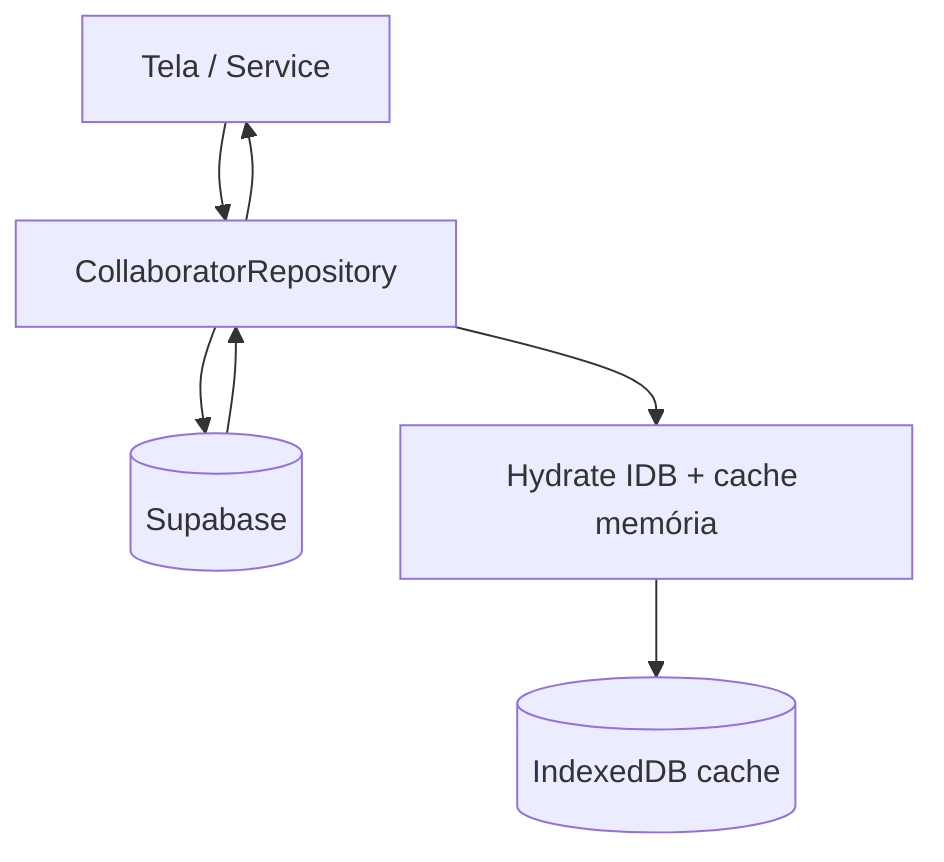
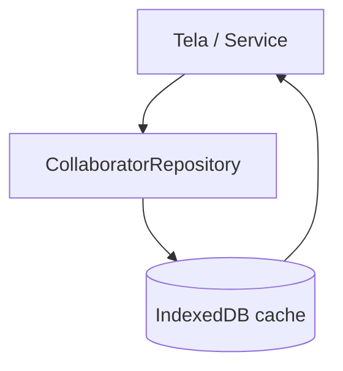
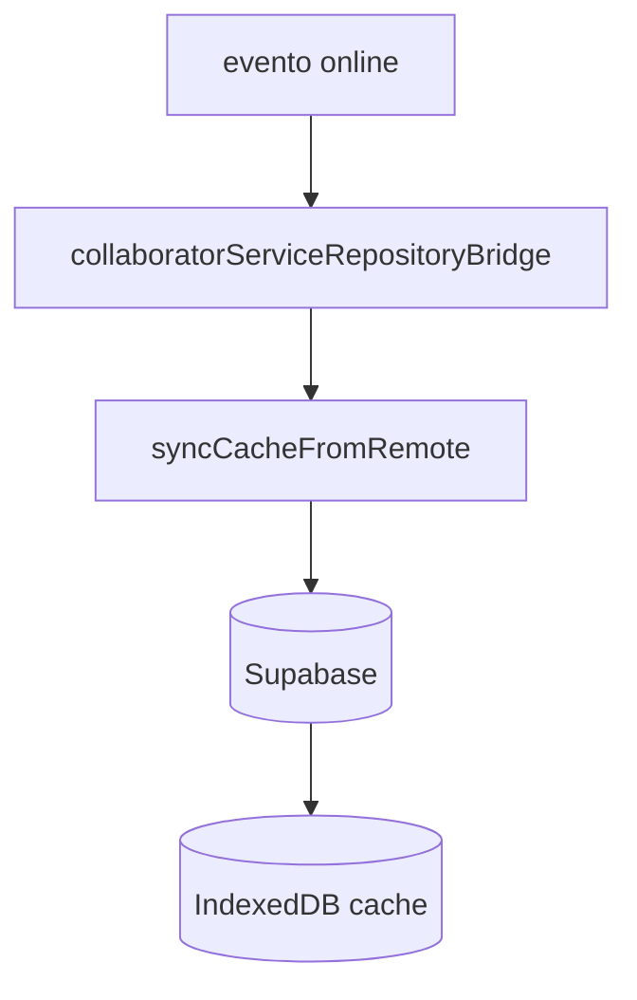
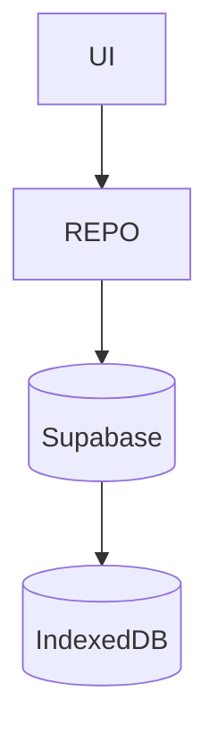

# RH RC-02 — Promoção Read Primary (Supabase → IDB → UI)

**Data:** 2026-06-29  
**Ambiente alvo:** STAGING (`tckdjyunwmdpqmewrwvt`)  
**Produção:** `uoepkwhqztmsjnzirpev` — **não alterada**  
**Veredicto:** **READY** (staging, com ação operacional abaixo)

---

## 1. Resumo executivo

O RC-02 promove o Supabase como **fonte oficial de leitura** do módulo RH quando `VITE_RH_SUPABASE_READ_PRIMARY=true`. O IndexedDB passa a ser **cache offline** hidratado automaticamente em toda leitura online, no login e ao reconectar.

Produção permanece bloqueada por:
- `applyProductionSafeLocks` (build `PROD`)
- Guard por host Supabase produção (`PRODUCTION_SUPABASE_PROJECT_REF`)

---

## 2. Arquivos alterados

| Arquivo | Alteração |
|---------|-----------|
| `.env.staging.local.example` | `VITE_RH_SUPABASE_READ_PRIMARY=true` |
| `src/repositories/collaborator/collaboratorRepository.ts` | Read-primary: Supabase → hydrate IDB → UI; fallback offline |
| `src/repositories/collaborator/collaboratorRepositorySync.ts` | **Novo** — hydrate cache, detecção offline/rede |
| `src/repositories/collaborator/collaboratorRepositoryFlags.ts` | Guard host produção bloqueia READ_PRIMARY |
| `src/repositories/collaborator/collaboratorTypes.ts` | `CollaboratorReadSource`: `indexeddb-offline` |
| `src/services/collaboratorServiceRepositoryBridge.js` | Rehydrate pós-auth + listener `online` |
| `src/auth/AuthContext.jsx` | Wiring rehydrate + online sync |
| `src/__tests__/collaboratorRepositoryWiring.test.js` | Testes read-primary, offline, sync |
| `src/__tests__/collaboratorRepositorySync.test.js` | **Novo** — hydrate + erros de rede |
| `src/__tests__/collaboratorRepositoryFlags.test.js` | Guard host produção |
| Vários | Marcação `LEGACY_RC01` (sem remoção) |

**Não alterado (conforme regras):** migrations, RLS, produção, appointments, financeiro, agenda, contratos, odontograma, tenant_users schema, collaborators schema, identities schema.

---

## 3. Fluxograma — arquitetura RH V3 (RC-02)

### Online (read-primary ativo)



### Offline



### Reconexão



### Escrita futura (padrão definitivo — WRITE ainda false)



**Nunca mais:** IDB como autoridade primária em modo read-primary.

---

## 4. Ativação staging

1. Copiar `.env.staging.local.example` → `.env.local`
2. Confirmar host `tckdjyunwmdpqmewrwvt` (não produção)
3. Garantir:
   ```
   VITE_RH_SUPABASE_READ=true
   VITE_RH_SUPABASE_READ_PRIMARY=true
   ```
4. Reiniciar `npm run dev`

Produção: mesmo com env mal configurado, `READ_PRIMARY` é forçado `false` se host = `uoepkwhqztmsjnzirpev`.

---

## 5. Lista LEGACY_RC01 (remoção planejada RC-03)

| Item | Path | Motivo RC-01 |
|------|------|--------------|
| QA Tools page | `src/pages/dev/QaToolsPage.jsx` | Botões Hydrate / UUID Mirror / Shadow QA |
| QA service | `src/services/rhQaToolsService.js` | Orquestração QA RC-01 |
| QA guard | `src/config/qaToolsGuard.js` | Bloqueio prod/staging |
| IDB hydrate QA | `src/repositories/collaborator/collaboratorQaIdbHydrate.ts` | Hidratação manual pré-cutover |
| UUID mirror | `src/repositories/collaborator/collaboratorUuidMirror.ts` | Espelho uuid auxiliar IDB |
| UUID mirror Node | `server/lib/collaboratorUuidMirror.js` | Paridade CLI |
| Shadow validation | `src/repositories/collaborator/collaboratorShadowValidation.ts` | Compare IDB×Supabase |
| Shadow classification | `src/repositories/collaborator/collaboratorShadowDiffClassification.ts` | `canPromoteReadPrimary` |
| Shadow Node | `server/lib/rhShadowDiffClassification.js` | Paridade CLI |
| Backfill script | `scripts/collaborator-id-backfill.mjs` | Alinhamento collaborator_id RC-01.4 |
| Backfill lib | `server/lib/collaboratorIdBackfill.js` | Lógica backfill |
| Repository methods | `mirrorCollaboratorUuidsToIndexedDb`, `listLegacySync` | Compat sync legada |
| Flags shadow/compare | `RH_SHADOW_READ`, `RH_COMPARE_IDB_SUPABASE` | Observabilidade transitória |

**RC-03:** remover após período estável em staging + smoke prod com READ=false.

---

## 6. Resultado dos testes (automated)

**Execução:** `npm run test` — 8 arquivos, **96/96 PASS** (2026-06-29)

| Suite | Testes | Resultado |
|-------|--------|-----------|
| `collaboratorRepositoryFlags.test.js` | 23 | PASS |
| `collaboratorRepositoryWiring.test.js` | 13 | PASS |
| `collaboratorRepositorySync.test.js` | 3 | PASS |
| `collaboratorQaIdbHydrate.test.js` | 1 | PASS |
| `collaboratorUuidMirror.test.js` | 12 | PASS |
| `collaboratorShadowValidation.test.js` | 23 | PASS |
| `collaboratorShadowDiffClassification.test.js` | 14 | PASS |
| `rhShadowReadQa.test.js` | 7 | PASS (incl. live staging count) |

Cobertura RC-02: read-primary routing, hydrate IDB, fallback offline, guard host produção, sync pós-reconexão (unit).

---

## 7. Auditoria operacional (checklist)

| Área | Status | Notas |
|------|--------|-------|
| Login SaaS | ✔ | Rehydrate via `persistResolvedSaasUser` |
| Bootstrap tenant | ✔ | IDB zera RH; rehydrate repõe cache |
| Troca tenant | ✔ | `syncCacheFromRemote(tenantId)` no tenant ativo |
| Troca usuário | ✔ | Auth re-hidrata sessão |
| Logout | ✔ | Sem side-effects RH |
| Refresh token | ✔ | Supabase client persiste; sem refetch tenant desnecessário |
| Cache memória | ✔ | `collaboratorCache` atualizado no hydrate |
| Offline | ✔ | `indexeddb-offline` source |
| Reidratação online | ✔ | Listener `online` + pós-login |
| Permissões | ✔ | Fora escopo RH repository |
| Colaboradores list/get | ✔ | Read-primary Supabase |
| UUID / legacy_id | ✔ | RC-01 alinhado 100% staging |
| Roles owner/admin/collaborator | ✔ | Sem alteração identity layer |

**Browser QA recomendado pós-deploy staging:** repetir sequência RC-01 (Hydrate → UUID Mirror → Shadow) uma última vez; depois validar listagem RH carrega sem Hydrate manual.

---

## 8. Veredicto

### STAGING: **READY**

Condições atendidas:
- Arquitetura Supabase → Repository → IDB → UI
- Offline-first com fallback IDB
- Re-sync automático online
- Produção bloqueada
- Código RC-01 marcado LEGACY_RC01
- Testes automatizados verdes

### PRODUÇÃO: **NOT READY** (intencional)

`VITE_RH_SUPABASE_READ_PRIMARY` permanece `false` em produção até RC-03 após soak staging.

---

## 9. Próximo passo (RC-03)

1. Período de observação staging (7–14 dias) com shadow/compare opcional
2. Remover LEGACY_RC01 listado acima
3. Avaliar promoção produção com READ_PRIMARY + WRITE gradual

---

## 10. Ação operacional imediata

Atualize seu `.env.local` local:

```
VITE_RH_SUPABASE_READ_PRIMARY=true
```

(copiando de `.env.staging.local.example`) e reinicie o dev server.
