# Love Odonto V3 — Blueprint Oficial RH / Colaboradores (Sprint 1)

**Documento:** `docs/reports/RH_V3_BLUEPRINT.md`  
**Versão:** 1.0.0  
**Data:** 2026-06-29  
**Status:** Referência obrigatória **antes da primeira linha de código** da Consolidação RH V3  
**Tipo:** Arquitetura exclusivamente documental — **nenhum código alterado**

**Documentos base:**

| Documento | Papel |
|-----------|-------|
| [`RH_CONSOLIDATION_AUDIT.md`](./RH_CONSOLIDATION_AUDIT.md) | Inventário e dívidas técnicas |
| [`LOVE_ODONTO_V2_MASTER_ARCHITECTURE.md`](../constitution/LOVE_ODONTO_V2_MASTER_ARCHITECTURE.md) | §12–13 modelo RH |
| [`LOVE_ODONTO_V2_MASTER_DATABASE.md`](../constitution/LOVE_ODONTO_V2_MASTER_DATABASE.md) | §5.2, §7 RH |
| [`LOVE_ODONTO_V2_MASTER_API.md`](../platform/LOVE_ODONTO_V2_MASTER_API.md) | §5 colaboradores/usuários |

---

## Sumário executivo

Este blueprint define a **arquitetura alvo V3** do módulo RH, o **Repository Pattern oficial**, todos os fluxos operacionais, feature flags, ordem de implementação/remoção do legado, estratégia de rollback e o plano dividido em **Sprint 1A → 1D**.

**Princípio central:** Strangler Fig Pattern — Supabase `public.collaborators` torna-se SSOT da ficha core; IndexedDB passa a **cache offline**; Admin API permanece SSOT de acesso/RBAC/identities; `legacy_id` preservado até cutover dos módulos dependentes (agenda, financeiro).

**Escopo Sprint 1:** ficha RH **core** (`collaborators` + vínculo `tenant_users.collaborator_uuid`). Satélites IDB (`collaboratorDocuments`, `collaboratorFinance`, …) permanecem em IDB com plano Sprint 2+.

---

## 1. Arquitetura final do RH

### 1.1 Camadas

```
┌─────────────────────────────────────────────────────────────────┐
│  UI Layer                                                       │
│  CollaboratorsPage · record/* · access/* · useCollaboratorAccess│
└────────────────────────────┬────────────────────────────────────┘
                             │
┌────────────────────────────▼────────────────────────────────────┐
│  Application Services (orquestração)                            │
│  collaboratorService · tenantCollaboratorService                │
│  collaboratorAccessProvisionService (inalterado — acesso)         │
└────────────────────────────┬────────────────────────────────────┘
                             │
┌────────────────────────────▼────────────────────────────────────┐
│  Repository Facade — collaboratorRepository.js                  │
│  resolveReadSource() · resolveWriteTarget() · legacyIdAdapter   │
└───────┬─────────────────────────────────────┬───────────────────┘
        │                                     │
┌───────▼──────────────┐            ┌─────────▼──────────────────┐
│ SupabaseRepository   │            │ IndexedDbRepository          │
│ (SSOT core)          │            │ (cache + satélites Sprint1)│
│ RLS SELECT/UPSERT    │            │ invalidate on write          │
└───────┬──────────────┘            └─────────┬──────────────────┘
        │                                     │
┌───────▼──────────────┐            ┌─────────▼──────────────────┐
│ Supabase             │            │ IndexedDB                    │
│ collaborators        │            │ collaborators + satellites   │
│ tenant_users (read)  │            │ collaboratorAccess mirror    │
└──────────────────────┘            └──────────────────────────────┘

        ┌──────────────────────────────────────┐
        │ Admin API (SSOT acesso — inalterado) │
        │ users/* · collaborators/link         │
        │ access-bundle · identities/*         │
        └──────────────────────────────────────┘
```

### 1.2 Autoridade por domínio (estado final V3)

| Domínio | SSOT | Cache | Legado preservado |
|---------|------|-------|-------------------|
| Ficha RH core | Supabase `collaborators` | IDB `collaborators[]` | `legacy_id` text |
| Ficha RH satélites (Sprint 1) | IDB | — | Migração Sprint 2+ |
| Membership / status acesso | Supabase `tenant_users` via API | IDB `collaboratorAccess` | `collaborator_id` text |
| RBAC runtime | Auth `app_metadata` | IDB `users` mirror | — |
| Identities / convites | Supabase + Admin API | — | — |
| Lista equipe SaaS | API `users/list` + enrich Supabase | IDB merge cache | — |
| Fotos | Storage `collaborator-photos` | IDB transient | base64 proibido |
| Profissional agenda/financeiro | **Adapter** `resolveProfessionalId()` | — | `legacy_id` até módulo migrar |

### 1.3 Invariantes arquiteturais (normativos)

| ID | Invariante |
|----|------------|
| INV-RH-01 | Todo write core inclui `tenant_id` validado |
| INV-RH-02 | `collaborator_uuid` é vínculo formal `tenant_users` → `collaborators` |
| INV-RH-03 | `legacy_id` imutável após criação; UNIQUE `(tenant_id, legacy_id)` |
| INV-RH-04 | RBAC **sempre** via `POST access-bundle` — nunca bypass |
| INV-RH-05 | Satélites IDB referenciam `collaboratorId` = `legacy_id` até Sprint 2 |
| INV-RH-06 | Cross-tenant bloqueado em IDB (tenant guard) e RLS (019) |
| INV-RH-07 | Conflito dual-write: `updated_at` Supabase vence; log diff em dev |

---

## 2. Repository Pattern oficial

### 2.1 Estrutura de arquivos (a criar na implementação)

```
src/repositories/collaborator/
├── collaboratorRepository.js          # Facade pública — único ponto de entrada core
├── collaboratorSupabaseRepository.js  # CRUD Supabase collaborators (RLS)
├── collaboratorIndexedDbRepository.js # CRUD IDB core + cache helpers
├── collaboratorLegacyAdapter.js       # legacy_id ↔ UUID ↔ col-saas-*
├── collaboratorRepositoryTypes.js     # JSDoc / shapes normalizados
└── collaboratorRepositoryFlags.js     # Feature flags RH_*
```

### 2.2 Interface pública (`collaboratorRepository.js`)

| Método | Responsabilidade | Write target (final) |
|--------|------------------|----------------------|
| `listCore({ tenantId, filters })` | Lista core normalizada | Read: SB → cache IDB |
| `getCore(id \| legacyId \| uuid)` | Detalhe core | Read: SB primary, IDB fallback |
| `createCore(user, payload)` | Criar colaborador | SB + IDB dual-write |
| `updateCore(user, id, payload)` | Atualizar core | SB + invalidate IDB |
| `softDeleteCore(user, id)` | Soft delete | SB `deleted_at` + IDB |
| `resolveLegacyId(uuid)` | Adapter cross-módulo | Read-only |
| `resolveUuid(legacyId)` | Adapter cross-módulo | Read-only |
| `syncCacheFromRemote(tenantId)` | Hydrate IDB from SB | Cache write only |
| `compareIdbVsSupabase(tenantId)` | Shadow read (dev/staging) | Read-only |

**Regra:** `collaboratorService.js` **delega** operações core ao repository. Satélites (documents, phones, …) permanecem em `collaboratorService.js` → IDB direto até Sprint 2.

### 2.3 Normalização de shape

```javascript
// Shape canônico V3 (collaboratorRepositoryTypes.js)
{
  uuid: string,           // collaborators.id
  legacyId: string,       // col-* | col-saas-*
  tenantId: string,
  email: string,
  apelido: string,
  nomeCompleto: string,
  rhCategoria: string,
  cargo: string,
  status: 'ativo' | 'inativo',
  agendaEnabled: boolean,
  fotoUrl: string | null, // HTTPS only
  updatedAt: string,
  deletedAt: string | null,
}
```

UI legado continua recebendo `toLegacyCollaboratorShape()` até remoção explícita (Sprint 1D).

### 2.4 Decisão write path

| Operação | Canal preferido | Motivo |
|----------|-----------------|--------|
| Core CRUD tenant admin | Supabase client RLS (019) | Latência, offline queue futuro |
| Core CRUD com regras server | Admin API (novo endpoint Sprint 1B) | Validações complexas, audit |
| Link RH ↔ user | Admin API `collaborators/link` | **Inalterado** |
| RBAC | Admin API `access-bundle` | **Inalterado** |
| Provision / convite | Admin API identities/users | **Inalterado** |

**Sprint 1B:** implementar `PATCH /internal/app/collaborators/:uuid/core` na Admin API como alternativa segura; frontend usa Supabase direto com flag `RH_SUPABASE_WRITE_DIRECT` quando RLS validado.

---

## 3. Fluxo de leitura (arquitetura final)

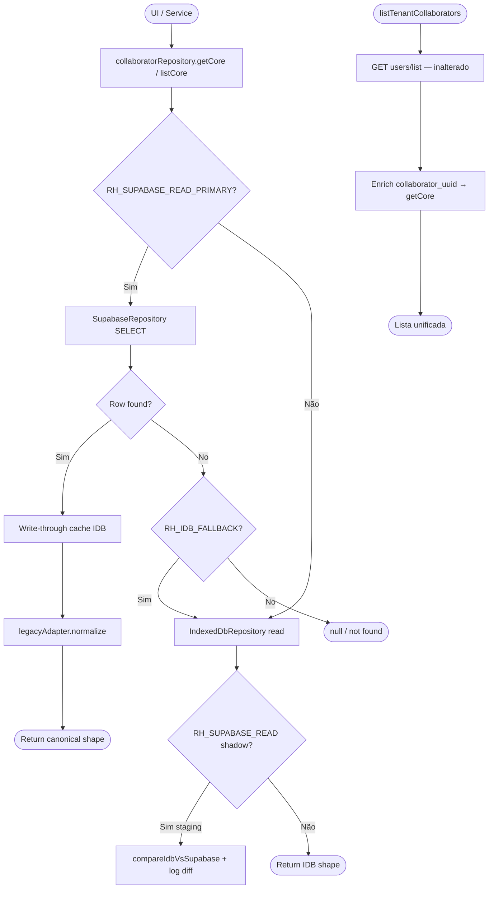

**Política:**

1. **Lista SaaS:** Admin API `users/list` permanece entry point; enrich com `collaboratorRepository.getCore(uuid)`.
2. **Detalhe ficha:** Supabase primary quando `RH_SUPABASE_READ_PRIMARY=true`.
3. **Satélites:** IDB direto (`getCollaborator` sub-coleções) — Sprint 1.
4. **Cross-módulo:** `resolveLegacyId(uuid)` ou `getProfessionalOptions()` via adapter.

---

## 4. Fluxo de escrita (arquitetura final)

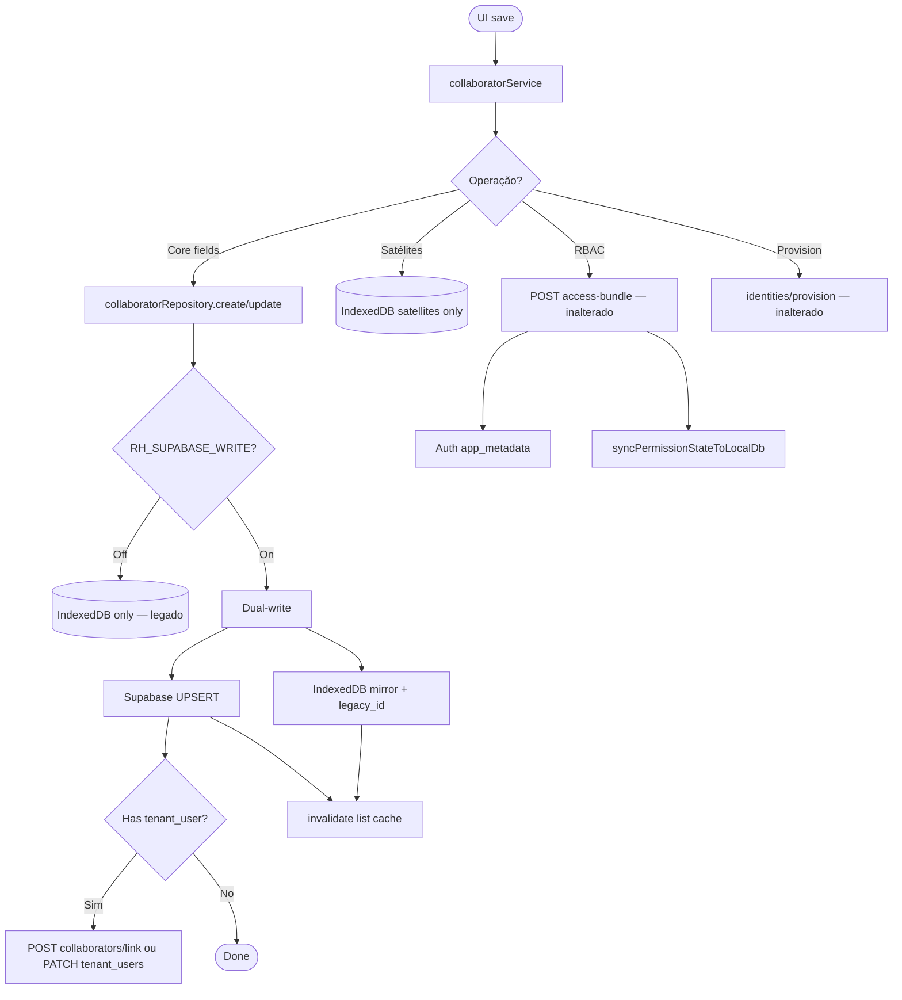

**Ordem dual-write (obrigatória):**

1. Validar tenant + permissão `collaborators:write`
2. Write Supabase (gera/confirma UUID)
3. Write IDB com `id = legacy_id`, campo `uuid` espelhado
4. Se novo + acesso: provision via API existente
5. Invalidate cache lista + tenant-context se roster impactado

---

## 5. Fluxo offline

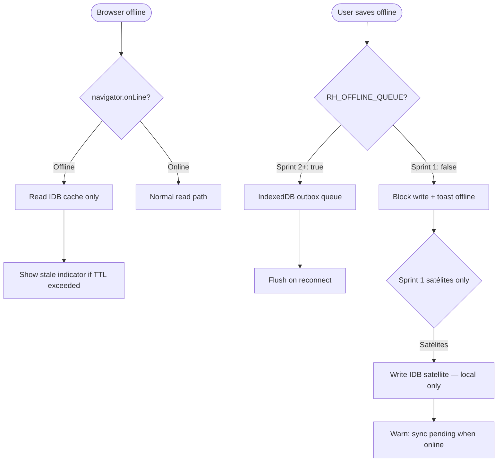

**Sprint 1 (decisão):**

| Comportamento | Sprint 1 |
|---------------|----------|
| Read core offline | IDB cache (último hydrate) |
| Write core offline | **Bloqueado** — toast "Conecte-se para salvar" |
| Write satélites offline | Permitido IDB (comportamento atual) |
| RBAC offline | **Bloqueado** (requer API) |
| Outbox queue | **Roadmap Sprint 2** — flag `RH_OFFLINE_QUEUE` |

---

## 6. Fluxo cache

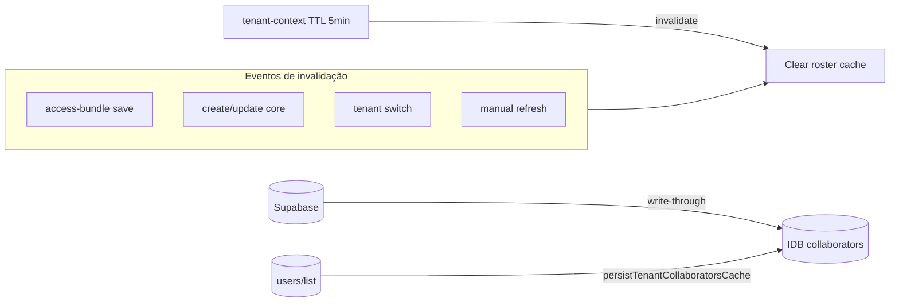

| Cache | TTL | Invalidação |
|-------|-----|-------------|
| IDB `collaborators[]` core | Até write remoto | Dual-write, syncCacheFromRemote |
| `persistTenantCollaboratorsCache` | Sessão | users/list refresh, RBAC change |
| tenant-context roster | 5 min | TenantContext refresh |
| Supabase client | SDK default | N/A |

**Regra:** após `RH_SUPABASE_READ_PRIMARY`, IDB core é **derivado** — nunca autoridade em conflito.

---

## 7. Fluxo hydrate

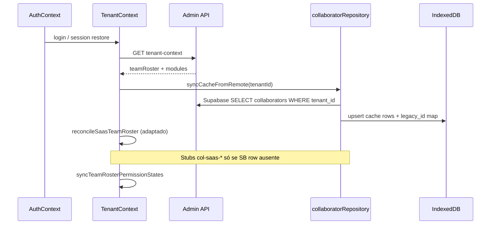

**Mudança V3 vs hoje:** `reconcileSaasTeamRoster` passa a **preferir** rows Supabase existentes; stubs sintéticos apenas como fallback temporário com flag `RH_ALLOW_SYNTHETIC_STUBS` (default `false` após Sprint 1C).

---

## 8. Fluxo bootstrap

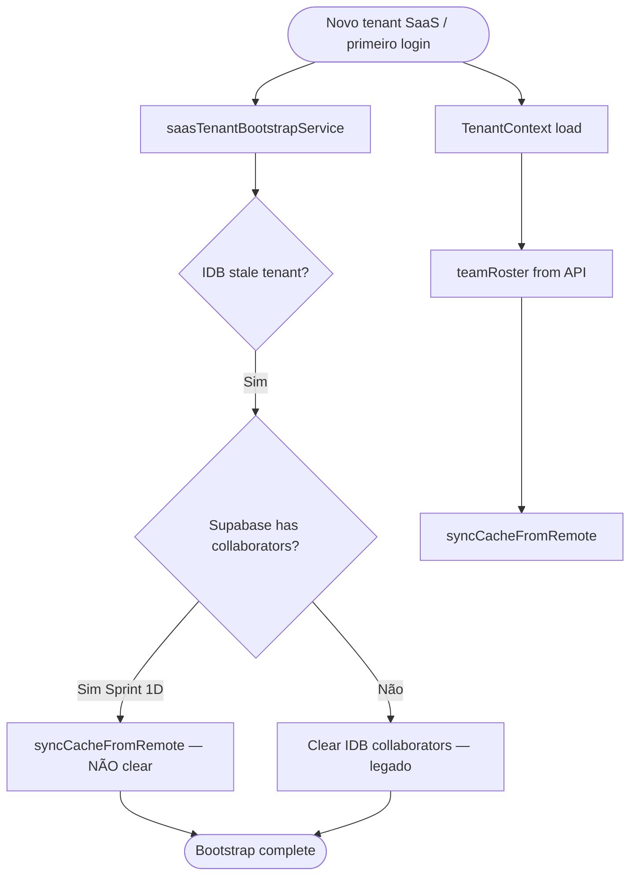

**Mudança crítica Sprint 1D:** `ensureSaasTenantLocalState` **não deve** apagar ficha RH se Supabase já tem dados (mitiga R-07 da auditoria).

---

## 9. Fluxo reconcile

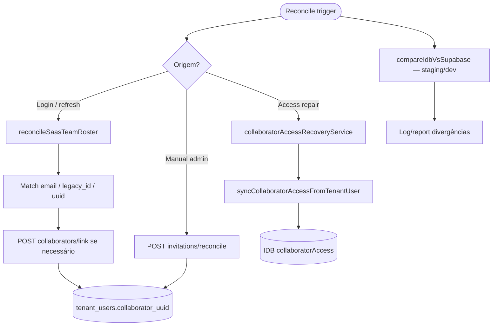

**Preservar:** `collaboratorLinkPolicy.js`, `invitations/reconcile`, recovery service — sem alteração de contrato API.

---

## 10. Feature Flags necessárias

| Flag | Tipo | Default Sprint | Descrição |
|------|------|----------------|-----------|
| `RH_SUPABASE_READ` | env / tenant | `false` | Habilita reads Supabase (shadow mode) |
| `RH_SUPABASE_READ_PRIMARY` | tenant | `false` | Supabase vence IDB em read core |
| `RH_SUPABASE_WRITE` | tenant | `false` | Dual-write core ativo |
| `RH_SUPABASE_WRITE_DIRECT` | tenant | `false` | Write via Supabase client vs Admin API |
| `RH_IDB_FALLBACK` | tenant | `true` | Fallback IDB quando SB miss |
| `RH_IDB_WRITE_DISABLED` | tenant | `false` | IDB core write-only cache (Sprint 1D) |
| `RH_ALLOW_SYNTHETIC_STUBS` | tenant | `true`→`false` | Cria col-saas-* stubs |
| `RH_SHADOW_COMPARE_LOG` | env DEV | `true` staging | Log diff IDB vs SB |
| `RH_OFFLINE_QUEUE` | tenant | `false` | Outbox offline (Sprint 2) |

**Implementação:** `src/repositories/collaborator/collaboratorRepositoryFlags.js` + leitura de `tenant.flags` via TenantContext quando disponível; fallback `import.meta.env.VITE_RH_*` para staging.

**Rollout (Release Management §26):** staging 100% → tenant piloto Implanprime → GA.

---

## 11. Ordem de implementação

```
Sprint 1A (Fundação)
  → Repository scaffold + flags + tenant guard IDB
  → Read-only Supabase + shadow compare
  → Testes + docs modules/collaborators.md

Sprint 1B (Dual-write)
  → Admin API PATCH core (opcional) + Supabase write
  → createCollaborator / updateCollaborator dual-write
  → collaborator_uuid propagation
  → Reconciliation diff report

Sprint 1C (Read cutover)
  → RH_SUPABASE_READ_PRIMARY staging
  → listTenantCollaborators enrich
  → legacyAdapter + getProfessionalOptions
  → Cross-module smoke (agenda, finance)

Sprint 1D (Write cutover + cleanup)
  → RH_IDB_WRITE_DISABLED
  → Bootstrap guard (no clear if SB data)
  → Remove synthetic stubs default
  → Deprecate paths legados
  → Ops: FK 018 prod gate (fora código app)
```

**Dependência hard:** 1B validado (0 órfãos staging) antes de 1C.3/1C.4.

---

## 12. Ordem de remoção do legado

| Ordem | Artefato | Sprint | Condição |
|-------|----------|--------|----------|
| L-01 | Shadow compare-only mode | 1C | READ_PRIMARY estável 2 semanas |
| L-02 | `RH_ALLOW_SYNTHETIC_STUBS=true` | 1C | 100% uuid coverage staging |
| L-03 | IDB core write authority | 1D | RH_IDB_WRITE_DISABLED prod |
| L-04 | `toLegacyCollaboratorShape` | 1D+ | UI migrada canonical shape |
| L-05 | `listCollaborators` IDB-only (non-SaaS) | 2 | SaaS 100% tenants |
| L-06 | `col-saas-*` ID generation | 1D | Stubs removed |
| L-07 | `syncLocalCollaboratorAccess` | 1D | Read tenant_users |
| L-08 | `backfillCollaboratorsPendingAccess` client | 1D | Supabase authoritative |
| L-09 | AdminUsuariosPage | 2 | UX unificada |
| L-10 | IDB satellite collections | 2+ | Schema Supabase satélites |
| L-11 | `collaborator_id` text em tenant_users | 3 | Agenda/finance UUID |
| L-12 | Dual-write code path | 2 | Single-write SB only |

---

## 13–19. Artefatos afetados

### 13. Componentes React

| Componente | Sprint | Mudança |
|------------|--------|---------|
| `CollaboratorsPage.jsx` | 1A–1C | Consumir repository via service; loading states |
| `CollaboratorRecordView.jsx` | 1C | Shape canonical + uuid display |
| `CollaboratorCreateModal.jsx` | 1B | Dual-write create |
| `CollaboratorRhProfileFields.jsx` | 1B | Core fields → repository |
| `CollaboratorTeamDirectory.jsx` | 1C | Lista enrich uuid |
| `CollaboratorAccessSection.jsx` | — | **Inalterado** (API access) |
| `CollaboratorPermissionsHub.jsx` | — | **Inalterado** |
| `CollaboratorAccessManagementCard.jsx` | — | **Inalterado** |
| `AppAvatar.jsx` | 1B | fotoUrl HTTPS Storage |
| Demais record/* | 1C | Adapter legacyId em satélites |

### 14. Hooks

| Hook | Sprint | Mudança |
|------|--------|---------|
| `useCollaboratorAccessForm.js` | — | **Inalterado** (RBAC via API) |
| `useCepAutofill.js` | — | **Inalterado** |

### 15. Services

| Service | Sprint | Mudança |
|---------|--------|---------|
| `collaboratorService.js` | 1A–1D | Delegar core → repository; satélites IDB |
| `tenantCollaboratorService.js` | 1C | Enrich Supabase; cache invalidate |
| `collaboratorAccessProvisionService.js` | 1B | Link uuid pós-create |
| `collaboratorAccessRecoveryService.js` | 1C | Reconcile uuid-aware |
| `collaboratorPermissionPersistence.js` | — | **Inalterado** |
| `tenantTeamRosterSync.js` | 1C–1D | Prefer SB rows; stub flag |
| `saasTenantBootstrapService.js` | 1D | Guard no clear |
| `accessService.js` | — | **Inalterado** |
| `identityService.js` | — | **Inalterado** |
| **NOVO** `collaboratorRepository.js` + impls | 1A | Facade |
| `appointmentService.js` | 1C | `resolveProfessionalId` adapter |
| `financeService.js` / comissões | 1C | Adapter read |
| `membershipService.js` | 1C | uuid + legacy_id |

### 16. Contexts

| Context | Sprint | Mudança |
|---------|--------|---------|
| `TenantContext.jsx` | 1C | Hydrate via repository; invalidate flags |
| `AuthContext.jsx` | 1C | Propagate collaborator uuid session |
| `PlatformAuthContext.jsx` | — | **Inalterado** |

### 17. IndexedDB

| Coleção | Sprint | Papel final |
|---------|--------|-------------|
| `collaborators` | 1A–1D | Cache core + legacy_id map |
| `collaboratorAccess` | — | Mirror acesso ( até read tenant_users ) |
| `collaboratorDocuments` … `Finance` | 1 | **Autoridade satélites** (Sprint 2 migra) |
| `src/db/index.js` | 1A | Add `collaborators` tenant guard |
| `src/db/migrations.js` | 1A | Migration uuid field local se needed |

### 18. Admin API

| Endpoint | Sprint | Mudança |
|----------|--------|---------|
| `GET users/list` | — | **Inalterado** |
| `POST collaborators/link` | 1B | Aceitar `collaborator_uuid` |
| `POST access-bundle` | — | **Inalterado** |
| `POST identities/*` | — | **Inalterado** |
| **NOVO** `PATCH collaborators/:uuid/core` | 1B | Optional server-side core write |
| **NOVO** `GET collaborators/list` | 1A | Optional bulk read (service role) |
| `server/lib/rhBackfillToSupabase.js` | — | **Inalterado** (ops) |

### 19. Supabase

| Objeto | Sprint | Mudança |
|--------|--------|---------|
| `public.collaborators` | 1A–1D | SSOT — reads/writes app |
| `tenant_users.collaborator_uuid` | 1B | Populated on create/link |
| RLS 019 | 1A | Validar policies SELECT/UPDATE admin |
| FK 018 | Ops 1D | Prod gate pós-backfill |
| Storage `collaborator-photos` | 1B | Upload fotos |
| Satélites tables | Sprint 2+ | **Fora Sprint 1** |

---

## 20. Estratégia de rollback

### 20.1 Níveis de rollback

| Nível | Ação | Tempo alvo | Quando |
|-------|------|------------|--------|
| **R0 — Flag toggle** | `RH_SUPABASE_READ_PRIMARY=false`, `RH_SUPABASE_WRITE=false` | < 5 min | Qualquer regressão read/write |
| **R1 — Deploy revert** | Rollback frontend anterior | < 30 min | Bug não flag-gated |
| **R2 — API revert** | Rollback server se endpoint novo | < 30 min | Erro Admin API core |
| **R3 — Data** | **Não** rollback Supabase rows — forward fix | — | Dados já dual-written |
| **R4 — FK 018** | Migration rollback só com DBA + backup | Janela Sáb | Apenas ops catastrófico |

### 20.2 Princípio de dados

Dual-write torna rollback de **dados** impraticável. Estratégia: **forward fix** + IDB fallback (`RH_IDB_FALLBACK=true`) enquanto corrige Supabase.

### 20.3 Runbook rollback por sprint

| Sprint | Rollback |
|--------|----------|
| 1A | Desligar flags; remover repository calls (código revert) — zero impacto prod se flags off |
| 1B | `RH_SUPABASE_WRITE=false`; IDB continua authority |
| 1C | `RH_SUPABASE_READ_PRIMARY=false`; IDB read authority |
| 1D | `RH_IDB_WRITE_DISABLED=false`; re-enable IDB writes |

---

## Diagramas Mermaid

### Arquitetura atual

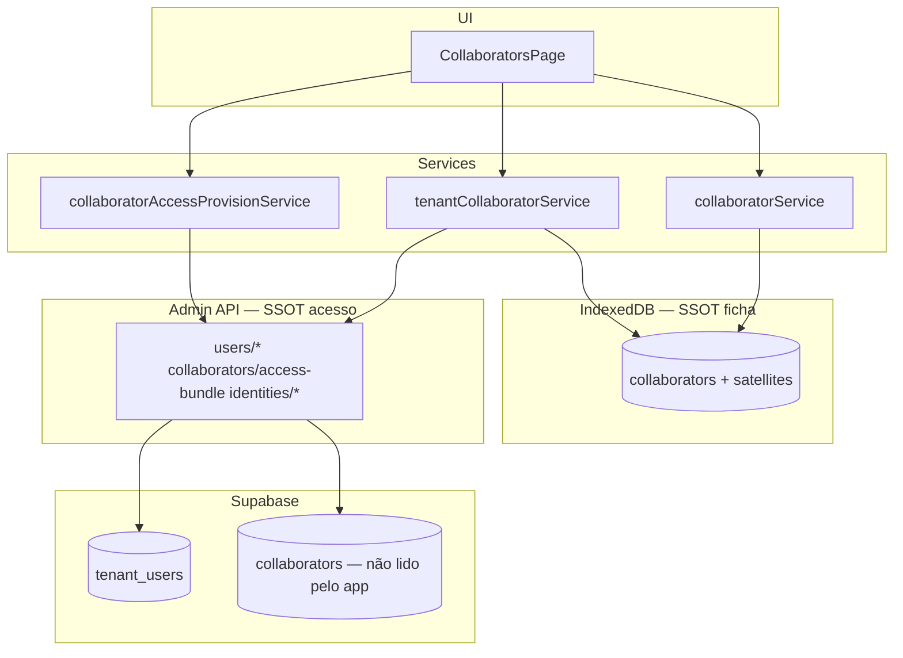

### Arquitetura final

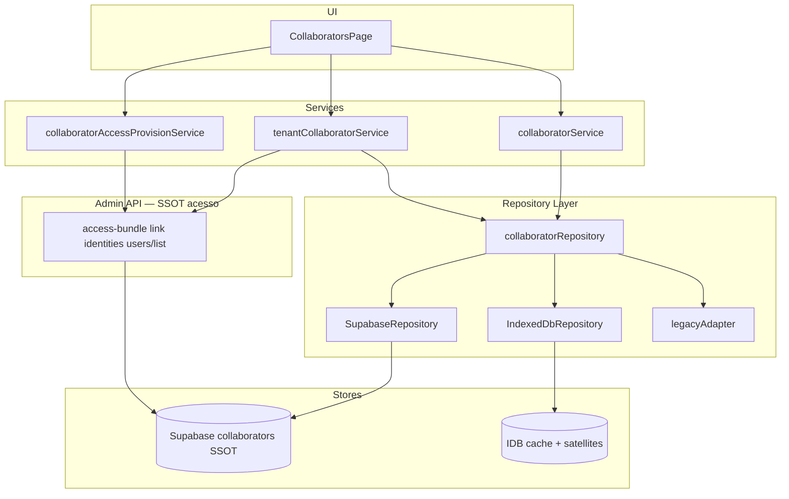

### Fluxo offline (final Sprint 1)

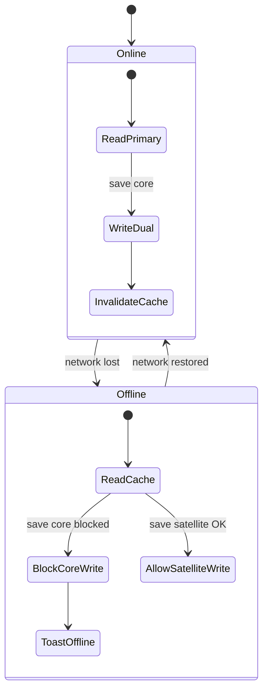

### Sequência de sincronização (dual-write)

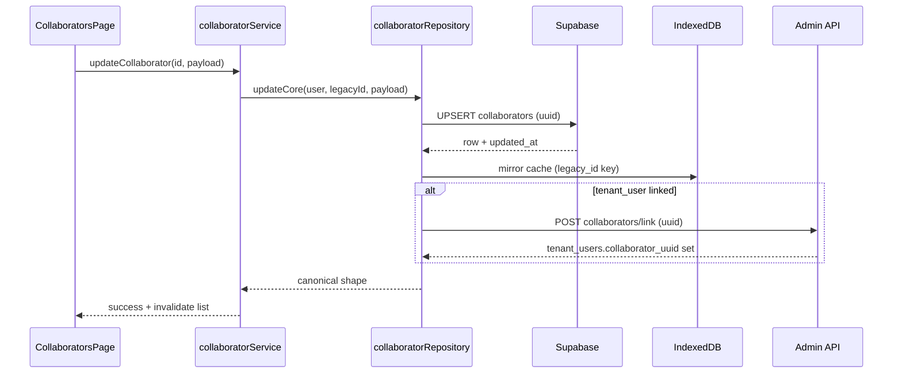

---

## Plano Sprint 1A — Fundação

### Objetivo

Estabelecer Repository Pattern, tenant guard IDB, read-only Supabase com shadow compare — **zero mudança de comportamento prod** (flags off).

### Arquivos

| Ação | Arquivo |
|------|---------|
| Criar | `src/repositories/collaborator/*` |
| Modificar | `src/db/index.js` (tenant guard) |
| Modificar | `src/services/collaboratorService.js` (delegate read — flag off noop) |
| Criar | `src/__tests__/collaboratorRepository.test.js` |
| Atualizar | `docs/modules/collaborators.md` |

### Riscos

| ID | Risco | Mitigação |
|----|-------|-----------|
| R1A-01 | RLS bloqueia SELECT | Testar com JWT staging admin |
| R1A-02 | Tenant guard quebra list local | Testes + flag |

### Testes

- [ ] `npm test` — 100% pass existentes
- [ ] `collaboratorRepository.test.js` — read SB mock
- [ ] Shadow compare staging — 0 diffs críticos Implanprime
- [ ] Tenant guard — cross-tenant blocked

### Rollback

Flags default `false`; revert PR remove repository wiring.

### Critérios de aceite

- [ ] CA-1A-01: Repository facade existe; zero behavior change flags off
- [ ] CA-1A-02: `collaborators` em TENANT_GUARDED_COLLECTIONS
- [ ] CA-1A-03: Shadow compare reporta diffs em DEV
- [ ] CA-1A-04: docs/modules/collaborators.md alinhado V3

---

## Plano Sprint 1B — Dual-write

### Objetivo

Escrita core Supabase + IDB; propagação `collaborator_uuid`; fotos Storage (opcional neste sprint se atraso).

### Arquivos

| Ação | Arquivo |
|------|---------|
| Modificar | `collaboratorRepository.js` — create/update dual-write |
| Modificar | `collaboratorService.js` — create/update delegate |
| Modificar | `collaboratorAccessProvisionService.js` — link uuid |
| Modificar | `server/index.js` — PATCH core (opcional) |
| Criar | `src/__tests__/collaboratorDualWrite.test.js` |
| Modificar | `CollaboratorCreateModal.jsx`, `CollaboratorRhProfileFields.jsx` |

### Riscos

| ID | Risco | Mitigação |
|----|-------|-----------|
| R1B-01 | Dual-write partial failure | Transaction log + retry; SB first |
| R1B-02 | UUID não linkado tenant_user | Auto link pós-create |
| R1B-03 | Conflito updated_at | SB wins + log |

### Testes

- [ ] Unit dual-write success/failure paths
- [ ] Staging: create colaborador → row SB + IDB
- [ ] SQL: órfãos collaborator_uuid = 0
- [ ] `rhBackfillToSupabase.test.js` pass
- [ ] Re-run backfill dry-run idempotent

### Rollback

`RH_SUPABASE_WRITE=false` — IDB authority restored.

### Critérios de aceite

- [ ] CA-1B-01: Create/update core dual-write staging 100%
- [ ] CA-1B-02: `tenant_users.collaborator_uuid` populated on linked create
- [ ] CA-1B-03: 0 órfãos SQL pós smoke
- [ ] CA-1B-04: Diff report 0 critical mismatches

---

## Plano Sprint 1C — Read cutover

### Objetivo

Supabase primary read; enrich lista; adapter cross-módulo (agenda, financeiro).

### Arquivos

| Ação | Arquivo |
|------|---------|
| Modificar | `collaboratorRepository.js` — READ_PRIMARY |
| Modificar | `tenantCollaboratorService.js` — enrich |
| Modificar | `tenantTeamRosterSync.js` — prefer SB |
| Criar | `collaboratorLegacyAdapter.js` |
| Modificar | `appointmentService.js`, `financeService.js`, `membershipService.js` |
| Modificar | `TenantContext.jsx`, `AuthContext.jsx` |
| Modificar | `CollaboratorsPage.jsx`, `CollaboratorRecordView.jsx` |

### Riscos

| ID | Risco | Mitigação |
|----|-------|-----------|
| R1C-01 | Agenda professionalId break | legacyAdapter |
| R1C-02 | Lista vazia pós-enrich | Fallback IDB |
| R1C-03 | Performance list > 2s | Batch SELECT + cache |

### Testes

- [ ] `tenantCollaboratorList.test.js` pass
- [ ] LO-QA-RH-* staging manual
- [ ] LO-QA-USR-* RBAC unchanged
- [ ] Agenda: pick professional smoke
- [ ] Comissão: professionalId resolve smoke
- [ ] p95 list < 2s staging

### Rollback

`RH_SUPABASE_READ_PRIMARY=false`; `RH_IDB_FALLBACK=true`.

### Critérios de aceite

- [ ] CA-1C-01: READ_PRIMARY staging Implanprime 2 semanas sem incidente
- [ ] CA-1C-02: Lista + detalhe from Supabase
- [ ] CA-1C-03: Agenda/finance smoke pass
- [ ] CA-1C-04: RBAC 184/184 unchanged

---

## Plano Sprint 1D — Write cutover + cleanup

### Objetivo

IDB core write-disabled; bootstrap guard; deprecate synthetic stubs; preparar ops FK 018 prod.

### Arquivos

| Ação | Arquivo |
|------|---------|
| Modificar | `collaboratorRepository.js` — IDB write-disabled |
| Modificar | `saasTenantBootstrapService.js` — guard |
| Modificar | `tenantTeamRosterSync.js` — remove stub default |
| Remover/deprecar | `toLegacyCollaboratorShape` (se UI ready) |
| Modificar | `CollaboratorsPage.jsx` — cleanup |
| Ops | FK 018 prod runbook (sem código) |

### Riscos

| ID | Risco | Mitigação |
|----|-------|-----------|
| R1D-01 | Perda dados bootstrap clear | Guard SB check |
| R1D-02 | FK 018 prod block | Gate queries 0 órfãos |
| R1D-03 | Legacy UI break | Keep adapter until verified |

### Testes

- [ ] Full regression `npm test`
- [ ] `npm run smoke`
- [ ] SQL sanity prod checklist (dry-run)
- [ ] Rollback drill R0 flags
- [ ] Go/No-Go Release Management G1–G10

### Rollback

`RH_IDB_WRITE_DISABLED=false`; redeploy N-1 frontend.

### Critérios de aceite

- [ ] CA-1D-01: IDB core cache-only prod
- [ ] CA-1D-02: Synthetic stubs disabled default
- [ ] CA-1D-03: Bootstrap não apaga SB data
- [ ] CA-1D-04: All CA-01…CA-15 from audit satisfied
- [ ] CA-1D-05: Ops sign-off FK 018 prod (separado)

---

## Checklists

### Checklist de implementação

- [ ] Blueprint RH_V3_BLUEPRINT.md aprovado por tech lead
- [ ] Tickets Jira/Linear por sprint 1A–1D
- [ ] Feature flags documentadas em tenant.flags schema
- [ ] Repository scaffold merged (1A)
- [ ] Tenant guard IDB merged (1A)
- [ ] Shadow compare staging green (1A)
- [ ] Dual-write staging green (1B)
- [ ] Storage fotos ou defer documentado (1B)
- [ ] READ_PRIMARY staging 2 semanas (1C)
- [ ] Cross-module adapter merged (1C)
- [ ] IDB write-disabled staging (1D)
- [ ] Legacy deprecation PRs (1D)
- [ ] Release notes draft
- [ ] Nenhuma migration nova sem ADR

### Checklist de QA

- [ ] LO-QA-RH-001 Lista colaboradores SaaS
- [ ] LO-QA-RH-002 Criar colaborador sem acesso
- [ ] LO-QA-RH-003 Criar colaborador com acesso + convite
- [ ] LO-QA-RH-004 Editar ficha core
- [ ] LO-QA-RH-005 Link RH ↔ usuário existente
- [ ] LO-QA-RH-006 Soft delete / inativar
- [ ] LO-QA-RH-007 Foto upload HTTPS
- [ ] LO-QA-USR-* RBAC save + count 184
- [ ] LO-QA-AUTH-* Convite + login novo user
- [ ] LO-QA-MT-* Cross-tenant isolation
- [ ] Agenda: selecionar profissional
- [ ] Financeiro: comissão por profissional
- [ ] Offline: read cache / block core write
- [ ] Performance p95 list < 2s
- [ ] SQL órfãos = 0, cross-tenant = 0

### Checklist de rollback

- [ ] Flags RH_* mapeadas no runbook ops
- [ ] Rollback R0 testado staging (toggle < 5 min)
- [ ] Deploy revert N-1 documentado
- [ ] Comunicação template SEV-2 lista vazia
- [ ] Forward-fix playbook dual-write mismatch
- [ ] DBA contact para FK 018 emergência
- [ ] Backup Supabase pré-FK 018 prod confirmado

### Checklist de produção

- [ ] Go/No-Go meeting realizado
- [ ] Migrations 016–019 aplicadas prod (exceto 018 se gate)
- [ ] Backfill RH prod dry-run 0 errors
- [ ] Backfill RH prod apply + JSON report arquivado
- [ ] Queries gate §22.2 Master DB = 0
- [ ] FK 018 apply (janela Sáb) — se sprint inclui
- [ ] Flags: WRITE=true, READ_PRIMARY gradual rollout
- [ ] Monitor stabilityLogService 24h pós-deploy
- [ ] Smoke prod `/admin/colaboradores`
- [ ] Zero base64 foto_url em prod SQL
- [ ] Release notes publicadas
- [ ] Post-deploy review D+1

---

## Regras proibidas (herdadas — inalteráveis)

| # | Proibição |
|---|-----------|
| ❌ 1 | Cutover frontend antes backfill 100% staging |
| ❌ 2 | FK 018 prod sem gate queries |
| ❌ 3 | Remover legacy_id antes agenda migrar |
| ❌ 4 | IDB SSOT após declarar cutover |
| ❌ 5 | base64 foto persistente |
| ❌ 6 | Write Supabase sem tenant_id |
| ❌ 7 | Bypass access-bundle RBAC |
| ❌ 8 | Implementar satélites Supabase antes core estável |
| ❌ 9 | Commit/deploy sem flags rollback testadas |

---

## Referências

| Documento | Seção |
|-----------|-------|
| RH_CONSOLIDATION_AUDIT.md | Inventário completo |
| Master Architecture §12–13 | Modelo RH |
| Master Database §5.2, §7, §22 | Schema + gates |
| Master API §5, §6 | Endpoints + matriz Supabase |
| Master Development Guide §16–19 | Flags + strangler |
| Master Release Management §26, §37 | Rollout + rollback |

---

## Controle de revisão

| Versão | Data | Alteração |
|--------|------|-----------|
| 1.0.0 | 2026-06-29 | Blueprint inicial Sprint 1 V3 |

---

*Este blueprint é a referência obrigatória antes de qualquer implementação da Consolidação RH Love Odonto V3. Divergências exigem ADR + atualização deste documento.*
