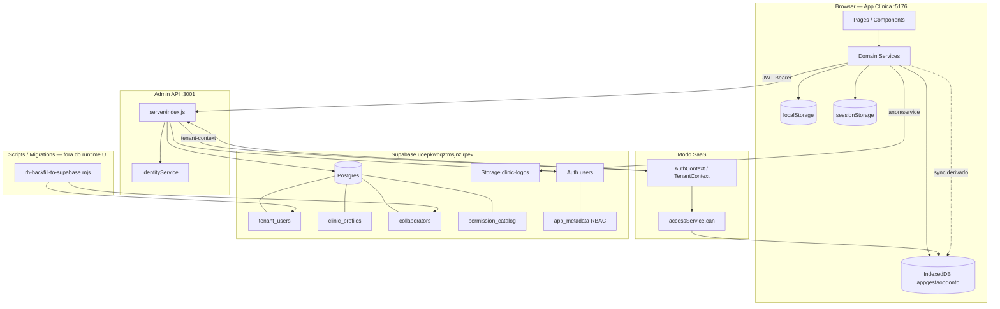
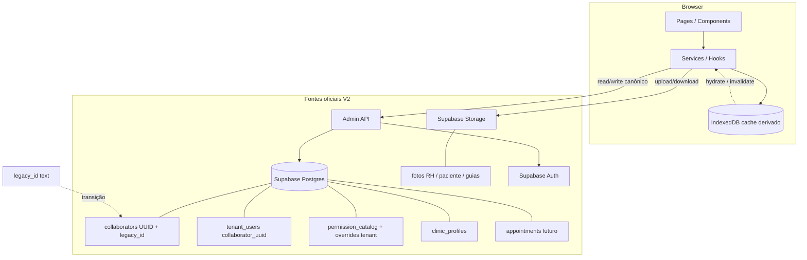

# Auditoria Arquitetural — Love Odonto V2

**Etapa:** 2 — Mapeamento completo de dependências (pré-backfill / pré-018)  
**Data:** 2026-06-29  
**Branch de trabalho:** `architecture-consolidation`  
**Escopo:** somente diagnóstico — nenhuma alteração de código, banco ou apply executada nesta etapa.

---

## Resumo executivo

O Love Odonto opera hoje como **aplicação offline-first** com **IndexedDB como autoridade operacional** para ~90% dos domínios clínicos, comerciais e financeiros. O modo **SaaS** adiciona uma camada **Supabase + Admin API (Express :3001)** para identidade, membership (`tenant_users`), perfil da clínica (`clinic_profiles`), RBAC em Auth `app_metadata`, Storage de logos e schema preparatório de RH (`collaborators`, `permission_catalog`).

A consolidação V2 (migrations 014–019 já aplicadas em dev local) introduz `public.collaborators` e `tenant_users.collaborator_uuid`, mas **o runtime da UI ainda não consome `collaborator_uuid`**. Todos os módulos críticos (agenda, prontuário, financeiro, CRM) continuam amarrados a **`collaboratorId` / `professionalId` legado (text)** no IndexedDB.

**Conclusão imediata:** o `--apply` do backfill RH é **baixo risco para IndexedDB e domínios operacionais**, mas **médio/alto risco para consolidação UUID** (2/4 links NOT_FOUND no dry-run) e **crítico se o projeto Supabase alvo for produção real** (`uoepkwhqztmsjnzirpev`, nome dashboard: `love-odonto-prod`).

---

## Diagrama — arquitetura atual

**Fluxo dominante hoje:** UI → Service → `loadDb`/`withDb` → IndexedDB.  
**Exceções SaaS:** tenant context, usuários, convites, perfil clínica, logos, espelho opcional de contratos.

---

## Diagrama — arquitetura alvo V2

**Princípios V2 aprovados:**
- Supabase = fonte oficial (RH, permissões, agenda futura, vínculos).
- IndexedDB = cache derivado + fila offline (fase posterior).
- `legacy_id` preservado até cutover completo; `collaborator_uuid` como vínculo formal.
- Proibido base64 em `foto_url` — Storage HTTPS only.

---

## Inventário global

### 1. Funções `reconcile`, `sync`, `merge`, `hydrate`, `bootstrap`, `backfill`

| Função | Arquivo | Domínio |
|--------|---------|---------|
| `syncLocalCollaboratorAccess` | `src/services/collaboratorService.js` | RH → IDB access |
| `backfillCollaboratorsPendingAccess` | `src/services/collaboratorService.js` | RH convites pendentes |
| `reconcileCollaboratorAccessState` | `src/services/collaboratorAccessRecoveryService.js` | Acesso ↔ tenant_user |
| `syncCollaboratorAccessFromTenantUser` | `src/services/collaboratorAccessRecoveryService.js` | Acesso |
| `reconcileCollaboratorTenantLinks` | `src/services/collaboratorAccessProvisionService.js` | `collaborator_id` text API |
| `reconcileOwnInvitationAcceptance` | `src/services/collaboratorAccessProvisionService.js` | Convites |
| `syncPermissionStateToLocalDb` | `src/services/collaboratorPermissionPersistence.js` | RBAC |
| `syncTeamRosterPermissionStates` | `src/services/collaboratorPermissionPersistence.js` | RBAC roster |
| `syncCurrentUserPermissionsFromContext` | `src/services/collaboratorPermissionPersistence.js` | RBAC sessão |
| `reconcileSaasTeamRoster` | `src/services/tenantTeamRosterSync.js` | Stubs RH mínimos |
| `backfillCollaboratorTenantIds` | `src/services/tenantTeamRosterSync.js` | `tenant_id` em colaboradores |
| `bootstrapSaasTenantLocalDb` | `src/services/saasTenantBootstrapService.js` | Bootstrap tenant |
| `ensureSaasUserInLocalDb` | `src/services/saasUserSeedService.js` | User + colaborador local |
| `hydrateSaasUser` | `src/auth/AuthContext.jsx` | Sessão pós-login |
| `syncTenantClinicProfileToLocalDb` | `src/services/tenantClinicProfileSync.js` | Perfil clínica |
| `syncFromTenantUser` / `syncIdentity` | `server/identity/IdentityService.js` | Identities |
| `syncAuthUserAppMetadata` | `server/clinicOwnerAccessDispatch.js` | Owner metadata |
| `buildRhBackfillPlan` / `applyRhBackfillPlan` | `server/lib/rhBackfillToSupabase.js` | Backfill RH |
| `buildBackfillPlan` / `applyBackfillPlan` | `server/lib/collaboratorIdBackfill.js` | Backfill text id |
| `syncClinicalBudgetFromFinancing` | `src/services/clinicalBudgetFinancingIntegration.js` | Orçamento clínico |
| `syncGeneratedContractToSaas` | `src/services/contractSaasSyncService.js` | Contratos espelho |
| `syncCheckinCommissionsForAppointment` | `src/services/commissionCalculationService.js` | Comissões |
| `syncLeadTagsArray` | `src/services/crmTagService.js` | CRM tags |
| `mergeContractAttachedTcleIds` | `src/services/clinicalTcleAttachmentService.js` | TCLE ↔ contrato |
| `mergePatientActivity` | `src/services/patientService.js` | Pacientes |
| `mergeSafeAgendaSnapshot` | `src/pages/AgendaPage.jsx` | Agenda UI |
| `bootstrapFirstAccessSession` | `src/utils/firstAccessSession.js` | Auth primeiro acesso |
| `bootstrapPasswordRecoverySession` | `src/utils/firstAccessSession.js` | Auth recovery |
| `backfillClinicalGuideImages` | `src/services/clinicalGuide/clinicalGuideSeed.js` | Seed guias |
| `backfillMissingBillingForTenants` | `server/platformBillingService.js` | Platform billing |

### 2. Onde IndexedDB ainda é autoridade

| Domínio | Stores / chaves principais |
|---------|---------------------------|
| Agenda | `appointments`, `appointmentBlocks`, `collaboratorWorkHours` |
| Pacientes | `patients`, `patient*` satélites |
| Prontuário / odontograma | `patientOdontograms*`, `patientAnamnesis*`, `clinicalAppointments`, `clinicalEvents`, `documentRecords` |
| Financeiro | `transactions`, `accountsReceivable`, `payables`, `financings`, `boletoCharges`, `commissions`, … |
| CRM / Comercial | `crmLeads`, `crmBudgets`, `crmTasks`, `marketingChat*`, `followUps` |
| Contratos | `contractTemplates`, `generatedContracts`, `contractSignatures`, … |
| RH rico (ficha) | `collaborators`, `collaboratorDocuments`, `collaboratorWorkHours`, `collaboratorFinance`, … |
| RBAC runtime (`can()`) | `permissionsCatalog`, `rolePermissions`, `userPermissions`, `users.*` |
| Acessos locais | `collaboratorAccess`, `userAuth` (legado) |
| Estoque | `materials`, `stockMovements`, `purchases` |
| Relatórios / dashboard | Agregação sobre stores acima |

### 3. Onde Supabase já é autoridade

| Domínio | Tabela / recurso | Consumidor |
|---------|------------------|------------|
| Membership SaaS | `tenant_users` | Admin API, `tenantContextService`, provisionamento |
| Auth / sessão | `auth.users` + JWT | Login SaaS, `saasSessionResolver` |
| RBAC canônico (escrita) | Auth `app_metadata` | `POST /internal/app/collaborators/access-bundle` |
| Perfil clínica | `clinic_profiles` | Admin API, `clinicProfileApi`, sync → IDB cache |
| Logos | Storage `clinic-logos` + `logo_url` | `clinicLogoUploadService` |
| Catálogo permissões (seed) | `permission_catalog`, `role_permission_defaults` | Migration 015; app ainda lê catálogo do código/IDB |
| RH núcleo (schema) | `collaborators` | Backfill script; **UI não escreve ainda** |
| Identities | `app_identities` (migration 008) | `IdentityService` |
| Contratos (schema remoto) | `006_app_contracts.sql` | Espelho opcional; runtime local em IDB |
| Platform / billing | Console migrations | `platformApi`, console |

### 4. Riscos antes de executar `--apply` (backfill RH)

| # | Risco | Severidade |
|---|-------|------------|
| R1 | Projeto Supabase `uoepkwhqztmsjnzirpev` nomeado **love-odonto-prod** — apply em prod acidental | **Crítico** |
| R2 | `collaborator_uuid` parcial (2/4 LINK, Juliana/Renata NOT_FOUND) — RLS `app_user_collaborator_uuid` incompleto | **Alto** |
| R3 | Divergência `tenant_users.collaborator_id` (col-saas-*) vs export RH (col-*) — IDs sintéticos SaaS vs IndexedDB | **Alto** |
| R4 | `resolveCollaboratorId` prefere ID da API sobre local — possível duplicidade conceitual na equipe | **Médio** |
| R5 | Fotos RH: export sem URL; Supabase recebe `foto_url: null` — OK, mas cutover Storage pendente | **Médio** |
| R6 | UI continua gravando RH só no IndexedDB — dualidade pós-apply sem sync contínuo | **Médio** |
| R7 | Migration 018 (FK NOT NULL) **não aplicada** — correto; apply não deve preceder 018 | **Baixo** (controlado) |
| R8 | Gate LIBERADO permite NOT_FOUND — apply “sucesso” com vínculos incompletos | **Médio** |
| R9 | IndexedDB / agenda / financeiro **não afetados** pelo script — falso positivo de “quebrou tudo” | **Informativo** |

---

## Módulos — auditoria detalhada

Legenda autoridade: **SB** Supabase · **API** Admin API · **IDB** IndexedDB · **LS** localStorage · **SS** sessionStorage · **AM** app_metadata · **JWT** · **STG** Storage · **MOCK** seed/fixture

---

### 1. RH / Colaboradores

| | |
|---|---|
| **A. Fontes** | **IDB** (ficha completa) · **API/SB** (`tenant_users`, futuro `collaborators`) · **STG** (fotos alvo V2) · **AM/JWT** (indireto via user) |
| **B. Leitura** | `collaboratorService.js` (`getCollaborator`, `listCollaborators`) · `tenantCollaboratorService.js` (`listTenantCollaborators`) · `CollaboratorsPage.jsx` · `AdminUsuariosPage.jsx` · `userProfileService.js` · `tenantTeamRosterSync.js` |
| **C. Escrita** | `collaboratorService.js` (CRUD RH, phones, hours, documents, finance, access local) · `tenantCollaboratorService.js` (`persistTenantCollaboratorsCache`) · `collaboratorAccessProvisionService.js` (link API) · `saasUserSeedService.js` · scripts `rhBackfillToSupabase.js` (somente CLI) |
| **D. Campos críticos** | `collaboratorId`, `collaborator_id` (text), `collaborator_uuid` (**schema only**), `tenant_id`, `user_id`, `agenda_enabled`, `legacy_id` (Supabase), `role_slug` (via access) |
| **E. Autoridade** | **Híbrido** — lista SaaS: API; ficha RH: **IDB**; Supabase `collaborators`: **legado/indefinido** até cutover |
| **F. Risco** | **Alto** (dual ID, apply parcial) |
| **G. V2 oficial** | Supabase `collaborators` + Storage fotos; IDB cache |
| **H. Migração** | **Migrar depois** (pós-backfill + link email); manter IDB como cache; não remover `legacy_id` |

---

### 2. Usuários e acessos

| | |
|---|---|
| **A. Fontes** | **SB** (`tenant_users`, Auth) · **API** · **IDB** (`users`, `collaboratorAccess`, `userAuth` legado) · **LS** (`appgestaoodonto.session`, platform auth) · **AM/JWT** |
| **B. Leitura** | `collaboratorAccessProvisionService.js` · `tenantContextService.js` · `ConfiguracoesUsuariosPage.jsx` · `accessService.js` · `identityService.js` · `AuthContext.jsx` · `CollaboratorAccessSection.jsx` |
| **C. Escrita** | `provisionCollaboratorSystemAccess`, `createTenantUserAccess`, `linkCollaboratorTenantAccess`, `setTenantUserSystemAccess`, `removeTenantUserAccess`, `saveCollaboratorAccessBundle` · `collaboratorAccessRecoveryService.js` · `useCollaboratorAccessForm.js` · `server/index.js` · `IdentityService.js` |
| **D. Campos críticos** | `tenant_id`, `user_id`, `tenant_user_id`, `collaborator_id`, `collaborator_uuid`, `role_slug`, `has_system_access`, `invitation_status` |
| **E. Autoridade** | **Supabase + API** (SaaS) · **IDB legado** (`userAuth` bcrypt local) |
| **F. Risco** | **Médio** (sync servidor→local; AdminUsuariosPage mistura legado) |
| **G. V2 oficial** | Supabase Auth + `tenant_users`; API provisionamento |
| **H. Migração** | **Manter** fluxo SaaS; **remover** `userAuth` legado após cutover; **migrar depois** alinhamento `collaborator_id` text |

---

### 3. Permissões

| | |
|---|---|
| **A. Fontes** | **AM** (canônico SaaS) · **SB** (`permission_catalog` seed) · **IDB** (`permissionsCatalog`, `userPermissions`) · **Código** (`permissions/catalog.js`, `roleDefaults.js`) · **JWT** (snapshot pós-refresh) |
| **B. Leitura** | `accessService.js` (`can`, `getPermissionsCatalog`) · `permissions.js` · `collaboratorPermissionPersistence.js` · `CollaboratorPermissionsPanel.jsx` · `CollaboratorPermissionsHub.jsx` · `useCollaboratorAccessForm.js` |
| **C. Escrita** | `POST .../access-bundle` (server) · `saveCollaboratorAccessBundle` · `updateUserAccess` (IDB espelho) · `syncPermissionStateToLocalDb` · `TenantContext.jsx` |
| **D. Campos críticos** | `has_custom_permissions`, `custom_permissions`, `permission_overrides`, `role_slug`, `permissions` (array legado vazio) |
| **E. Autoridade** | **Híbrido** — escrita SB/AM; leitura runtime **IDB** |
| **F. Risco** | **Médio** (desync se sync falhar; Melissa 184/184 depende de AM + espelho) |
| **G. V2 oficial** | SB `permission_catalog` + overrides tenant (Fase 2); AM snapshot temporário |
| **H. Migração** | **Migrar depois** overrides relacionais; **manter** espelho IDB para `can()` offline |

---

### 4. Agenda

| | |
|---|---|
| **A. Fontes** | **IDB** (`appointments`, `appointmentBlocks`, `collaboratorWorkHours`, `rooms`) · integrações CRM/comissões IDB |
| **B. Leitura** | `appointmentService.js` · `AgendaPage.jsx` · `GestaoAtendimentoPage.jsx` · `PatientFlowPage.jsx` · componentes `src/components/agenda/*` · `gestaoAtendimentoDashboard.js` |
| **C. Escrita** | `appointmentService.js` (CRUD, check-in, status) · `patientFlowService.js` · `communicationService.js` (lembretes) · `journeyEntryService.js` |
| **D. Campos críticos** | `professionalId` (= `collaborators.id`), `patientId`, `appointmentId`, `tenant_id`, `collaboratorId` (work hours) |
| **E. Autoridade** | **IndexedDB oficial** |
| **F. Risco** | **Baixo** para backfill RH (script não toca agenda) |
| **G. V2 oficial** | Supabase appointments (futuro); IDB cache |
| **H. Migração** | **Manter como está** · **migrar depois** (Fase agenda) · resolver `professionalId` → UUID gradualmente |

---

### 5. Pacientes

| | |
|---|---|
| **A. Fontes** | **IDB** (`patients` + satélites) |
| **B. Leitura** | `patientService.js` · `PatientsPage.jsx` · `PatientCadastroPage.jsx` · `PatientChartPage.jsx` · modais agenda/CRM |
| **C. Escrita** | `patientService.js` · `patientRecordService.js` · `importPatientService.js` · `patientAnamnesisService.js` · etc. |
| **D. Campos críticos** | `patientId`, `tenant_id` (write guard) |
| **E. Autoridade** | **IndexedDB oficial** |
| **F. Risco** | **Baixo** |
| **G. V2 oficial** | Supabase patients (futuro) |
| **H. Migração** | **Migrar depois** |

---

### 6. Comercial / CRM

| | |
|---|---|
| **A. Fontes** | **IDB** (`crmLeads`, `crmBudgets`, `crmTasks`, `marketingChat*`, pipeline stages) |
| **B. Leitura** | `crmService.js` · `crmBudgetService.js` · `crmReportsService.js` · páginas `src/pages/crm/*` · `marketingChatService.js` |
| **C. Escrita** | `crmService.js` · `crmTagService.js` · `crmPipelineStageService.js` · automações marketing |
| **D. Campos críticos** | `tenant_id`, `leadId`, `patientId`, `appointmentId`, `budgetId` |
| **E. Autoridade** | **IndexedDB oficial** |
| **F. Risco** | **Baixo** |
| **G. V2 oficial** | Supabase CRM (futuro) |
| **H. Migração** | **Migrar depois** |

---

### 7. Financeiro

| | |
|---|---|
| **A. Fontes** | **IDB** (transações, receber, pagar, caixa, financings, boletos, comissões) |
| **B. Leitura** | `financeService.js` · `receivablesService.js` · `payablesService.js` · `financingsService.js` · `financeDreService.js` · páginas `Finance*.jsx` |
| **C. Escrita** | Serviços financeiros + `commissionCalculationService.js` · `boletoAutomationService.js` |
| **D. Campos críticos** | `tenant_id`, `budget_id`/`budgetId`, `contract_id`, `financialId`, `patientId`, `professionalId` (comissões) |
| **E. Autoridade** | **IndexedDB oficial** |
| **F. Risco** | **Baixo** |
| **G. V2 oficial** | Supabase financeiro (Fase 3+) |
| **H. Migração** | **Migrar depois** (`collaborator_finance` explicitamente Fase 3) |

---

### 8. Contratos e consentimentos

| | |
|---|---|
| **A. Fontes** | **IDB** (templates, generated, signatures) · **API/SB** espelho opcional · **MOCK** seeds contrato |
| **B. Leitura** | `contractService.js` · `contractModuleService.js` · páginas `src/pages/contratos/*` · `ClinicalContractSection.jsx` · `documentService.js` |
| **C. Escrita** | `contractService.js` · `contractSignatureFlowService.js` · `documentService.js` · `contractSaasSyncService.js` (espelho) |
| **D. Campos críticos** | `patientId`, `quoteId` (appointment/budget), `contractId`, `appointmentId`, `tenant_id`/`clinicId` |
| **E. Autoridade** | **IndexedDB oficial** · espelho SB **legado/opcional** |
| **F. Risco** | **Baixo** · divergência `clinicId` vs `tenant_id` |
| **G. V2 oficial** | Supabase contracts + Storage PDFs |
| **H. Migração** | **Migrar depois** · unificar `tenant_id` |

---

### 9. Odontograma / prontuário

| | |
|---|---|
| **A. Fontes** | **IDB** · **STG** (imagens guia clínico) · **LS** (cache odontograma v2) · trilha paralela `budgetsService` → SB `budgets` |
| **B. Leitura** | `clinicalService.js` · `patientOdontogramService.js` · `patientOdontogramV2Service.js` · `PatientChartPage.jsx` · `ClinicalAppointmentPage.jsx` · `odontogramV2Store.jsx` |
| **C. Escrita** | `clinicalService.js` · guias clínicos · anamnese · `documentService.js` |
| **D. Campos críticos** | `patientId`, `appointmentId`, `professionalId`, `budgetId`, `tenant_id` (guias) |
| **E. Autoridade** | **IndexedDB oficial** · Storage para binários guia |
| **F. Risco** | **Baixo** |
| **G. V2 oficial** | Supabase clinical records + Storage |
| **H. Migração** | **Migrar depois** · deprecar trilha SB `budgets` legada |

---

### 10. Clínica / tenant / configurações

| | |
|---|---|
| **A. Fontes** | **SB** `clinic_profiles` · **API** tenant-context · **IDB** `clinicProfile` (cache) · **LS** preferências UI |
| **B. Leitura** | `tenantContextService.js` · `TenantContext.jsx` · `ClinicSettingsPage.jsx` · `useClinicSummary.js` · `clinicService.js` |
| **C. Escrita** | `clinicProfileApi.js` · `clinicService.js` · `clinicLogoUploadService.js` · `tenantClinicProfileSync.js` |
| **D. Campos críticos** | `tenant_id`, módulos/flags subscription |
| **E. Autoridade** | **Híbrido** — SB+API oficial; IDB cache |
| **F. Risco** | **Baixo** |
| **G. V2 oficial** | Supabase `clinic_profiles` + Storage logos |
| **H. Migração** | **Manter** (já alinhado V2 parcial) |

---

### 11. Assets / fotos / logos

| | |
|---|---|
| **A. Fontes** | **STG** logos · **IDB** fotos paciente/RH (data URL) · **STG** guias clínicos · `avatarUtils.js` |
| **B. Leitura** | `AppAvatar.jsx` · `clinicLogoUploadService.js` · `patientAlbumService.js` · `patientFilesService.js` |
| **C. Escrita** | `uploadCollaboratorPhoto` (IDB base64) · logo upload Storage · guia storage service |
| **D. Campos críticos** | `fotoUrl`, `logo_url`, `avatar_url`, `tenant_id` |
| **E. Autoridade** | **Híbrido** — logos SB Storage; RH/paciente ainda **IDB base64** |
| **F. Risco** | **Médio** (backfill zera foto Supabase; local intacto) |
| **G. V2 oficial** | **Supabase Storage** only (anti-base64) |
| **H. Migração** | **Migrar depois** upload RH/paciente → Storage |

---

### 12. Relatórios / dashboard

| | |
|---|---|
| **A. Fontes** | **IDB** agregado · **API** platform (master) |
| **B. Leitura** | `dashboardMetricsService.js` · `reportsService.js` · `gestaoAtendimentoService.js` · `DashboardPage.jsx` · `ReportsPage.jsx` · `CrmRelatoriosPage.jsx` |
| **C. Escrita** | Mínima (snapshots marketing chat); mostly read-only |
| **D. Campos críticos** | `tenant_id`, `professionalId`, filtros por período |
| **E. Autoridade** | **IndexedDB** (operacional) · **SB** (platform master) |
| **F. Risco** | **Baixo** |
| **G. V2 oficial** | Read models Supabase / materialized views (futuro) |
| **H. Migração** | **Manter** · **migrar depois** |

---

## Matriz resumo — autoridade e migração

| Módulo | Autoridade hoje | Risco backfill | V2 oficial | Plano |
|--------|-----------------|----------------|------------|-------|
| RH / Colaboradores | Híbrido | Alto | SB + STG | Migrar depois |
| Usuários e acessos | SB + API | Médio | SB + API | Manter / link UUID |
| Permissões | Híbrido | Baixo | SB catálogo | Migrar depois |
| Agenda | IDB | Baixo | SB (futuro) | Manter |
| Pacientes | IDB | Baixo | SB (futuro) | Migrar depois |
| CRM | IDB | Baixo | SB (futuro) | Migrar depois |
| Financeiro | IDB | Baixo | SB Fase 3+ | Migrar depois |
| Contratos | IDB | Baixo | SB + STG | Migrar depois |
| Prontuário | IDB | Baixo | SB + STG | Migrar depois |
| Clínica / tenant | Híbrido | Baixo | SB | Manter |
| Assets | Híbrido | Médio | STG | Migrar depois |
| Dashboard | IDB | Baixo | SB read models | Migrar depois |

---

## Contexto do dry-run (tenant Implanprime)

Referência: `scripts/reports/rh-backfill-dryrun-2026-06-29T21-19-50-758Z.json`

| Colaborador | INSERT | LINK | NOT_FOUND link | Impacto apply |
|-------------|--------|------|----------------|---------------|
| Paulo | Sim | Sim | — | UUID ok |
| Melissa | Sim | Sim | — | UUID ok |
| Juliana | Sim | **Não** | Sim (col-saas-* ≠ col-f93e5dbf-*) | Agenda IDB intacta; UUID ausente |
| Renata | Sim | **Não** | Sim (col-c92cf731-* ≠ col-6b85c4cb-*) | UUID ausente |

O script **não quebra agenda** (IndexedDB). O gap é **consolidação Supabase** incompleta para 50% dos `tenant_users`.

---

## Recomendação final

### Decisão: **ajustar script antes** + **confirmar ambiente** — **não aplicar `--apply` agora**

| Prioridade | Ação |
|------------|------|
| P0 | Confirmar no painel Supabase se `uoepkwhqztmsjnzirpev` é **dev/staging** ou **produção real**. Se produção → **bloquear apply**. |
| P1 | Implementar **link pós-insert por e-mail único** para `NOT_FOUND` (Juliana, Renata) sem alterar `collaborator_id` text. Re-rodar dry-run → meta: `LINK_PROPOSED: 4`, `NOT_FOUND: 0`. |
| P2 | Executar `--apply` **somente em dev confirmado** + checklist pós-apply manual. |
| P3 | **Não aplicar migration 018** até UUIDs consistentes e queries de órfãos = 0. |
| P4 | Iniciar **refatoração estrutural** (Fase 2 código): `tenantCollaboratorService` preferir UUID + fallback legacy; dual-write RH → Supabase — **após** backfill validado. |

### O que **não** fazer agora

- `--apply` em projeto não confirmado como dev.
- Migration 018 (FK NOT NULL).
- Commit da consolidação antes de apply validado em dev.
- Refatorar agenda/financeiro/CRM para Supabase (fora de escopo Fase 1).

### O que o backfill **não** quebra (evidência desta auditoria)

- IndexedDB (zero writes no script).
- Appointments / `professionalId`.
- Permissões (`app_metadata` / Melissa 184/184).
- Financeiro, CRM, contratos, prontuário.
- Fotos locais (export sem base64; Supabase recebe null).

---

## Referências de código

| Área | Paths |
|------|-------|
| Persistência | `src/db/index.js`, `src/db/schema.js`, `src/db/idbStorage.js` |
| Tenant / SaaS | `src/tenant/TenantContext.jsx`, `src/services/tenantContextService.js` |
| RH híbrido | `src/services/tenantCollaboratorService.js`, `src/services/collaboratorService.js` |
| Backfill | `server/lib/rhBackfillToSupabase.js`, `scripts/rh-backfill-to-supabase.mjs` |
| Migrations V2 | `supabase/migrations/014_*` … `019_*` |
| Admin API | `server/index.js` |
| Permissões | `src/services/accessService.js`, `src/permissions/catalog.js` |
| Docs existentes | [`agenda.md`](../modules/agenda.md), [`prontuario.md`](../modules/prontuario.md), [`collaborators.md`](../modules/collaborators.md), [`clinic-profile.md`](../modules/clinic-profile.md) |

---

*Documento gerado na Etapa 2 da consolidação arquitetural. Próxima etapa sugerida: ajuste de link por e-mail no backfill + dry-run revalidado + apply em dev com checklist.*
